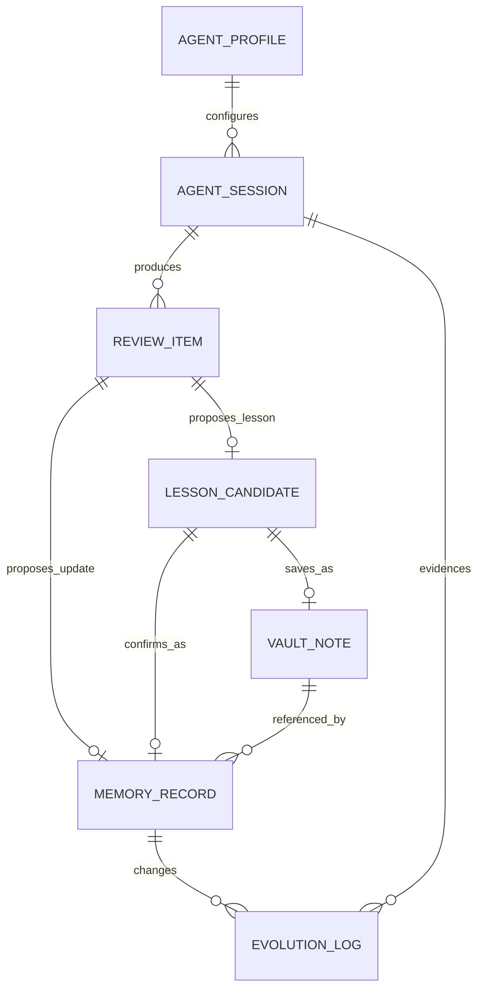
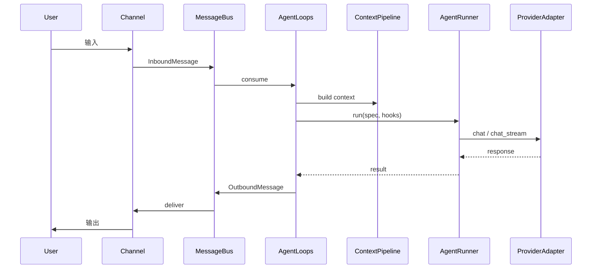
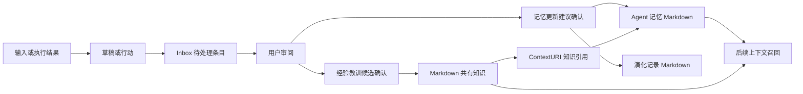

> **Status**: `active`
>
> 本文档描述 MindClaw 系统的全局架构设计。涉及 ≥2 个模块的代码变更时，需检查本文档是否仍然准确。

# MindClaw 系统架构总览

MindClaw 是一个以 Markdown 共有知识库为真相源、以桌面工作站为操作界面、以 Agent 演化记录为反馈机制的人机知识共建系统。系统核心命题是：**记忆是 Agent 的，知识是共同的**。

---

## § 系统目标与约束

**系统定位**：MindClaw 为个人用户提供本地优先的 AI 工作站，支持对话、笔记、Daily、Inbox、私密空间、Agent 记忆和可审阅的 Agent 演化流程。

**核心约束**：

1. 所有业务逻辑在 Rust Services 层执行，前端保持薄客户端。
2. Markdown + Frontmatter 和原始资源文件是真相源：已确认知识在 Vault，待处理产物在 Inbox，外部原文在 `resources/`，Agent 长期资产在 `agent/`；SQLite 只存储运行状态、会话、ContextIndex 和查询缓存。
3. `private/` 是 Vault 下的普通文件夹，不作为独立存储空间或数据库索引；该路径不进入 Agent 上下文、不生成记忆、不进入共有知识索引。
4. 同一 `session_key` 的消息串行处理。
5. `AgentRunner` 不持有 Session、MessageBus、审核状态或持久化依赖。
6. 旁路观察、记忆更新建议、外部解析结果和经验教训候选必须先进入 Inbox 审核流程，不能直接写入稳定记忆或共有知识。

---

## § 核心设计原则

**1. 记忆与知识分离**
Agent 记忆服务后续行动，Markdown 知识承载共同真相；两者都必须可审阅，区别在于状态、用途和引用边界。

**2. 候选先于长期状态**
旁路观察、记忆更新和经验教训先形成候选或建议；这个流程减少误判污染长期上下文。

**3. Definition 与 Runtime 分离**
`AgentProfile` 只描述身份、策略和边界；Session、上下文、取消状态和消息分发都属于 Runtime。

**4. 外层编排与内层执行分离**
`AgentLoops` 负责编排一条入站消息，`AgentRunner` 负责执行一次 run 的 LLM 与工具迭代。

**5. Adapter 不承载业务语义**
Provider、MCP、Storage、Bus Adapter 只处理外部系统协议差异；业务判断留在 Runtime 和 Services。

---

## § 关键设计决策

| 决策问题                              | 选择                                               | 放弃的替代方案                          | 理由                                                                       |
| ------------------------------------- | -------------------------------------------------- | --------------------------------------- | -------------------------------------------------------------------------- |
| Agent 是否是运行时实体？              | 否，使用 `AgentProfile`                            | Agent 持有 provider/session/tools       | 定义与状态分离更利于复用和权限控制                                         |
| 编排与执行是否分层？                  | 是，Loops / Runner 分离                             | 单个大 Agent 对象包办全部               | turn 级和 run 级粒度不同，混在一起会导致职责失控                           |
| 旁路观察是否进入主调用链？            | 否，作为 Review & Evolution side path              | 每次输入同步观察和沉淀                  | 观察和沉淀不应拉长主响应链路                                               |
| 经验教训正文存在哪里？                | Markdown Vault                                     | Agent Memory 或 SQLite 正文             | 经验教训是共同知识，必须人类可读、可审阅、可修改                           |
| Agent 记忆如何持久化？                | 受管 Markdown + Frontmatter，ContextIndex 只建索引 | SQLite 结构化运行数据作为真相源         | 记忆影响长期行为，必须可审阅、可迁移、可人工纠偏                           |
| 上下文如何统一引用？                  | 使用 ContextURI + ContextFS                        | 各模块传递文件路径、session id 和表主键 | 记忆、演化、外部资料和会话证据需要稳定交叉引用                             |
| 待处理 Markdown 产物存在哪里？        | Inbox                                              | 分散写入 `resources/` 或 `agent/`       | Inbox 是统一待处理源，用户可以集中审核、分流；归档只作为无明确去向时的兜底 |
| Observability 与 Evolution 是否合并？ | 否，运行观测和业务审计分离                         | 把演化记录当日志                        | 运行日志服务排障，演化记录影响长期行为，可信要求不同                       |
| Private 隔离在哪里强制？              | Rust PathGuard 和上下文策略双重隔离                | 专用数据库索引或仅靠前端隐藏入口        | Private 只是 Vault 文件夹，但 Agent 不可见边界必须由后端强制               |
| 是否引入 rig LLM 框架？               | 是，作为 AgentRunner 执行内核支撑 Provider/Tool/Stream/MCP | 继续手写 Provider/Tool/Stream 实现 | rig 提供成熟的 AgentBuilder、streaming、tool calling 和 MCP 集成，降低维护负担 |
| rig 替换到哪一层？                    | Runner 执行层近乎全量 Rig 化，Provider/Tool/MCP 进入 Rig 路径 | 全量替换包括 AgentProfile 和 Runtime | 业务契约由 MindClaw 定义，Rig 只接管 run 内部执行 |

---

## § 边界划分

```text
┌─────────────────────────────────────────────────────┐
│ Desktop Frontend                                    │
│ Workspace Shell · Editor · Review Queue · Memory UI │
└───────────────────┬─────────────────────────────────┘
                    │ invoke / event subscription
┌───────────────────▼─────────────────────────────────┐
│ Channel + MessageBus                                │
│ InboundMessage / OutboundMessage / user status       │
└───────────────────┬─────────────────────────────────┘
                    │
┌───────────────────▼─────────────────────────────────┐
│ Agent Runtime                                        │
│ Definition: AgentProfile / AgentRegistry / Router    │
│ Orchestration: AgentLoops / Session / Context / Spawn  │
│ Execution: AgentRunner / Rig Agent / PromptHook / ToolServer │
│ Adapter: ProviderRegistry / MCP config / Event / Storage adapters │
└─────────────┬───────────────────────────┬───────────┘
              │                           │
              │ review trigger            │ business calls
              ▼                           ▼
┌──────────────────────────────┐   ┌────────────────────────────┐
│ Review & Evolution            │   │ Services                   │
│ Inbox candidates / logs        │   │ Note / Daily / Inbox       │
│ lesson candidates              │   │ Memory / Review / Evolution│
└─────────────┬────────────────┘   └─────────────┬──────────────┘
              │                                  │
              ▼                                  ▼
┌─────────────────────────────────────────────────────┐
│ Storage                                             │
│ ContextFS · ContextIndex · RuntimeStore · OS Keychain · PathGuard │
└─────────────────────────────────────────────────────┘
```

---

## § 核心实体关系

**AgentSession**：用户与 Agent 的一次对话会话，包含多个 Turn，归属于具体通道和 `session_key`。

**AgentProfile**：Agent 的静态定义，描述提示词、模型、工具、上下文和安全策略。

**MemoryRecord**：Agent 为后续判断和行动保存的受管 Markdown 记忆，具有状态、来源和可选 Vault 引用。

**ReviewItem**：回顾队列中的统一审核项，承载观察候选、记忆更新建议、经验教训候选或 Vault 草稿入口，索引来自 Inbox Markdown 和 ContextIndex。

**EvolutionLog**：记忆或策略变化的 Markdown 审计记录，解释变化原因和证据来源。

**LessonCandidate**：Inbox 中可复用经验教训的 Markdown 待审核候选，确认后可以保存为 Vault 笔记或转化为 Agent Memory。

**VaultNote**：已确认 Vault 笔记，正文保存在 Markdown Vault 中，可被人和 Agent 共同引用。



---

## § 整体流程

### 主调用链



### 知识与演化闭环



---

## § 安全架构

| 边界              | 强制点                        | 说明                                      |
| ----------------- | ----------------------------- | ----------------------------------------- |
| `private/` 文件夹 | Rust PathGuard                | 拒绝 Agent 读取、索引、记忆生成和知识沉淀 |
| Provider Secret   | OS Keychain                   | API Key 不以明文落盘                      |
| Tool 权限         | AgentProfile + Tool filtering | 工具可用性由定义层和编排层统一收敛        |
| 文件写入          | Storage PathGuard             | Agent 文件写操作只允许受控工作区路径      |
| 候选审核          | Inbox + Review & Evolution    | 未审核候选不能直接写入长期知识或稳定记忆  |

---

## § 相关文档

### 设计文档

| 文件                                                     | 内容                                                                 |
| -------------------------------------------------------- | -------------------------------------------------------------------- |
| [00-overview.md](./00-overview.md)                       | 系统架构总览                                                         |
| [01-channels.md](./01-channels.md)                       | Channels：多通道架构                                                 |
| [02-bus.md](./02-bus.md)                                 | MessageBus：异步消息队列                                             |
| [03-agent-runtime.md](./03-agent-runtime.md)             | Agent Runtime：Definition / Orchestration / Execution / Adapter 总览 |
| [03.01-agent-profile.md](./03.01-agent-profile.md)       | AgentProfile：静态定义与策略边界                                     |
| [03.02-agent-Loops.md](./03.02-agent-Loops.md)             | AgentLoops：turn 级编排层                                             |
| [03.03-agent-runner.md](./03.03-agent-runner.md)         | AgentRunner：run 级执行引擎                                          |
| [03.04-run-contracts.md](./03.04-run-contracts.md)       | Run 契约：Spec / Result / RunHooks / InvocationMode                  |
| [03.05-agent-spawn.md](./03.05-agent-spawn.md)           | Agent Spawn：SubAgent 派生执行                                      |
| [03.06-context-pipeline.md](./03.06-context-pipeline.md) | ContextPipeline：上下文装配                                          |
| [03.07-tool-execution.md](./03.07-tool-execution.md)     | Tool Execution：工具执行系统                                         |
| [03.08-mcp.md](./03.08-mcp.md)                           | MCP：外部能力适配                                                    |
| [03.09-skills.md](./03.09-skills.md)                     | Skills：能力定义与按需注入                                           |
| [03.10-memory.md](./03.10-memory.md)                     | Memory：Agent 记忆与召回                                             |
| [03.11-review-evolution.md](./03.11-review-evolution.md) | Review & Evolution：回顾、演化与经验教训候选                         |
| [03.12-observability.md](./03.12-observability.md)       | Observability：Runtime 可观测性                                      |
| [03.13-rig-integration.md](./03.13-rig-integration.md)   | Rig Integration：LLM 框架引入决策总览                                |
| [04-providers.md](./04-providers.md)                     | Providers：LLM Provider Adapter 层                                   |
| [05-services.md](./05-services.md)                       | Services：业务服务层                                                 |
| [06-storage.md](./06-storage.md)                         | Storage：存储层设计                                                  |
| [07-runtime.md](./07-runtime.md)                         | AppRuntime：统一运行时与依赖注入                                     |
| [08-desktop-frontend.md](./08-desktop-frontend.md)       | Desktop Frontend：Ribbon、Pane 与 Content Host 架构                  |

### 参考文档

| 文件                                                                   | 内容                   |
| ---------------------------------------------------------------------- | ---------------------- |
| [reference/directory-structure.md](./reference/directory-structure.md) | 代码目录结构现状       |
| [reference/dependencies.md](./reference/dependencies.md)               | Rust 和前端依赖清单    |
| [reference/type-registry.md](./reference/type-registry.md)             | 跨模块接口契约索引     |
| [reference/config.md](./reference/config.md)                           | 配置项清单与加载顺序   |
| [reference/database-notes.md](./reference/database-notes.md)           | 数据库表结构与索引说明 |
