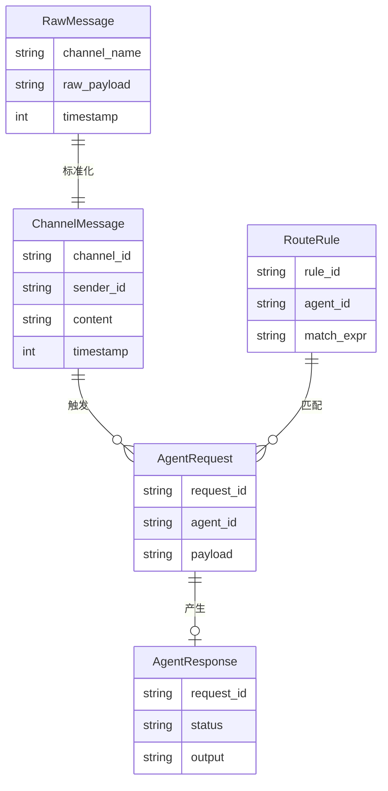
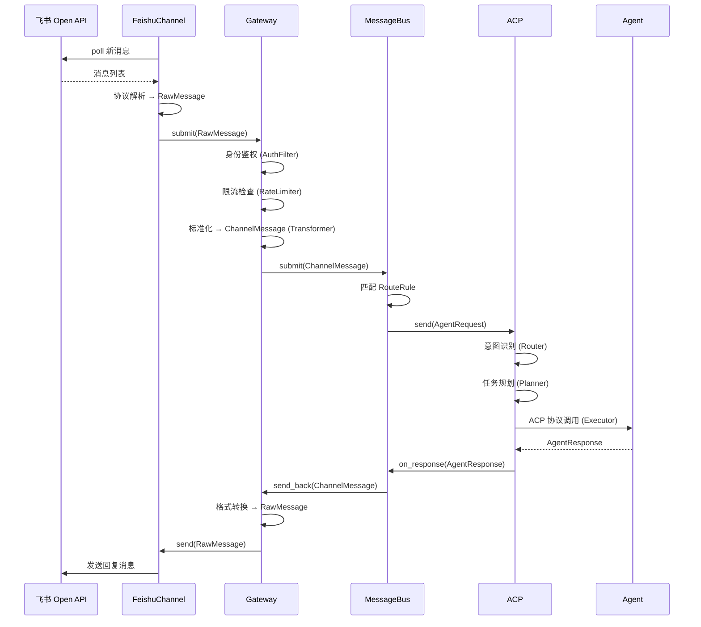

> **Status**: `draft`

# 架构总览：消息渠道与 Agent 调度

## § 系统目标与约束

MindClaw 消息调度子系统负责将不同 IM 渠道（飞书、Telegram 等）的消息接入本地 Gateway，经标准化后流入 MessageBus，经统一路由后通过 ACP 协议调用本地 Agent 进行处理，并将结果回写到消息渠道。

核心数据流：**`im_channel` → `gateway` → `message_bus` → `acp`**

**核心约束：**

- 所有消息处理在本地完成，不经过云端
- 密钥（飞书 Token 等）存储在 Stronghold 中
- 遵循现有分层架构：Command (thin) → Service (thick) → Storage (thin)
- Services 层不得 `use tauri::*`
- 渠道 Gateway 可插拔：通过 `ChannelAdapter` trait + `GatewayRegistry` 注册，新增渠道不修改 MessageBus 核心

## § 核心设计原则

1. **分层解耦**：`im_channel` 只做渠道协议转换；`gateway` 负责标准化、鉴权、限流；`message_bus` 负责路由；`acp` 负责执行。各层通过 trait 接口解耦，下层不感知上层
2. **渠道无关消息模型**：MessageBus 定义统一的 `ChannelMessage` 抽象，飞书等具体渠道消息转换为统一格式后流入——确保 Agent 和路由逻辑不感知渠道差异
3. **单向数据流**：消息从 `im_channel` → `gateway` → `message_bus` → `acp` 单向流动，响应沿原路径返回
4. **ACP 协议标准化**：Agent 调用通过 ACP 协议进行，MessageBus 不直接依赖特定 Agent 实现
5. **安全边界明确**：`im_channel` 负责外部 API 调用和 Token 管理，`gateway` 负责安全策略，`message_bus` 不持有任何外部凭证

## § 关键设计决策

| 决策问题 | 选择 | 放弃的替代方案 | 理由 |
|---------|------|--------------|------|
| 消息中间层用同步 channel 还是异步消息队列？ | 同步 trait 接口 + tokio 异步运行时 | 独立消息队列（Redis/AMQP） | 桌面单机应用不需要外部中间件；tokio 提供足够异步能力 |
| 飞书消息获取用轮询还是 Webhook？ | 轮询（飞书 Open API） | Webhook 回调 | v1 桌面应用无公网 IP，无法接收 Webhook；v2 可加 WebSocket 长连接 |
| Agent 调用用 ACP 还是自定义协议？ | ACP 标准协议 | 自定义 JSON-RPC | ACP 是 Agent 通信标准，确保未来可对接不同 Agent 实现 |
| 消息存储用什么？ | SQLite（后续集成） | 文件系统 / JSON | 需要按渠道、时间、状态查询消息，SQLite 更适合结构化查询 |
| 标准化在哪一层？ | `gateway` 层集中标准化 | `im_channel` 各自标准化 | 避免每个渠道重复实现鉴权/限流/格式化逻辑，集中管理更清晰 |

## § 分层架构

```
┌──────────────────────────────────────────────────────────────────────────────┐
│                        Tauri Command Layer                                    │
│               (thin: invoke handlers, type conversion)                        │
├──────────────────────────────────────────────────────────────────────────────┤
│                          Service Layer (Rust)                                 │
│                                                                               │
│  ┌──────────────────────────────────────────────────────────────────────┐    │
│  │                         im_channel 层                                 │    │
│  │  ┌──────────────┐  ┌──────────────┐  ┌──────────────────────────┐   │    │
│  │  │FeishuChannel │  │TelegramChan..│  │   [Future Channels...]   │   │    │
│  │  │(协议适配)     │  │(协议适配)     │  │                          │   │    │
│  │  └──────┬───────┘  └──────┬───────┘  └──────────────────────────┘   │    │
│  │         │                 │                                          │    │
│  │         └─────────────────┼──────────────────────────────────────────┘    │
│  │                           │ RawMessage                                   │    │
│  └───────────────────────────┼──────────────────────────────────────────────┘    │
│                              ▼                                                │
│  ┌──────────────────────────────────────────────────────────────────────┐    │
│  │                         gateway 层                                    │    │
│  │  ┌─────────────┐  ┌─────────────┐  ┌─────────────┐  ┌─────────────┐ │    │
│  │  │GatewayRegi..│  │ AuthFilter  │  │ RateLimiter │  │ Transformer │ │    │
│  │  │(注册中心)    │──▶│(身份鉴权)    │──▶│(流量控制)    │──▶│(消息标准化)  │ │    │
│  │  └─────────────┘  └─────────────┘  └─────────────┘  └──────┬──────┘ │    │
│  │                                                             │        │    │
│  └─────────────────────────────────────────────────────────────┼────────┘    │
│                                                                │ ChannelMessage│
│                              ┌─────────────────────────────────┘               │
│                              ▼                                                │
│  ┌──────────────────────────────────────────────────────────────────────┐    │
│  │                       message_bus 层                                  │    │
│  │  ┌──────────────┐  ┌──────────────┐  ┌──────────────────────────┐   │    │
│  │  │   Router     │  │   Topic      │  │    SubscriptionMgr       │   │    │
│  │  │(路由匹配)      │──▶│(消息分发)    │──▶│    (订阅管理)             │   │    │
│  │  └──────────────┘  └──────────────┘  └──────────────────────────┘   │    │
│  │                                                                     │    │
│  └─────────────────────────────────────────────────────────────────────┘    │
│                              │ AgentRequest                                  │
│                              ▼                                                │
│  ┌──────────────────────────────────────────────────────────────────────┐    │
│  │                         acp 层                                        │    │
│  │  ┌──────────┐  ┌──────────┐  ┌──────────┐  ┌──────────┐            │    │
│  │  │  Router  │  │ Planner  │  │ Executor │  │  Memory  │            │    │
│  │  │(意图路由)  │  │(任务规划)  │  │(动作执行)  │  │(记忆管理)  │            │    │
│  │  └──────────┘  └──────────┘  └──────────┘  └──────────┘            │    │
│  └──────────────────────────────────────────────────────────────────────┘    │
│                              │ AgentResponse                                 │
│                              │                                                │
│  ┌──────────────────────────────────────────────────────────────────────┐    │
│  │                         Storage Layer                                 │    │
│  │              (SQLite: messages, config, sessions)                     │    │
│  └──────────────────────────────────────────────────────────────────────┘    │
├──────────────────────────────────────────────────────────────────────────────┤
│                        External Boundaries                                    │
│  Feishu/Telegram API  ◀──▶  ACP Agent Process/Server                         │
└──────────────────────────────────────────────────────────────────────────────┘
```

**模块职责：**

- **`im_channel`** (`src-tauri/src/services/im_channel/`)：渠道协议适配层。每个渠道实现 `ChannelAdapter` trait，负责渠道 API 的消息拉取与发送、连接管理、协议解析
  - **Feishu Channel** (`im_channel/feishu/`)：飞书 Open API 适配
  - **Telegram Channel** (`im_channel/telegram/`)：Telegram Bot API 适配
- **`gateway`** (`src-tauri/src/services/gateway/`)：网关层。负责渠道注册、身份鉴权、流量控制、消息标准化（`RawMessage` → `ChannelMessage`）、会话绑定
  - **GatewayRegistry**：渠道注册中心，持有所有已注册的 ChannelAdapter
  - **AuthFilter**：身份鉴权与凭证验证
  - **RateLimiter**：按渠道/用户维度的限流熔断
  - **Transformer**：消息标准化与富媒体处理
- **`message_bus`** (`src-tauri/src/services/message_bus/`)：消息总线路由层。接收标准化后的 `ChannelMessage`，根据 `RouteRule` 匹配目标 Agent，将 `AgentResponse` 回写到对应渠道
- **`acp`** (`src-tauri/src/services/acp/`)：Action Control Plane 执行层。负责意图识别、任务规划、动作执行、记忆管理、工具调用

**数据流方向：**

```
飞书 API ──poll──▶ FeishuChannel ──RawMessage──▶ Gateway ──ChannelMessage──▶ MessageBus ──AgentRequest──▶ ACP ──ACP──▶ Agent
                                                    (Auth/RateLimit/Transform)         │
                                                                      ◀──AgentResponse── MessageBus ◀──AgentResponse──◀──┘
                                                                                                                          │
飞书 API ◀──send── FeishuChannel ◀──RawMessage────────── Gateway ◀──ChannelMessage────────────────────────────────────────┘
       (via GatewayRegistry)                              (via GatewayRegistry)
```

## § 核心实体关系

**核心实体：**

- **RawMessage**：来自任一渠道的原始消息，包含渠道特定格式。由 `im_channel` 创建，`gateway` 消费
- **ChannelMessage**：经 gateway 标准化后的统一消息，包含来源渠道、消息内容、发送者、时间戳。由 Gateway 创建，MessageBus 消费
- **AgentRequest**：MessageBus 向 Agent 发起的处理请求，携带原始消息和路由规则。由 MessageBus 创建，ACP 消费
- **AgentResponse**：Agent 处理完成后返回的结果，包含处理状态、输出内容。由 ACP 创建，MessageBus 消费后回写渠道
- **RouteRule**：消息路由规则，定义什么样的消息交给哪个 Agent 处理。由用户配置，MessageBus 读取



## § 整体流程

### 主流程：飞书消息 → Agent 处理 → 回复



## § 安全架构

- **密钥管理**：飞书 App ID/Secret 存储在 Stronghold (`tauri-plugin-stronghold`)
- **信任边界**：`im_channel` 是唯一可访问外部网络的模块，`gateway` 负责安全策略，`message_bus` 和 `acp` 不发起网络请求
- **CSP**：`'self'` + `https://open.feishu.cn`（飞书 Open API）
- **数据隔离**：`vault/private/` 对 Agent 不可见，Storage 层拒绝 `private/` 前缀路径
