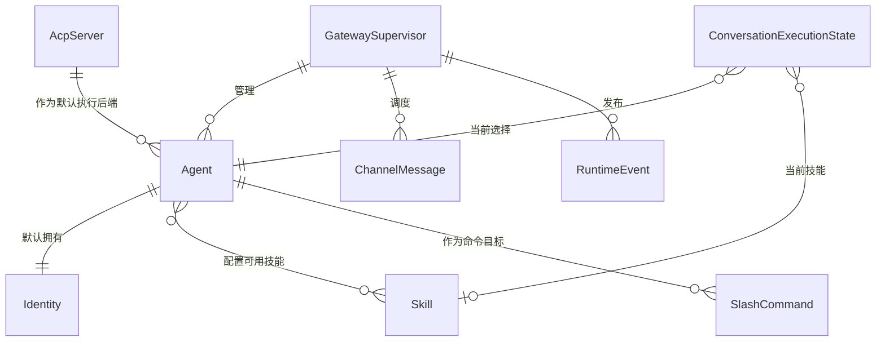
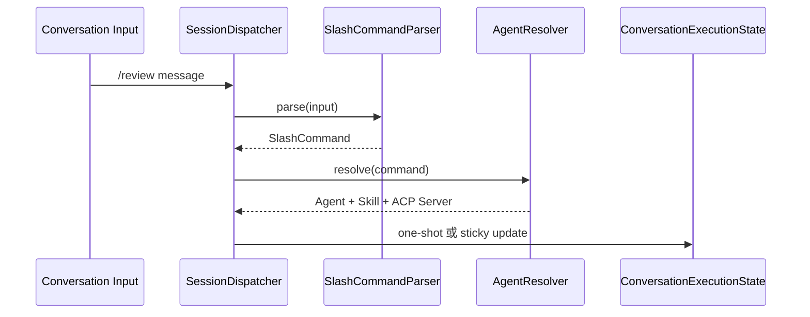

> **Status**: `draft`

# 架构总览：ACP-native Agent 控制平面

## § 架构定位

MindClaw 的架构服务于蓝图中的产品定位：

> **本地优先的 ACP-native Agent 控制平面：它复用用户已有的 ACP Server 执行能力，在 MindClaw 中管理 Agent 角色、Skill 和会话状态，并把这些 Agent 接入 Feishu 等真实消息渠道。**

这意味着：

- **MindClaw 不自研基础 Agent Server**。所有 Agent 执行通过用户配置的 ACP Server 完成。
- **MindClaw owns the user-facing Agent model；ACP Server owns execution。** MindClaw 管理“谁在处理、用什么 Skill、什么时候切换”；ACP Server 管理“如何真正执行”。
- **IM 渠道是场景不是平台**。Feishu 是第一个验证入口，不是架构前提。

## § 三层能力模型

```
┌─────────────────────────────────────────────┐
│           Channel Gateway Layer              │
│  Feishu polling → ChannelMessage → reply     │
│  GatewaySupervisor · Channel · InboundDriver │
├─────────────────────────────────────────────┤
│           Agent Control Layer                │
│  Agent · Skill · SlashCommand · Session      │
│  AgentResolver · ConversationState · EventBus│
├─────────────────────────────────────────────┤
│           ACP Execution Layer                │
│  acp_client → ACP Server → AgentResponse     │
│  Transport · ToolExecutor · AcpServerRegistry│
└─────────────────────────────────────────────┘
```

- **Channel Gateway Layer**：接入 Feishu 等消息渠道，按会话调度消息并回写。
- **Agent Control Layer**：管理用户侧的 Agent 角色、Skill、默认 Agent、会话状态和显式命令。
- **ACP Execution Layer**：通过 acp_client 调用用户配置的 ACP Server，处理 Tool Call 和结果。

## § 系统目标与约束

- GatewaySupervisor 运行在 Tauri App 进程内，不创建独立 OS daemon 或独立 Tokio runtime。
- 窗口关闭到托盘后 GatewaySupervisor 继续运行；用户显式退出后停止。
- 无 SlashCommand 的自动消息使用默认 Agent。
- SlashCommand 不读取 legacy RouteRule。
- Skill 独立管理，Agent 与 Skill 是多对多关系。
- Desktop UI、CLI 等外部入口通过 Tauri commands（后续 Gateway API adapter）访问 Services，不直接调用渠道实现、SessionDispatcher、AgentResolver 或 EventBus 内部结构。
- Channel 只负责外部协议、凭证、payload 转换和渠道发送。
- SessionDispatcher 负责消息去重、按会话保序、SlashCommand 解析入口、ACP 调用和回复编排。
- EventBus 只负责 Pub/Sub 事件传播，不参与业务调度。
- Services 层不得 `use tauri::*`。
- MindClaw 自身不向 MindClaw 云端上传消息；ACP Server 内部是否访问外部模型服务取决于用户配置。
- 密钥存储在 Stronghold 中。

## § 核心设计原则

1. **ACP 优先，不自研 Agent Server**：MindClaw 专注控制平面和渠道接入，底层 Agent 执行交给用户配置的 ACP Server。
2. **用户侧 Agent 模型优先**：Agent、Skill、默认 Agent、会话状态属于 MindClaw 的核心产品模型，不依赖某个具体 ACP Server 的内部配置。
3. **显式选择优先于自动路由**：用户通过 `/命令` 切换 Agent 或 Skill，不在 v1 引入关键词 RouteRule、自动 Agent 路由或复杂优先级。
4. **SessionDispatcher 管业务调度**：入站消息按 `channel + conversation_id` 分片调度；同一会话 FIFO，不同会话并发。
5. **EventBus 管事件传播**：运行时事件通过 EventBus 广播；事件订阅和业务调度拥有不同变更理由。
6. **可观测优先**：每次执行都应能追踪到 channel、conversation、agent、skill、acp_server 和状态。

## § 关键设计决策

| 决策问题 | 选择 | 放弃的替代方案 | 理由 |
|---------|------|--------------|------|
| MindClaw 是否自研 Agent Server？ | 不自研，复用用户 ACP Server | 自研 Agent runtime | 聚焦控制平面，少造轮子，跟随 ACP 生态 |
| 用户选择的主对象是什么？ | Agent | ACP Server 或 RouteRule | Agent 表达“谁来执行”，ACP Server 是执行后端 |
| Skill 如何建模？ | Skill 独立管理，Agent-Skill 多对多 | Skill 内嵌在 Agent | 独立 Skill 能跨 Agent 复用 |
| 入站消息由谁调度？ | SessionDispatcher | MessageBus 直连上下游 | 当前链路是有序处理管线，不是 Pub/Sub |
| Agent 如何选择？ | 默认 Agent + SlashCommand 显式选择 | RouteRule 自动路由 | 显式命令比关键词规则更可解释 |
| 事件传播如何建模？ | EventBus 独立 Pub/Sub | SessionDispatcher 同时广播事件 | 事件订阅和业务调度拥有不同变更理由 |
| v1 后台模型是什么？ | Tauri App 内驻留 GatewaySupervisor | 独立 OS daemon | App 内驻留满足窗口关闭到托盘场景 |
| 外部 SaaS webhook 如何接入？ | 公网 webhook 需要 relay 或用户自建 endpoint | 认为 daemon 能直接接收公网 webhook | daemon 解决进程常驻，公网 webhook 需要公网 HTTPS endpoint |

## § 边界划分

```
Tauri App Process
  ├─ Tauri Runtime
  │    ├─ app/window/webview event loop
  │    ├─ IPC commands
  │    ├─ plugin lifecycle
  │    ├─ managed State
  │    └─ async runtime
  │
  └─ AppState
       └─ GatewaySupervisor
            ├─ Tauri commands（当前）/ Gateway API adapter（后续）
            ├─ Channel Gateway Layer
            │    ├─ ChannelRegistry + 各渠道 client
            │    ├─ InboundDriver（Feishu polling 等）
            │    └─ Channel reply
            ├─ Agent Control Layer
            │    ├─ Agent / Identity / Skill / SlashCommand
            │    ├─ AgentResolver
            │    ├─ ConversationExecutionState
            │    └─ EventBus
            ├─ ACP Execution Layer
            │    ├─ agent_context（prompt / context 组装）
            │    ├─ acp_client（ACP 协议客户端）
            │    └─ AcpServerRegistry
            └─ Storage / Config / Stronghold
```

**跨切关注点：**

- **鉴权**：当前由 Tauri Command 层控制访问；后续 Gateway API adapter 校验本地客户端和 Webhook 请求。
- **审计与日志**：EventBus 发布事件，Logger 和 Audit 订阅事件。
- **错误翻译**：Service 层将渠道、Agent 解析、ACP 和调度错误转换为 Gateway Runtime 错误边界。
- **密钥保护**：Stronghold 持有渠道凭证和 ACP Server secret。
- **任务取消**：GatewaySupervisor 使用 cancellation token 统一停止 inbound drivers 和 dispatcher workers。

## § 核心实体关系

- **GatewaySupervisor**：App 内驻留的业务主管组件，拥有渠道管理、Agent 管理、会话调度、事件广播和控制 API 的生命周期。
- **Agent**：用户可选择的执行者，默认拥有 Identity，绑定默认 ACP Server，并关联多个 Skill。
- **Identity**：Agent 的身份、人设和行为约束。
- **Skill**：独立管理的任务能力模板，可被多个 Agent 复用。
- **AcpServer**：Agent 默认绑定的 ACP 执行后端。
- **SlashCommand**：对话中的显式选择入口，映射到 Agent 或 Agent + Skill。
- **ConversationExecutionState**：按 `channel + conversation_id` 保存当前会话 Agent、Skill 和 ACP session 状态。
- **ChannelMessage**：跨渠道统一消息。
- **AgentResponse**：ACP Server 返回的处理结果。
- **RuntimeEvent**：Gateway Runtime 内部事件。



## § 整体流程

### 主流程：渠道消息 → Agent 解析 → ACP Server → 渠道回复


### SlashCommand 选择流程



## § 部署架构

- GatewaySupervisor 运行在 Tauri App 进程内。
- Desktop UI 关闭窗口到托盘后，Tauri App 进程保持运行，GatewaySupervisor 持续处理已启用渠道消息。
- 用户显式退出 MindClaw 后，GatewaySupervisor 停止 inbound drivers 并关闭调度器。
- v1 不安装独立 daemon、sidecar 或 OS service。
- GatewaySupervisor 对本机客户端暴露 Local API；外部公网 Webhook 入口需要 Cloud Relay、tunnel 或用户自建 HTTPS endpoint。

## § 安全架构

- **密钥管理**：渠道凭证和 ACP Server secret 存储在 Stronghold。
- **信任边界**：Tauri commands（后续 Gateway API adapter）是 Desktop UI、CLI 进入系统的唯一入口。
- **Agent 选择边界**：SlashCommand 只使用用户可见且已启用的 Agent 和 Skill。
- **Webhook 访问控制**：外部 Webhook 必须校验渠道签名或共享密钥；公网 webhook 必须经过 HTTPS endpoint。
- **数据隔离**：`vault/private/` 对 ACP Server 不可见，Storage 层拒绝 `private/` 前缀路径。
- **工具权限**：ACP Server 发起的本地工具调用经过 `acp_client::ToolExecutor` 权限控制。
