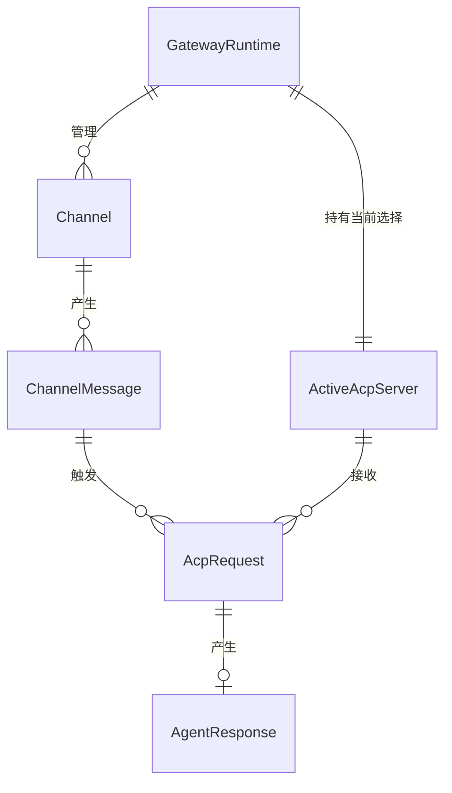
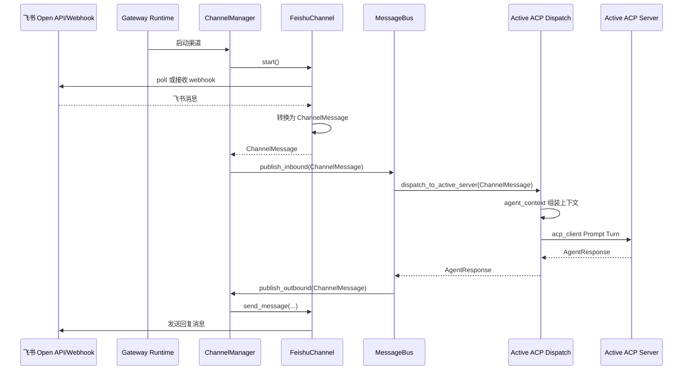
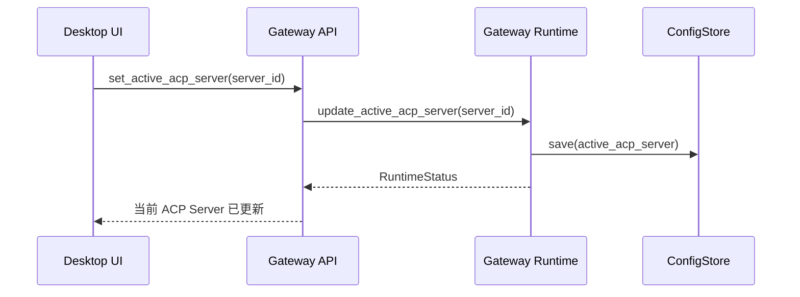

> **Status**: `draft`

# 架构总览：Gateway Runtime 与 ACP Server 调度

## § 系统目标与约束

MindClaw 消息调度子系统以 **Gateway Runtime** 为本地常驻核心：Gateway Runtime 在桌面窗口最小化或关闭后持续运行，负责托管消息渠道、MessageBus、当前激活 ACP Server 调用链路和本地控制 API；Desktop UI 只作为配置、监控和人工操作的客户端。

核心数据流： **`Gateway Runtime → ChannelManager → MessageBus → agent_context → acp_client → Active ACP Server`**

**核心约束：**

- Gateway Runtime 是消息接入和 ACP Server 调度的运行时核心，Desktop UI 退出窗口后不影响已启用渠道的轮询、Webhook 接入和消息处理
- Gateway Runtime 同一时刻只有一个 **Active ACP Server** 接收自动进入的渠道消息
- Desktop UI、CLI、Web UI、Mobile companion 和外部 Webhook 通过 Gateway API 接入，不直接调用渠道实现或 MessageBus 内部结构
- 所有消息处理在本地完成，不经过 MindClaw 云端服务
- 密钥（飞书 Token 等）存储在 Stronghold 中
- 遵循现有分层架构：Command (thin) → Service (thick) → Storage (thin)
- Services 层不得 `use tauri::*`
- ACP 是通信协议，MindClaw 是 ACP Client，Agent 进程是 ACP Server。MindClaw 不实现 Agent 智能，只负责协议通信和本地能力暴露

## § 核心设计原则

1. **Gateway Runtime 常驻化**：消息渠道、MessageBus 和 ACP Server 调用链路由 Gateway Runtime 托管；理由是桌面窗口生命周期不能决定消息接入是否在线。
2. **单一激活 ACP Server**：自动进入的渠道消息直接发送给当前激活 ACP Server；理由是 v1 不引入多 Agent 路由规则，降低调度复杂度。
3. **UI 是客户端**：Desktop UI 只通过 Gateway API 查看状态、修改配置和发起人工操作；理由是 CLI、Web UI、Mobile companion 与桌面端应复用同一运行时入口。
4. **Channel 拥有协议细节**：FeishuChannel、TelegramChannel 负责渠道 API、凭证、协议解析和 `ChannelMessage` 转换；理由是渠道响应结构差异大，转换逻辑应靠近对应 API。
5. **智能在 ACP Server 端**：意图识别、任务规划、工具执行决策在 ACP Server 中完成；理由是 MindClaw 负责调度、上下文注入和本地能力暴露，不承担 Agent 运行时职责。

## § 关键设计决策

| 决策问题 | 选择 | 放弃的替代方案 | 理由 |
|---------|------|--------------|------|
| 消息接入运行时绑定桌面窗口还是后台服务？ | Gateway Runtime 常驻后台运行 | Desktop UI 进程直接承载渠道连接 | 桌面窗口最小化或关闭后仍需接收和处理 IM 消息 |
| gateway 是渠道 registry 还是运行时入口？ | gateway 定位为 Gateway Runtime | gateway 仅承载 ChannelGateway trait 和 Registry | Webhook、多客户端接入、health check、后台任务需要统一运行时边界 |
| 消息如何选择 Agent？ | 发送到当前激活 ACP Server | RouteRule 多 Agent 路由 | v1 只需要一个用户当前选中的 Agent 处理消息，避免提前引入规则引擎 |
| 渠道抽象放在哪里？ | ChannelManager 作为 Gateway Runtime 内部子模块 | 将渠道实现作为顶层架构层 | 渠道生命周期由 Gateway Runtime 管理，MessageBus 不依赖具体渠道 |
| 飞书消息获取用轮询还是 Webhook？ | v1 支持轮询，Gateway Runtime 预留 Webhook HTTP 入口 | 仅桌面端手动刷新 | 后台持续运行需要自动接入；Webhook 接入需要服务端入口 |
| Agent 上下文组装？ | 独立 `agent_context` 模块 | 并入 `acp_client` | 解耦协议层与 prompt 逻辑，独立可测试 |

## § 边界划分

```
┌──────────────────────────────────────────────────────────────────────────────┐
│                            Clients                                           │
│  Desktop UI        CLI        Web UI        Mobile companion        Webhook   │
│  (控制台)          (命令)     (浏览器)      (伴随客户端)           (外部入口) │
└──────────┬──────────┬──────────┬───────────┬───────────────────────┬────────┘
           │          │          │           │                       │
           ▼          ▼          ▼           ▼                       ▼
┌──────────────────────────────────────────────────────────────────────────────┐
│                         Gateway Runtime                                      │
│                                                                              │
│  ┌────────────────┐  ┌────────────────┐  ┌──────────────────────────────┐  │
│  │ Gateway API    │  │ Health/Superv. │  │        ChannelManager        │  │
│  │ HTTP/WS/IPC    │  │ health/start   │  │ FeishuChannel/Telegram/...   │  │
│  └───────┬────────┘  └───────┬────────┘  └──────────────┬───────────────┘  │
│          │                   │                          │ ChannelMessage    │
│          └───────────────────┴──────────────────────────▼                  │
│  ┌──────────────────────────────────────────────────────────────────────┐  │
│  │                         MessageBus                                    │  │
│  │             inbound / outbound / subscription                         │  │
│  └──────────────────────────────────┬───────────────────────────────────┘  │
│                                     │ ChannelMessage                         │
│                                     ▼                                       │
│  ┌──────────────────────────────────────────────────────────────────────┐  │
│  │                       Active ACP Dispatch                             │  │
│  │       agent_context → acp_client → Active ACP Server                  │  │
│  └──────────────────────────────────────────────────────────────────────┘  │
│                                                                              │
│  ┌──────────────────────────────────────────────────────────────────────┐  │
│  │                    Storage / Config / Stronghold                      │  │
│  │        active_acp_server, messages, sessions, memory, secrets         │  │
│  └──────────────────────────────────────────────────────────────────────┘  │
└──────────────────────────────────────────────────────────────────────────────┘
```

**模块职责：**

- **Gateway Runtime**：本地常驻运行时。负责启动和监督 ChannelManager、MessageBus、Active ACP Dispatch、Gateway API、health check 和后台任务
- **Gateway API**：本地控制入口。向 Desktop UI、CLI、Web UI、Mobile companion 和 Webhook 暴露受控 API，不暴露内部模块实现
- **ChannelManager**：渠道生命周期管理器。负责启动、停止、健康状态、轮询任务和出站消息分发
- **Channels**：具体渠道实现。FeishuChannel、TelegramChannel 负责渠道 API、凭证、协议解析和 `ChannelMessage` 转换
- **MessageBus**：消息总线层。接收 `ChannelMessage`，传递给 Active ACP Dispatch，并将响应转为出站消息
- **Active ACP Dispatch**：当前激活 ACP Server 调用链路。由 `agent_context` 组装上下文，再由 `acp_client` 通过 ACP 协议调用 Active ACP Server
- **Storage / Config / Stronghold**：持久化消息、配置、会话、记忆、Active ACP Server 配置和密钥

**数据流方向：**

```
Feishu Poll/Webhook ─▶ Gateway Runtime ─▶ ChannelManager ─▶ MessageBus ─▶ agent_context ─▶ acp_client ─▶ Active ACP Server
Feishu API ◀────────── Gateway Runtime ◀── ChannelManager ◀── MessageBus ◀── AgentResponse ◀──────────────────────┘
Desktop UI / CLI / Web UI ───────────────▶ Gateway API ─▶ Runtime Status / Active ACP Server / MessageStore / Config
```

## § 核心实体关系

**核心实体：**

- **GatewayRuntime**：本地常驻运行时，拥有渠道、消息总线、Active ACP Dispatch 和控制 API 的生命周期
- **Channel**：外部消息渠道的本地适配器，负责接入外部 IM 平台并产生 `ChannelMessage`
- **ChannelMessage**：跨渠道统一消息，包含来源渠道、会话、发送者、内容、时间和回复关系
- **ActiveAcpServer**：用户当前选中的 ACP Server，接收自动进入的渠道消息
- **AcpRequest**：经 `agent_context` 组装后的 ACP 协议请求，包含 system prompt、上下文、用户消息和可用工具描述
- **AgentResponse**：Active ACP Server 处理完成后返回的结果，包含处理状态、输出内容和错误信息



## § 整体流程

### 主流程：飞书消息 → Active ACP Server 处理 → 回复



### Desktop UI 切换当前激活 ACP Server



## § 部署架构

- Gateway Runtime 作为本地常驻后台服务运行，由 Desktop UI 启动、连接和监督
- Desktop UI 关闭窗口后，Gateway Runtime 持续处理已启用渠道消息
- 用户显式退出 MindClaw 后，Gateway Runtime 停止渠道连接并关闭 Active ACP Dispatch
- Gateway Runtime 对本机客户端暴露 Local API；外部 Webhook 入口必须经过明确开启和认证配置

## § 安全架构

- **密钥管理**：飞书 App ID/Secret 存储在 Stronghold (`tauri-plugin-stronghold`)
- **信任边界**：Gateway API 是 Desktop UI、CLI、Web UI、Mobile companion 和 Webhook 进入系统的唯一入口
- **本地 API 访问控制**：本机客户端通过本地 token 或系统权限访问 Gateway API
- **Webhook 访问控制**：外部 Webhook 必须校验渠道签名或共享密钥
- **ACP Server 控制**：只有用户显式选择的 Active ACP Server 接收自动渠道消息
- **数据隔离**：`vault/private/` 对 ACP Server 不可见，Storage 层拒绝 `private/` 前缀路径
- **工具沙箱**：`acp_client::ToolExecutor` 执行本地工具时受权限控制，Terminal 工具禁止危险命令
