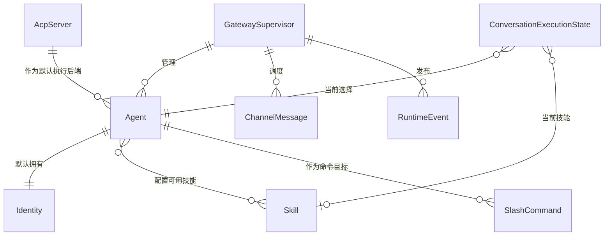
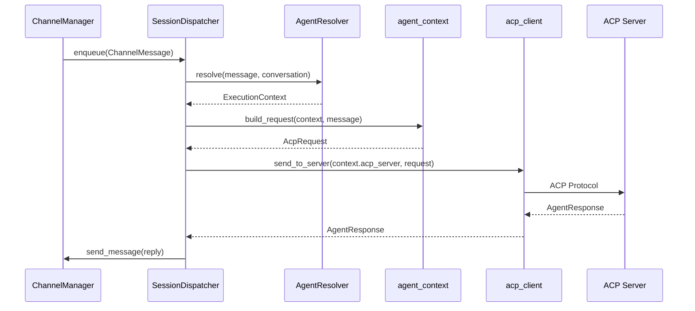
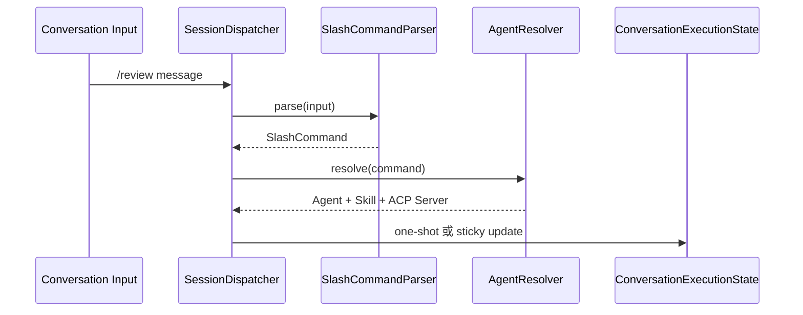

> **Status**: `draft`

# 架构总览：App 内驻留 GatewaySupervisor、Agent 与会话调度

## § 系统目标与约束

MindClaw 消息调度子系统以 **Gateway Runtime** 为业务运行时边界，为 Desktop UI、CLI、Web UI、Mobile companion、Webhook 和外部消息渠道提供统一的本地 Agent Runtime。代码实现命名为 **GatewaySupervisor**，运行在 Tauri App 进程内，复用 Tauri 的应用运行时、managed State、AppHandle 和 async runtime。

核心数据流：**`GatewaySupervisor → ChannelManager → SessionDispatcher → AgentResolver → agent_context → acp_client → Agent 绑定的 ACP Server`**。

事件数据流：**`GatewaySupervisor / ChannelManager / SessionDispatcher → EventBus → Gateway API / UI / Logger / Audit`**。

**核心约束：**

- Gateway Runtime 是业务运行时边界，不是 Tauri runtime、Tokio runtime 或独立 OS daemon。
- GatewaySupervisor 作为 Tauri managed State 的业务组件运行在 Tauri App 进程内。
- MindClaw 第一阶段采用 App 内驻留：窗口关闭到托盘后 GatewaySupervisor 继续运行，用户显式退出应用后 GatewaySupervisor 停止。
- 业务层不得创建独立 `tokio::runtime::Runtime`。
- 独立 daemon 不是 v1 边界；UI 完全退出后继续接收消息属于 daemon / sidecar 演进方向。
- 无 slash command 的自动消息使用默认 Agent。
- SlashCommand 是用户显式选择 Agent 或 Skill 的入口，不读取 legacy RouteRule。
- Skill 独立管理，Agent 与 Skill 是多对多关系。
- Desktop UI、CLI、Web UI、Mobile companion 和外部 Webhook 通过 Gateway API 接入，不直接调用渠道实现、SessionDispatcher、AgentResolver 或 EventBus 内部结构。
- Channel 只负责外部协议、凭证、payload 转换和渠道发送。
- ChannelManager 按渠道 inbound driver 启动消息接收任务：polling、long polling、stream、webhook handler 或 manual input。
- SessionDispatcher 负责消息去重、按会话保序、slash command 解析入口、ACP 调用和回复编排。
- EventBus 只负责 Pub/Sub 事件传播，不参与业务调度。
- Services 层不得 `use tauri::*`；Tauri 相关能力只出现在 `lib.rs`、`commands` 或 Gateway API adapter 层。
- 所有消息处理在本地完成，不经过 MindClaw 云端服务。
- 密钥存储在 Stronghold 中。

## § 核心设计原则

1. **App 内驻留优先**：GatewaySupervisor 运行在 Tauri App 进程内，窗口关闭到托盘后继续处理消息；理由是 v1 不承担独立 daemon 的安装、更新和 IPC 成本。
2. **Agent 是执行者**：用户通过默认 Agent 或 `/命令` 选择谁执行；理由是 Agent 比 ACP Server 更贴近用户心智。
3. **Skill 独立复用**：Skill 独立管理，Agent 与 Skill 多对多关联；理由是任务能力需要跨 Agent 复用。
4. **SessionDispatcher 管业务调度**：入站消息按 `channel + conversation_id` 分片调度，并解析显式命令；理由是同一会话需要顺序一致，不同会话不应互相阻塞。
5. **EventBus 管事件传播**：运行时事件通过 EventBus 广播给 UI、日志和审计；理由是 Pub/Sub 事件传播与 ACP 调度是不同职责。

## § 关键设计决策

| 决策问题 | 选择 | 放弃的替代方案 | 理由 |
|---------|------|--------------|------|
| v1 后台模型是什么？ | Tauri App 内驻留 GatewaySupervisor | 独立 OS daemon | App 内驻留满足窗口关闭到托盘后的消息处理，避免 daemon 安装、更新和本地 IPC 成本 |
| 用户选择的主对象是什么？ | Agent | ACP Server 或 RouteRule | Agent 表达“谁来执行”，ACP Server 是执行后端，RouteRule 是 legacy 自动路由 |
| Skill 如何建模？ | Skill 独立管理，Agent-Skill 多对多 | Skill 内嵌在 Agent | 独立 Skill 能被多个 Agent 复用，减少重复配置 |
| 入站消息由 Bus 还是 Dispatcher 处理？ | SessionDispatcher 处理 ACP 调度和 slash command 入口 | MessageBus 直连上下游 | 当前链路是有序处理管线，不是多订阅者 Pub/Sub |
| Agent 如何选择？ | 默认 Agent + SlashCommand 显式选择 | RouteRule 多 Agent 自动路由 | 显式命令比关键词规则更可解释，避免规则冲突 |
| 事件传播如何建模？ | EventBus 作为真正 Pub/Sub | 让 SessionDispatcher 同时广播事件 | 事件订阅和业务调度拥有不同变更理由 |
| 外部 SaaS webhook 如何接入？ | v1 保留 Gateway API 边界，本机可接收 local webhook；公网 webhook 需要 relay 或用户自建 endpoint | 认为 daemon 能直接接收公网 webhook | daemon 解决进程常驻，公网 webhook 需要公网 HTTPS endpoint |

## § 边界划分

```
Tauri App Process
  ├─ Tauri Runtime
  │    ├─ app/window/webview event loop
  │    ├─ IPC commands
  │    ├─ plugin lifecycle
  │    ├─ managed State
  │    └─ async runtime
  │
  └─ AppState
       └─ GatewaySupervisor
            ├─ Gateway API adapter
            ├─ ChannelManager
            ├─ SessionDispatcher
            │    ├─ per-session queue
            │    ├─ SlashCommandParser
            │    ├─ AgentResolver
            │    ├─ agent_context
            │    ├─ acp_client
            │    └─ reply orchestration
            ├─ Agent module
            │    ├─ Agent
            │    ├─ Identity
            │    ├─ Skill
            │    ├─ SlashCommand
            │    └─ ConversationExecutionState
            ├─ EventBus
            └─ Storage / Config / Stronghold
```

**模块职责：**

- **Tauri Runtime**：应用运行时。负责 app 事件循环、窗口、WebView、IPC、插件生命周期、managed State、AppHandle 和 async executor。
- **GatewaySupervisor**：Gateway Runtime 的 Rust 实现。负责组装和监督 ChannelManager、SessionDispatcher、Agent 模块、EventBus、Gateway API adapter、Storage、Config 和 Stronghold。
- **Agent module**：执行者管理模块。负责 Agent、Identity、Skill、SlashCommand 和 ConversationExecutionState。
- **ChannelManager**：渠道生命周期管理器。负责渠道注册、凭证代理、健康状态、inbound driver 启停和出站分发。
- **SessionDispatcher**：消息调度器。负责去重、保存、按 session 保序、slash command 入口、ACP 调用和回复编排。
- **agent_context**：上下文组装 seam。负责把 Agent Identity、Skill instruction、记忆和工具元数据组装为 ACP 请求。
- **acp_client**：ACP 协议客户端。负责与 Agent 绑定的 ACP Server 通信，不承载业务智能。
- **EventBus**：事件总线。负责运行时事件广播，不承担消息业务调度。

**跨切关注点：**

- **鉴权**：Gateway API adapter 校验本地客户端和 Webhook 请求。
- **审计与日志**：EventBus 发布事件，Logger 和 Audit 订阅事件。
- **错误翻译**：Service 层将渠道、Agent 解析、ACP 和调度错误转换为 Gateway Runtime 错误边界。
- **密钥保护**：Stronghold 持有渠道凭证和 ACP Server secret。
- **任务取消**：GatewaySupervisor 使用 cancellation token 统一停止 inbound drivers 和 dispatcher workers。

## § 核心实体关系

- **GatewaySupervisor**：App 内驻留的业务主管组件，拥有渠道管理、Agent 管理、会话调度、事件广播和控制 API 的生命周期。
- **Agent**：用户可选择的执行者，默认拥有 Identity，绑定默认 ACP Server，并关联多个 Skill。
- **Identity**：Agent 的身份、人设和行为约束。
- **Skill**：独立管理的任务能力模板，可被多个 Agent 复用。
- **AcpServer**：Agent 默认绑定的 ACP 执行后端。
- **SlashCommand**：对话中的显式选择入口，映射到 Agent 或 Agent + Skill。
- **ConversationExecutionState**：按 `channel + conversation_id` 保存当前会话 Agent、Skill 和 ACP session 状态。
- **ChannelMessage**：跨渠道统一消息，表示一次来自外部渠道或 Agent 回复的消息。
- **RuntimeEvent**：Gateway Runtime 内部事件，用于 UI、日志、审计和监控订阅。



## § 整体流程

### 主流程：渠道消息 → Agent 解析 → ACP Server → 渠道回复



### SlashCommand 选择流程



## § 部署架构

- GatewaySupervisor 运行在 Tauri App 进程内。
- Desktop UI 关闭窗口到托盘后，Tauri App 进程保持运行，GatewaySupervisor 持续处理已启用渠道消息。
- 用户显式退出 MindClaw 后，GatewaySupervisor 停止 inbound drivers 并关闭调度器。
- v1 不安装独立 daemon、sidecar 或 OS service。
- GatewaySupervisor 对本机客户端暴露 Local API；外部公网 Webhook 入口需要 Cloud Relay、tunnel 或用户自建 HTTPS endpoint。

## § 安全架构

- **密钥管理**：渠道凭证和 ACP Server secret 存储在 Stronghold。
- **信任边界**：Gateway API adapter 是 Desktop UI、CLI、Web UI、Mobile companion 和 Webhook 进入系统的唯一入口。
- **Agent 选择边界**：SlashCommand 只使用用户可见且已启用的 Agent 和 Skill。
- **Webhook 访问控制**：外部 Webhook 必须校验渠道签名或共享密钥；公网 webhook 必须经过 HTTPS endpoint。
- **数据隔离**：`vault/private/` 对 ACP Server 不可见，Storage 层拒绝 `private/` 前缀路径。
- **工具权限**：ACP Server 发起的本地工具调用经过 `acp_client::ToolExecutor` 权限控制。
