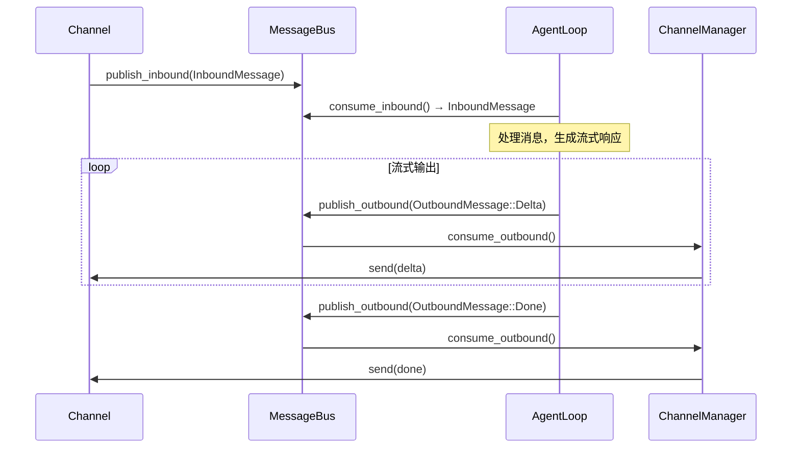

> **Status**: `active`

# MessageBus — 异步消息队列

---

## § 职责定位

MessageBus 负责解耦 Channel 层与 AgentLoop 的双向异步通信，不负责消息的内容处理、路由决策或会话管理。

---

## § 核心原则

**严格单向数据流**：Channel 只写入 Inbound 队列，AgentLoop 只消费 Inbound 队列；AgentLoop 只写入 Outbound 队列，ChannelManager 只消费 Outbound 队列。两个方向的数据不混合。

---

## § 边界与实体

**输入**（Inbound）：Channel 发布的用户消息，携带来源通道标识和用户身份。
**输入**（Outbound）：AgentLoop 或 `InteractiveRunHooks` 发布的 Agent 响应，携带目标会话标识和响应内容。
**输出**（Inbound）：AgentLoop 消费，进入业务处理流程。
**输出**（Outbound）：ChannelManager 消费，路由到对应 Channel 推送给用户。

**核心实体**：

**InboundMessage**：从用户到 Agent 的消息，是 Channel 与 AgentLoop 之间的唯一数据载体。
关键属性：`session_key`（`{channel_name}:{chat_id}` 格式）、发送者 ID、消息内容（文本 + 可选媒体附件）、消息类型（普通消息 / 控制命令）。
关系：由 Channel 实现创建，由 AgentLoop 的主循环消费；`session_key` 同时作为响应路由依据。

**OutboundMessage**：从 Agent 到用户的消息，承载不同阶段的响应内容。
关键属性：`session_key`（与对应 InboundMessage 一致）、消息类型（流式文本增量 / 完整响应 / 工具执行进度 / 错误通知）、内容负载。
关系：由 AgentLoop 使用的 `InteractiveRunHooks` 在流式输出期间持续创建，由 ChannelManager 消费并路由到目标 Channel。

---

## § 消息流图

---

## § 关键流程

1. Channel 将用户消息封装为 InboundMessage（填入 `session_key` 和内容），调用 `bus.publish_inbound()`。
2. AgentLoop 主循环调用 `bus.consume_inbound()`（带超时），获取待处理消息。
3. AgentLoop 处理消息期间，`InteractiveRunHooks` 接收流式增量，调用 `bus.publish_outbound()` 持续发布流式 OutboundMessage。
4. ChannelManager 并行调用 `bus.consume_outbound()`，按 `session_key` 前缀匹配目标 Channel，调用 `channel.send()`。
5. 流式输出完成时，`InteractiveRunHooks` 发布 `OutboundMessage::Done`，ChannelManager 通知 Channel 流式结束。

---

## § 设计决策与权衡

| 决策问题 | 选择 | 放弃的替代方案 | 理由 |
|---------|------|--------------|------|
| Channel 如何通知 AgentLoop 有新消息？ | MessageBus 异步队列（基于 tokio mpsc channel） | Channel 直接调用 AgentLoop 方法（同步回调） | 队列解耦两侧生命周期：Channel 崩溃或重启不影响 AgentLoop；AgentLoop 繁忙时 Channel 不会阻塞 |
| 消息队列是否有界？ | 有界缓冲（固定容量） | 无界缓冲 | 有界缓冲提供自然背压：Channel 推送速度超过消费速度时阻塞发布方，防止内存无限增长 |
| Inbound 和 Outbound 是否共用一条队列？ | 两条独立队列 | 单条双向队列（带消息类型区分） | 两个方向的消费者完全不同（AgentLoop vs ChannelManager）；共用队列需要额外过滤逻辑，增加复杂度 |
| 流式响应如何通过 MessageBus 传递？ | 每个流式增量单独一条 OutboundMessage | 流式响应通过独立 WebSocket 连接绕过 MessageBus | 统一通过 MessageBus 保证所有出站消息都经过 ChannelManager 路由，Desktop 和 Telegram 行为一致 |
| session_key 格式？ | `{channel_name}:{chat_id}` 纯字符串 | 结构体（含 channel 和 chat_id 字段） | 字符串在日志中直接可读；ChannelManager 按前缀字符串匹配即可路由，无需反序列化 |
| 消息队列如何实现？ | tokio mpsc channel（内存队列） | 持久化消息队列（如 SQLite 队列） | 本地桌面应用消息在内存中传递即可；持久化队列增加磁盘 I/O 和复杂度，且 AgentLoop 处理速度通常快于消息到达速度 |
| 队列消费超时如何处理？ | 设置超时时间，超时后继续循环（优雅退出） | 无限期阻塞等待 | 超时允许 AgentLoop 在退出信号到达时有机会检查状态，实现优雅关闭 |
| 如何确保消息不丢失？ | Channel 确认收到后再返回 | 异步 fire-and-forget | 确认机制保证消息到达 MessageBus；本地应用内存队列本身可靠，fire-and-forget 在崩溃时可能丢失 |
| 如何处理超大消息？ | 拒绝超过大小限制的消息 | 分片传输 | 本地应用消息通常不大；分片增加复杂度，简单拒绝使问题暴露给调用方 |
