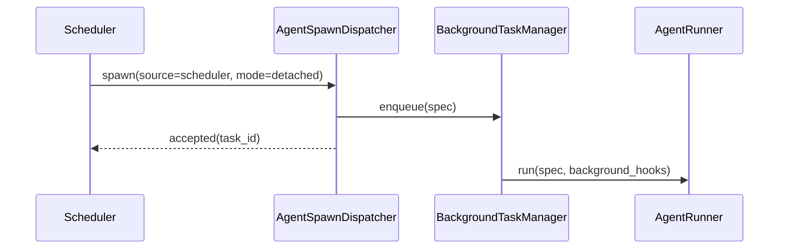

> **Status**: `active`

# Agent Spawn — SubAgent 派生执行

---

## § 职责定位

`AgentSpawnDispatcher` 负责统一处理 Agent Runtime 中的派生执行请求，不负责 LLM 迭代本身。

它覆盖两类运行方式：

- 主 Agent 发起 inline SubAgent，并等待结果
- 主 Agent 发起 detached SubAgent，立即返回 task id，完成后单独通知

---

## § 核心原则

**SubAgent 是唯一派生 Agent 定义**：后台不是独立 Agent 身份，而是 SubAgent 委派时选择的 `InvocationMode::Detached`。

**实现层共享机制**：inline 与 detached SubAgent 共用同一个 `AgentRunner` 和同一套 spawn 机制；差异主要在 `InvocationMode`、发起源和结果交付方式。

**LLM 不直接构造其他 Agent**：主 Agent 只能通过 orchestration tool 请求派发；真正的派生执行由 Runtime 的 spawn 层控制。

**Spawn 不拥有 Agent 定义**：派生 Agent 的身份、工具策略和 system prompt 来自 `AgentRegistry` 中的 `AgentProfile`。`spawn.rs` 只解析目标 agent id、补充 `SpawnContextSeed`，再构建本次 `AgentRunSpec`。

---

## § 概念与运行方式

| 概念 | 典型发起方 | InvocationMode | 是否等待 | 结果去向 |
|------|-----------|----------------|---------|---------|
| Inline SubAgent | 主 Agent | `inline_child` | 父 Agent 等待 | 回填为父 Agent 的 ToolResult |
| Background SubAgent | 主 Agent / Scheduler / System | `detached` | 不等待 | 写入任务结果，完成后单独通知 |

---

## § 核心对象

**AgentSpawnDispatcher**

- 解析 spawn source
- 校验派发权限
- 按 agent id 从 `AgentRegistry` 解析目标 `AgentProfile`
- 构建 spawn context seed
- 将 `AgentProfile.prompt_policy.system_prompt_template` 与 spawn context 合成派生 run 的 system prompt
- 根据 `AgentProfile.ToolPolicy` 构建派生工具集合
- 构建派生 `AgentRunSpec`
- 同步执行或异步入队
- 维护 parent-child / scheduler-root 链路

**SpawnSource**

- `ParentRun(parent_run_id, parent_agent_id)`
- `Scheduler(job_id)`
- `System(reason)`

**SpawnContextSeed**

- `task_brief`
- `workspace_root`

**SpawnResult**

- `completed(result)`：同步 SubAgent 结果
- `accepted(task_id)`：后台任务已入队

---

## § 调用入口

只暴露一个 orchestration tool：

- `delegate_to_agent`

`delegate_to_agent` 不直接执行 agent，而是把请求交给 `AgentSpawnDispatcher`。工具参数中的 `background` 决定本次委派使用 inline 还是 detached。

除此之外，Scheduler / System 也可以直接请求 spawn 后台 Agent，而不需要先构造一个“主 Agent 再转委托”。

---

## § 子代理调用链

```mermaid
sequenceDiagram
    participant Parent as Main Agent
    participant Loop as AgentLoop
    participant Spawn as AgentSpawnDispatcher
    participant Runner as AgentRunner

    Parent->>Loop: tool call: delegate_to_agent
    Loop->>Spawn: spawn(source=parent, mode=inline_child)
    Spawn->>Runner: run(spec, subagent_hooks)
    Runner-->>Spawn: result
    Spawn-->>Loop: completed(result)
    Loop-->>Parent: ToolResult(child_result)
```

---

## § 会话内后台调用链

```mermaid
sequenceDiagram
    participant Parent as Main Agent
    participant Loop as AgentLoop
    participant Spawn as AgentSpawnDispatcher
    participant Queue as BackgroundTaskManager
    participant Runner as AgentRunner

    Parent->>Loop: tool call: delegate_to_agent(background=true)
    Loop->>Spawn: spawn(source=parent, mode=detached)
    Spawn->>Queue: enqueue(spec)
    Spawn-->>Loop: accepted(task_id)
    Loop-->>Parent: ToolResult(task_id)
    Queue->>Runner: run(spec, background_hooks)
```

---

## § 定时任务后台调用链



这里没有“主 Agent 先委托”这个中间层。  
定时任务应直接启动 detached SubAgent root run。

---

## § 上下文继承规则

默认建议：

**SubAgent 继承**

- 任务描述
- 相关历史摘要
- 工作目录边界
- 必要约束

**SubAgent 不继承**

- 完整对话历史
- 完整记忆库
- 父 Agent 的全部工具权限

**Detached SubAgent 继承**

- 任务 payload
- root session id
- 必要上下文摘要

如果是 Scheduler / System 发起的 detached SubAgent，则由调度器提供任务 payload，不依赖父 Agent Session。

不建议把整个主 Session 原封不动传给派生执行。

---

## § 权限边界

父 Agent 侧使用 `DelegationPolicy` 控制：

- 能否调 subagent
- 能否后台委派
- 能调哪些派生 agents
- 最大并发数

目标 Agent 侧使用 `InvocationPolicy` 控制：

- 哪些父 Agent 可以调用它
- 是否继承 workspace scope
- 是否允许结果直接对用户可见

目标 Agent 的工具边界由 `ToolPolicy.allowed_tools` 控制。SubAgent 的默认工具集合在 Markdown Agent 定义中声明，spawn 层只执行过滤，不再硬编码提示词或能力描述。

Scheduler / System 发起的 detached SubAgent 不走父 Agent 的 `DelegationPolicy`，而走 Runtime 级调度权限。

---

## § 并发控制

`delegate_to_agent`（`inline_child`）不占用全局 runner 并发槽，父 Agent 在持有槽的同时等待子 Agent 结果。

`delegate_to_agent(background=true)`（`detached`）占用全局 runner 并发槽，由 BackgroundTaskManager 调度执行。

`inline_child` 不占全局槽是为了避免死锁（父 Agent 持槽等待子 Agent，子 Agent 却无法获得槽）。递归派生通过目标 Agent 的工具集合控制：默认 SubAgent 不包含委派工具。

---

## § 设计决策与权衡

| 决策问题 | 选择 | 放弃的替代方案 | 理由 |
|---------|------|--------------|------|
| SubAgent 与后台运行是否合并成同一个概念？ | 是，background 只作为委派属性 | 独立后台 Agent Profile | 二者共享身份、工具和提示词，差异只在 invocation 与结果交付 |
| 是否共用同一套实现机制？ | 是，共用 spawn 机制 + `AgentRunner` | 两套独立 runtime | 执行链路、权限校验和观测需求高度重叠，没必要复制 |
| 定时任务后台执行是否必须经由主 Agent 委托？ | 否，Scheduler 可直接启动 detached SubAgent | 先构造主 Agent 再委托 | 这会人为引入不存在的父子关系，也让调度链路变脏 |
| 派生执行是否继承完整 Session？ | 否，只传摘要或任务 payload | 复制完整历史 | 完整复制成本高，也容易泄露无关上下文和权限 |
| Detached SubAgent session 是否写 DB？ | Ephemeral（不写 DB） | Persistent（写 DB） | 后台运行状态由 BackgroundTaskManager 追踪（含 task_id、状态、结果）；Session 历史不需长期保留；若 app 崩溃，BackgroundTaskManager 可根据未完成任务重新入队，无需 Session 恢复 |
