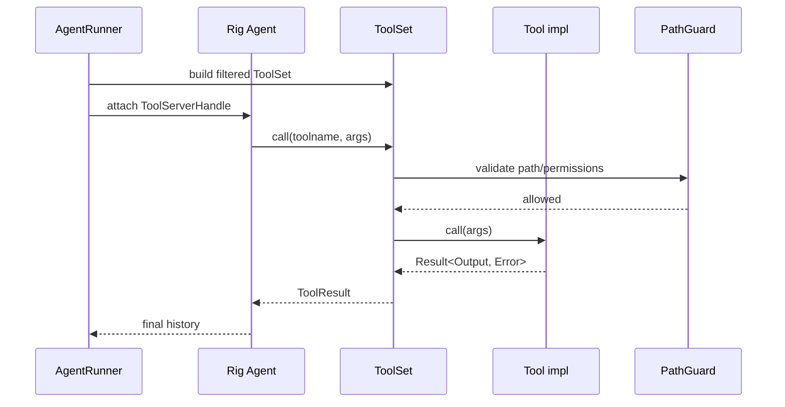

> **Status**: `active`

# Tool Execution — 工具注册、沙箱与执行

---

## § 职责定位

工具系统负责声明可用工具、构建本次 run 的 Rig 工具范围，并把工具交给 Rig execution kernel 执行；不负责决定当前 Agent 是否可以使用某个工具。

---

## § 核心原则

**rig Tool 作为唯一执行接口**：内置工具实现 `rig::tool::ToolDyn` 或 `rig::tool::Tool`，不再引入 MindClaw 自定义 Tool trait。

**ToolSet / ToolServerHandle 替代 ToolRegistry**：`build_tools(...)` 返回本次 run 的 `Vec<Box<dyn ToolDyn>>`，Runner 将它装入 Rig `ToolSet` 与 `ToolServerHandle`。

**Profile 决定可用性，Runtime 决定执行**：`AgentProfile.ToolPolicy` 只定义白名单与策略，真正的工具执行属于 Runtime Support。

**安全边界先于能力**：PathGuard、权限配置、超时和并发限制必须先于工具逻辑生效。

**MCP 桥接优先使用 Rig 适配**：MindClaw 保留 MCP 配置、连接生命周期和权限策略；远端工具通过 Rig `rmcp::McpTool` 进入同一工具路径。

---

## § 核心对象

**rig::tool::Tool trait**

所有工具的统一接口定义。

```rust
pub trait Tool: Sized + Send + Sync {
    type Error: Error + Send + Sync + 'static;
    type Args: for<'a> Deserialize<'a> + Send + Sync;
    type Output: Serialize;
    const NAME: &'static str;
    fn definition(&self, prompt: String) -> impl Future<Output = ToolDefinition>;
    fn call(&self, args: Self::Args) -> impl Future<Output = Result<Self::Output, Self::Error>>;
}
```

**#[rig_tool] macro**

将函数自动转换为 Tool trait 实现。

- 自动生成 ToolDefinition（JSON Schema）
- 自动处理参数解析和错误转换
- 函数签名直接作为工具接口

**rig::tool::ToolSet**

工具集合管理器。

- `ToolSet::builder().tool(t1).tool(t2).build()` 构建工具集
- `ToolSet::from_tools(vec![...])` 从列表创建
- `toolset.call(toolname, args)` 执行工具
- `toolset.documents()` 获取工具文档
- `toolset.get_tool_definitions()` 获取工具定义列表

**rig::tool::server::ToolServer / ToolServerHandle**

Runner 为每次 run 创建 ToolServer，将过滤后的 ToolSet 追加进去，并把 handle 挂到 Rig Agent。工具调用、结果回填和错误传播由 Rig 负责。

**PathGuard**

文件系统安全边界。

- 强制 vault_only 访问策略
- 拒绝 private/ 路径访问
- 在工具执行前校验路径合法性

---

## § 工具定义方式

### 使用 #[rig_tool] macro 定义工具

```rust
#[rig_tool]
async fn read_file(
    path: String,
    offset: Option<usize>,
    limit: Option<usize>
) -> Result<String, AppError> {
    // PathGuard 校验
    // 读取文件内容
    // 返回结果
}
```

macro 自动生成：

- `NAME = "read_file"`
- `ToolDefinition` 包含 JSON Schema
- 参数类型 `Args` 从函数签名推导
- 返回类型 `Output = String`

### MCP 工具适配

MCP bridge 直接使用 Rig 的 rmcp 适配：

```rust
let tool = rig::tool::rmcp::McpTool::from_mcp_server(
    mcp_tool,
    client.inner.peer().clone(),
);
```

---

## § 工具分类

| 类别                 | 示例                                                                            | 定义方式            | 归属                  |
| -------------------- | ------------------------------------------------------------------------------- | ------------------- | --------------------- |
| builtin tools        | `read_file`、`write_file`、`edit_file`、`find_files`、`search_content`、`shell` | `#[rig_tool]` macro | Runtime Support       |
| orchestration tools  | `delegate_to_agent`、`spawn_background_agent`                                   | `#[rig_tool]` macro | Orchestration Support |
| external tool bridge | MCP server tools                                                                | Rig `McpTool`       | Adapter Layer         |

---

## § 执行链



---

## § 与 AgentProfile 的关系

每次 run 开始前：

1. AgentLoop 根据 `AgentProfile.ToolPolicy.allowed_tools` 构建本次工具范围
2. 内置工具、MCP 工具和 spawn 工具统一为 `Box<dyn ToolDyn>`
3. AgentRunner 将工具列表转换为 `ToolSet`
4. Rig Agent 通过 `ToolServerHandle` 执行工具

因此：

- 工具白名单属于 Definition
- 工具实现与执行属于 Runtime
- MCP bridge 作为 external bridge 理解
- 子代理工具仍是普通 Rig 工具；子代理默认不再注入 spawn 工具，避免递归失控

---

## § 关键执行策略

Rig ToolSet / ToolServer 内置支持：

- 并发控制：rig 内置工具执行管理
- 超时：由 rig Agent 配置或上层 CancellationToken 控制
- 失败策略：由 `AgentRunSpec.fail_on_tool_error` 决定
- 沙箱：PathGuard 在工具 call 前校验

MindClaw 层面：

- 审计：工具输入摘要、输出摘要、耗时记录到 `ToolEvent`
- 权限：AgentProfile.ToolPolicy 过滤

---

## § 文件结构变更

迁移后 tools 目录结构：

```text
tools/
├── mod.rs           # ToolDyn 列表初始化、Profile 过滤和导出
├── file_ops.rs      #[rig_tool] read_file, write_file, edit_file
├── shell.rs         #[rig_tool] shell
├── find_files.rs    #[rig_tool] find_files
├── search_content.rs #[rig_tool] search_content
├── mcp.rs           # MCP config/lifecycle + Rig McpTool
├── agent_spawn.rs   #[rig_tool] delegate_to_agent, spawn_background_agent
└── path_guard.rs    # 文件系统安全边界（保留）
```

删除文件：

- `traits.rs`（自定义 Tool trait 被 rig::tool::Tool 替代）

---

## § 设计决策与权衡

| 决策问题                            | 选择                                | 放弃的替代方案                  | 理由                                                            |
| ----------------------------------- | ----------------------------------- | ------------------------------- | --------------------------------------------------------------- |
| Tool trait 用 rig 还是自定义？      | 使用 rig::tool::Tool + #[rig_tool]  | 保持自定义 Tool trait           | rig 提供标准化工具定义，自动生成 JSON Schema，减少样板代码      |
| ToolRegistry 是否保留？             | 删除，使用 rig ToolSet              | 保留自定义 ToolRegistry         | ToolSet 提供相同功能，无需重复实现                              |
| MCP 桥接如何处理？                  | 保持 MCP 管理逻辑，远端工具通过 Rig `McpTool` 暴露 | 自研 MCP ToolDyn wrapper | Rig 已提供 rmcp 工具适配，MindClaw 只需保留配置和连接生命周期 |
| 工具权限在哪里决定？                | AgentLoop 基于 Profile 过滤工具范围 | Tool 自己判断是否允许           | 权限集中在 Definition + Orchestration，工具实现应尽量无策略判断 |
| orchestration tool 是否算普通工具？ | 是，统一注册到 ToolSet              | 单独开旁路调用                  | 统一管理，避免隐式特权路径                                      |
| #[rig_tool] 能否处理复杂场景？      | 是，支持 async、多参数、Result 返回 | 手写 Tool trait 实现            | macro 覆盖大部分场景，复杂场景可直接实现 Tool trait             |
