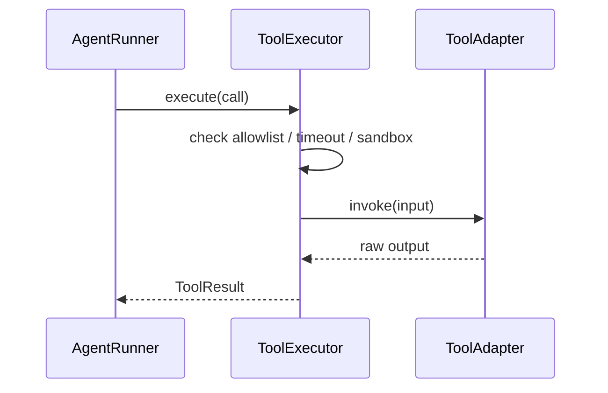

> **Status**: `active`

# Tool Execution — 工具注册、沙箱与执行

---

## § 职责定位

工具系统负责声明可用工具、执行工具调用、控制并发与超时，并提供统一的结果格式；不负责决定当前 Agent 是否可以使用某个工具。

---

## § 核心原则

**Profile 决定可用性，Runtime 决定执行**：`AgentProfile.ToolPolicy` 只定义白名单与策略，真正的工具执行属于 Runtime Support。

**统一执行入口**：无论内置工具、MCP bridge 暴露的外部工具，还是 orchestration tool，都通过同一 ToolExecutor 执行。

**安全边界先于能力**：PathGuard、权限配置、超时和并发限制必须先于工具逻辑生效。

---

## § 核心对象

**ToolRegistry**

- 管理全部已注册工具
- 暴露 Schema 给 `AgentRunSpec`
- 按名称查找工具实现

**ToolExecutor**

- 执行工具调用
- 施加并发、超时、权限与审计
- 将输出标准化为 `ToolResult`

**ToolAdapter**

- 将文件系统、shell、MCP、子代理派发等能力包装为统一工具

**MCP Bridge**

- 管理 MCP server 配置、连接、生命周期与外部 tool 注册
- 最终产物仍然是注册进 `ToolRegistry` 的 `Tool`
- 当前代码物理上位于 `tools/`，但语义上属于 external tool bridge，而不是 builtin tool

---

## § 工具分类

| 类别 | 示例 | 归属 |
|------|------|------|
| builtin tools | `read_file`、`write_file`、`edit_file`、`find_files`、`search_content`、`shell` | Runtime Support |
| orchestration tools | `delegate_to_agent`、`spawn_background_agent` | Orchestration Support |
| external tool bridge | `mcp.rs` 注册出的 `mcp__*` tools | Adapter Layer |

---

## § 执行链



---

## § 与 AgentProfile 的关系

每次 run 开始前：

1. AgentLoop 从全局 ToolRegistry 取全部工具
2. 结合 `AgentProfile.ToolPolicy.allowed_tools` 过滤
3. 生成本次 run 的 `tool_schemas`
4. AgentRunner 执行时只允许访问这些工具

因此：

- 工具白名单属于 Definition
- 工具实现与执行属于 Runtime
- `mcp` 当前虽然放在 `tools/` 目录中，但应按 external bridge 理解，而不是按 builtin tool 理解

---

## § 关键执行策略

- 并发限制：防止大量工具同时执行
- 超时：避免 tool hang 住 run
- 失败策略：由 `fail_on_tool_error` 决定是否中止
- 沙箱：文件路径、工作目录、网络能力必须在执行前校验
- 审计：工具输入摘要、输出摘要、耗时记录到 `ToolEvent`

---

## § 设计决策与权衡

| 决策问题 | 选择 | 放弃的替代方案 | 理由 |
|---------|------|--------------|------|
| 工具执行放在哪层？ | Execution Support | 放进 AgentProfile 或 Provider | 工具执行是 run 内行为，不是定义层也不是 provider 适配层职责 |
| orchestration tool 是否算普通工具？ | 是，统一经过 ToolExecutor | 单独开旁路调用 | 统一记录、限流、超时与审计，避免隐式特权路径 |
| 工具权限在哪里决定？ | AgentLoop 基于 Profile 过滤 | Tool 自己判断是否允许 | 权限集中在 Definition + Orchestration，工具实现应尽量无策略判断 |
| `mcp` 是否应脱离 `tools/`？ | 当前不脱离 | 立即迁到独立 adapter 目录 | 当前代码规模下保留在 `tools/` 成本最低，但语义上已明确是 external bridge |

---

## § 未来扩展

当前 `tools/` 目录先保持扁平，避免过早拆分。

如果后续出现下面任一情况，可以再做二次整理：

- builtin tools 数量明显增多
- orchestration tools 继续扩展
- MCP / 其他外部工具桥接不再只有一种

届时建议的演进方向是：

```text
tools/
├── builtin/
├── orchestration/
├── bridge/
│   └── mcp.rs
├── mod.rs
└── traits.rs
```

在此之前，`mcp.rs` 继续留在 `tools/` 是合理的，但文档和代码注释应始终把它当作 bridge，而不是普通 builtin tool。
