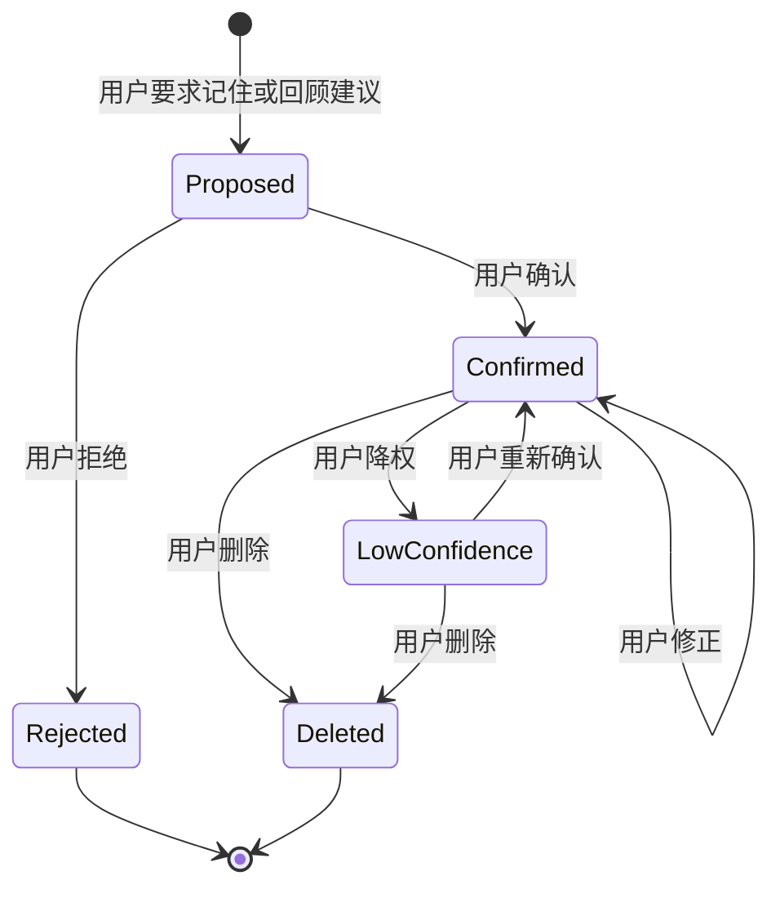

> **Status**: `active`

# Memory — Agent 记忆与召回

---

## § 职责定位

Memory 子系统负责维护 Agent 可召回的记忆文档、记忆状态、来源证据和知识引用；不负责旁路观察、经验教训提炼、共有知识正文写入或 Runtime 可观测性。

---

## § 核心原则

**记忆不是知识库**：Memory 保存 Agent 行动所需的短摘要、触发条件、来源和引用；已确认知识正文只保存在 Markdown Vault 中。

**记忆必须可审阅**：Agent 记忆以受管 Markdown + Frontmatter 作为真相源，ContextIndex 只保存召回索引、筛选索引和排序结果。

**确认优先于召回**：未确认观察不能作为稳定记忆注入上下文，只能在低风险场景作为假设提示。

**状态变化必须可审计**：确认、修正、删除、降权、链接知识都会生成演化记录，Memory 本身不隐藏变化原因。

---

## § 边界与实体

**输入**：用户显式记住请求、用户修正、已确认的 `MemoryUpdateProposal`、知识链接操作、召回查询。

**输出**：`MemoryRecord`、召回结果、记忆状态变更、知识引用、演化记录触发信号。

**核心实体**：

**MemoryRecord**：Agent 为后续判断和行动保存的受管 Markdown 记忆。
关键属性：ContextURI、归属、类型、状态、摘要、触发条件、来源、可信状态、更新时间、文档路径。

**MemorySource**：记忆形成的证据来源。
关键属性：来源类型、来源对象、摘录或摘要、生成时间。

**MemoryKnowledgeRef**：记忆对共有知识的引用。
关键属性：知识笔记路径、引用原因、触发条件、短摘要。

---

## § 二维分类

归属维度决定可见性和使用边界：

| 归属 | 含义 | 使用边界 |
|------|------|----------|
| `user` | 关于用户、用户环境、用户偏好的记忆 | 用户可查看、修正、删除 |
| `agent` | 关于 Agent 自身执行、失败和工作方法的记忆 | 可审计，影响后续行动 |
| `shared` | 对已确认共有知识的调用索引 | 只保留摘要、触发条件和知识引用 |

类型维度决定组织方式和召回策略：

| 类型 | 说明 |
|------|------|
| `profile` | 用户或工作空间的稳定背景 |
| `preference` | 稳定偏好、边界、默认行为要求 |
| `entity` | 人物、项目、组织、工具、知识对象 |
| `event` | 决策、里程碑、重要反馈或执行结果 |
| `observation` | 未确认的观察假设 |
| `case` | 具体案例，包含情境、行动、结果 |
| `pattern` | 多次案例中抽象出的模式 |
| `procedure` | 可复用的处理流程或工作方法 |
| `constraint` | 禁止事项、边界、强约束 |

---

## § 记忆状态



状态规则：

- `Proposed` 不进入稳定召回集合。
- `Confirmed` 可以进入上下文装配。
- `LowConfidence` 只能作为低置信提示，并且必须带上来源。
- `Deleted` 不再影响 Agent 行动，但记忆 Markdown 和演化记录保留删除原因。

---

## § Frontmatter 契约

Agent 记忆文档位于 `agent/memory/`，Frontmatter 使用 Storage 通用契约，并通过 `agent_asset` 扩展承载可索引状态。

```yaml
---
title: Markdown 作为 Agent 记忆真相源
origin: agent
agent_asset:
  kind: memory
  status: confirmed
  owner: user
  memory_type: preference
  confidence: 0.86
tags: [prd, product-design]
overview: 用户偏好以 Markdown 作为长期可审阅资产，而不是隐藏在数据库中。
refs:
  - mc://session/sess_20260429/turn/12
  - mc://agent/main/evolution/evo_20260429_003.md
created_at: 2026-04-29T10:20:00+08:00
updated_at: 2026-04-29T10:30:00+08:00
---
```

正文承载记忆内容、证据摘录、使用边界和备注。`shared` 记忆正文不复制知识全文，只保留短摘要、触发条件和 `refs` 引用。

---

## § 写入路径

### 路径 A：用户显式记住

用户通过 UI 或对话明确要求 Agent 记住某个背景、偏好或约束时，系统先生成 Inbox `memory_proposal` 条目。用户确认后，Memory 子系统才写入 `agent/memory/`。

### 路径 B：回顾建议确认

`Review & Evolution` 子系统在 Inbox 中生成 `MemoryUpdateProposal` Markdown。只有用户确认后，Memory 子系统才新增、修正、删除或降权 `MemoryRecord` Markdown，并由 InboxService 归档源建议。

### 路径 C：共有知识引用

经验教训或知识草稿保存为 Markdown 后，Memory 只创建或更新 `shared` 引用，不复制知识正文。

---

## § 召回策略

`ContextPipeline` 发起召回时，Memory 按以下优先级返回候选：

1. 与当前输入显式匹配的 `constraint` / `preference`
2. 已确认的 `profile` / `entity`
3. 与当前任务相关的 `case` / `pattern` / `procedure`
4. 带有知识引用的 `shared` 记忆
5. 低置信记忆，仅在上下文预算允许时返回

召回结果来自 ContextIndex，必须携带 ContextURI、来源和状态，供 `ContextPipeline` 决定是否注入、摘要或仅提示可打开。

---

## § 与其他模块的关系

| 模块 | 关系 |
|------|------|
| `ContextPipeline` | 读取已确认或低置信记忆并按预算注入上下文 |
| `Review & Evolution` | 生成 Inbox 记忆更新建议，接收记忆变更后的演化记录 |
| `NoteService` | 提供共有知识笔记读写；Memory 只保存引用 |
| `Storage` | 通过 ContextStore 持久化记忆 Markdown，并维护 ContextIndex 召回索引 |
| `Observability` | 记录召回耗时、命中数量等运行指标，不解释业务变化 |

---

## § 设计决策与权衡

| 决策问题 | 选择 | 放弃的替代方案 | 理由 |
|---------|------|--------------|------|
| 经验教训正文是否写入 Memory？ | 否，只写 Markdown 知识，Memory 保留引用 | 将经验教训正文复制进 Memory | 避免 Agent 记忆成为长期知识真相源 |
| Agent 是否能绕过审核直接写稳定记忆？ | 否，先生成 Inbox 建议或待确认条目 | LLM 工具直接写 confirmed memory | 记忆会影响后续行动，必须可审阅 |
| 待确认记忆建议存在哪里？ | Inbox | `agent/memory/` 中保存 Proposed 记忆 | Inbox 是统一待处理源，`agent/memory/` 只保存确认后或低可信的长期记忆 |
| Memory 是否负责经验提炼？ | 否，由 Review & Evolution 负责 | Memory 同时负责召回和提炼 | 召回是运行时能力，提炼是审核工作流，变更理由不同 |
| `shared` 是否仍属于 Memory？ | 是，但只作为调用索引 | 从 Memory 中完全移除 | Agent 需要快速找到可复用知识入口，但正文必须回到 Vault |
| Memory 真相源是否使用 Markdown？ | 是，使用受管 Markdown + Frontmatter | SQLite 表作为真相源 | 记忆是长期可审阅资产，需要随 Vault 迁移并可人工纠偏 |
| Memory 是否使用独立索引表？ | 否，写入统一 ContextIndex | `agent_memory_index` 单独维护 | Agent 记忆需要与知识、来源和演化资产在同一召回链路中比较 |
