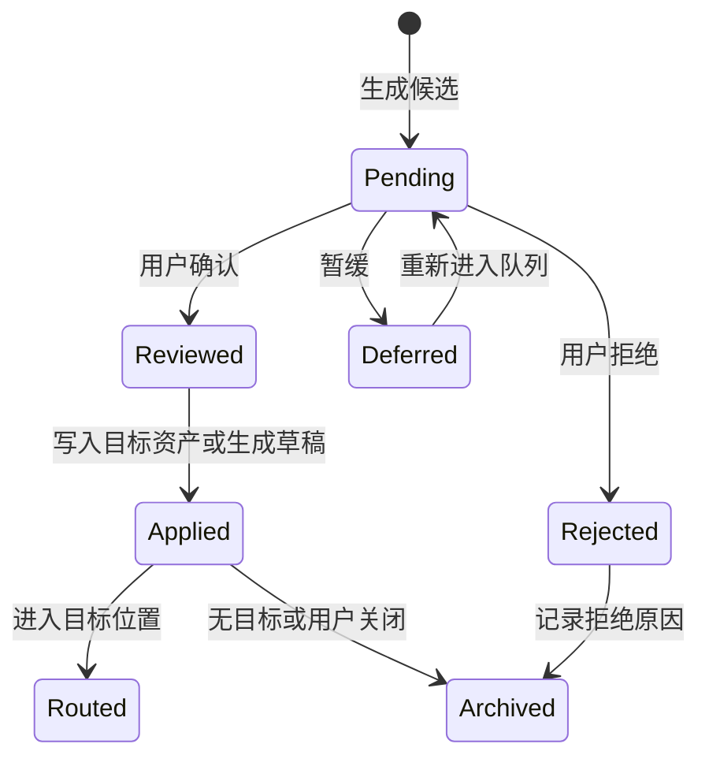

> **Status**: `active`

# Review & Evolution — 回顾、演化与经验教训候选

---

## § 职责定位

Review & Evolution 子系统负责把旁路观察、任务回顾、记忆更新建议、演化记录和经验教训候选组织成可审核流程；不负责 Agent 记忆召回、正式知识正文存储或底层模型执行。

---

## § 核心原则

**候选先于状态变化**：旁路观察、记忆更新和经验教训只能先进入候选或建议，不能直接改写稳定记忆或共有知识。

**Inbox 承载审核候选**：观察候选、记忆更新建议和经验教训候选先以 Inbox Markdown 保存；确认后的长期 Agent 资产只进入 `agent/memory/` 或 `agent/evolution/`。

**证据链不可丢失**：所有影响长期行为的变化都必须保留来源、触发原因和处理结果。

**旁路不阻塞主链路**：回顾可以由后台 Agent 生成候选，但不拉长用户当前对话响应。

---

## § 边界与实体

**输入**：Turn 完成信号、用户纠正、工具失败、任务完成、Daily 回顾、周期回顾、记忆变更事件。

**输出**：Inbox 中的 `ObservationCandidate`、`MemoryUpdateProposal`、`ReviewItem`、`LessonCandidate`、确认后的 `EvolutionLog`、知识草稿入口。

**核心实体**：

**ObservationCandidate**：旁路观察形成的待判断假设。
关键属性：Inbox ContextURI、观察摘要、来源、`confidence`、适用范围、拒绝原因、归档去向。

**MemoryUpdateProposal**：对 Agent 记忆的新增、修正、删除或降权建议。
关键属性：Inbox ContextURI、目标记忆、建议动作、变化前后摘要、证据来源、归档去向。

**ReviewItem**：回顾队列中的统一审核项。
关键属性：Inbox ContextURI、类型、状态、来源、优先级、关联对象、归档去向。

**EvolutionLog**：Agent 记忆或策略变化的审计记录。
关键属性：ContextURI、变化类型、变化前后内容、触发原因、证据摘要、session / turn 引用、处理人备注、文档路径。

**LessonCandidate**：可复用经验教训的待审核候选。
关键属性：Inbox ContextURI、适用场景、规则、反例、触发条件、来源记录、目标记忆或知识去向。

---

## § 触发与产物

| 触发信号 | 判断问题 | 直接产物 | 后续动作 |
|----------|----------|----------|----------|
| 用户明确要求记住 | 是否是稳定背景、偏好或约束 | Inbox `MemoryUpdateProposal` Markdown | 用户确认后写 Memory |
| 用户纠正 Agent | 哪个判断或默认策略需要改变 | Inbox `MemoryUpdateProposal`，确认后生成 `EvolutionLog` Markdown | 修正记忆或生成经验候选 |
| 用户否定候选 | 哪个假设不成立 | 拒绝状态和原因 | 后续召回排除 |
| 工具或执行失败 | 是否是可复用失败模式 | Inbox `ObservationCandidate` 或 `LessonCandidate` Markdown | 回顾队列审核 |
| 失败被修复 | 修复方法是否可复用 | Inbox `LessonCandidate` Markdown | 确认后保存为 Memory 或共有知识 |
| Session 结束 | 本次是否产生偏好变化、失败修正或流程模式 | 轻量回顾结果 | 批量确认或拒绝 |
| 周期回顾 | 多次事件是否形成重复模式 | Inbox `LessonCandidate` Markdown 或降权建议 | 人工审核 |
| 知识保存完成 | 是否需要建立调用索引 | `shared` Memory 引用 + `EvolutionLog` Markdown | 后续上下文召回 |

---

## § 回顾队列状态



状态规则：

- `Pending` 只代表等待审核，不代表内容成立。
- `Reviewed` 之后仍要根据类型进入 Memory、Vault 或 `agent/` 的写入流程。
- `Routed` 代表候选已有明确目标引用，不再出现在默认回顾队列。
- `Rejected` 的候选不得进入默认召回集合。
- `Archived` 保留无目标、拒绝或用户关闭的证据链，不再出现在默认回顾队列。

---

## § Frontmatter 契约

Review & Evolution 的待审核候选位于 `inbox/review/`。Frontmatter 使用 Storage 通用契约，并通过 `inbox` 扩展表达审核状态。确认后的演化记录写入 `agent/evolution/`。

```yaml
---
title: Agent 记忆存储策略调整建议
origin: agent
inbox:
  type: memory_proposal
  status: pending
  target: []
tags: [agent-evolution, prd]
overview: 用户将 Agent 记忆真相源从 SQLite 调整为 Markdown + Frontmatter。
refs:
  - mc://session/sess_20260429/turn/12
  - mc://agent/main/memory/mem_20260429_001.md
created_at: 2026-04-29T11:00:00+08:00
updated_at: 2026-04-29T11:10:00+08:00
---
```

正文承载来源摘要、判断过程、变化前后内容、备注和建议处理结果。用户确认后，ReviewService 调用 MemoryService / EvolutionService 写入目标资产，InboxService 写入目标引用并将条目移出默认待处理队列；没有明确目标或用户选择关闭时，条目进入 `inbox/archive/`。

---

## § 轻量回顾流程

```text
Turn / Daily / Inbox 完成
    │
    ▼
收集纠正、失败、确认、草稿和关键行动
    │
    ▼
后台或同步生成 Inbox ReviewItem Markdown
    │
    ▼
用户审核
    │
    ├── 记忆建议确认 -> Memory Markdown -> EvolutionLog Markdown -> Inbox 目标引用
    ├── 经验候选确认 -> agent/memory 或 Vault 主题位置 -> Inbox 目标引用
    └── 候选拒绝或无目标 -> 拒绝原因 / 关闭原因 -> 归档历史
```

轻量回顾只处理本次协作直接产生的信号，不做跨周期模式归纳。

---

## § 周期回顾流程

周期回顾读取一段时间内的观察候选、案例、用户修正和失败记录，识别重复模式并生成 Inbox `LessonCandidate` Markdown 或记忆降权建议。

周期回顾的输出仍然是候选，不直接保存为知识，也不直接修改已确认记忆。

---

## § 与 Runtime 的关系

- `AgentLoop` 在 turn 完成后发出回顾触发信号。
- `AgentSpawnDispatcher` 可以用 `InvocationMode=detached` 调度后台回顾 Agent。
- `AgentRunner` 只执行回顾 run，不持有审核状态。
- `Review & Evolution` 持有审核语义和演化记录生命周期，候选文件生命周期由 InboxService 持有。

---

## § 与 Observability 的边界

`EvolutionLog` 是业务审计记录，解释 Agent 为什么改变记忆或策略。

EvolutionLog 同时承载必要证据摘要：触发事件、用户确认、关键 session / turn / tool trace 引用、变化前后和影响范围。完整会话仍保存在 Global DB，Vault 不再生成独立会话归档。

`RuntimeEvent` 是运行期观测事件，服务于状态展示、日志、指标和调试。

两者可以互相引用同一个 `run_id` 或 `turn_id`，但不能合并为同一种记录。

---

## § 设计决策与权衡

| 决策问题 | 选择 | 放弃的替代方案 | 理由 |
|---------|------|--------------|------|
| 旁路观察是否进入主调用链？ | 否，作为 side path | 每次输入都同步观察和沉淀 | 避免拉长响应并污染主任务 |
| 经验教训是否直接写知识库？ | 否，先生成 `LessonCandidate` Markdown | 自动写共有知识 | 经验具有泛化风险，必须审核 |
| 演化记录是否可直接编辑？ | UI 中只允许追加备注和纠错标记 | 允许覆盖原记录正文 | 审计记录需要保持可信，直接覆盖会破坏证据链 |
| 回顾 Agent 是否需要独立 runner？ | 否，复用 `AgentRunner` + detached invocation | 单独实现后台执行引擎 | 执行机制相同，差异在调度和产物生命周期 |
| 候选和演化记录是否写 Markdown？ | 是，候选写 Inbox，确认后的演化记录写 `agent/` | SQLite 审核表作为真相源 | 候选和演化记录都需要可审阅、可迁移和可归档 |
| 候选是否使用统一 ContextIndex？ | 是，回顾队列从 Inbox Markdown 和 ContextIndex 派生 | 每类候选一张独立业务表，或维护独立队列表 | 回顾项需要跨观察、建议、经验和演化记录统一排序和引用，第一版不增加独立队列表 |
| 待审核候选是否直接进入 `agent/`？ | 否，先进入 Inbox | 生成后直接写 Agent 长期资产目录 | Inbox 是统一待处理源，长期 Agent 资产只保存确认后结果 |
