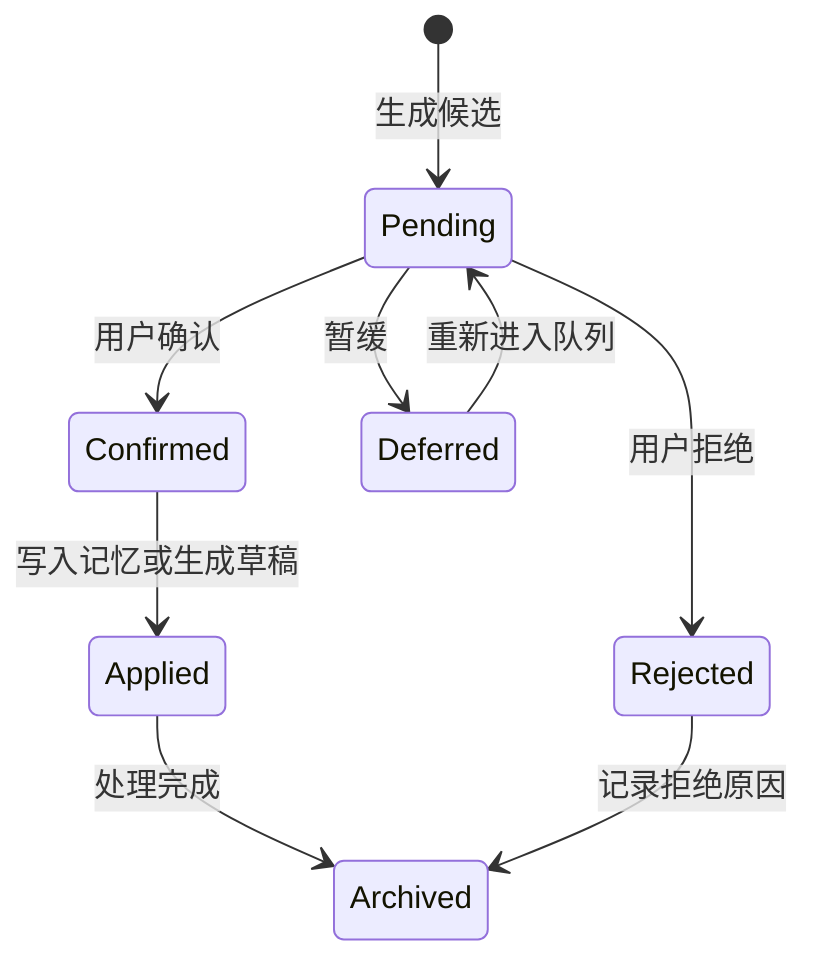

> **Status**: `active`

# Review & Evolution — 回顾、演化与经验教训候选

---

## § 职责定位

Review & Evolution 子系统负责把旁路观察、任务回顾、记忆更新建议、演化记录和经验教训候选组织成可审核流程；不负责 Agent 记忆召回、正式知识正文存储或底层模型执行。

---

## § 核心原则

**候选先于状态变化**：旁路观察、记忆更新和经验教训只能先进入候选或建议，不能直接改写稳定记忆或共有知识。

**证据链不可丢失**：所有影响长期行为的变化都必须保留来源、触发原因和处理结果。

**旁路不阻塞主链路**：回顾可以由后台 Agent 生成候选，但不拉长用户当前对话响应。

---

## § 边界与实体

**输入**：Turn 完成信号、用户纠正、工具失败、任务完成、Daily 回顾、周期回顾、记忆变更事件。

**输出**：`ObservationCandidate`、`MemoryUpdateProposal`、`ReviewItem`、`EvolutionLog`、`LessonCandidate`、知识草稿入口。

**核心实体**：

**ObservationCandidate**：旁路观察形成的待判断假设。
关键属性：观察摘要、来源、置信状态、适用范围、拒绝原因。

**MemoryUpdateProposal**：对 Agent 记忆的新增、修正、删除或降权建议。
关键属性：目标记忆、建议动作、变化前后摘要、证据来源。

**ReviewItem**：回顾队列中的统一审核项。
关键属性：类型、状态、来源、优先级、关联对象。

**EvolutionLog**：Agent 记忆或策略变化的审计记录。
关键属性：变化类型、变化前后内容、触发原因、来源、处理人备注。

**LessonCandidate**：可复用经验教训的待审核候选。
关键属性：适用场景、规则、反例、触发条件、来源记录。

---

## § 触发与产物

| 触发信号 | 判断问题 | 直接产物 | 后续动作 |
|----------|----------|----------|----------|
| 用户明确要求记住 | 是否是稳定背景、偏好或约束 | `MemoryUpdateProposal` | 用户确认后写 Memory |
| 用户纠正 Agent | 哪个判断或默认策略需要改变 | `MemoryUpdateProposal` + `EvolutionLog` | 修正记忆或生成经验候选 |
| 用户否定候选 | 哪个假设不成立 | 拒绝记录 | 后续召回排除 |
| 工具或执行失败 | 是否是可复用失败模式 | `ObservationCandidate` 或 `LessonCandidate` | 回顾队列审核 |
| 失败被修复 | 修复方法是否可复用 | `LessonCandidate` | 确认后保存为知识 |
| Session 结束 | 本次是否产生偏好变化、失败修正或流程模式 | 轻量回顾结果 | 批量确认或拒绝 |
| 周期回顾 | 多次事件是否形成重复模式 | `LessonCandidate` 或降权建议 | 人工审核 |
| 知识保存完成 | 是否需要建立调用索引 | `shared` Memory 引用 + `EvolutionLog` | 后续上下文召回 |

---

## § 回顾队列状态



状态规则：

- `Pending` 只代表等待审核，不代表内容成立。
- `Confirmed` 之后仍要根据类型进入 Memory 或 Vault 的写入流程。
- `Rejected` 的候选不得进入默认召回集合。
- `Archived` 保留证据链，不再出现在默认回顾队列。

---

## § 轻量回顾流程

```text
Turn / Daily / Inbox 完成
    │
    ▼
收集纠正、失败、确认、草稿和关键行动
    │
    ▼
后台或同步生成 ReviewItem
    │
    ▼
用户审核
    │
    ├── 记忆建议确认 -> Memory 写入 -> EvolutionLog
    ├── 经验候选确认 -> LessonCandidate -> Save as Knowledge
    └── 候选拒绝 -> 拒绝原因 -> Archived
```

轻量回顾只处理本次协作直接产生的信号，不做跨周期模式归纳。

---

## § 周期回顾流程

周期回顾读取一段时间内的观察候选、案例、用户修正和失败记录，识别重复模式并生成 `LessonCandidate` 或记忆降权建议。

周期回顾的输出仍然是候选，不直接保存为知识，也不直接修改已确认记忆。

---

## § 与 Runtime 的关系

- `AgentLoop` 在 turn 完成后发出回顾触发信号。
- `AgentSpawnDispatcher` 可以用 `InvocationMode=detached` 调度后台回顾 Agent。
- `AgentRunner` 只执行回顾 run，不持有审核状态。
- `Review & Evolution` 持有候选和演化记录的业务生命周期。

---

## § 与 Observability 的边界

`EvolutionLog` 是业务审计记录，解释 Agent 为什么改变记忆或策略。

`RuntimeEvent` 是运行期观测事件，服务于状态展示、日志、指标和调试。

两者可以互相引用同一个 `run_id` 或 `turn_id`，但不能合并为同一种记录。

---

## § 设计决策与权衡

| 决策问题 | 选择 | 放弃的替代方案 | 理由 |
|---------|------|--------------|------|
| 旁路观察是否进入主调用链？ | 否，作为 side path | 每次输入都同步观察和沉淀 | 避免拉长响应并污染主任务 |
| 经验教训是否直接写知识库？ | 否，先生成 `LessonCandidate` | 自动写 Markdown | 经验具有泛化风险，必须审核 |
| 演化记录是否可直接编辑？ | 否，只允许补充备注 | 允许修改原记录正文 | 审计记录需要保持可信 |
| 回顾 Agent 是否需要独立 runner？ | 否，复用 `AgentRunner` + detached invocation | 单独实现后台执行引擎 | 执行机制相同，差异在调度和产物生命周期 |
