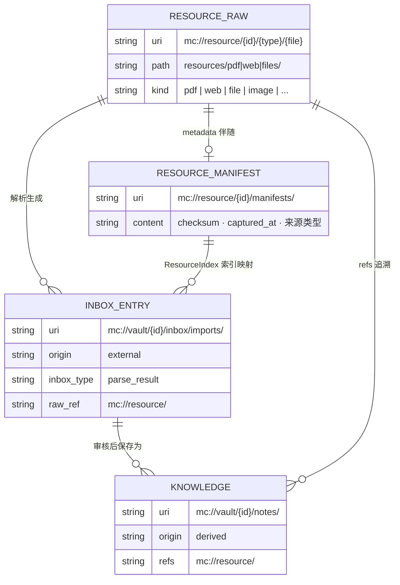
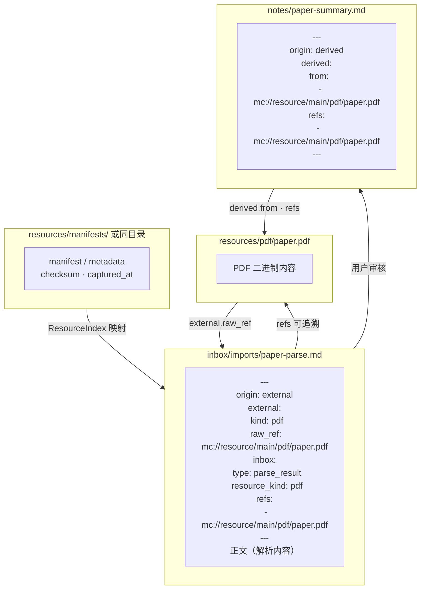
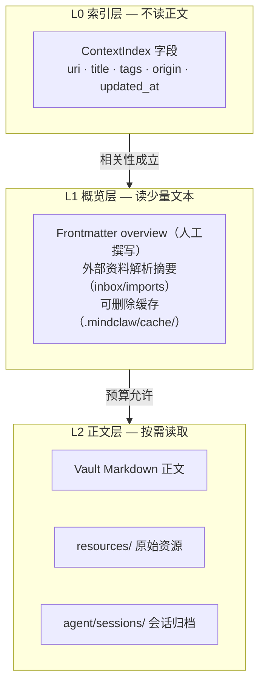
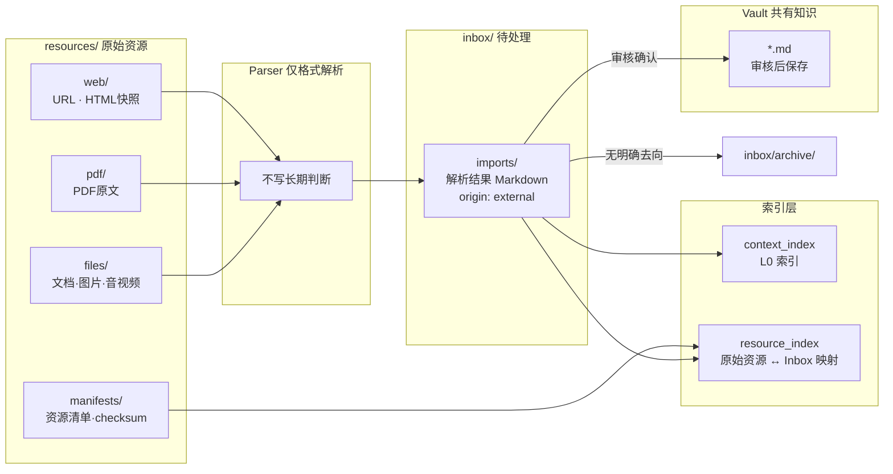

> **Status**: `active`

# Storage — 存储层

---

## § 职责定位

Storage 层负责把 Vault 文件、SQLite 索引、运行时状态和 OS Keychain 统一封装为可被 Services 使用的存储能力；不负责业务判断、候选审核、记忆召回排序、知识提炼或 Agent 执行。

MindClaw 的存储架构借鉴 OpenViking 的三个判断：

- 上下文应能通过确定性路径被浏览、引用和调试，而不是只依赖黑盒向量召回。
- 内容真相源和索引层必须分离，索引只保存引用、摘要和检索字段。
- Agent 读取上下文应采用分层加载，先读轻量索引和概览，再按需读取正文。

MindClaw 不照搬 OpenViking 的 AGFS / Vector DB 形态。MindClaw 的内容真相源是用户可直接编辑和迁移的本地 Vault Markdown；SQLite 是本地索引、缓存和运行时状态层。

参考来源：

- [OpenViking Architecture Overview](https://volcengine-openviking.mintlify.app/concepts/architecture)
- [OpenViking Storage Architecture](https://volcengine-openviking.mintlify.app/concepts/storage)
- [OpenViking Context Layers](https://volcengine-openviking.mintlify.app/concepts/context-layers)
- [OpenViking Viking URI](https://volcengine-openviking.mintlify.app/concepts/viking-uri)

---

## § 核心原则

**Markdown-first，Index-derived**：凡是需要人类审阅、纠偏、迁移、长期保留和复用的内容，都以 Markdown + Frontmatter 或原始资源文件作为真相源。待处理 Markdown 产物进入 Inbox；SQLite 中的索引、摘要缓存、FTS、向量引用和排序结果必须可从文件重建。

**ContextFS 统一寻址**：Services 不直接拼接文件路径或读取索引表，而是通过 ContextFS 使用统一的 ContextURI 读写、移动、删除和引用上下文。

**L0 / L1 / L2 分层加载**：Agent 先读取索引层和概览层，只有在相关性成立时才读取正文或原始资源，避免把整个 Vault 注入上下文。

**运行状态与审计资产分离**：锁、后台任务游标、临时队列、活跃会话 turn 可以存 SQLite；会影响长期知识、记忆或演化判断的审计资产必须落到 Vault Markdown。

**处理结果优先落位，Archive 兜底**：Inbox 是待处理源，不是处理结果的默认终点。共有知识保存时优先按用户选择、主题目录、`tags` 或 Vault 配置规则进入合适位置；没有明确去向或用户选择暂存时，才进入 Archive。

**Private 后端强隔离**：Private 路径不进入 ContextIndex，不参与 Agent 召回、记忆生成、经验提炼或演化记录引用；Private 搜索使用独立索引入口。

---

## § 逻辑架构

```text
┌────────────────────────────────────────────────────────┐
│ Services                                                │
│ Note · Daily · Checklist · Memory · Review · Evolution  │
└──────────────────────────┬─────────────────────────────┘
                           │
┌──────────────────────────▼─────────────────────────────┐
│ ContextStore                                            │
│ ContextURI · Frontmatter contract · atomic write        │
└───────────────┬──────────────────────┬─────────────────┘
                │                      │
┌───────────────▼──────────────┐ ┌─────▼──────────────────┐
│ ContextFS                    │ │ ContextIndex            │
│ Vault Markdown / raw resources │ │ SQLite metadata / FTS    │
│ PathGuard / file operations  │ │ optional vector refs     │
└───────────────┬──────────────┘ └─────┬──────────────────┘
                │                      │
┌───────────────▼──────────────┐ ┌─────▼──────────────────┐
│ RuntimeStore                 │ │ KeychainStorage         │
│ sessions / turns / queues    │ │ provider secrets        │
│ locks / processing cursors   │ │                         │
└──────────────────────────────┘ └────────────────────────┘
```

### 实体关系



---

## § ContextURI

ContextURI 是 Storage 和 Services 内部使用的稳定引用格式，解决跨笔记、来源、记忆、演化记录和会话之间的引用问题。UI 可以显示普通 Vault 相对路径，不要求用户理解 URI。

```text
mc://vault/{vault_id}/daily/2026-04-29.md
mc://vault/{vault_id}/notes/frontmatter-design.md
mc://vault/{vault_id}/inbox/imports/openviking-parse.md
mc://resource/{vault_id}/pdf/openviking.pdf
mc://agent/{vault_id}/memory/mem_20260429_001.md
mc://agent/{vault_id}/evolution/evo_20260429_003.md
mc://session/{session_id}/turn/{turn_id}
mc://private/{vault_id}/journal/private-note.md
```

URI 规则：

- `mc://vault/` 指向人类笔记、Daily、Inbox 和共有知识。
- `mc://resource/` 指向外部资料原文、HTML 快照、链接清单、附件原件和资源清单。
- `mc://agent/` 指向已确认 Agent 记忆、已应用建议归档、演化记录、已确认经验归档和会话归档。
- `mc://session/` 指向活跃会话和 turn 运行记录；可被审计 Markdown 引用，但不直接成为知识。
- `mc://private/` 只允许 PrivateService 使用，Agent ContextPipeline 和 ContextIndex 必须拒绝。

---

## § 目录结构

```text
~/.config/mindclaw/
├── config.json              ← UserConfig（providers、vault 列表）
└── mindclaw.db              ← Global RuntimeStore：sessions / turns

{vault}/
├── .obsidian/               ← Obsidian 配置（不动）
├── .mindclaw/
│   ├── config.json          ← VaultConfig（folder mapping、index policy）
│   ├── mindclaw.db          ← ContextIndex + Vault RuntimeStore
│   └── cache/               ← 可删除缓存：摘要、解析中间态、embedding refs
├── daily/                   ← Daily Markdown
├── inbox/                   ← Intake & Review Queue，待处理 Markdown 产物
│   ├── captures/            ← 用户手动捕获
│   ├── imports/             ← PDF / Web / File 解析结果
│   ├── review/              ← 观察、记忆建议、经验候选等待审核项
│   ├── drafts/              ← 知识草稿和整理草稿
│   └── archive/             ← 无明确去向或已关闭条目，保留处理引用
├── resources/               ← 外部原始资源
│   ├── web/                 ← URL、HTML 快照、网页 metadata
│   ├── pdf/                 ← PDF 原文和 metadata
│   ├── files/               ← 文档、图片、音视频等附件原件
│   └── manifests/           ← 资源清单、checksum、导入批次记录
├── agent/                   ← Agent 可审阅资产
│   ├── sessions/            ← 会话归档摘要和可引用审计入口
│   ├── proposals/           ← 已应用记忆建议归档
│   ├── memory/              ← Agent 记忆
│   ├── evolution/           ← 演化记录
│   └── lessons/             ← 已确认经验教训归档
├── private/                 ← Agent 不可见内容
└── **/*.md                  ← 共有知识、项目笔记等 Markdown 内容
```

目录规则：

- `resources/` 只保留外部原始资源、HTML / URL 快照、附件原件、checksum 和资源清单。
- `inbox/` 是待整理、待审核、待沉淀 Markdown 产物的真实存储位置，不只是 UI 聚合视图。
- `agent/` 下的文件是确认后或长期审计所需的系统受管 Markdown，用户可打开审阅，但状态变更必须走对应 Service。
- `.mindclaw/cache/` 可以删除；删除后系统能从 Markdown 和原始资源重建索引或摘要缓存。
- `private/` 只能由 PrivateService 读写和搜索，不进入 ContextFS 的 Agent 可见空间。

---

## § 存储职责分配

| 数据类型 | 真相源 | 索引 / 缓存 | 写入方 | 索引可重建 |
|---------|--------|-------------|--------|------------|
| 共有知识正文 | Vault Markdown | `context_index` | NoteService | 是 |
| Daily | Vault Markdown | `context_index` | DailyService | 是 |
| Inbox 待处理条目 | `inbox/**/*.md` | `context_index` / `review_queue_index` | InboxService / ReviewService | 是 |
| 外部资源原文 | `resources/` 原始文件和 manifest | `resource_index` | ResourceImportService | 是 |
| 外部资源解析结果 | `inbox/imports/*.md` | `context_index` / 摘要缓存 | ResourceImportService / InboxService | 是 |
| Checklist | Markdown checklist | `checklist_index` | ChecklistService | 是 |
| Agent 记忆 | `agent/memory/*.md` | `context_index` | MemoryService | 是 |
| 观察 / 建议 / 经验候选 | `inbox/review/*.md` | `context_index` / `review_queue_index` | ReviewService / InboxService | 是 |
| 已应用建议归档 | `agent/proposals/*.md` | `context_index` | MemoryService / ReviewService | 是 |
| 演化记录 | `agent/evolution/*.md` | `context_index` / `evolution_timeline_index` | EvolutionService | 是 |
| 已确认经验归档 | `agent/lessons/*.md` | `context_index` | ReviewService | 是 |
| 会话归档摘要 | `agent/sessions/*.md` | `context_index` | Session / Review 相关服务 | 是 |
| 活跃会话 turn | Global SQLite | RuntimeStore | SessionManager | 否 |
| 后台队列 / 锁 / 游标 | Vault SQLite | RuntimeStore | Runtime / Services | 否 |
| Private 笔记 | `private/` Markdown | `private_index` | PrivateService | 是 |
| API Key | OS Keychain | 无 | Settings / Provider | 否 |

---

## § Frontmatter 契约

### 通用字段

所有可索引 Markdown 都遵循同一套最小字段。普通用户主要维护 `tags` 和 `overview`，系统维护 `origin`、时间和引用。

```yaml
---
title: Frontmatter 设计
tags: [knowledge-design, context-storage]
overview: 说明 MindClaw 如何用 Markdown Frontmatter 支持人类和 Agent 的分层知识加载。
origin: user
created_at: 2026-04-29T10:00:00+08:00
updated_at: 2026-04-29T10:30:00+08:00
refs: []
---
```

字段规则：

- `title` 用于人类浏览、Tab 标题和搜索结果展示；缺省时从文件名或一级标题派生。
- `tags` 是轻量路由和过滤，不承载复杂分类体系。
- `overview` 是 L1 预读入口，说明文档解决什么问题、核心判断是什么。
- `origin` 标识创作来源：`user`、`external`、`agent`、`derived`、`system`。
- `refs` 记录上级来源引用（原始资源、触发对话等），值为 ContextURI 或 Vault 相对路径的数组，无引用时为空数组。

### 外部资料扩展

外部资料扩展用于 `resources/` 下的资源清单或指向原始资源的 Inbox 条目。解析后的 Markdown 不写回 `resources/`，而是写入 Inbox。

```yaml
---
title: OpenViking Storage Architecture
tags: [context-database, storage]
overview: OpenViking 原网页来源记录，解析产物进入 Inbox 等待整理。
origin: external
external:
  kind: web
  uri: https://volcengine-openviking.mintlify.app/concepts/storage
  raw_ref: mc://resource/main/web/openviking-storage.html
  captured_at: 2026-04-29T10:00:00+08:00
  checksum:
---
```

`external.kind` 支持 `web`、`pdf`、`file`、`image`、`audio`、`video`。原始资源和 Inbox 解析产物都必须通过 `refs` 或 `external.raw_ref` 保留可追溯关系。

### Inbox 扩展

Inbox 条目是待整理、待审核、待沉淀的 Markdown 产物。

```yaml
---
title: OpenViking Storage 解析结果
tags: [storage, external]
overview: 从 OpenViking 存储文档解析出的上下文数据库设计要点，等待整理为知识或引用材料。
origin: external
inbox:
  type: parse_result
  status: pending
  resource_kind: web
  target: []
refs:
  - mc://resource/main/web/openviking-storage.html
created_at: 2026-04-29T10:00:00+08:00
updated_at: 2026-04-29T10:30:00+08:00
---
```

`inbox.type` 支持 `capture`、`parse_result`、`knowledge_draft`、`memory_proposal`、`observation`、`lesson_candidate`、`review_note`。

`inbox.status` 支持 `pending`、`processing`、`reviewed`、`archived`、`rejected`。完成处理时，Inbox 条目先按用户选择、主题目录、`tags` 或 Vault 配置规则写入目标位置，并在 `inbox.target` 或 `refs` 中保留去向引用；只有没有明确目标或用户选择归档时，条目才进入 `inbox/archive/`。

### Agent 资产扩展

```yaml
---
title: Markdown 作为 Agent 记忆真相源
tags: [agent-memory, storage]
overview: 用户确认 Agent 记忆应保存为可审阅 Markdown，而不是隐藏在数据库中。
origin: agent
agent_asset:
  kind: memory
  status: confirmed
  owner: user
  memory_type: preference
  confidence: 0.86
refs:
  - mc://session/sess_20260429/turn/12
  - mc://agent/main/evolution/evo_20260429_003.md
created_at: 2026-04-29T10:20:00+08:00
updated_at: 2026-04-29T10:30:00+08:00
---
```

`agent_asset.kind` 支持 `memory`、`applied_proposal`、`evolution_log`、`confirmed_lesson`、`session_archive`。待审核的观察、记忆建议和经验候选使用 Inbox 扩展，不直接写入 `agent/`。

`agent_asset.status` 表示确认后资产的生命周期状态；状态变更必须由对应 Service 写入，并生成必要的演化记录。

### 二次沉淀扩展

```yaml
---
title: ContextFS 存储设计原则
tags: [architecture, context-storage]
overview: 综合用户讨论、OpenViking 参考和 MindClaw 本地优先约束后形成的存储设计原则。
origin: derived
derived:
  method: synthesis
  from:
    - mc://resource/main/web/openviking-storage.md
    - mc://agent/main/evolution/evo_20260429_003.md
---
```

`derived` 表示内容来自整理、反思、总结、提炼或合并，不代表外部原文，也不代表 Agent 稳定记忆。

### Frontmatter 引用链



---

## § L0 / L1 / L2 分层加载

MindClaw 的分层加载基于 Markdown 和 ContextIndex，而不是隐藏的上下文数据库。

| 层级 | MindClaw 载体 | 作用 | 读取成本 |
|------|---------------|------|----------|
| L0 索引层 | `context_index` 中的 path、title、tags、origin、asset kind、status、updated_at | 快速过滤、排序、权限判断 | 不读正文 |
| L1 概览层 | Frontmatter `overview`、Inbox 解析摘要、目录概览缓存 | 判断是否需要打开正文，构建轻量上下文 | 读少量文本 |
| L2 正文层 | Markdown body、原始资源、会话归档正文 | 承载完整论证、证据、案例、反例和执行细节 | 按需读取 |

规则：

- 普通知识笔记以 `overview` 作为默认 L1，不额外生成强制 sidecar 文件。
- 大型外部资料的解析摘要先进入 Inbox；目录级或章节级 L1 缓存可删除、可重建，不替代用户可审阅 Markdown。
- Agent 资产的 L1 必须来自 Frontmatter `overview` 或审核后的正文摘要，不能只依赖向量结果。
- ContextPipeline 默认只注入 L0/L1；L2 需要明确相关性或用户打开当前文档后才加载。



---

## § ContextIndex

ContextIndex 是 Vault 级 SQLite 派生索引，统一承载文档级检索字段。

核心索引字段：

| 字段 | 说明 |
|------|------|
| `uri` | ContextURI，索引主键 |
| `space` | `vault` / `resource` / `inbox` / `agent` |
| `path` | Vault 相对路径 |
| `title` | 标题 |
| `tags` | JSON 数组 |
| `overview` | L1 概览 |
| `origin` | 创作来源：`user` / `external` / `agent` / `derived` / `system` |
| `asset_kind` | Agent 资产或资源资产类型，普通笔记可为空 |
| `status` | 生命周期状态，普通笔记可为空 |
| `owner` | `user` / `agent` / `shared`，仅 Agent 资产使用 |
| `updated_at` | 文件更新时间或 Frontmatter 更新时间 |

辅助索引：

- `checklist_index`：Markdown checklist 的行级索引。
- `private_index`：Private 工作域内部搜索索引，Agent 不可访问。
- `resource_index`：外部原始资源、资源清单与 Inbox 解析产物的映射索引。
- `review_queue_index`：基于 Inbox 审核型条目的队列排序、优先级和未处理状态缓存。
- `evolution_timeline_index`：演化记录时间线缓存。
- `semantic_cache`：可选摘要、embedding 或 rerank 缓存，不保存正文真相。

ContextIndex 可以使用 SQLite FTS 和可选向量引用增强召回，但不得把向量库作为内容真相源。

---

## § 关键流程

### 笔记保存

1. Service 构造或更新 Markdown + Frontmatter。
2. ContextStore 校验 ContextURI 和 PathGuard。
3. ContextFS 使用 temp + rename 原子写入文件。
4. ContextStore 解析 Frontmatter，更新 ContextIndex。
5. 若文档过大或 origin 为 external，RuntimeStore 排队生成 L1 缓存或语义缓存。

### 外部资料导入

1. ResourceImportService 保存原始资源、HTML 快照、URL 和 metadata 到 `resources/`。
2. Parser 只做格式解析和结构化拆分，不在解析阶段写长期判断。
3. 解析后的 Markdown 写入 `inbox/imports/`，Frontmatter 标记 `origin: external` 和 `inbox.type: parse_result`。
4. ContextIndex 索引 Inbox 解析产物，ResourceIndex 记录原始来源与 Inbox 条目的映射。
5. 用户确认有复用价值时，NoteService 按用户选择、主题目录、`tags` 或 Vault 配置规则保存为共有知识，并让 Inbox 条目保留目标引用；没有明确目标或用户选择归档时，Inbox 条目进入 `inbox/archive/`。



### Agent 候选与演化资产写入

1. ReviewService 生成观察、记忆建议或经验候选时，先写入 `inbox/review/`。
2. Frontmatter 使用 `origin: agent` 和 `inbox` 扩展表达候选类型、审核状态和证据。
3. 用户确认后，MemoryService、NoteService 或 EvolutionService 将结果写入 `agent/` 或 Vault；共有知识由 NoteService 解析保存位置。
4. 原 Inbox 条目记录已确认记忆、演化记录或知识笔记引用，并从默认待处理队列移除；没有后续目标或用户选择关闭时进入 `inbox/archive/`。
5. `agent/` 只保存确认后或需要长期审计的受管 Markdown。

### 会话提交和回顾

1. 活跃 turn 写入 Global RuntimeStore，保证当前会话可恢复。
2. Session commit 或回顾触发后，系统生成 `agent/sessions/` 下的会话归档摘要 Markdown。
3. 回顾流程引用 `mc://session/{session_id}/turn/{turn_id}` 作为证据来源。
4. 观察候选、记忆建议和经验候选写入 `inbox/review/`；确认后的记忆和演化记录再写入 `agent/`。

### 上下文召回

1. ContextPipeline 根据当前输入、工作域和权限构造查询。
2. ContextIndex 先返回 L0 候选，排除 Private、Rejected、Deleted 和不匹配状态；普通任务默认排除未确认 Inbox 审核项。
3. ContextStore 读取候选的 `overview` 或 L1 缓存。
4. 只有相关性成立且预算允许时，ContextFS 读取 L2 正文。
5. 召回结果返回 ContextURI、来源、状态和摘要，供 Agent 输出引用说明。

### 索引重建

1. 扫描 Vault 下允许索引的 Markdown、Inbox 条目和 `resources/` 原始资源。
2. 排除 `.obsidian/`、`.mindclaw/cache/`、`private/` 等目录。
3. 解析通用 Frontmatter、来源扩展、Agent 资产扩展和 checklist。
4. 重建 ContextIndex、ResourceIndex、ChecklistIndex、ReviewQueueIndex 和 EvolutionTimelineIndex。
5. 语义缓存可异步重建；重建期间不影响 Markdown 读取。

---

## § 设计决策与权衡

| 决策问题 | 选择 | 放弃的替代方案 | 理由 |
|---------|------|--------------|------|
| 是否引入统一上下文寻址？ | 是，使用 ContextURI | 直接在各模块传文件路径和 session id | 记忆、演化、外部资料和会话证据需要稳定交叉引用 |
| 内容真相源在哪里？ | Vault Markdown / 原始资源文件 | SQLite 或向量库保存正文 | 用户需要可读、可迁移、可纠偏的知识空间 |
| 是否统一索引表？ | 是，ContextIndex 统一文档级索引 | notes / memory / review / evolution 完全分表 | 同一检索链路需要跨来源比较 L0/L1，分表会重复状态和过滤逻辑 |
| Private 是否进入 ContextIndex？ | 否，使用独立 Private 索引 | 在同表里用 visibility 过滤 | Agent 不可见边界必须用后端结构隔离，不能只靠查询条件 |
| 是否必需向量数据库？ | 否，MVP 以 SQLite FTS、Frontmatter 和按需正文加载为主 | 默认引入独立向量库 | 本地桌面 MVP 应降低部署复杂度；向量可以作为可重建缓存扩展 |
| 会话是否全部写 Markdown？ | 否，活跃 turn 留在 RuntimeStore，提交后生成可审阅归档摘要 | 每条消息都实时写 Vault Markdown | 实时对话需要恢复和性能；长期审计只需要可引用归档和证据链 |
| 外部资源解析结果存在哪里？ | Inbox | 写回 `resources/` 或直接写入 Vault | `resources/` 只保存原始资源；解析结果是待处理产物，需要用户审核 |
| Agent 候选存在哪里？ | Inbox | 直接写入 Agent 长期资产目录 | 候选尚未确认，先进入统一待处理源，避免污染长期 Agent 资产 |
| Inbox 条目处理后如何落位？ | 优先写入目标位置，Archive 作为兜底 | 默认归档或原地保留 | 共有知识需要进入合适主题位置；Archive 只承接无明确去向、已拒绝或用户选择关闭的条目 |
| L1 缓存是否是真相源？ | 否，可删除可重建 | 将生成摘要作为唯一概览 | 自动摘要会过时或出错，用户确认的 `overview` 优先 |

---

## § 相关文件

| 文件 | 说明 |
|------|------|
| `src-tauri/src/storage/database/global.rs` | Global RuntimeStore 打开与迁移 |
| `src-tauri/src/storage/database/vault.rs` | Vault ContextIndex / RuntimeStore 打开与迁移 |
| `src-tauri/src/storage/markdown.rs` | Frontmatter 解析与原子写入 |
| `src-tauri/src/storage/vector.rs` | 可选语义缓存和向量索引适配 |
| `src-tauri/src/storage/migrations/` | SQLite 迁移文件 |
