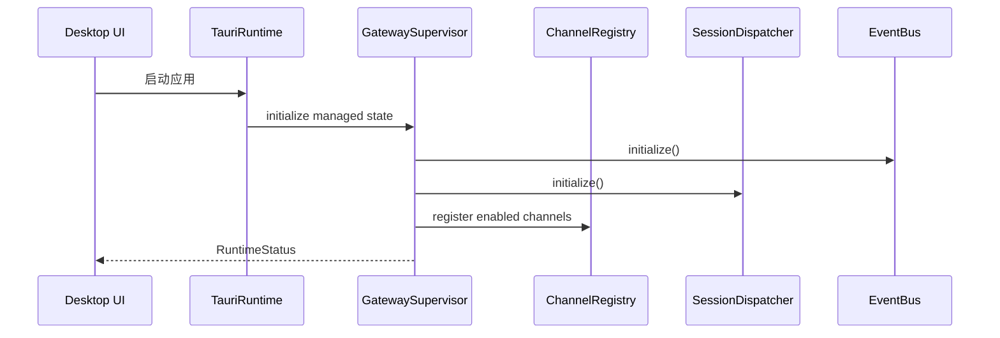
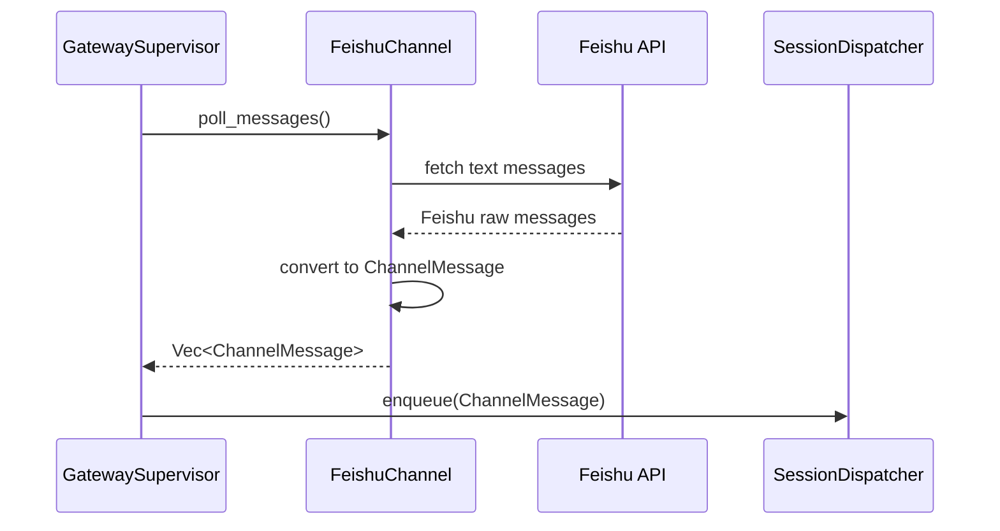
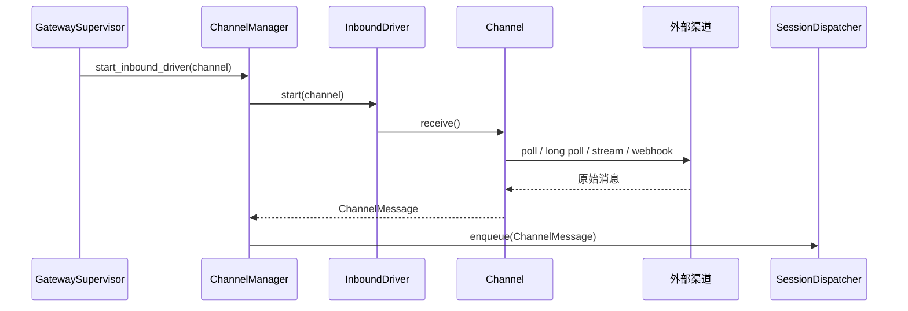

> **Status**: `draft`

# 架构子模块：GatewaySupervisor 与 Channel Gateway

## § 职责定位

GatewaySupervisor 是 Tauri App 进程内的业务主管组件，负责组装和监督 Channel Gateway Layer、Agent Control Layer、ACP Execution Layer、EventBus、Storage、Config 和 Stronghold。

Channel Gateway Layer 负责把外部消息渠道转换为 MindClaw 内部统一消息流，并把 Agent 输出回写到原渠道。它不负责 Agent 选择、Skill 解析、ACP 协议通信或 UI 展示。

第一阶段以 Feishu 验证闭环；Telegram、Email、Webhook、CLI Input、MCP Event 是后续入口扩展。

## § 核心原则

1. **Supervisor 管业务生命周期**：GatewaySupervisor 启动、停止和监督内部子模块；Tauri runtime 管应用事件循环。
2. **App 内驻留**：GatewaySupervisor 随 Tauri App 进程驻留，窗口关闭到托盘后继续运行；显式退出后停止。
3. **Channel 管协议边界**：具体 Channel 负责外部 API、凭证、payload 转换和发送回复。
4. **Registry / Manager 管编排**：ChannelRegistry 负责注册和查找；ChannelManager 是后续统一生命周期、健康状态和 inbound driver 的目标抽象。
5. **Feishu-first**：MVP 优先 Feishu 文本消息 polling，不把多渠道平台作为首个交付目标。

## § 边界与实体

### 输入

- `start()`：启动 GatewaySupervisor 和业务子模块。
- `stop()`：停止渠道 inbound drivers、调度器和本地控制入口。
- `register_channel(channel)`：注册一个渠道实现。
- `poll_channel(channel, page)`：手动从指定渠道拉取标准化消息。
- `start_inbound_driver(channel)`：启动指定渠道的后台接收任务。
- `send_message(channel, conversation, content, reply_to)`：向指定渠道发送回复。
- `handle_webhook(channel, payload)`：接收 Gateway API adapter 转发的渠道 webhook payload。

### 输出

- `RuntimeStatus`：GatewaySupervisor、渠道、调度器、默认 Agent 和 ACP Server 的运行状态。
- `ChannelMessage`：统一渠道消息，供 SessionDispatcher 消费。
- `RuntimeEvent`：运行时事件，供 EventBus 广播。
- `GatewayError`：运行时、渠道和 API 入口的统一错误边界。

### 核心实体

- **GatewaySupervisor**：App 内驻留业务主管组件，拥有内部子模块生命周期。
- **GatewayAPIAdapter**（后续）：Tauri commands、Local API、Webhook 的统一入口适配器。
- **ChannelManager**（后续）：渠道生命周期、凭证代理、健康状态、inbound driver 启停和出站分发。
- **ChannelRegistry**：渠道注册、查找和列表顺序。
- **Channel**：具体渠道适配器 trait。
- **InboundDriver**：渠道接收方式，包含 polling、long-polling、stream、webhook handler 和 manual input。
- **ChannelMessage**：跨渠道统一消息。

### 错误边界

- Channel 捕获渠道 API、网络、凭证和转换错误，并转换为 `GatewayError`。
- Gateway API adapter 捕获鉴权、Webhook 签名和请求格式错误，并转换为 `GatewayError`。
- GatewaySupervisor 捕获启停和内部子模块状态错误，并转换为 `GatewayError`。
- Channel Gateway 不暴露渠道原始 payload 给 SessionDispatcher。
- SessionDispatcher 不依赖具体渠道客户端实现。

## § 关键流程

### App 内驻留启动流程

### Feishu polling 接入流程

### 通用 inbound driver 接入流程

### 出站消息分发流程

## § 接收方式映射

| 渠道 | 接收方式 | 边界说明 |
|------|----------|----------|
| Feishu | polling | MVP 优先；公网 webhook 需要 relay、tunnel 或用户自建 HTTPS endpoint |
| Telegram | long polling | 不依赖公网 webhook，适合 App 内驻留 |
| Email | IMAP IDLE / polling | 由 EmailChannel 的 inbound driver 维护连接 |
| MCP Event | stream / local connection | 由 MCPChannel 读取事件流 |
| Webhook | local webhook handler | 本机或局域网入口；公网入口不由 daemon 单独解决 |
| CLI Input | manual input / local API | CLI 通过本地 API 或 command 注入 `ChannelMessage` |

## § 设计决策与权衡

| 决策问题 | 选择 | 放弃的替代方案 | 理由 |
|---------|------|--------------|------|
| v1 后台模型是什么？ | Tauri App 内驻留 GatewaySupervisor | 独立 daemon | App 内驻留覆盖窗口关闭到托盘场景，降低安装和 IPC 成本 |
| GatewaySupervisor 是否创建底层 runtime？ | 不创建，复用 Tauri runtime 和 async executor | 独立 Tokio runtime | 复用框架 runtime 可减少退出清理和任务泄漏风险 |
| MVP 渠道是什么？ | Feishu-first | 同时做 Telegram / Email / Webhook | 少渠道先闭环，避免平台化膨胀 |
| ChannelRegistry 和 ChannelManager 如何划分？ | Registry 管注册查找；Manager 后续管生命周期 | 把所有职责放进 Channel | 具体 Channel 不应知道运行时全局结构 |
| Desktop UI 是否直接轮询渠道？ | UI 通过命令控制后端；长期由 Gateway 统一驱动 | UI 直接调用 FeishuClient | UI 生命周期不应决定消息接入和调度 |
| Webhook 是否直接进入调度器？ | Webhook 先进入 Gateway API adapter，再由 Channel 生成 `ChannelMessage` | Webhook 直接写入 SessionDispatcher | 渠道签名校验和 payload 转换属于 Gateway API 与 Channel 边界 |

## § 安全边界

- Feishu 与其他渠道凭证必须进入 Stronghold 或等价安全存储。
- Channel Gateway 不向 Agent 暴露渠道原始 payload。
- Webhook payload 必须先完成签名校验，再转换为 `ChannelMessage`。
- 出站回复默认受 Agent 执行策略和用户确认策略约束。
- 公网 webhook relay 不属于 App 内驻留本身能力。
