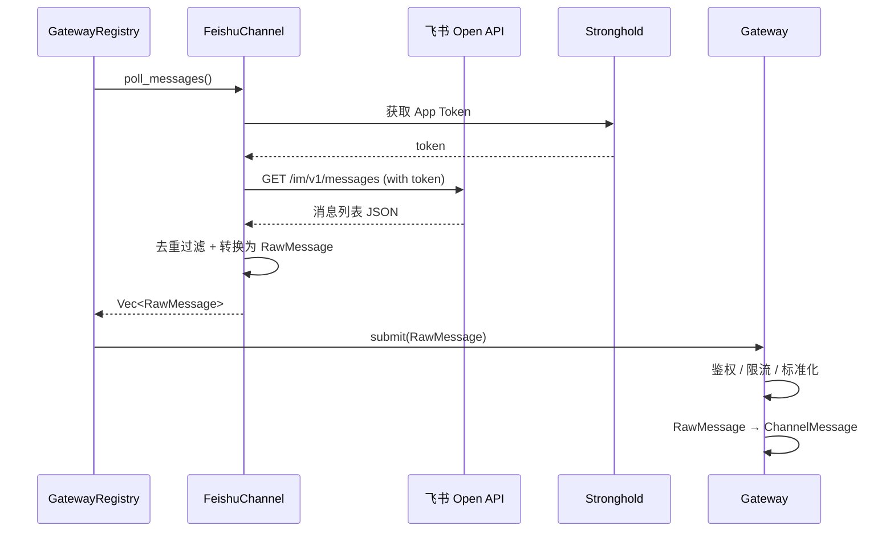
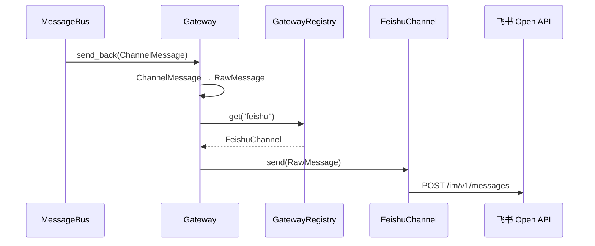

> **Status**: `draft`

# 架构子模块：Channel & Gateway

## § 职责定位

Channel & Gateway 是消息接入的两层抽象：

- **`im_channel`**：渠道协议适配层，负责对接外部 IM 渠道 API，进行消息拉取、发送和协议解析
- **`gateway`**：网关层，负责渠道注册、身份鉴权、流量控制、消息标准化（`RawMessage` → `ChannelMessage`）

两层通过 `ChannelAdapter` trait 解耦：`im_channel` 只输出 `RawMessage`，`gateway` 接收后完成标准化再流入 `message_bus`。

## § 核心 Trait

### ChannelAdapter（im_channel 层）

```rust
pub trait ChannelAdapter: Send + Sync {
    fn channel_name(&self) -> &str;
    fn poll_messages(&self, page_size: i32, page_token: Option<&str>)
        -> Result<(Vec<RawMessage>, Option<String>), ChannelError>;
    fn send_message(&self, conversation_id: &str, content: &str, reply_to: Option<&str>)
        -> Result<(), ChannelError>;
    fn credentials(&self) -> &dyn CredentialsManager;
}
```

### CredentialsManager

```rust
pub trait CredentialsManager: Send + Sync {
    fn set_credentials(&self, credentials: serde_json::Value) -> Result<(), ChannelError>;
    fn clear_credentials(&self) -> Result<(), ChannelError>;
    fn has_credentials(&self) -> bool;
    fn test_connection(&self) -> Result<(), ChannelError>;
}
```

### GatewayRegistry（gateway 层）

`GatewayRegistry` 持有 `HashMap<String, Arc<dyn ChannelAdapter>>`，提供：

- `register(adapter)` — 注册渠道
- `get(channel)` — 按名称获取
- `list_channels()` — 列出所有已注册渠道
- `poll_all()` — 并行轮询所有渠道
- `set_credentials()` / `test_connection()` — 凭证管理

### Gateway 处理流程

```rust
pub trait Gateway {
    fn submit(&self, raw: RawMessage) -> Result<ChannelMessage, GatewayError>;
    fn send_back(&self, msg: ChannelMessage) -> Result<(), GatewayError>;
}
```

Gateway 内部处理链：

1. **AuthFilter**：验证 sender 身份、凭证有效性
2. **RateLimiter**：按渠道/用户维度限流，防止突发流量
3. **Transformer**：`RawMessage` → `ChannelMessage` 标准化转换
4. **SessionBinder**：识别并绑定到对应 `Session` / `Thread`

## § 渠道实现

### 飞书 (`im_channel::feishu`)

飞书作为首个渠道，由 `src-tauri/src/services/im_channel/feishu/` 实现：

| 组件 | 文件 | 职责 |
|------|------|------|
| `FeishuClient` | `client.rs` | HTTP 客户端，调用飞书 Open API |
| `TokenManager` | `token.rs` | tenant_access_token 的获取与缓存 |
| `converter` | `converter.rs` | 飞书消息结构 → `RawMessage` 转换 |

### Telegram (`im_channel::telegram`)

Telegram Bot 渠道，由 `src-tauri/src/services/im_channel/telegram/` 实现：

| 组件 | 文件 | 职责 |
|------|------|------|
| `TelegramClient` | `client.rs` | HTTP 客户端，调用 Telegram Bot API |
| `TelegramTokenManager` | `token.rs` | Bot Token 管理 |
| `converter` | `converter.rs` | Telegram Update → `RawMessage` 转换 |

两者分别实现 `ChannelAdapter` 和 `CredentialsManager` trait。

## § 边界与实体

### im_channel 输入/输出

- `poll_messages()`：从渠道 API 拉取新消息，返回 `Vec<RawMessage>`
- `send_message(msg: RawMessage)`：将 `RawMessage` 写回渠道会话

### gateway 输入/输出

- `submit(raw: RawMessage)`：接收来自 im_channel 的原始消息，返回标准化 `ChannelMessage`
- `send_back(msg: ChannelMessage)`：接收来自 message_bus 的回复消息，转换为 `RawMessage` 后发回 im_channel

### 核心实体

- **RawMessage**：渠道原始消息，包含 `channel_name`（渠道标识）、`raw_payload`（渠道特定格式）、`timestamp`
- **ChannelMessage**：统一渠道消息，包含 `channel_id`（会话 ID）、`sender_id`、`content`（文本内容）、`timestamp`、`message_id`（原始消息 ID，用于去重）
- **ChannelAdapter**：渠道适配器 trait，新增渠道无需修改 Gateway 和 MessageBus

### 错误边界

- 网络错误和渠道 API 错误在 `im_channel` 层捕获，转换为 `ChannelError`（包含 `Retryable`/`NonRetryable` 分类）
- 鉴权失败、限流触发在 `gateway` 层捕获，转换为 `GatewayError`，不向 MessageBus 泄露原始 HTTP 错误

## § 关键流程

### 消息轮询流程（以飞书为例）



### 消息回写流程



### 新增渠道流程

1. 实现 `ChannelAdapter` trait（HTTP 客户端 + 消息转换）
2. 实现 `CredentialsManager` trait（凭证管理）
3. 在 `AppState::new()` 中将实现注册到 `GatewayRegistry`
4. 前端 `ChannelSettings` 组件传入对应 `channelName` 即可使用

## § 设计决策与权衡

| 决策问题 | 选择 | 放弃的替代方案 | 理由 |
|---------|------|--------------|------|
| 渠道抽象方式？ | `dyn ChannelAdapter` trait object | 泛型 / enum 多态 | 渠道运行时动态注册，trait object 更灵活；数量少（<10），vtable 开销可忽略 |
| 凭证管理？ | 渠道自管（`CredentialsManager` trait） | 统一 CredentialProvider | 每种渠道凭证格式不同（OAuth2、API Key 等），自管更解耦 |
| 轮询方式？ | 同步 trait 方法 + tokio block_in_place | async trait | 保持 trait object-safe，避免使用 async_trait crate |
| 飞书 SDK 还是直接 HTTP 调用？ | 直接 HTTP（reqwest） | 飞书官方 Rust SDK | 官方 SDK 维护不活跃，直接 HTTP 更可控；API 端点少，手写成本低 |
| Token 刷新策略？ | 惰性刷新（过期前 5 分钟刷新） | 每次请求前刷新 | 减少不必要的 API 调用，飞书 token 有效期 2 小时 |
| 标准化在哪一层？ | `gateway` 集中标准化 | `im_channel` 各自标准化 | 避免重复实现鉴权/限流逻辑；新增渠道只需实现协议转换 |
