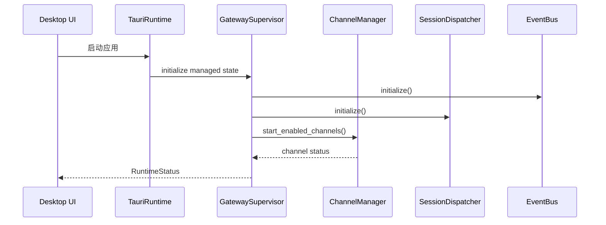
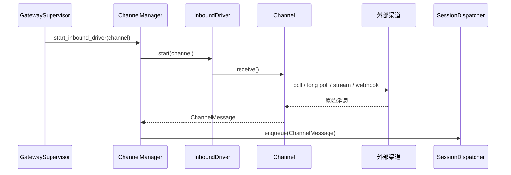
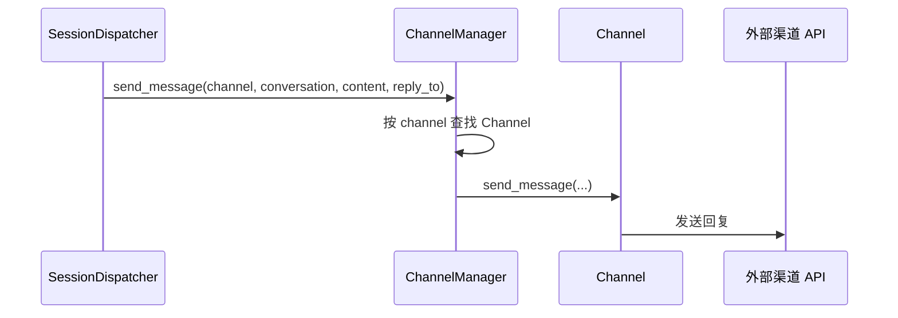

> **Status**: `draft`

# 架构子模块：GatewaySupervisor 与 Channels

## § 职责定位

GatewaySupervisor 负责在 Tauri App 进程内常驻运行、统一接入 Gateway API adapter、托管 ChannelManager、SessionDispatcher 和 EventBus；不负责具体渠道协议解析、ACP 协议细节、Agent 内部智能，也不创建独立 OS daemon 或独立 Tokio runtime。

Channels 负责具体消息渠道接入、凭证管理、外部 payload 转换和渠道回复发送；不负责桌面 UI、会话调度、ACP 调用或事件订阅管理。

## § 核心原则

1. **Supervisor 管业务生命周期**：GatewaySupervisor 启动、停止和监督内部子模块；理由是 Tauri runtime 管应用事件循环，业务生命周期需要独立边界。
2. **App 内驻留**：GatewaySupervisor 随 Tauri App 进程驻留，窗口关闭到托盘后继续运行；理由是 v1 不承担独立 daemon 的安装和维护成本。
3. **Manager 管渠道编排**：ChannelManager 负责渠道注册、凭证代理、健康状态、入站接收和出站分发；理由是具体 Channel 不应知道运行时全局结构。
4. **Channel 管 inbound driver**：每个 Channel 声明自己的接收方式；理由是不同渠道的消息入口模型不同。

## § 边界与实体

### 输入

- `start()`：启动 GatewaySupervisor 和业务子模块。
- `stop()`：停止渠道 inbound drivers、调度器和本地控制入口。
- `register_channel(channel)`：将一个渠道实现注册到 ChannelManager。
- `start_inbound_driver(channel)`：启动指定渠道的消息接收任务。
- `poll_channel(channel, page)`：手动从指定渠道拉取标准化消息。
- `send_message(channel, conversation, content, reply_to)`：向指定渠道发送回复。
- `handle_webhook(channel, payload)`：接收 Gateway API adapter 转发的渠道 Webhook payload。

### 输出

- `RuntimeStatus`：GatewaySupervisor、渠道、调度器、默认 Agent 和 ACP Server 的运行状态。
- `ChannelMessage`：统一渠道消息，供 SessionDispatcher 消费。
- `RuntimeEvent`：运行时事件，供 EventBus 广播。
- `GatewayError`：运行时、渠道和 API 入口的统一错误边界。

### 核心实体

- **GatewaySupervisor**：Tauri App 进程内的业务主管组件，拥有内部子模块的生命周期。
- **GatewayAPIAdapter**：Tauri 与业务服务之间的入口适配器，负责命令、本地 API 和 webhook 的边界转换。
- **ChannelManager**：渠道管理器，负责渠道注册、凭证代理、健康状态、inbound driver 启停和出站分发。
- **ChannelRegistry**：ChannelManager 内部注册表，负责渠道注册、查找和列表顺序。
- **Channel**：具体渠道适配器，负责外部 API、凭证和消息转换。
- **InboundDriver**：渠道接收方式，包含 polling、long polling、stream、webhook handler 和 manual input。
- **ChannelMessage**：跨渠道统一消息，是 ChannelManager 输出给 SessionDispatcher 的消息格式。

### 错误边界

- Channel 捕获渠道 API、网络、凭证和转换错误，并转换为 `GatewayError`。
- Gateway API adapter 捕获鉴权、Webhook 签名和请求格式错误，并转换为 `GatewayError`。
- GatewaySupervisor 捕获启停和内部子模块状态错误，并转换为 `GatewayError`。
- ChannelManager 不暴露渠道原始 payload，不依赖 ACP 协议类型。
- SessionDispatcher 不接收渠道原始错误，也不依赖具体渠道客户端实现。

## § 关键流程

### App 内驻留启动流程

### 渠道 inbound driver 接入流程

### 接收方式映射

| 渠道 | v1 接收方式 | 边界说明 |
|------|-------------|----------|
| Feishu | polling | 公网 webhook 需要 relay、tunnel 或用户自建 HTTPS endpoint |
| Telegram | long polling | 不依赖公网 webhook，适合 App 内驻留 |
| Email | IMAP IDLE / polling | 由 EmailChannel 的 inbound driver 维护连接 |
| MCP Event | stream / local connection | 由 MCPChannel 读取事件流 |
| Webhook | local webhook handler | 本机或局域网入口；公网入口不由 daemon 单独解决 |
| CLI Input | manual input / local API | CLI 通过本地 API 或 command 注入 `ChannelMessage` |

### 出站消息分发流程

## § 设计决策与权衡

| 决策问题 | 选择 | 放弃的替代方案 | 理由 |
|---------|------|--------------|------|
| v1 后台模型是什么？ | Tauri App 内驻留 GatewaySupervisor | 独立 daemon | App 内驻留覆盖窗口关闭到托盘场景，降低安装和 IPC 成本 |
| GatewaySupervisor 是否创建底层 runtime？ | 不创建，复用 Tauri runtime 和 async executor | 独立 Tokio runtime | 复用框架 runtime 可减少退出清理和任务泄漏风险 |
| ChannelRegistry 放在哪里？ | ChannelManager 内部 | 独立顶层架构层 | registry 只负责注册和查找，不拥有生命周期 |
| 渠道适配器命名是什么？ | FeishuChannel / TelegramChannel | FeishuGateway / TelegramGateway | Channel 表达具体渠道适配器，Gateway 保留给运行时边界 |
| Desktop UI 是否直接轮询渠道？ | Desktop UI 通过 Gateway API 控制和观察 | Desktop UI 直接调用 FeishuClient | UI 生命周期不能影响消息接入和调度 |
| Webhook 是否直接进入调度器？ | Webhook 先进入 Gateway API adapter，再由 Channel 生成 `ChannelMessage` | Webhook 直接写入 SessionDispatcher | 渠道签名校验和 payload 转换属于 Gateway API 与 Channel 边界 |
