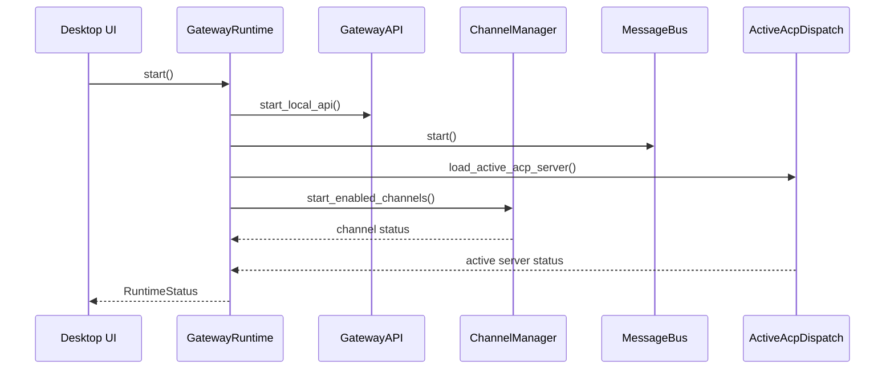
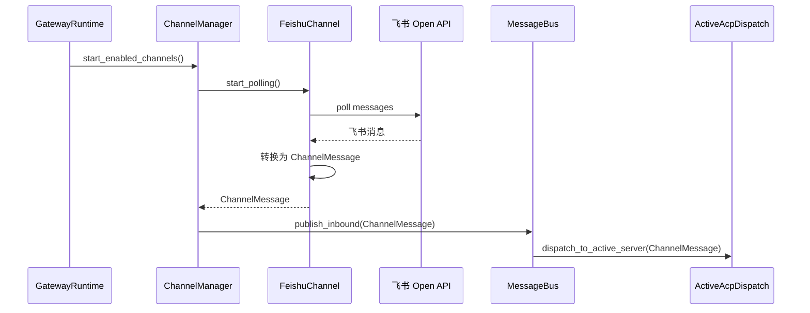
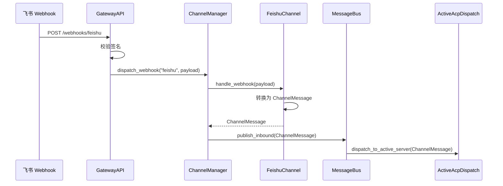
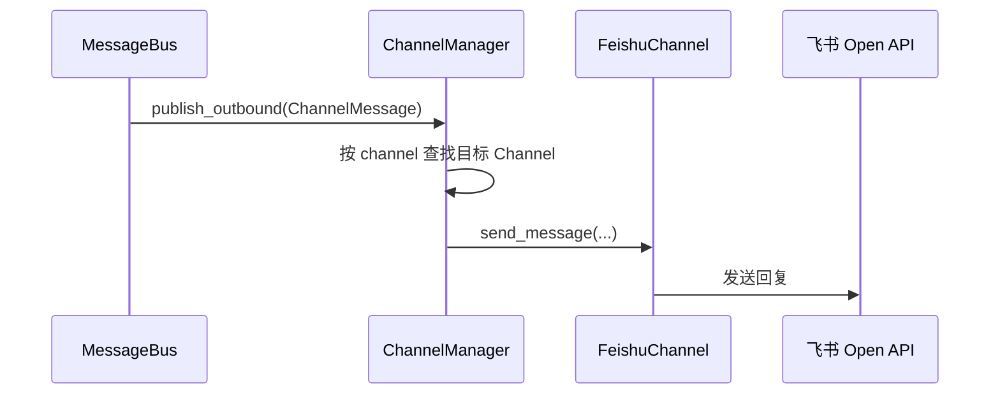

> **Status**: `draft`

# 架构子模块：Gateway Runtime 与 Channels

## § 职责定位

Gateway Runtime 负责常驻运行、统一接入客户端和外部 Webhook、托管 ChannelManager、MessageBus 与 Active ACP Dispatch；不负责具体渠道协议解析，不负责 Agent 内部智能，也不负责多 Agent 路由分发。

Channels 负责具体 IM 渠道接入：对接外部 API、管理渠道凭证、处理轮询或 Webhook payload，并转换为统一的 `ChannelMessage`；不负责桌面 UI、ACP 协议或多客户端控制 API。

## § 核心原则

1. **Runtime 管生命周期**：Gateway Runtime 启动、停止和监督 ChannelManager、MessageBus、Active ACP Dispatch 与 Gateway API。这样桌面窗口关闭后消息链路仍在线。
2. **Channel 管协议细节**：FeishuChannel、TelegramChannel 各自处理外部 API、Token 和消息转换。这样 gateway 不堆积渠道特定分支。
3. **API 管入口安全**：Desktop UI、CLI、Web UI、Mobile companion 与 Webhook 统一经过 Gateway API。这样认证、授权、审计和健康检查有单一入口。
4. **Active ACP Server 管处理目标**：自动渠道消息只发往当前激活 ACP Server。这样 v1 不需要 RouteRule 或多 Agent 分发规则。

## § 边界与实体

### 输入

- `start()`：启动 Gateway Runtime 和内部子模块。
- `stop()`：停止渠道连接、MessageBus、Active ACP Dispatch 和 Gateway API。
- `register_channel(channel)`：注册一个渠道实现到 ChannelManager。
- `set_active_acp_server(server_id)`：更新当前激活 ACP Server。
- `publish_inbound(msg: ChannelMessage)`：接收渠道入站消息。
- `publish_outbound(msg: ChannelMessage)`：接收 MessageBus 出站消息并分发给目标渠道。
- `handle_client_request(request)`：接收 Desktop UI、CLI、Web UI 和 Mobile companion 的本地控制请求。
- `handle_webhook(channel, payload)`：接收外部渠道 Webhook 请求。

### 输出

- `RuntimeStatus`：Gateway Runtime、渠道、MessageBus、Active ACP Server 的运行状态。
- `ChannelMessage`：统一渠道消息，供 MessageBus 消费。
- `GatewayEvent`：运行时事件，供 UI 和日志订阅。
- `GatewayError`：运行时、渠道、API 入口的统一错误边界。

### 核心实体

- **GatewayRuntime**：本地常驻运行时，拥有内部子模块的生命周期。
- **GatewayAPI**：本地和外部入口，负责客户端请求、Webhook 请求、鉴权和状态查询。
- **ChannelManager**：渠道管理器，负责渠道注册、启动、停止、健康状态和出站分发。
- **Channel**：具体渠道适配器，负责外部 IM API、凭证和消息转换。
- **ActiveAcpServer**：用户当前选中的 ACP Server，接收自动进入的渠道消息。
- **ChannelMessage**：跨渠道统一消息，进入 MessageBus 的唯一消息格式。

### 错误边界

- 渠道 API、网络、凭证错误由 Channel 捕获，并转换为 `GatewayError::Channel`。
- Gateway API 鉴权、Webhook 签名、请求格式错误转换为 `GatewayError::Api`。
- Runtime 启停和内部子模块状态错误转换为 `GatewayError::Runtime`。
- Active ACP Server 未配置或不可用时转换为 `GatewayError::AgentUnavailable`。
- MessageBus 和 Active ACP Dispatch 不接收渠道原始错误，也不依赖具体渠道客户端实现。

## § 关键流程

### Runtime 启动流程

### 飞书轮询接入流程

### 飞书 Webhook 接入流程

### 出站消息分发流程

## § 设计决策与权衡

| 决策问题 | 选择 | 放弃的替代方案 | 理由 |
|---------|------|--------------|------|
| gateway 的定位是什么？ | 本地常驻 Gateway Runtime | 轻量 ChannelRegistry | 桌面窗口关闭后仍需接收渠道消息，多客户端和 Webhook 需要统一入口 |
| ChannelRegistry 放在哪里？ | 作为 ChannelManager 内部能力 | 作为独立架构层 | registry 只是渠道管理细节，运行时边界由 Gateway Runtime 承担 |
| 飞书接收模块叫什么？ | FeishuChannel | FeishuGateway | FeishuChannel 表达具体渠道适配器，FeishuGateway 会与运行时 gateway 混淆 |
| Desktop UI 是否直接轮询渠道？ | Desktop UI 通过 Gateway API 控制和观察 | Desktop UI 直接调用 FeishuClient | UI 生命周期不能影响消息接入和 Agent 调度 |
| 自动消息如何选择 Agent？ | 直接发往 Active ACP Server | RouteRule 多 Agent 分发 | v1 降低配置和调试成本，用户只需要当前激活的一个 ACP Server |
| Webhook 是否进入 MessageBus？ | Webhook 先进入 Gateway API，再由 Channel 生成 `ChannelMessage` | Webhook 直接写入 MessageBus | 渠道签名校验和 payload 转换属于 Gateway Runtime 与 Channel 边界 |
