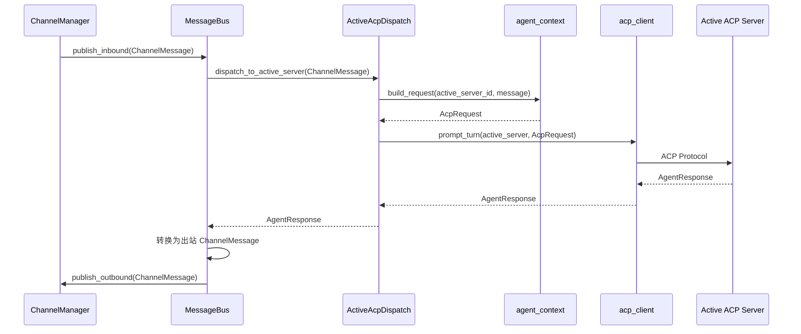
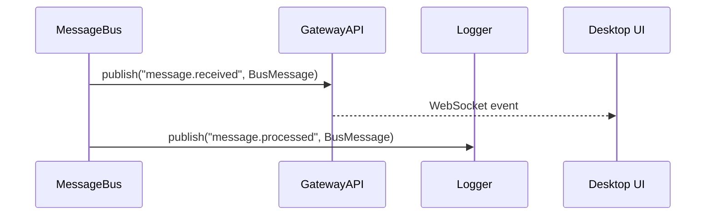

> **Status**: `draft`

# 架构子模块：MessageBus

## § 职责定位

MessageBus 负责在 Gateway Runtime 内部传递标准化后的 `ChannelMessage`，将入站消息交给当前激活 ACP Server 调用链路，并将 Agent 响应转换为出站消息交还 ChannelManager；不负责渠道 API、Webhook 接入、桌面 UI、运行时生命周期、ACP 协议细节或多 Agent 路由。

## § 边界与实体

### 输入

- `publish_inbound(msg: ChannelMessage)`：接收来自 ChannelManager 的入站消息。
- `publish_outbound(msg: ChannelMessage)`：接收 Active ACP Dispatch 转换后的出站消息。
- `subscribe(topic: String, handler: MessageHandler)`：订阅运行时事件。

### 输出

- `ChannelMessage`：发送给 Active ACP Dispatch 的入站消息。
- `ChannelMessage`：发送给 ChannelManager 的出站消息。
- `BusMessage`：广播给 Gateway API、日志、监控或 UI 订阅者的事件。

### 核心实体

- **ChannelMessage**：来自 ChannelManager 的标准化消息，包含渠道、会话、发送者、内容、时间和回复关系。
- **AgentResponse**：Active ACP Server 处理结果，包含请求 ID、处理状态、输出内容和错误信息。
- **BusMessage**：总线事件，用于状态订阅、日志和 UI 更新。

### 错误边界

- 消息格式错误时返回 `BusError::InvalidMessage`，并发布错误事件给 Gateway Runtime。
- Active ACP Dispatch 超时时返回 `BusError::AgentTimeout`，不阻塞其他消息处理。
- MessageBus 不暴露渠道原始错误，也不暴露 ACP 协议内部错误。

## § 关键流程

### 入站消息直达 Active ACP Server

### 广播/订阅流程

## § 设计决策与权衡

| 决策问题 | 选择 | 放弃的替代方案 | 理由 |
|---------|------|--------------|------|
| MessageBus 运行在哪里？ | Gateway Runtime 内部 | Desktop UI 内部 | 消息传递必须在桌面窗口关闭后继续运行 |
| MessageBus 是否执行多 Agent 路由？ | 不执行，消息直接进入 Active ACP Dispatch | RouteRule 多 Agent 路由 | v1 只需要当前激活 ACP Server，规则路由会增加配置与调试成本 |
| MessageBus 是否知道渠道实现？ | 只处理 `ChannelMessage` | 直接依赖 FeishuChannel/TelegramChannel | 渠道协议由 ChannelManager 管理，Bus 保持渠道无关 |
| MessageBus 是否知道 ACP 协议？ | 只调用 Active ACP Dispatch | 直接构造 ACP 请求 | `agent_context` 和 `acp_client` 负责上下文和协议边界 |
| 出站消息如何回到渠道？ | MessageBus 发布出站 `ChannelMessage` 给 ChannelManager | MessageBus 直接调用渠道 send | 出站分发属于 ChannelManager 职责 |
| 消息追踪？ | TraceId 贯穿 Gateway Runtime 内部链路 | 无追踪 | 常驻运行时需要跨渠道、Bus、ACP Server 的可观测性 |
