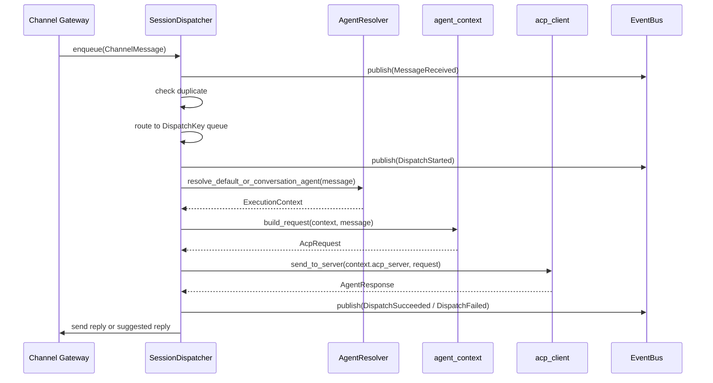
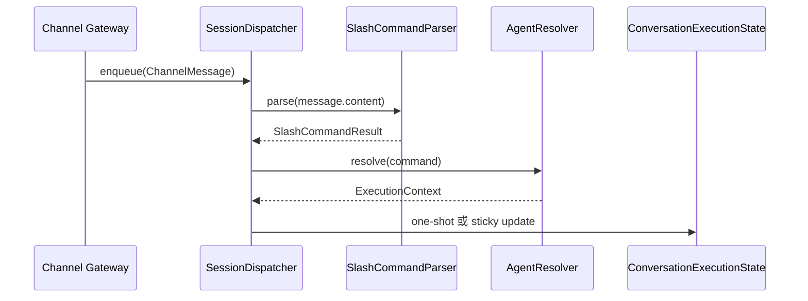

> **Status**: `draft`

# 架构子模块：SessionDispatcher 与 EventBus

## § 职责定位

SessionDispatcher 是 MindClaw 的业务调度管线，负责接收标准化 `ChannelMessage`，按 `channel + conversation_id` 保序处理，解析 SlashCommand，选择本次执行使用的 Agent / Skill / ACP Server，并编排 ACP 调用和渠道回复。

EventBus 是运行时事件 Pub/Sub 组件，负责把消息接收、调度开始、调度完成、回复成功、回复失败等事件广播给 UI、日志和审计。

## § 核心原则

1. **Dispatcher 管处理顺序**：SessionDispatcher 以 `channel + conversation_id` 作为 session key；同一会话 FIFO，不同会话并发。
2. **Dispatcher 管显式命令入口**：SlashCommand 在后端统一解析，保证 Desktop UI、CLI、Webhook 语义一致。
3. **Resolver 管执行目标**：AgentResolver 读取默认 Agent、SlashCommand 和 ConversationExecutionState，生成 ExecutionContext。
4. **EventBus 管事件传播**：EventBus 只广播 runtime 事件，不直接触发 ACP 调用。

## § 边界与实体

### 输入

- `dispatch(msg: ChannelMessage)`：接收人工触发、后台轮询或 webhook 产生的消息，进入 session 队列并返回 Agent 处理结果。
- `SlashCommandParser::parse(input)`：由 Agent 模块提供的 SlashCommand 解析入口；本模块只负责调用解析结果，详见 `docs/architecture/40-agent-skill-command.md`。
- `publish(event: RuntimeEvent)`：向 EventBus 发布运行时事件。
- `subscribe()`：订阅 EventBus 后续事件。

### 输出

- `ExecutionContext`：本次消息执行使用的 Agent、Skill、ACP Server 和会话元数据。
- `AgentResponse`：ACP Server 对入站消息的处理结果。
- `Channel reply`：交给 Channel Gateway 的出站回复内容。
- `RuntimeEvent`：消息收到、命令调用、Agent 选择、Skill 选择、调度开始、调度完成、回复成功和回复失败等事件。
- legacy `RouteRule`：已退出主链路的旧路由配置，仅作为历史背景记录。

### 核心实体

- **SessionDispatcher**：会话调度器，拥有 per-session 队列和 worker 生命周期。
- **DispatchKey**：由 `channel + conversation_id` 组成的 session 标识。
- **SlashCommandParser**：解析 `/命令` 的组件。
- **AgentResolver**：把消息和会话状态解析为 ExecutionContext 的组件。
- **ConversationExecutionState**：当前会话选择的 Agent、Skill 和 ACP session 状态。
- **ChannelMessage**：来自 Channel Gateway 的标准化消息。
- **AgentResponse**：ACP Server 处理结果。
- **RuntimeEvent**：运行时事件，供 UI、日志、审计和监控订阅。

### 错误边界

- SessionDispatcher 捕获消息去重、命令解析、Agent 解析、队列关闭、ACP 调用和回复发送错误，并转换为调度错误。
- EventBus 不将无订阅者视为错误；订阅者滞后不阻断发布者。

## § 关键流程

### 普通消息按 session 调度

### SlashCommand 调度

### legacy RouteRule 背景

RouteRule 已从主链路完全移除，相关 `message_bus` 模块已删除。新 Agent 选择只读取默认 Agent、ConversationExecutionState 和 SlashCommand，不读取 RouteRule。

## § 设计决策与权衡

| 决策问题 | 选择 | 放弃的替代方案 | 理由 |
|---------|------|--------------|------|
| 有序 ACP 调用由谁负责？ | SessionDispatcher（per-session queue） | MessageBus | 该职责是队列和 worker 调度，不是 Pub/Sub |
| SlashCommand 在哪里解析？ | 后端统一解析 | 前端解析 | 后端解析保证 Desktop UI、CLI、Webhook 语义一致 |
| Agent 如何解析？ | AgentResolver 读取 ConversationExecutionState 或默认 Agent | RouteRule 匹配 | Agent 选择是显式状态，不是自动规则路由 |
| EventBus 是否处理业务消息？ | 不处理，只广播事件 | EventBus 直接触发 ACP 调用 | 事件传播不应拥有业务处理顺序 |
| RouteRule 是否参与主调度？ | 不参与，保留 legacy API | 继续用 RouteRule 选择 Agent | 主链路使用默认 Agent 和 SlashCommand，避免规则冲突 |
| 出站回复由谁发送？ | Dispatcher 编排，Channel Gateway 执行发送 | Dispatcher 直接依赖具体 Channel | 出站分发属于 Channel Gateway 职责 |

## § 可观测性事件

SessionDispatcher 与 GatewaySupervisor 应发布足够的事件支持 UI、日志和调试：

- `RuntimeStarted` / `RuntimeStopped`
- `ChannelPollStarted` / `ChannelPollSucceeded` / `ChannelPollFailed`
- `MessageReceived`
- `MessageDeduplicated`
- `DispatchStarted`
- `DispatchSucceeded` / `DispatchFailed`
- `ReplySent` / `ReplyFailed`

实现状态以 `docs/architecture/reference/migration.md` 为准。
