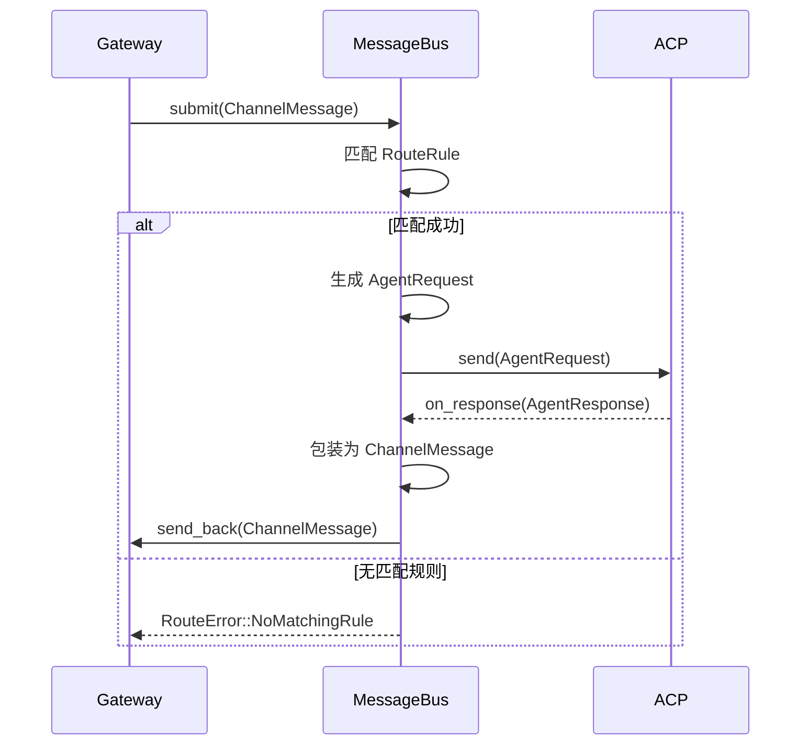
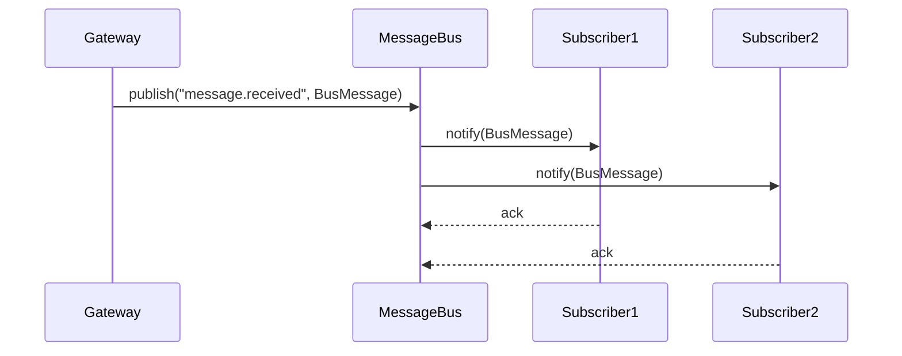

> **Status**: `draft`

# 架构子模块：MessageBus

## § 职责定位

MessageBus 是系统的**中枢神经**，负责统一消息路由：接收来自 `gateway` 的标准化 `ChannelMessage`，根据 `RouteRule` 匹配目标 Agent，将 `AgentRequest` 投递到 `acp`，并将 `AgentResponse` 回写到对应渠道。

MessageBus 不直接依赖 `im_channel` 和 `gateway` 的具体实现，也不持有任何外部凭证。它只处理已标准化的 `ChannelMessage` 和 `AgentRequest`/`AgentResponse`。

## § 边界与实体

### 输入

- `submit(msg: ChannelMessage)`：接收来自 Gateway 的标准化消息
- `on_response(resp: AgentResponse)`：接收来自 ACP 的 Agent 响应
- `register_route(rule: RouteRule)`：注册路由规则
- `subscribe(topic: String, handler: MessageHandler)`：订阅消息主题

### 输出

- `AgentRequest`：发送给 ACP 的处理请求
- `ChannelMessage`：回写给 Gateway 的回复消息
- `BusMessage`：广播给订阅者的消息

### 核心实体

- **ChannelMessage**：来自 Gateway 的标准化消息，包含 `channel_id`、`sender_id`、`content`、`timestamp`、`session_id`
- **RouteRule**：消息路由规则，包含 `match_expr`（匹配表达式，支持渠道、发送者、关键词匹配）、`agent_id`（目标 Agent）、`priority`（优先级）
- **AgentRequest**：向 Agent 发起的请求，包含 `request_id`、`agent_id`、`payload`（原始消息内容）、`session_id`
- **AgentResponse**：Agent 处理结果，包含 `request_id`、`status`、`output`、`error_message`
- **BusMessage**：总线消息，包含 `message_id`、`trace_id`、`topic`、`payload`、`headers`、`timestamp`

### 错误边界

- 无匹配路由规则时返回 `RouteError::NoMatchingRule`
- Agent 超时时返回 `RouteError::AgentTimeout`，不阻塞其他消息处理
- 消息格式错误时返回 `RouteError::InvalidMessage`，记录错误日志

## § 支持的消息模式

| 模式 | 说明 | 使用场景 |
|------|------|----------|
| **Direct** | 点对点直接发送 | Gateway → ACP 执行请求 |
| **Pub/Sub** | 发布/订阅广播 | 日志、监控事件、状态变更通知 |
| **Topic** | 主题路由 | 按消息类型分发给不同处理器 |
| **Queue** | 队列消费 | 异步任务、削峰填谷 |

## § 关键流程

### 消息路由与回写

### 广播/订阅流程

## § 设计决策与权衡

| 决策问题 | 选择 | 放弃的替代方案 | 理由 |
|---------|------|--------------|------|
| 消息处理模式？ | 同步处理（请求-响应） | 异步队列+Worker | v1 消息量小，同步模式代码简单；v2 可按需引入 actor 模型 |
| RouteRule 存储？ | 内存 Vec + 配置文件 | SQLite 持久化 | 规则数量少（<50），启动时从配置加载即可 |
| 多 Agent 路由策略？ | 精确匹配 + 优先级 | 负载均衡/广播 | 当前场景是规则路由而非负载路由；广播由多条规则实现 |
| 总线实现方式？ | 内置 EventEmitter + 内存队列 | Redis / RabbitMQ / NATS | 桌面单机应用，内置实现足够；v2 可替换为分布式实现 |
| 消息追踪？ | TraceId 贯穿全链路 | 无追踪 | 便于调试和监控，定位跨模块问题 |
