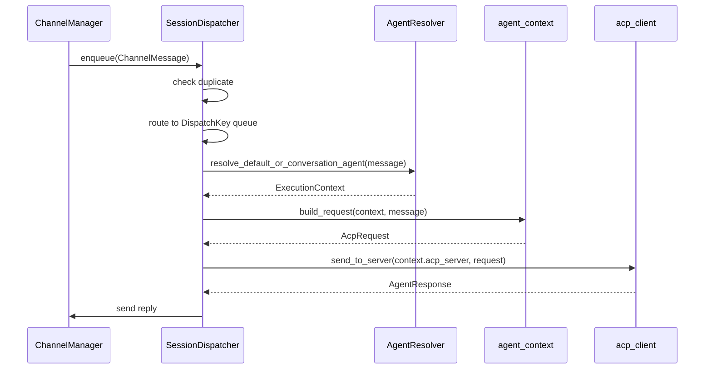
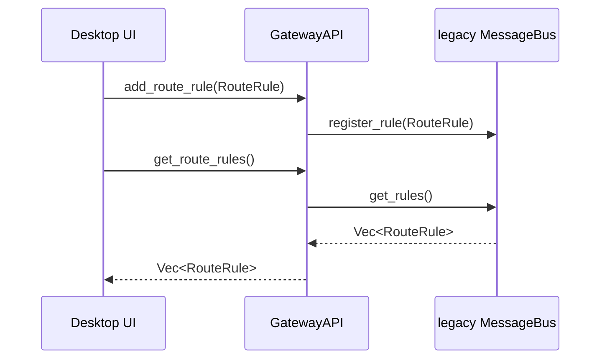

> **Status**: `draft`

# 架构子模块：SessionDispatcher、EventBus 与 legacy MessageBus

## § 职责定位

SessionDispatcher 负责 GatewaySupervisor 内部的消息处理调度：接收标准化 `ChannelMessage`，按 session 保序，解析 slash command，解析本次执行使用的 Agent、Skill 和 ACP Server，并将回复交给 ChannelManager；不负责渠道协议、Webhook 接入、UI 展示、事件订阅或 legacy RouteRule 自动路由。

EventBus 负责 GatewaySupervisor 内部事件的 Pub/Sub 传播；不负责 ACP 调用、渠道回复或业务处理顺序。

legacy MessageBus 只保留 RouteRule 兼容接口；不参与主消息调度链路。

## § 核心原则

1. **Dispatcher 管处理顺序**：SessionDispatcher 以 `channel + conversation_id` 作为 session key；理由是同一会话需要 FIFO，不同会话需要并发。
2. **Dispatcher 管显式命令入口**：SessionDispatcher 统一解析 slash command；理由是 Desktop UI、CLI 和 Webhook 需要一致的命令语义。
3. **EventBus 管事件传播**：EventBus 只广播 runtime 事件；理由是事件订阅和业务调度拥有不同变更理由。
4. **MessageBus 退出主链路**：legacy MessageBus 保留旧 RouteRule API；理由是当前主链路是 pipeline，不是 Pub/Sub。

## § 边界与实体

### 输入

- `dispatch_and_wait(msg: ChannelMessage)`：接收人工触发的消息处理请求，并返回 Agent 处理结果。
- `enqueue(msg: ChannelMessage)`：接收后台轮询或 Webhook 产生的消息，异步进入 session 队列。
- `parse_input(msg: ChannelMessage)`：解析消息中的 slash command。
- `publish(event: RuntimeEvent)`：向 EventBus 发布运行时事件。
- `subscribe()`：订阅 EventBus 后续事件。
- `get_route_rules()` / `add_route_rule()` / `remove_route_rule()`：legacy RouteRule 兼容接口。

### 输出

- `AgentResponse`：ACP Server 对入站消息的处理结果。
- `ChannelMessage` 或 reply payload：交给 ChannelManager 的出站回复。
- `RuntimeEvent`：消息收到、命令调用、Agent 选择、Skill 选择、调度开始、调度完成、回复成功和回复失败等运行时事件。
- `RouteRule`：legacy MessageBus 返回的兼容配置。

### 核心实体

- **SessionDispatcher**：会话调度器，拥有 per-session 队列和 worker 生命周期。
- **DispatchKey**：由 `channel + conversation_id` 组成的 session 标识，用于隔离顺序。
- **SlashCommandParser**：解析 `/命令` 的组件。
- **AgentResolver**：把消息和会话状态解析为 ExecutionContext 的组件。
- **ConversationExecutionState**：当前会话选择的 Agent、Skill 和 ACP session 状态。
- **ChannelMessage**：来自 ChannelManager 的标准化消息。
- **AgentResponse**：ACP Server 处理结果。
- **RuntimeEvent**：运行时事件，供 UI、日志、审计和监控订阅。
- **RouteRule**：legacy 路由规则，仅用于兼容旧接口。

### 错误边界

- SessionDispatcher 捕获消息去重、命令解析、Agent 解析、队列关闭、ACP 调用和回复发送错误，并转换为 GatewaySupervisor 可理解的调度错误。
- EventBus 不将无订阅者视为错误；订阅者滞后不阻断发布者。
- legacy MessageBus 不暴露渠道原始错误，也不参与 ACP 调用错误处理。

## § 关键流程

### 普通消息按 session 调度

### SlashCommand 调度

### legacy RouteRule 兼容

## § 设计决策与权衡

| 决策问题 | 选择 | 放弃的替代方案 | 理由 |
|---------|------|--------------|------|
| 有序 ACP 调用由谁负责？ | SessionDispatcher | MessageBus | 该职责是队列和 worker 调度，不是 Pub/Sub |
| SlashCommand 在哪里解析？ | SessionDispatcher 统一解析 | 前端解析 | 后端解析保证 Desktop UI、CLI、Webhook 语义一致 |
| Agent 如何解析？ | AgentResolver 读取 ConversationExecutionState 或默认 Agent | RouteRule 匹配 | Agent 选择是显式状态，不是自动规则路由 |
| EventBus 是否处理业务消息？ | 不处理，只广播事件 | EventBus 直接触发 ACP 调用 | 事件传播不应拥有业务处理顺序 |
| RouteRule 是否参与主调度？ | 不参与，保留 legacy API | 继续用 RouteRule 选择 Agent | 主链路使用默认 Agent 和 SlashCommand，避免规则冲突 |
| 出站回复由谁发送？ | SessionDispatcher 编排，ChannelManager 执行发送 | Dispatcher 直接依赖具体 Channel | 出站分发属于 ChannelManager 职责 |
