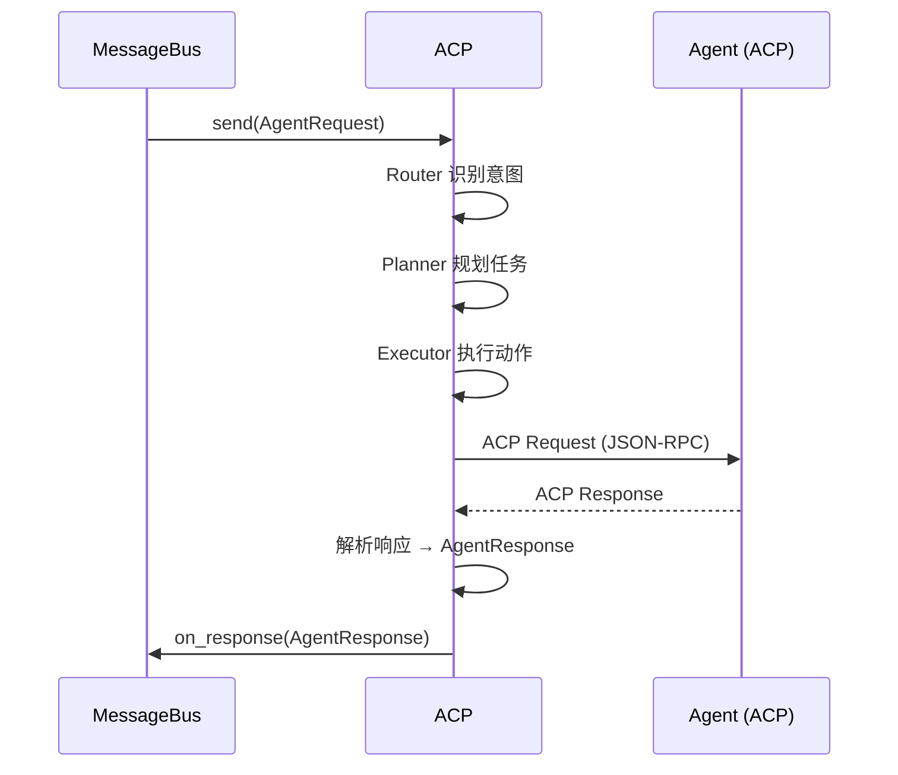
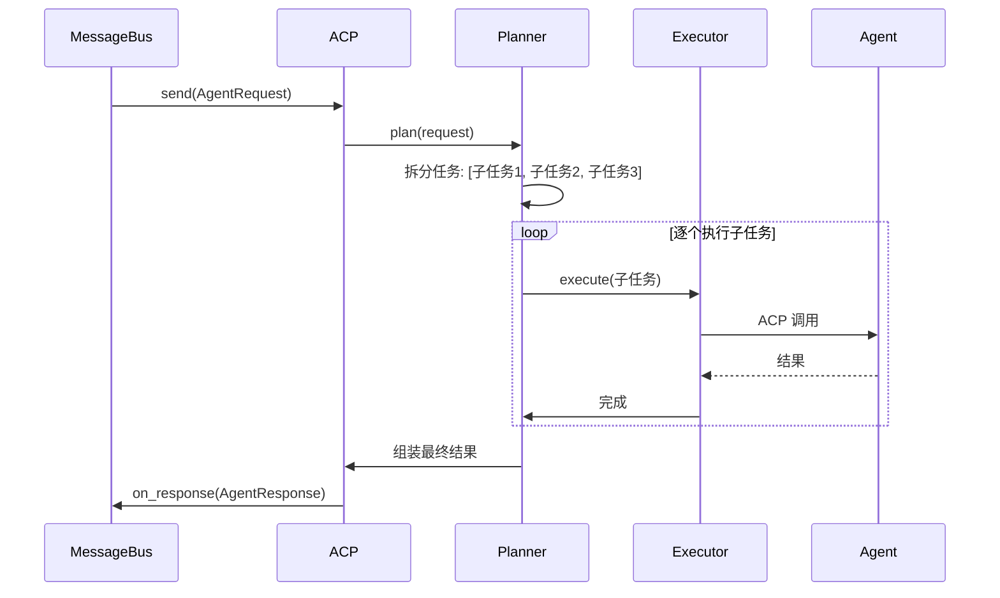

> **Status**: `draft`

# 架构子模块：ACP (Action Control Plane)

## § 职责定位

ACP 是系统的**大脑与手脚**，负责理解意图、规划任务、调用工具、执行动作。它通过 ACP 协议与本地 Agent 进程通信，是消息调度的最终执行层。

ACP 内部包含：

- **Router**：意图识别与分发，将消息路由到对应 Agent / Skill / 工作流
- **Planner**：任务规划，复杂任务拆分为可执行的子任务序列
- **Executor**：动作执行，调用 Tools、Skills、外部 API，收集结果
- **Memory**：短期记忆（会话上下文）+ 长期记忆（知识库/向量检索）

## § 边界与实体

### 输入

- `send(request: AgentRequest)`：向 Agent 发送处理请求
- `cancel(request_id: RequestId)`：取消正在处理的请求
- `register_skill(skill: Skill)`：注册业务技能插件
- `register_tool(tool: Tool)`：注册工具

### 输出

- `AgentResponse`：Agent 处理结果，包含 `request_id`、`status`（`Success`/`Error`/`Timeout`）、`output`、`metadata`

### 核心实体

- **AgentRequest**：处理请求，包含 `request_id`、`agent_id`、`payload`（自由格式文本）、`session_id`、`context`
- **AgentResponse**：处理结果，包含 `request_id`、`status`、`output`（自由格式文本）、`error_message`（可选）、`metadata`（执行时间、使用工具等）
- **Skill**：可插拔业务技能单元，如代码审查、数据分析、文档生成
- **Tool**：原子工具，如代码执行、文件操作、HTTP 调用、数据库查询

### 错误边界

- ACP 连接失败 → `AcpError::ConnectionFailed`
- Agent 超时 → `AcpError::Timeout`
- Agent 返回错误 → `AcpError::AgentError`（透传 Agent 的错误信息）
- 技能执行失败 → `AcpError::SkillExecutionFailed`

## § 子模块职责

### Router（意图路由）

- 接收 `AgentRequest`，识别用户意图
- 根据意图匹配对应的 Agent、Skill 或工作流
- 支持规则匹配和 AI 语义理解两种模式

### Planner（任务规划）

- 将复杂任务拆分为可执行的子任务序列
- 管理任务依赖关系和执行顺序
- 支持条件分支和循环

### Executor（动作执行）

- 调用 Tools 和 Skills 完成具体动作
- 管理工具注册和发现
- 收集执行结果，组装成 `AgentResponse`

### Memory（记忆管理）

- **短期记忆**：当前会话上下文，维护多轮对话状态
- **长期记忆**：持久化知识库，支持向量检索
- 与 Storage 层交互，读写记忆数据

## § 关键流程

### Agent 调用流程

### 复杂任务处理流程

## § 设计决策与权衡

| 决策问题 | 选择 | 放弃的替代方案 | 理由 |
|---------|------|--------------|------|
| ACP 传输层？ | stdio（子进程 stdin/stdout） | HTTP/TCP Socket | stdio 零网络配置，适合本地单 Agent 场景；HTTP 留给 v2 远程 Agent |
| 超时策略？ | 可配置超时（默认 120s）+ 取消 | 无超时等待 | LLM 推理可能较慢，需要可配置的超时和手动取消 |
| 并发请求？ | 串行处理（单 Agent 单请求） | 并发多请求 | v1 本地 Agent 串行处理更简单；v2 引入请求队列和并发 |
| 技能架构？ | 插件化 Skill 注册 | 硬编码业务逻辑 | 业务迭代通过插件完成，支持热加载；core 保持精简 |
| 记忆实现？ | 内存 + SQLite 持久化 | 纯内存 / 外部向量数据库 | 桌面应用内置足够；v2 可接入外部向量库 |
