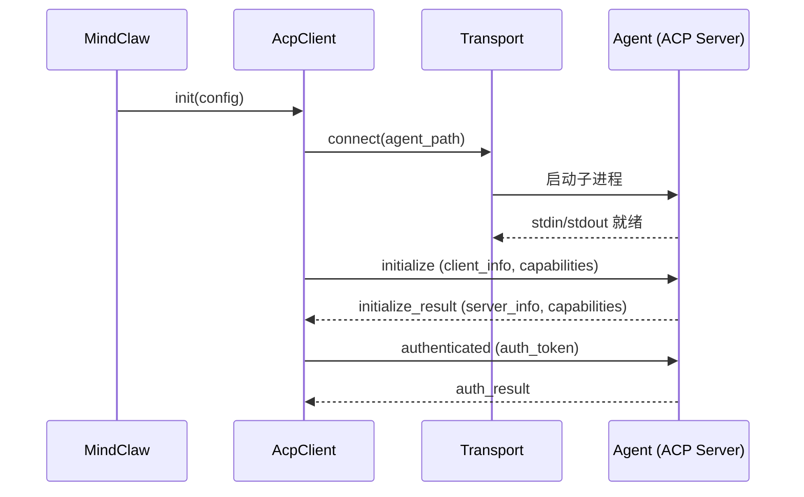
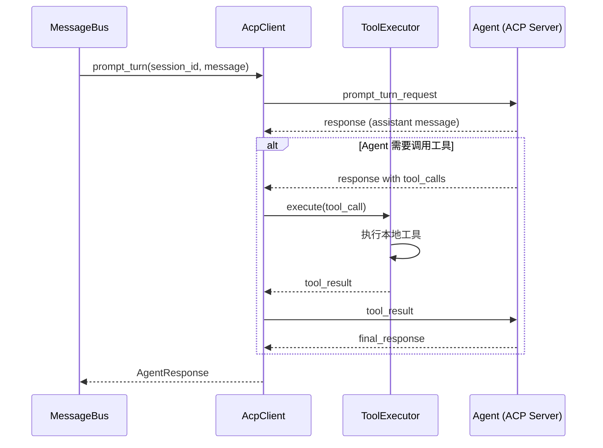
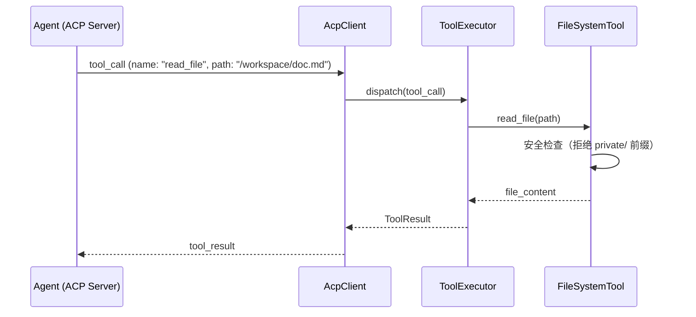

> **Status**: `draft`

# 架构子模块：ACP 协议客户端 (acp_client)

## § 职责定位

`acp_client` 是 Gateway Runtime 内部的 **ACP (Agent Client Protocol) 协议客户端**，负责与外部 Agent 进程（ACP Server）建立连接、管理会话生命周期、发送 Prompt Turn 请求，并处理 Agent 发起的反向调用（Tool Calls、File System、Terminals 等）。

**核心原则**：`acp_client` 是纯协议层，不承载业务智能。意图识别、任务规划、工具执行决策等全部在 ACP Server（Agent 进程）端完成。MindClaw 只负责协议通信和本地能力暴露。

**与旧概念的区别**：本模块原被称为 "Action Control Plane"，该定位是错误的。ACP 不是 MindClaw 内部的"大脑"，而是**标准化通信协议**的客户端实现。

## § 边界与实体

### 输入

- `init(config: AcpConfig)`：初始化客户端，建立传输层连接，执行协议握手
- `session_create(config: SessionConfig)`：创建新会话
- `prompt_turn(session_id: SessionId, message: AcpMessage)`：向 Agent 发送用户消息
- `tool_result(call_id: String, result: ToolResult)`：返回本地工具执行结果给 Agent
- `register_local_tool(tool: LocalTool)`：注册本地工具，供 Agent 反向调用

### 输出

- `AcpResponse`：Agent 返回的响应（文本、多模态内容、工具调用请求）
- `ToolCall`：Agent 请求调用本地工具的指令
- `SessionEvent`：会话状态变更事件（created/updated/deleted）
- `ConnectionEvent`：连接状态事件（connected/disconnected/error）

### 核心实体

- **AcpClient**：协议客户端主结构，持有 Transport、SessionManager、ToolExecutor
- **Transport**：传输层抽象（stdio / HTTP / SSE），负责底层字节流传输
- **Session**：ACP 会话，包含 `session_id`、`mode`、`config`、`state`
- **AcpMessage**：协议消息，支持 text / image / resource 等多种 ContentPart
- **ToolCall**：Agent 发起的工具调用请求，包含 `call_id`、`name`、`arguments`
- **ToolResult**：本地工具执行结果，包含 `call_id`、`content`、`is_error`
- **LocalTool**：本地注册的工具定义，包含 `name`、`description`、`schema`、`handler`

### 错误边界

| 错误 | 说明 |
|------|------|
| `AcpError::ConnectionFailed` | 传输层连接失败（Agent 进程无法启动或网络不可达） |
| `AcpError::HandshakeFailed` | 协议握手失败（版本不匹配、认证失败） |
| `AcpError::SessionError` | 会话操作失败（创建失败、会话不存在） |
| `AcpError::Timeout` | Prompt Turn 超时（默认 120s，可配置） |
| `AcpError::AgentError` | Agent 返回的错误（透传） |
| `AcpError::ToolExecutionFailed` | 本地工具执行失败 |

## § 子模块职责

### Transport（传输层）

- 抽象传输接口：`connect()`、`send()`、`receive()`、`close()`
- **StdioTransport**（v1.0）：通过子进程 stdin/stdout 通信，零网络配置
- **HttpTransport**（v1.1）：HTTP 长轮询或 SSE 传输，支持远程 Agent
- 连接状态管理和自动重连

### SessionManager（会话管理）

- 创建/恢复/删除 ACP 会话
- 维护会话状态机（`Creating` → `Active` → `Closing` → `Closed`）
- 会话上下文持久化到 SQLite
- 支持 Session List / Session Delete 协议方法

### ToolExecutor（本地工具执行器）

- 注册和管理本地工具（`register_local_tool`）
- 接收 Agent 的 `ToolCall` 请求，分发给对应工具 handler
- 执行本地工具并返回 `ToolResult`
- 工具权限控制（允许/拒绝列表、沙箱限制）
- 内置工具集：File System、Terminals、HTTP Client

### Protocol（协议编解码）

- ACP v1 协议数据结构定义（serde）
- JSON-RPC / 自定义协议帧的序列化/反序列化
- Capabilities 协商（Client ↔ Server 能力交换）
- 协议版本兼容性处理

## § 关键流程

### 初始化与握手

### Prompt Turn（含 Tool Calls 循环）

### Agent 调用本地文件系统（File System）

## § ACP 协议能力适配规划

| 协议章节 | MindClaw 实现 | 优先级 | 阶段 |
|---------|--------------|--------|------|
| Transports | Transport trait + StdioTransport | P0 | v1.0 |
| Initialization | 协议握手 + capabilities 交换 | P0 | v1.0 |
| Authentication | 认证协商（API Key / None） | P0 | v1.0 |
| Session Setup | SessionManager::create() | P0 | v1.0 |
| Prompt Turn | prompt_turn() + 流式响应 | P0 | v1.0 |
| Content | text 内容编解码 | P0 | v1.0 |
| Tool Calls | ToolExecutor 接收并执行 | P0 | v1.0 |
| File System | 内置 fs 工具集 | P0 | v1.0 |
| Session List | SessionManager::list() | P1 | v1.1 |
| Session Delete | SessionManager::delete() | P1 | v1.1 |
| Session Config | 模型参数、温度等配置 | P1 | v1.1 |
| Content (multimodal) | image / audio / resource | P1 | v1.1 |
| Terminals | 内置 terminal 工具集 | P1 | v1.1 |
| Transports (HTTP/SSE) | HttpTransport / SseTransport | P1 | v1.1 |
| Session Modes | chat / agent / plan 模式 | P1 | v1.1 |
| Agent Plan | Plan 展示与确认流程 | P1 | v1.1 |
| Slash Commands | /command 解析与映射 | P2 | v2.0 |
| Extensibility | ExtensionRegistry | P2 | v2.0 |
| Schema | JSON Schema 校验与表单生成 | P2 | v2.0 |

## § 设计决策与权衡

| 决策问题 | 选择 | 放弃的替代方案 | 理由 |
|---------|------|--------------|------|
| ACP 定位？ | 纯协议客户端 | Action Control Plane 执行层 | ACP 是通信协议，智能在 Agent 端 |
| 传输层？ | StdioTransport（v1.0）+ HTTP/SSE（v1.1） | 仅 stdio / 仅 HTTP | stdio 零配置适合本地；HTTP 支持远程 |
| 会话模式？ | 有状态 Session（v1.0 基础） | 无状态请求-响应 | ACP 协议基于会话，需管理 session 生命周期 |
| Tool Calls 方向？ | Agent → Client（反向调用） | Client → Agent（正向调用） | ACP 标准定义 Agent 可调用 Client 侧工具 |
| 工具权限？ | 显式注册 + 拒绝列表 | 全部开放 / 全部拒绝 | 安全与灵活性平衡，敏感操作需显式授权 |
| 超时策略？ | 可配置（默认 120s）+ 取消 | 无超时 | LLM 推理可能较慢 |
| 流式响应？ | v1.0 完整响应，v1.1 SSE 流式 | 始终阻塞等待完整响应 | 流式提升 UX，但增加协议复杂度 |

## § 安全边界

- `acp_client` **不**发起 IM 渠道网络请求；渠道 API 调用由 Channel 实现负责，Gateway API 负责客户端和 Webhook 入口
- File System 工具拒绝 `vault/private/` 前缀路径
- Terminal 工具禁止危险命令（如 `rm -rf /`），设置超时和输出大小限制
- 工具执行在沙箱权限下运行，敏感操作需用户确认
- Agent 进程通过 stdio 隔离，协议层提供结构化边界
