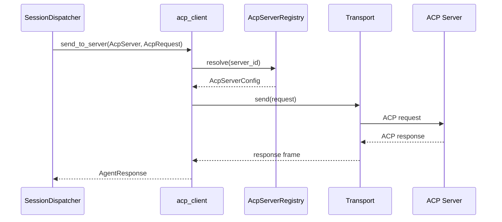
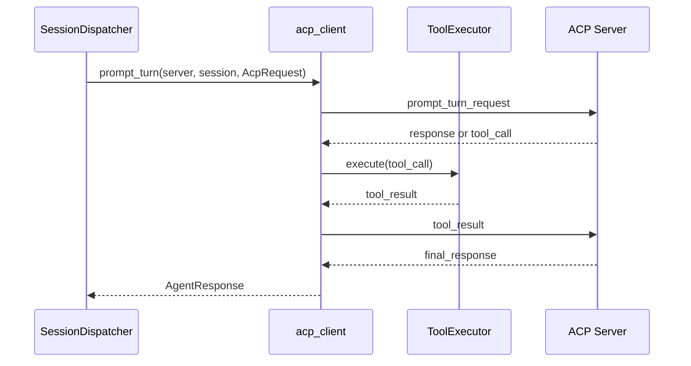

> **Status**: `draft`

# 架构子模块：ACP Execution Layer (acp_client)

## § 职责定位

`acp_client` 是 MindClaw 的 ACP Execution Layer。它负责按 AcpServer 配置与用户已有或自建的 ACP Server 通信，发送已组装的请求、接收响应、处理连接状态和受控 Tool Call。

`acp_client` 不负责渠道协议、会话调度、Agent / Skill 解析、Agent 上下文组装或 ACP Server 内部智能。

## § 核心原则

1. **ACP-native**：MindClaw 通过 ACP Server 执行 Agent，不自研基础 Agent Server。
2. **协议层保持纯粹**：`acp_client` 只处理 ACP 通信；业务调度由 SessionDispatcher 负责。
3. **按 AcpServer 调用**：调用目标由 AgentResolver 生成的 ExecutionContext 指定；`acp_client` 不自行解析 Agent。
4. **上下文组装前置**：`agent_context` 在调用 `acp_client` 前完成请求组装。
5. **本地工具受控执行**：ToolExecutor 执行 ACP Server 请求的本地工具调用，必须经过权限边界。

## § 边界与实体

### 输入

当前可用输入：

- `register_server(server_config)`：注册 ACP Server。
- `test_connection(server)`：测试 AcpServer 连接状态。
- `send_to_server(server, request)`：向指定 AcpServer 发送已组装请求。

目标输入（当前实现状态见 `docs/architecture/reference/migration.md` Phase 4）：

- `prompt_turn(server, session_id, request)`：向指定 AcpServer 发送 ACP Prompt Turn 请求。
- `tool_result(call_id, result)`：将本地工具执行结果返回给 ACP Server。
- `register_local_tool(tool)`：注册可供 ACP Server 调用的本地工具。

### 输出

- `AgentResponse`：ACP Server 返回的处理结果。
- `AcpServerStatus`：ACP Server 连接与可用状态。
- `ToolCall`：ACP Server 请求调用本地工具的指令。
- `SessionEvent`：ACP 会话状态事件。
- `ConnectionEvent`：ACP 连接状态事件。

### 核心实体

- **AcpClient**：协议客户端主结构，协调 server registry、transport、session 和 tool executor。
- **AcpServer**：可被调用的 ACP 执行后端。
- **AcpServerRegistry**：ACP Server 注册与状态查询组件。
- **Transport**：传输层抽象，负责底层 stdio / HTTP / 其他传输。
- **Session**：ACP 会话，表示 ACP Server 侧的一次对话上下文。
- **AcpRequest**：发给 ACP Server 的协议请求。
- **AgentResponse**：ACP Server 返回给 SessionDispatcher 的处理结果。
- **ToolCall**：ACP Server 发起的本地工具调用请求。
- **ToolExecutor**：本地工具执行器，负责权限检查和工具分发。

### 错误边界

- 传输连接失败、协议解析失败、ACP Server 返回错误和超时由 `acp_client` 转换为 ACP 调用错误。
- 工具执行失败由 ToolExecutor 转换为工具调用错误，并通过 ACP 协议返回给 ACP Server。
- `acp_client` 不暴露 IM 渠道错误，不读取 Channel Gateway 内部状态，不解析 Agent 或 Skill。

## § 关键流程

### 按 AcpServer 调用流程

### 目标 Prompt Turn 与 Tool Call 流程

该流程描述 Phase 4 完整化后的目标能力；当前可用调用入口以 `send_to_server` 为准。

## § 设计决策与权衡

| 决策问题 | 选择 | 放弃的替代方案 | 理由 |
|---------|------|--------------|------|
| ACP 定位是什么？ | 纯协议客户端和执行后端适配层 | MindClaw 内部智能执行层 | ACP 是通信协议，智能在 ACP Server 端 |
| SessionDispatcher 如何调用 ACP？ | 通过 `acp_client` 按 AcpServer 调用 | Dispatcher 直接管理子进程和协议帧 | 协议通信和业务调度拥有不同变更理由 |
| Agent 与 ACP Server 如何关联？ | Agent 绑定默认 AcpServer，调用时传入 AcpServer | `acp_client` 根据 Agent 名称自行查找 | Agent 解析属于业务层，协议层只关心目标 server |
| 上下文组装放在哪里？ | `agent_context` | `acp_client` | 协议层不应关心 Agent Identity、Skill 和记忆来源 |
| 工具调用方向是什么？ | ACP Server → MindClaw Client | MindClaw Client 主动执行 Agent 内部工具 | ACP 定义 Agent 可调用 Client 侧本地能力 |
| 多 transport 如何支持？ | Transport trait | 将 stdio / HTTP 写死在 AcpClient | transport 是协议承载细节，应可替换 |

## § 安全边界

- `acp_client` 不发起 IM 渠道网络请求。
- AcpServer secret、token 和敏感环境变量存储在 Stronghold。
- File System 工具拒绝访问 `vault/private/` 前缀路径。
- Terminal 工具受命令权限、超时和输出大小限制。
- ACP Server 通过 ACP 协议边界访问本地能力。
- 敏感工具调用必须经过权限策略确认。
- MindClaw 不控制 ACP Server 内部是否访问外部模型服务；该行为由用户配置的 Server 决定。
