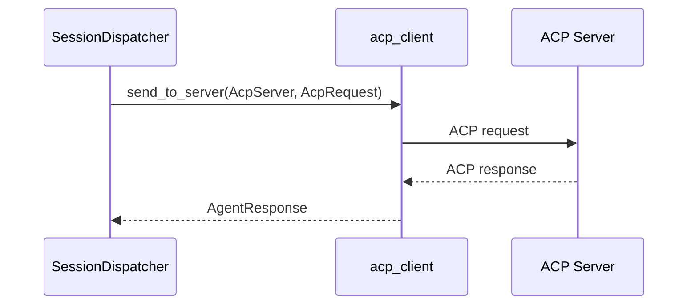
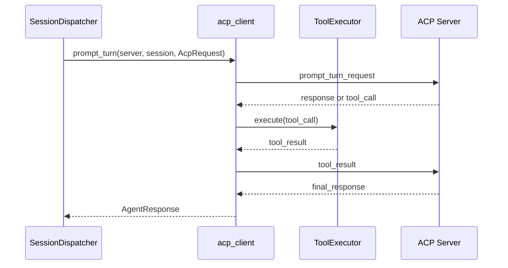

> **Status**: `draft`

# 架构子模块：ACP 协议客户端 (acp_client)

## § 职责定位

`acp_client` 是 GatewaySupervisor 内部的 ACP (Agent Client Protocol) 协议客户端，负责按 AcpServer 配置与外部 ACP Server 通信、发送请求、接收响应和执行 ACP Server 发起的本地工具调用；不负责渠道协议、会话调度、Agent/Skill 解析、Agent 上下文组装或 ACP Server 内部智能。

## § 核心原则

1. **协议层保持纯粹**：`acp_client` 只处理 ACP 通信；理由是业务调度由 SessionDispatcher 负责。
2. **按 AcpServer 调用**：`acp_client` 接收已解析的 AcpServer 作为执行目标；理由是 Agent 可以绑定不同 ACP Server。
3. **上下文组装前置**：`agent_context` 在调用 `acp_client` 前完成请求组装；理由是 Agent Identity、Skill 和记忆不属于协议传输职责。
4. **本地工具受控执行**：ToolExecutor 执行 ACP Server 请求的本地工具调用；理由是本地能力暴露必须有权限边界。

## § 边界与实体

### 输入

- `send(request: AgentRequest)`：接收迁移期 legacy Agent 请求。
- `send_to_server(server, request)`：向指定 AcpServer 发送已组装请求。
- `prompt_turn(server, session_id, request)`：向指定 AcpServer 发送 ACP Prompt Turn 请求。
- `test_connection(server)`：测试 AcpServer 连接状态。
- `tool_result(call_id, result)`：将本地工具执行结果返回给 ACP Server。
- `register_local_tool(tool)`：注册可供 ACP Server 调用的本地工具。

### 输出

- `AgentResponse`：ACP Server 返回的处理结果。
- `ToolCall`：ACP Server 请求调用本地工具的指令。
- `SessionEvent`：ACP 会话状态事件。
- `ConnectionEvent`：ACP 连接状态事件。
- `AcpServerStatus`：ACP Server 连接与可用状态。

### 核心实体

- **AcpClient**：协议客户端主结构，持有传输、协议编解码和工具执行能力。
- **AcpServer**：可被调用的 ACP 执行后端。
- **AcpServerRegistry**：ACP Server 注册与状态查询组件。
- **Transport**：传输层抽象，负责底层字节流传输。
- **Session**：ACP 会话，表示 ACP Server 侧的一次对话上下文。
- **AcpRequest**：发给 ACP Server 的协议请求。
- **AgentResponse**：ACP Server 返回给 GatewaySupervisor 的处理结果。
- **ToolCall**：ACP Server 发起的本地工具调用请求。
- **ToolExecutor**：本地工具执行器，负责权限检查和工具分发。

### 错误边界

- 传输连接失败、协议解析失败、ACP Server 返回错误和超时由 `acp_client` 转换为 ACP 调用错误。
- 工具执行失败由 ToolExecutor 转换为工具调用错误，并通过 ACP 协议返回给 ACP Server。
- `acp_client` 不暴露 IM 渠道错误，不读取 ChannelManager 内部状态，不解析 Agent 或 Skill。

## § 关键流程

### 按 AcpServer 调用流程

### Prompt Turn 与 Tool Call 流程

## § 设计决策与权衡

| 决策问题 | 选择 | 放弃的替代方案 | 理由 |
|---------|------|--------------|------|
| ACP 定位是什么？ | 纯协议客户端 | MindClaw 内部智能执行层 | ACP 是通信协议，智能在 ACP Server 端 |
| SessionDispatcher 如何调用 ACP？ | 通过 `acp_client` 按 AcpServer 调用 | Dispatcher 直接管理子进程和协议帧 | 协议通信和业务调度拥有不同变更理由 |
| Agent 与 ACP Server 如何关联？ | Agent 绑定默认 AcpServer，调用时传入 AcpServer | `acp_client` 根据 Agent 名称自行查找 | Agent 解析属于业务层，协议层只关心目标 server |
| 上下文组装放在哪里？ | `agent_context` | `acp_client` | 协议层不应关心 Agent Identity、Skill 和记忆来源 |
| 工具调用方向是什么？ | ACP Server → MindClaw Client | MindClaw Client 主动执行 Agent 内部工具 | ACP 标准定义 Agent 可调用 Client 侧本地能力 |
| 迁移策略是什么？ | 保留 legacy `send(AgentRequest)` seam，同时新增按 AcpServer 调用边界 | 一次性替换为完整 ACP session 协议 | 分阶段迁移可以保持现有渠道处理行为稳定 |

## § 安全边界

- `acp_client` 不发起 IM 渠道网络请求。
- AcpServer secret、token 和敏感环境变量存储在 Stronghold。
- File System 工具拒绝访问 `vault/private/` 前缀路径。
- Terminal 工具受命令权限、超时和输出大小限制。
- ACP Server 通过 ACP 协议边界访问本地能力。
- 敏感工具调用必须经过权限策略确认。
