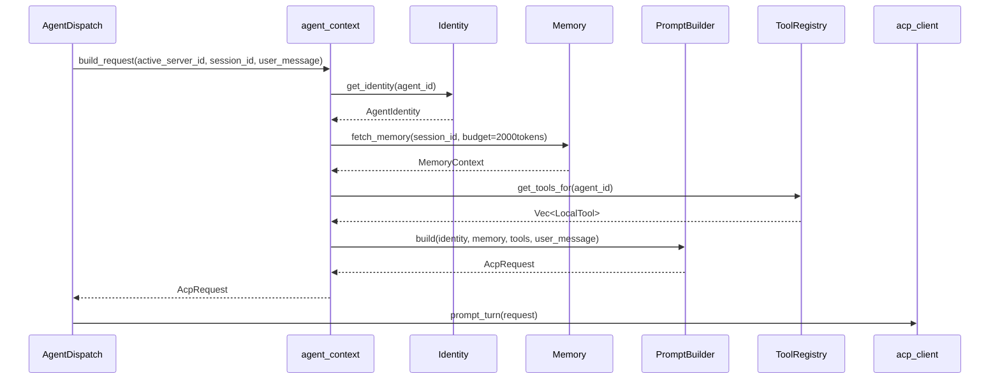

> **Status**: `draft`

# 架构子模块：Agent Context (agent_context)

## § 职责定位

`agent_context` 是 Gateway Runtime 内部的 **Agent 上下文组装模块**，负责在 Agent Dispatch 通过 ACP 协议发送消息给 Agent 之前，组装完整的上下文信息：Agent 身份证（Identity）、记忆（Memory）、可用工具列表（Tools）、会话配置（Session Config）。

**核心原则**：`agent_context` 不直接参与协议通信，也不包含业务智能。它只负责**数据准备**——将 MindClaw 管理的 Agent 元数据、用户记忆、本地工具注册信息等，组装成 ACP 协议要求的 `system_prompt` 和 `context` 字段。

**为什么独立成模块**：
1. **解耦**：ACP 协议层保持纯粹，不关心 prompt 如何组装
2. **可测试**：prompt 组装逻辑可以独立单元测试
3. **可扩展**：未来支持多种 prompt 模板策略（如不同 Agent 使用不同模板）

## § 边界与实体

### 输入

- `build_request(active_server_id: &str, session_id: &str, user_message: &ChannelMessage)`：为当前激活 ACP Server 组装完整 ACP 请求
- `register_identity(server_id: &str, identity: AgentIdentity)`：注册 ACP Server 身份证
- `register_memory_source(source: MemorySource)`：注册记忆数据源
- `get_registered_tools(active_server_id: &str)`：获取当前激活 ACP Server 可用的本地工具列表

### 输出

- `AcpRequest`：组装后的完整 ACP 请求，包含 `system_prompt`、`context`、`user_message`、`available_tools`
- `PromptBuildError`：组装失败时的错误（如 Agent 不存在、记忆源不可用）

### 核心实体

- **AgentIdentity**：Agent 身份证，包含 `agent_id`、`name`、`role_description`、`capabilities`、`system_prompt_template`
- **MemorySource**：记忆数据源接口，支持短期记忆（会话上下文）和长期记忆（向量检索）
- **PromptBuilder**：prompt 组装器，将 Identity + Memory + Tools 合并为最终 system prompt
- **ToolRegistry**：本地工具注册表，管理可供 Agent 调用的工具元数据（名称、描述、参数 schema）

## § 子模块职责

### Identity（Agent 身份证）

- 管理 Agent 的身份定义：名称、角色、能力描述、行为约束
- 每个 ACP Server 对应一个 `AgentIdentity`，存储在 SQLite 中
- 当前激活 ACP Server 使用对应的 Identity 组装 system prompt
- 将 Identity 转换为 system prompt 片段

### Memory（记忆管理）

- **短期记忆**：当前会话的最近 N 轮对话历史，从 SQLite 读取
- **长期记忆**：持久化知识库，支持关键词/向量检索，将相关记忆注入 context
- 记忆注入策略：限制 token 预算，避免 prompt 过长
- 与 Storage 层交互，不直接操作文件

### PromptBuilder（Prompt 组装器）

- 接收 `AgentIdentity`、`MemoryContext`、`ToolList`、`UserMessage`
- 按模板组装为完整 ACP 请求的 `context` 字段
- 支持模板变量替换（如 `{{agent_name}}`、`{{current_time}}`）
- 控制总 prompt 长度，超出时优先截断长期记忆

### ToolRegistry（工具元数据注册表）

- 注册本地工具的元数据（名称、描述、参数 JSON Schema）
- 按 Agent 过滤可用工具列表
- **注意**：只管理元数据，实际执行在 `acp_client::ToolExecutor` 中
- 与 `acp_client` 的工具注册保持同步

## § 关键流程

### Prompt 组装流程



### Agent Identity 定义示例

```rust
AgentIdentity {
    agent_id: "default",
    name: "MindClaw Assistant",
    role_description: "你是一个本地 AI 助手，帮助用户处理 IM 消息...",
    capabilities: vec!["消息摘要", "任务执行", "文件操作"],
    system_prompt_template: "你是 {{name}}。{{role_description}}\n\n当前可用工具：{{tools}}",
    constraints: vec!["不访问外部网络", "不泄露用户数据"],
}
```

## § 与 acp_client 的关系

```
┌─────────────────────────────────────────────────────────────┐
│  agent_context                                               │
│  ┌──────────┐  ┌──────────┐  ┌─────────────┐  ┌──────────┐ │
│  │ Identity │  │ Memory   │  │PromptBuilder│  │ToolReg.  │ │
│  └────┬─────┘  └────┬─────┘  └──────┬──────┘  └────┬─────┘ │
│       └─────────────┴───────────────┴──────────────┘        │
│                         │                                   │
│                         ▼ AcpRequest (含 system_prompt)     │
└─────────────────────────┬───────────────────────────────────┘
                          │
┌─────────────────────────┼───────────────────────────────────┐
│  acp_client              │                                   │
│                         ▼                                   │
│  ┌──────────────────────────────────────────────────────┐  │
│  │ Transport → SessionManager → Protocol → ToolExecutor │  │
│  └──────────────────────────────────────────────────────┘  │
│                         │                                   │
│                         ▼ ACP Protocol                       │
└─────────────────────────────────────────────────────────────┘
```

## § 设计决策与权衡

| 决策问题 | 选择 | 放弃的替代方案 | 理由 |
|---------|------|--------------|------|
| 模块边界？ | 独立 `agent_context` 模块 | 并入 `acp_client` | 解耦协议层与 prompt 逻辑，独立可测试 |
| Identity 存储？ | SQLite 持久化 | 配置文件 / 内存 | 支持动态更新，Active ACP Server 切换后需要读取对应 Identity |
| Memory 注入方式？ | prompt 文本注入 | 协议级 memory 扩展 | ACP 标准通过 prompt 传递上下文 |
| prompt 模板？ | 字符串模板替换 | 结构化 AST | 简单够用，避免过度设计 |
| Tool 元数据同步？ | `agent_context` 注册元数据，`acp_client` 注册执行器 | 单一注册中心 | 元数据与执行逻辑解耦 |

## § 后续演进

| 功能 | 说明 | 阶段 |
|------|------|------|
| ACP Server Identity 切换 | 用户切换 Active ACP Server 后，使用对应 Identity 组装上下文 | v1.1 |
| 记忆向量检索 | 接入本地向量数据库，语义检索相关记忆 | v1.1 |
| Prompt 模板市场 | 用户可自定义/分享 prompt 模板 | v2.0 |
| 动态工具发现 | Agent 根据上下文动态发现可用工具 | v2.0 |
