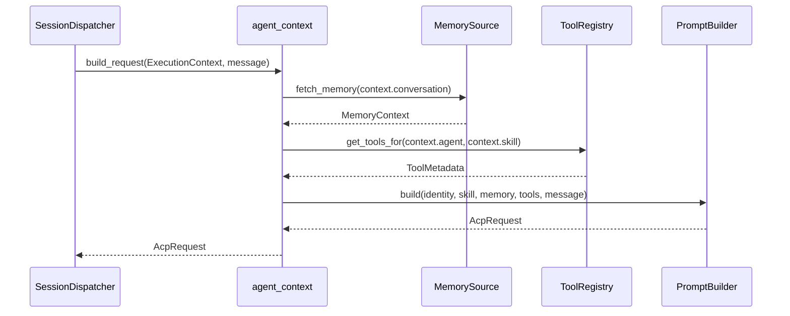
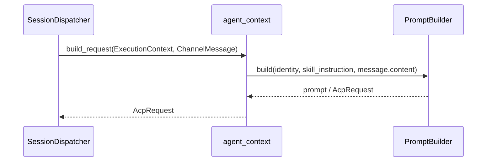

> **Status**: `draft`

# 架构子模块：Agent Context (agent_context)

## § 职责定位

`agent_context` 是 Agent Control Layer 与 ACP Execution Layer 之间的上下文组装模块。它负责把 Agent Identity、选中的 Skill、渠道消息、会话元数据、记忆和工具元数据组装为 ACP 请求。

`agent_context` 不负责协议传输、队列调度、SlashCommand 解析、渠道回复或 ACP Server 内部智能。

## § 核心原则

1. **MindClaw 管用户侧上下文**：Agent Identity、Skill instruction 和会话元数据属于 MindClaw 控制平面。
2. **ACP Server 管执行**：`agent_context` 只准备请求，不决定模型、工具执行循环或 Agent 内部推理。
3. **上下文与协议分离**：`agent_context` 生成 ACP 请求，`acp_client` 发送 ACP 请求。
4. **上下文与调度分离**：SessionDispatcher 决定处理顺序和命令语义，`agent_context` 只准备请求内容。
5. **Skill 与 Tool 分离**：Skill 是用户任务模板；Tool metadata 是可暴露能力描述；ToolExecutor 执行工具。

## § 边界与实体

### 输入

当前可用输入：

- `build_request(context, user_message)`：根据 ExecutionContext 和用户消息组装 ACP 请求。
- `build_prompt(context, user_message)`：生成 prompt 文本或 prompt segment。

目标输入（当前实现状态见 `docs/architecture/reference/migration.md` Phase 5）：

- `register_memory_source(source)`：注册记忆数据源。
- `get_registered_tools(agent_id, skill_id)`：获取当前 Agent 和 Skill 可用工具元数据。

### 输出

- `AcpRequest`：组装后的 ACP 请求，包含 Agent Identity、Skill instruction、系统上下文、用户消息和工具元数据。
- `PromptBuildError`：上下文组装失败时的错误。

### 核心实体

- **ExecutionContext**：一次执行所需的 Agent、Identity、Skill、ACP Server 和会话元数据。
- **Agent**：用户可选择的执行者，默认拥有 Identity，并关联多个 Skill。
- **Identity**：Agent 的身份、人设和行为约束。
- **Skill**：独立管理的任务能力模板，提供 instruction 和输出约束。
- **MemorySource**：记忆数据源接口，提供会话历史和长期记忆。
- **PromptBuilder**：上下文组装器，将 Identity、Skill、记忆、工具元数据和用户消息合并为 ACP 请求。
- **ToolRegistry**：本地工具元数据注册表，管理可暴露给 ACP Server 的工具描述。

### 错误边界

- Agent Identity 缺失、Skill 不可用、记忆源不可用和工具元数据读取失败由 `agent_context` 转换为 `PromptBuildError`。
- `agent_context` 不暴露渠道原始 payload，不解析 slash command，不执行本地工具，不处理 ACP 传输错误。

## § 关键流程

### 目标 Agent + Skill Prompt 组装流程

该流程描述 Phase 5 完整化后的目标能力；当前 MVP 简化流程见下一节。

### MVP 简化组装流程

## § Prompt 组成

MVP 的 prompt / request 至少包含：

- Agent Identity：身份、人设、行为约束。
- Skill instruction：任务能力、输出偏好、约束。
- Message content：标准化后的用户消息内容。
- Conversation metadata：channel、conversation_id、sender 等必要上下文。

后续增强包含：

- MemoryContext：会话历史和长期记忆。
- ToolMetadata：可供 ACP Server 调用的本地能力描述。
- Output schema：Skill 参数和结构化输出约束。

## § 设计决策与权衡

| 决策问题 | 选择 | 放弃的替代方案 | 理由 |
|---------|------|--------------|------|
| 模块边界是什么？ | 独立 `agent_context` 模块 | 并入 `acp_client` | 协议层不应关心 prompt 如何组装 |
| 谁决定消息顺序？ | SessionDispatcher | `agent_context` | 上下文组装不拥有队列和 worker 生命周期 |
| Identity 如何归属？ | Agent 默认拥有 Identity | Channel 注入 Identity | Agent 身份与渠道协议无关 |
| Skill 如何注入？ | PromptBuilder 合并 Skill instruction | ACP Server 自行选择 Skill | Skill 是用户显式选择的任务模板，应由 MindClaw 注入 |
| Memory 如何注入？ | PromptBuilder 合并进 ACP 请求 | ACP Server 自行读取 MindClaw 本地存储 | 本地存储权限由 MindClaw 控制，注入边界在 Client 侧更清晰 |
| Tool 元数据与执行如何划分？ | `agent_context` 管元数据，`acp_client::ToolExecutor` 管执行 | 单一工具模块同时管元数据和执行 | 元数据选择与本地权限执行拥有不同变更理由 |

## § 安全边界

- `agent_context` 只接收标准化 `ChannelMessage`，不接收渠道原始 payload。
- ToolRegistry 只暴露工具元数据，不执行工具。
- PromptBuilder 不应把 ACP Server secrets、渠道 secrets 或本地私有路径注入 prompt。
- Agent / Skill 内容默认仅本地保存，不上传 MindClaw 云端。
