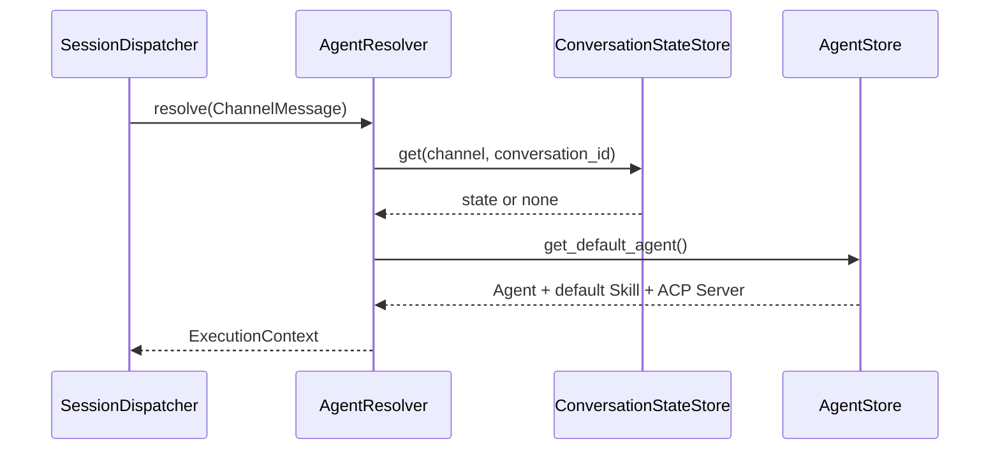
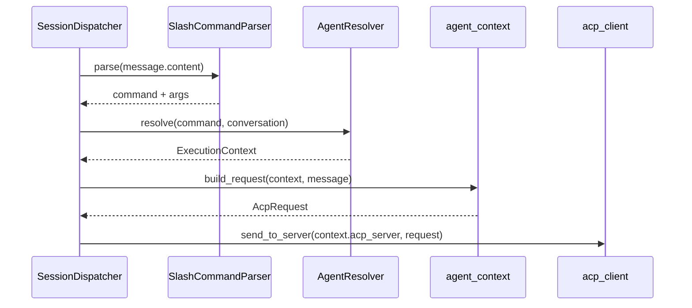
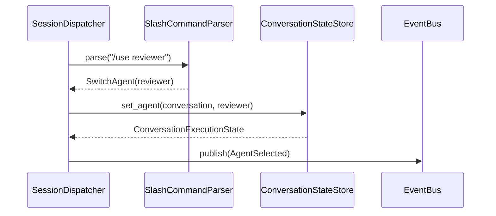
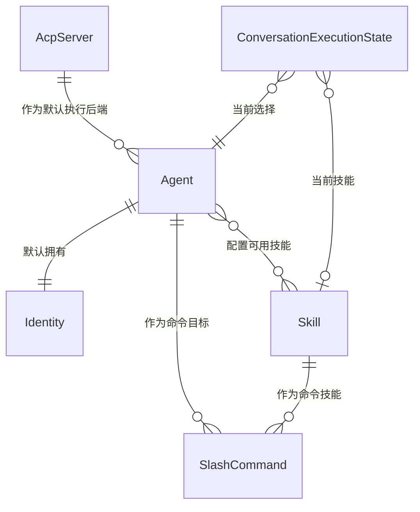

> **Status**: `draft`

# 架构子模块：Agent、Skill 与 SlashCommand

## § 职责定位

Agent 模块是 MindClaw 的 Agent Control Layer。它负责管理用户侧执行模型：Agent、Identity、Skill、Agent-Skill 关联、SlashCommand、AgentResolver 和 ConversationExecutionState。

Agent 模块不负责渠道协议、ACP 协议传输、消息队列调度、legacy RouteRule 或本地工具执行。

## § 核心原则

1. **Agent 是用户选择的执行者**：Agent 表达“谁来处理当前消息”，比 ACP Server 更贴近用户心智。
2. **ACP Server 是执行后端**：Agent 绑定默认 ACP Server，但不拥有模型调用细节。
3. **Identity 归属 Agent**：每个 Agent 默认拥有自己的 Identity，降低首版配置复杂度。
4. **Skill 独立复用**：Skill 独立管理，Agent 与 Skill 多对多关联。
5. **SlashCommand 显式选择**：SlashCommand 只响应用户显式输入，不读取 legacy RouteRule。
6. **ConversationState 隔离会话选择**：会话级 Agent / Skill 状态按 `channel + conversation_id` 隔离。

## § 边界与实体

### 输入

- `save_agent(agent)`：创建或更新 Agent。
- `save_skill(skill)`：创建或更新 Skill。
- `bind_skill(agent_id, skill_id)`：将 Skill 关联到 Agent。
- `save_slash_command(command)`：配置 slash command 到 Agent 或 Agent + Skill 的映射。
- `parse_input(message)`：解析对话输入中的 slash command。
- `resolve_execution_context(message, conversation)`：解析当前消息使用的 Agent、Identity、Skill 和 ACP Server。
- `set_conversation_agent(conversation, agent_id)`：切换当前会话 Agent。
- `set_conversation_skill(conversation, skill_id)`：切换当前会话 Skill。
- `reset_conversation(conversation)`：恢复当前会话默认 Agent / Skill。

### 输出

- `ExecutionContext`：SessionDispatcher 调用 agent_context 前使用的执行上下文。
- `ConversationExecutionState`：当前会话选中的 Agent、Skill 和 ACP session 状态。
- `SlashCommandResult`：命令解析结果，包括执行、切换、恢复默认或错误。
- `RuntimeEvent`：Agent 选择、Skill 选择、命令调用和执行失败事件。

### 核心实体

- **Agent**：用户可选择的执行者，默认拥有 Identity，绑定默认 ACP Server，并关联多个 Skill。
- **Identity**：Agent 的身份、人设和行为约束。
- **Skill**：独立管理的任务能力模板，可被多个 Agent 复用。
- **AgentSkillBinding**：Agent 与 Skill 的多对多关联。
- **AcpServer**：Agent 默认绑定的 ACP 执行后端。
- **SlashCommand**：对话中的显式选择入口，映射到 Agent 或 Agent + Skill。
- **ConversationExecutionState**：按 `channel + conversation_id` 保存当前会话执行上下文。
- **ExecutionContext**：一次消息执行所需的 Agent、Identity、Skill、ACP Server 和会话元数据。

### 错误边界

- Agent、Skill、SlashCommand 不存在或被禁用时，Agent 模块返回执行上下文解析错误。
- Agent 绑定的 ACP Server 不可用时，Agent 模块返回目标不可用错误，不调用 `acp_client`。
- Agent 模块不暴露渠道原始 payload，不处理 ACP 协议错误，不读取 legacy RouteRule。

## § 关键流程

### 默认 Agent 解析流程

### SlashCommand one-shot 执行流程

### 当前会话 Agent 切换流程

### 实体关系

## § SlashCommand 语义

固定控制命令：

- `/help`：查看命令说明。
- `/default`：恢复或设置默认 Agent / Skill。
- `/use <agent>`：切换当前会话 Agent。
- `/skill <skill>`：切换当前会话 Skill。

任意 `/<name>` 可作为显式执行入口：

- one-shot：只影响当前消息，不修改会话状态。
- sticky：通过 `/use` 或 `/skill` 修改当前会话状态。

SlashCommand 不读取 RouteRule，不根据关键词自动选择 Agent。

## § 设计决策与权衡

| 决策问题 | 选择 | 放弃的替代方案 | 理由 |
|---------|------|--------------|------|
| 用户选择的主对象是什么？ | Agent | ACP Server 或 ExecutionRole | Agent 更符合“谁来执行”的用户心智 |
| Identity 如何建模？ | Agent 默认拥有 Identity | Identity 独立复用为主路径 | Agent 1:1 Identity 降低首版配置复杂度 |
| Skill 如何建模？ | Skill 独立管理，Agent-Skill 多对多 | Skill 内嵌在 Agent 中 | 独立 Skill 可跨 Agent 复用 |
| SlashCommand 是否使用 RouteRule？ | 不使用 RouteRule | 复用 RouteRule 匹配逻辑 | SlashCommand 是显式命令，RouteRule 是自动规则路由 |
| SlashCommand 解析在哪里？ | 后端统一解析 | 前端解析后传结构化命令 | 后端解析保证 Desktop UI、CLI、Webhook 语义一致 |
| 会话切换状态如何保存？ | ConversationExecutionState 按 conversation 隔离 | 写入 ChannelMessage | 执行状态是会话状态，不属于消息内容 |

## § 安全边界

- 只能解析和执行已启用、用户可见的 Agent / Skill。
- 禁用 Agent 或 Skill 后不得用于新执行。
- SlashCommand 错误不得回退到 RouteRule 自动路由。
- Agent / Skill 内容默认仅本地保存，不上传 MindClaw 云端。
- 执行元数据必须保留实际使用的 agent_id、skill_id、acp_server_id，便于审计和调试。
