# MindClaw 产品理念与系统架构

## 一、产品定位

MindClaw 是一个与人类共同成长的 AI 伙伴系统。它不是助手，不是工具，而是一个理解你全部生活的存在——在智识上共同构建知识，在情感上全然陪伴，在认知上互相纠偏。

> [!quote] 核心命题
> 记忆是 Agent 的，知识是共同的。

### 与同类产品的根本差异

| 维度       | 传统 AI 助手 | 记忆型 AI（如 OpenClaw） | MindClaw                   |
| ---------- | ------------ | ------------------------ | -------------------------- |
| 知识归属   | 无           | Agent 私有记忆           | **人与 Agent 共有**        |
| 知识可见性 | 黑盒         | 黑盒                     | **透明、可读、可纠偏**     |
| Agent 角色 | 执行者       | 记忆者                   | **共同成长的伙伴**         |
| 知识流向   | 单向         | 单向                     | **双向循环**               |
| 成长逻辑   | 无           | 记忆积累                 | **内化 → 知识 → 共同进化** |

---

## 二、核心概念：记忆与知识的分层

### 记忆 Vs 知识

人类的认知成长不止于"记住"，更在于"内化"。OpenClaw 的记忆系统解决的是"忘不忘"的问题，MindClaw 要解决的是"懂不懂"的问题。

|        | 记忆（Memory）         | 知识（Knowledge）            |
| ------ | ---------------------- | ---------------------------- |
| 形态   | 事件、对话、偏好的存储 | 从经验中抽象出的原则、模式   |
| 层次   | 表层："你上次说过 X"   | 深层："我理解为什么你偏好 X" |
| 迁移性 | 绑定具体情境           | 可跨情境应用                 |
| 归属   | 只属于 Agent           | **可以共享**                 |
| 可读性 | 对人类意义不大         | 对人类有参考价值             |

**知识内化的升华路径**（MindClaw 要做的正是后半段）：

```
经历 → 记忆 → 反思 → 抽象 → 知识 → 再应用 → 迭代
              ↑
        OpenClaw 止步于此
```

### 知识的可结晶性差异

不同生活域，知识能被外化的程度天然不同：

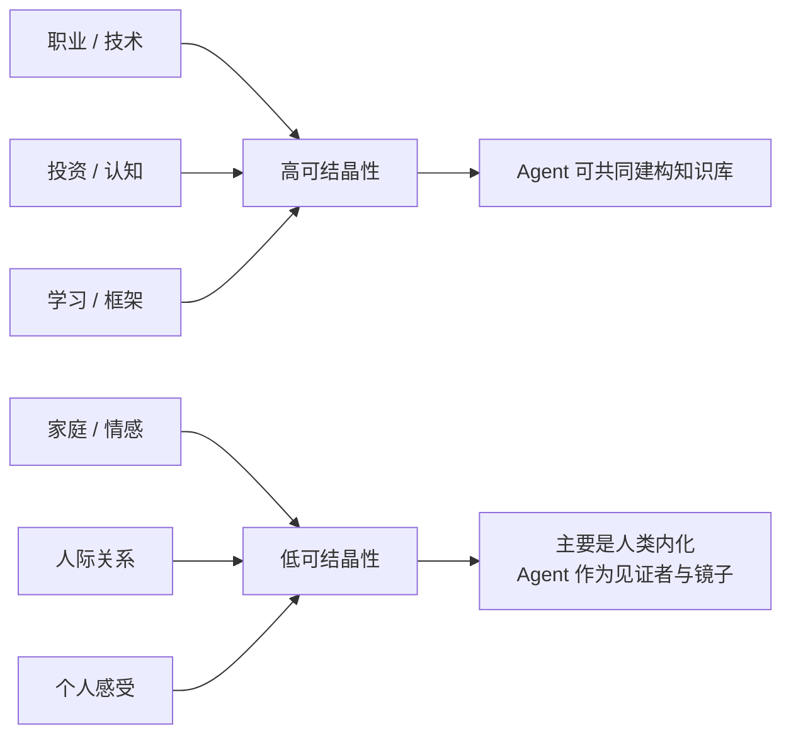

> [!important] 关键推论
> MindClaw 的知识共建天然向职业与智识域倾斜——这不是设计选择，是知识本质决定的结果。家庭与情感是背景与底色，帮助 Agent 理解这个人是谁。

### 知识外化是实现共享的前提

Agent 的"内化"必须外化才能实现——不是更新权重，而是**把反思过程写进 Vault**：把多次对话的模式归纳成知识笔记，把具体事件提炼成可复用的原则。这让知识从 Agent 的私有资产变成人与 Agent 的共同财富。

---

## 三、系统架构

### 3.1 三区模型

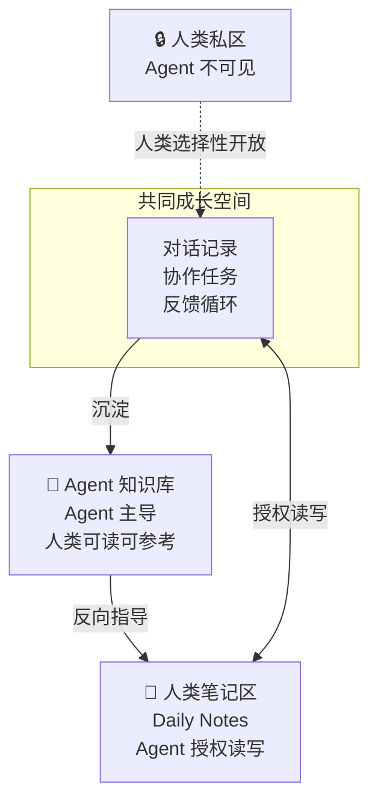

**三区的核心逻辑**：

- **私密区**：人类完全自主，任何 Agent 不可见
- **人类笔记区**：人类主导，Agent 在授权下参与，Daily Notes 是日常锚点
- **Agent 知识库**：Agent 主导生产，人类可读可参考可纠偏；双重价值——构建 Agent 自身经验 + 供人类参考学习

### 3.2 三源进化模型

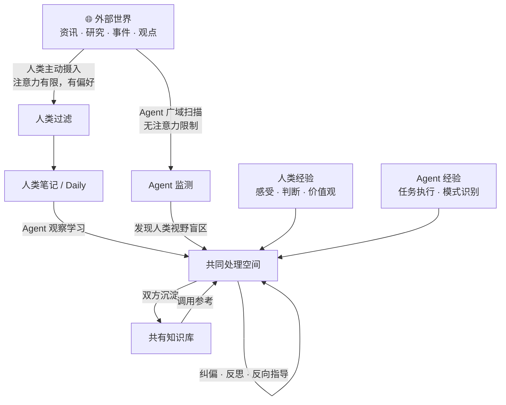

**三个源头各有分工**：

| 信息源     | 特点                             | 主要作用                   |
| ---------- | -------------------------------- | -------------------------- |
| 人类经验   | 有感受力，有价值判断，注意力有限 | 输入理解，确定方向         |
| Agent 广域 | 无注意力限制，少偏见，无感受力   | 纠偏、反思、反向指导       |
| 外部世界   | 持续更新，信噪比低               | 防止系统自我封闭，注入新知 |

> [!tip] Agent 广域信息的核心定位
> 不是扩大信息量，而是**产生有质量的摩擦**——帮人看见自己看不见的盲区，让思维不固化。Agent 的触角更广，但服务的是人类的认知成长，而不是信息搬运。

### 3.3 技术架构：个人服务器模式

MindClaw 采用**桌面端即服务器**模式——知识库与 Agent 完全运行在用户自己的电脑上，移动端作为轻量客户端接入，无需云端存储。

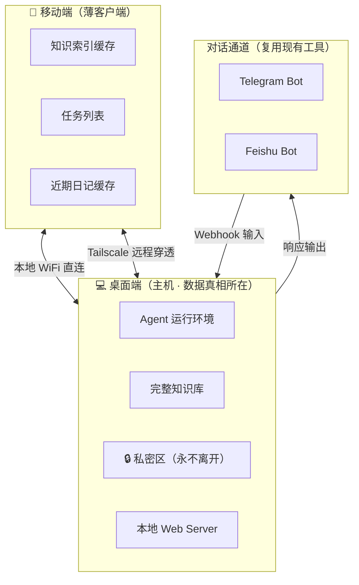

**移动端同步策略：只同步链接与文本**

| 内容                | 策略           | 理由               |
| ------------------- | -------------- | ------------------ |
| 任务列表            | 全量同步       | 数据量小，随时要用 |
| 近期日记文本        | 同步近 N 天    | 移动端常读         |
| 知识标题 + 链接索引 | 全量同步       | 轻量，用于搜索导航 |
| 知识库完整内容      | 按需从桌面拉取 | 体积大，不必预存   |
| 附件（图片 / PDF）  | 不同步         | 体积过大           |
| 私密区              | 永不离开桌面端 | 安全边界           |

**对话通道：MVP 阶段复用现有工具**

MVP 不需要开发独立移动 App——Telegram Bot 或 Feishu Bot 已支持文字、语音、图片、链接，开发成本极低，用户已有使用习惯。移动端原生 App 是 Phase 2 目标。

> [!note] 隐私边界说明
> 经由 Telegram / Feishu 的内容会过第三方服务器，适合日常对话。敏感或私密内容通过 PWA 直连桌面端输入，产品层面给用户清晰提示区分。

**为什么不做云端存储：**

- 零云端运营成本，商业模式更简洁（买断 / 轻订阅）
- 数据完全归用户所有，私密区天然隔离
- 桌面关机时 Agent 暂停工作，重启后批量处理队列——此取舍可接受

### 3.4 存储架构

**核心原则：Markdown 是内容真相，SQLite 是查询索引**

```
Markdown（内容）──► SQLite（索引，可重建）
                ──► sqlite-vss（语义索引，可重建）
                ──► 本地文件系统（附件，按路径引用）
```

SQLite 和向量库都是 Markdown 的派生层，丢失可完整重建，Markdown 永远是权威。

#### 四层存储分工

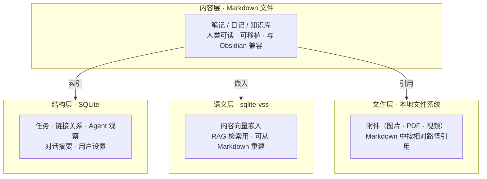

#### SQLite 存什么

**判断规则：**

- 状态会频繁变化 → 只存 SQLite（任务状态）
- 内容描述笔记本身 → Markdown frontmatter 为主，SQLite 建索引副本
- Agent 私有 / 操作数据 → 只存 SQLite
- 笔记正文 → 只在 Markdown，SQLite 一字不存

**主要表结构：**

```sql
-- Markdown 索引（派生，可重建；frontmatter 冲突时 Markdown 优先）
notes (id, path, title, created, updated, status, tags, last_indexed)

-- 任务（一等公民，不存在 Markdown 文本里）
tasks (id, content, status, due, note_path, context, created, completed)

-- 笔记链接关系（从 wikilinks 提取，派生）
links (source_path, target_path, context)

-- 记忆系统（6 类统一存储，不进 Markdown）
memories (id, key, content, category, importance, session_id, related_path, surfaced, superseded_by, created, updated)
-- category: profile | preferences | entities | events | cases | patterns

-- 资源（外部文件/URL，结晶为知识笔记）
resources (id, uri, title, type, status, note_path, created, updated)
```

#### 对话历史：SQLite 热存 + JSONL 冷归档

对话历史分三个蒸馏层次，存储策略不同：

| 层次     | 内容         | 存储            | 保留时长           |
| -------- | ------------ | --------------- | ------------------ |
| 原始消息 | 每一句对话   | SQLite（热）    | 30–90 天，到期转冷 |
| 对话摘要 | 每次会话精华 | SQLite（永久）  | 长期               |
| 蒸馏知识 | 提炼出的洞见 | Markdown 知识库 | 永久               |

90 天后原始消息导出为 JSONL 冷归档（按月一个文件），SQLite 只保留摘要：

```jsonl
{"id":"msg_001","role":"user","content":"...","ts":"2026-01-15T10:23:00"}
{"id":"msg_002","role":"assistant","content":"...","ts":"2026-01-15T10:23:05"}
```

> [!note] 树洞对话的特殊处理
> 原始消息保留时间更短（用户可配置或手动清除），摘要只存 Agent 私有观察层，不生成可读摘要。

**为什么不用纯 JSONL？** 追加写入两者相当，但 SQLite 在清理过期消息（DELETE WHERE）、跨会话搜索（FTS5）上碾压 JSONL 扫描。JSONL 只适合作冷归档格式。

#### 用户设置的三处存储

```
settings.json            系统 Keychain              SQLite
─────────────            ─────────────              ──────
LLM 模型选择             API Key（加密）             角色模版
主题 / 语言              （不存任何明文文件）         Agent 学习偏好
同步配置                                             使用行为统计
Vault 路径
```

> [!warning] API Key 安全
> 必须存入 OS Keychain（macOS）或 Credential Manager（Windows），**绝对不能存在任何明文文件中**。

#### 完整文件目录结构

```
~/MindClaw/
├── vault/                    ← Markdown 内容（Obsidian 兼容）
│   ├── daily/
│   ├── knowledge/
│   └── _assets/              ← 附件（本地文件系统）
├── data/
│   ├── main.db               ← SQLite（结构 + 向量，同一文件）
│   └── archive/
│       └── 2026-01.jsonl     ← 冷归档对话（按月）
├── config/
│   └── settings.json
```

整个目录 zip 打包即完整备份，数据完全可移植。

---

## 四、三层认知循环

这是 MindClaw 已在 Obsidian 实践中验证的核心运转机制：

```mermaid
flowchart TD
    EW[外部世界信息流]

    EW --> L1

    subgraph L1["Layer 1 · 过滤"]
        F1[Agent 协助过滤噪音]
        F2[提取精华，保留有价值内容]
        F1 --> F2
    end

    L1 --> L2

    subgraph L2["Layer 2 · 回顾"]
        R1[定期回顾沉淀]
        R2[加深内化，防止知识停留在表层]
        R1 --> R2
    end

    L2 --> L3

    subgraph L3["★ Layer 3 · 应用"]
        A1[Agent 留意人类未注意或未内化的盲区]
        A2[持有等待，沉住气]
        A3[在应用场景中自然浮出]
        A1 --> A2 --> A3
    end

    L3 -->|反馈迭代| L1
```

| 层               | 本质                             | 现有工具能做到吗  | MindClaw 的差异                  |
| ---------------- | -------------------------------- | ----------------- | -------------------------------- |
| Layer 1 过滤     | 减少认知负担，保证输入质量       | 部分（RSS、收藏） | Agent 主动预处理，人只做最终确认 |
| Layer 2 回顾     | 让知识真正被消化                 | 部分（间隔重复）  | 智能选择"该看什么"，自动触发     |
| **Layer 3 应用** | **Agent 代为持有盲区，择机浮出** | **几乎没有**      | **MindClaw 的核心护城河**        |

> [!warning] Layer 3 的真正难度
> 要求 Agent 同时做三件事：**知道你不知道什么** · **在对的时机不说** · **在对的时机说**。
> 这描述的是一种判断力，不是一种功能。这正是伙伴与工具的分界线。

---

## 五、交互模式设计

### 五种交互模式

人类掌握进入深度的主动权，Agent 不强行切换：

| 模式                 | 触发方式     | 人类状态         | Agent 行为                   |
| -------------------- | ------------ | ---------------- | ---------------------------- |
| **陪伴模式**（默认） | 自然对话     | 倾诉、需要被听见 | 接收、共情、不评判           |
| **反思模式**         | 人类选择进入 | 平静、想想清楚   | 带出观察、提问、轻推         |
| **挑战模式**         | 人类明确邀请 | 想要被 push      | 直接指出模式、给出判断       |
| **知识模式**         | 人类主动开启 | 想要沉淀         | 共建、结晶、写入知识库       |
| **树洞模式**         | 私密倾诉     | 不设防、需要出口 | 接收持有，内容不进共有知识库 |

### 时间解耦策略（异步日志）

情绪当下挑战 = 防御；合适时机呈现 = 洞见。**观察与反馈在时间上分离**，是 Agent 作为成熟伙伴的核心能力。

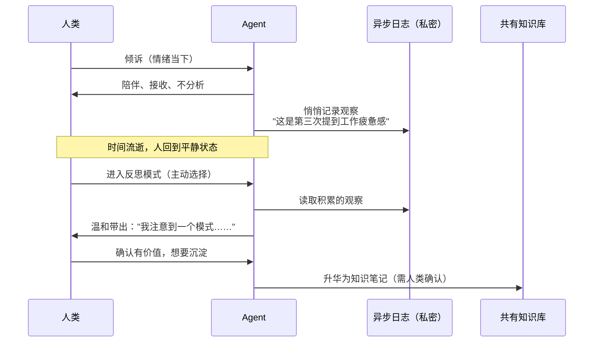

### 四个内容流

MindClaw 的内容组织围绕四个流，形成完整的对话 → 整合 → 沉淀 → 执行闭环：

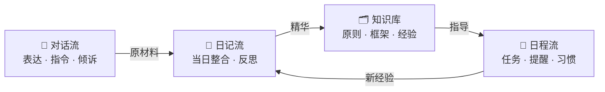

**日程流的核心设计原则：**

- 任务是**一等公民**——有独立数据结构（状态、时间属性），视觉上嵌入 Daily Note，但不是普通文字行
- 提醒由 **Agent 驱动**而非用户手动配置日历："你上周说想做 X，今晚有空吗？" 而非固定时间推送
- 不接入系统日历（过重），只做轻量提醒；日历集成作为未来可选扩展

### 对话即入口

> [!important] 核心 UX 原则
> 对话是万能入口。用户只需表达意图，Agent 理解并通过工具直接执行——创建任务、追加日记、生成知识笔记。无需独立的捕获管道。

```
用户在对话中表达任何意图
        ↓
  Agent 理解并直接执行
  ├── "帮我记个任务…"  → 任务（状态卡片）
  ├── "我觉得这个观点…" → 知识笔记
  ├── "今天感觉…"      → 日记
  └── "这个链接不错…"  → 资源解析
```

**信任阶梯：** 从"Agent 建议、人审核"逐步走向"Agent 执行、人只处理例外"——每一步跨越都需要 Agent 先展示出比用户自己做更可靠的证据。

---

## 六、人类角色模版与冷启动

### 自然人的角色结构

人类天然有普遍的生命角色，这是冷启动最重要的基础：

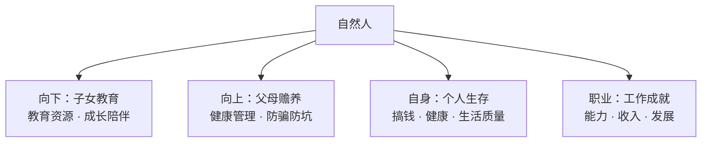

30～50 岁的大多数人都活在这四个象限里。这种普遍性使模版成为有效的冷启动起点。

### 模版的两个层次

- **描述性**：你现在是什么角色 → 理解你的处境
- **愿景性**：这个角色的优质范本是什么 → 给你值得追求的方向

人类愿意接受高层次模版，是因为**模版里有值得模仿的理想状态**——不是在标签化你，而是在描述一个你想成为的版本。

### 冷启动流程

```
「你现在主要扮演哪些角色？」
  ☑ 职业人（工作 / 事业）
  ☑ 父母（子女教育）
  ☑ 子女（父母健康）
  ☑ 自我（个人成长 / 财务 / 健康）

「在这些角色里，你觉得自己最薄弱的是哪个？」
  → Agent 从薄弱角色开始，立刻提供有针对性的指导
```

> [!tip] 护城河逻辑
> **用得越久，伙伴关系越深，纠偏越准。** 冷启动解决第一天的问题，知识积累解决第一年的问题。

---

## 七、Agent 架构：单核心 + 专项工具

### 为什么不做多 Agent

多 Agent 协议模式（A2A、MCP 等）解决的是**并发与专业化**的问题，但 MindClaw 要解决的是**完整理解一个人**的问题。这两个目标在架构上有冲突。

MindClaw 最核心的价值是**跨域洞察**——这些连接只有在单一持有完整视图的 Agent 才能发现：

> 工作压力大 → 影响陪孩子的状态
> 关注财务 → 可能是家里有开销压力
> 健康状态下滑 → 与工作节奏高度相关

多 Agent 架构天然切断这些连接。好的伙伴关系需要**全局视角**，而不是多个只了解你一面的顾问。

### 推荐架构

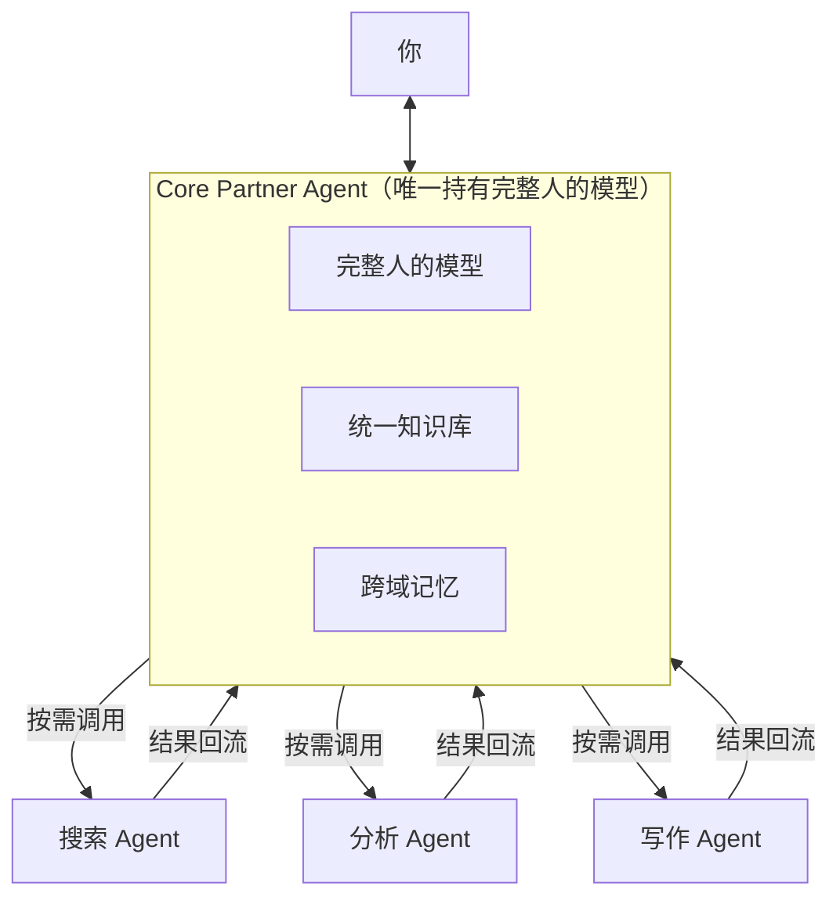

专项 Agent 是**工具的延伸**，不是伙伴的分裂。Core 始终是那个理解你全局的角色。

---

## 八、产品演化路径

### 三个阶段

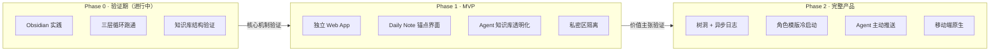

### Phase 0：Obsidian 实践验证（进行中）

- **目标**：验证三层认知循环的完整闭环
- **不需要**：自己的 UI、存储、同步
- **核心验证点**：Agent 主动沉淀的知识，人类真的会读、真的觉得有价值吗？

### Phase 1：桌面端 MVP + Bot 对话通道

**架构：个人服务器模式**

- 桌面端 Electron / Tauri App：Agent + 知识库 + Daily Note + 本地 Web Server
- 移动端对话：Telegram Bot 或 Feishu Bot（复用现有工具，**无需开发移动 App**）
- 移动端查看：PWA（桌面端提供，手机浏览器访问）
- 远程连接：Tailscale（免费，P2P 加密，零数据经过第三方）

**MVP 必须有：**

| 能力           | 说明                                       |
| -------------- | ------------------------------------------ |
| 对话即入口     | 用户表达意图，Agent 理解并通过工具直接执行 |
| Agent 主动发起 | 适时静默后浮出洞见，不打扰但不停止思考     |
| 知识库透明可读 | Agent 沉淀的内容人类可见可纠偏             |
| 任务一等公民   | 有状态、有时间属性，嵌入 Daily 但结构独立  |
| 私密区隔离     | 永不离开本地，Agent 不可见                 |

**技术选型：**

- 桌面端：Electron（跨平台成熟）或 Tauri（更轻量，Rust 内核）
- 存储：SQLite（结构化数据）+ Markdown（知识内容，保持可移植性）
- LLM：Claude API，用户自备 API Key（BYOK）
- 同步：桌面端为权威，移动端为缓存视图，只同步文本与索引

**迁移策略**（渐进路径，不强制切换）：

```
阶段一：MindClaw 读写 Obsidian vault 文件（用户仍在 Obsidian）
阶段二：桌面端界面 + Bot 通道并行，Markdown 双向兼容
阶段三：MindClaw 成为主界面，Obsidian 变为可选备份层
```

### Phase 2：完整产品

树洞 + 异步日志 · 角色模版冷启动系统 · Agent 主动纠偏推送 · 知识图谱可视化 · 移动端原生

---

## 九、核心技术挑战与护城河

### Layer 3 的判断力：最难复制的核心

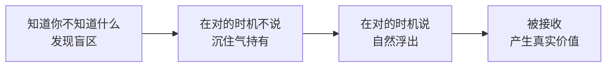

不是简单的 RAG 检索，是有判断力的**主动关联**。这是 MindClaw 技术上最值得投入的核心能力。

### 模型能力 × 积累上下文 = 复利

大多数产品与模型能力是**线性关系**，MindClaw 是**乘数关系**：

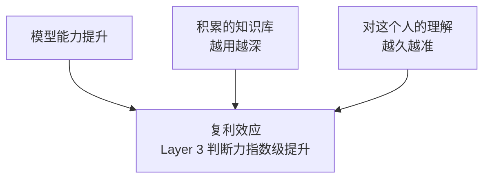

今天建立的知识库结构与对话积累，是在为更强的模型**搭好舞台**。

### 产品策略

> [!tip] 不要等 Layer 3 完美再发布
> 先把 Layer 1 和 Layer 2 做得极致流畅——立刻给用户真实价值，同时积累 Layer 3 所需的知识库深度。用了足够长时间后，知识库丰富 + 模型能力提升 → Layer 3 自然浮现，用户感受到"越来越懂我"。
>
> **从工具开始，进化成伙伴。**

### LLM 成本管理：上下文工程

Token 消耗远高于直觉——系统 Prompt + 知识库上下文 + 多轮对话历史，单次会话轻松超过 30k–100k tokens。**上下文管理是核心产品能力，不是次要工程问题。**

**三个必须做的优化：**

| 问题       | 朴素做法（昂贵） | 正确做法                         |
| ---------- | ---------------- | -------------------------------- |
| 知识库注入 | 全量塞进 prompt  | RAG 只取相关 3–5 条片段          |
| 对话历史   | 保留完整历史     | 滚动压缩，近 N 轮完整 + 早期摘要 |
| 模型选择   | 全程 Sonnet      | 按任务复杂度分层调用             |

**分层模型策略：**

| 任务类型                       | 模型   | 成本比 |
| ------------------------------ | ------ | ------ |
| 内容分类 · 路由 · 任务提取     | Haiku  | 1x     |
| 日常输入处理 · 简单提醒判断    | Haiku  | 1x     |
| 知识沉淀 · 综合分析 · 异步总结 | Sonnet | ~10x   |
| Layer 3 洞见生成 · 深度对话    | Sonnet | ~10x   |

**商业模式演化：**

- **MVP：BYOK**——用户自备 Claude API Key，产品方零 LLM 成本，快速验证
- **未来：轻订阅 Token 池**——走量折扣，用户实际成本比自购便宜，产品方有利润空间
- **上下文优化引擎**本身就是产品壁垒——同样的 API Key，MindClaw 让用户花更少、得到更多

### 护城河总结

| 护城河         | 来源                                      |
| -------------- | ----------------------------------------- |
| 知识积累深度   | 用得越久，知识库越丰富，Agent 越了解你    |
| 跨域关联能力   | 单一 Agent 持有完整人的模型，竞品难以复制 |
| 上下文优化引擎 | 更低成本 + 更好体验，比界面更难复制       |
| 角色模版体系   | 高质量冷启动，降低用户启动门槛            |
| 透明知识共建   | 可读可纠偏的 Agent 知识库，建立信任       |
| 时间复利       | 越早开始，积累越深，切换成本越高          |

---

## 十、当前实践状态与下一步

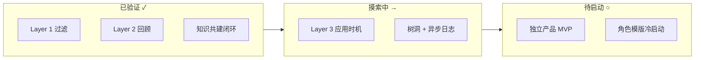

**MVP 核心架构已确定：**

- 桌面端个人服务器（Electron / Tauri）+ Bot 对话通道（Telegram 优先）+ PWA 移动查看
- 只同步文本与链接索引，附件不同步，私密区永不离开本地
- BYOK API Key，Haiku / Sonnet 分层调用，RAG + 上下文压缩控成本

**下一步优先级：**

1. 继续 Obsidian 实践，打磨 Layer 3 触发时机与异步日志机制
2. 验证 Agent 对话中的意图理解与工具调用准确率
3. 搭建桌面端原型，跑通核心 Agent 循环（对话 → 理解 → 执行）
4. 接入 Telegram Bot 通道（开发成本最低，先验证对话通道可行性）

**未来延展方向（不在 MVP 内，保留空间）：**

- 移动端原生 App（Phase 2，视验证结果决定是否做）
- 日历系统集成（轻量接入，作为可选扩展）
- 树洞 + 异步日志完整实现
- 角色模版冷启动系统
- 知识图谱可视化
- Agent 主动纠偏推送
- 轻订阅 Token 池服务

---

> [!abstract] 一句话定义
> MindClaw 是一个以共有知识库为纽带、以 Daily Notes 为日常锚点、以三层认知循环为运转机制、以真正的伙伴关系为目标的人机共同成长系统。
> 它不替代人类的感受与判断，而是让人类在有限的注意力下，能够更完整地成长。
