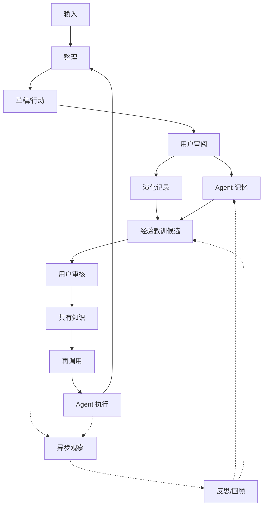

> **Status**: `active`

# MindClaw 产品蓝图

## 文档定位

| 文档类型 | 回答的问题 | 不承载的内容 |
|----------|------------|--------------|
| 产品蓝图 | 产品为什么存在、核心命题是什么、长期演进方向是什么 | 逐项验收标准、接口契约、数据库细节 |
| PRD | 用户能看到什么功能、如何交互、完成标准是什么 | 产品哲学、长期技术路线、底层实现 |
| 架构文档 | 系统如何分层、模块如何协作、数据如何流动 | 市场定位、用户故事、视觉细节 |

## 一、产品定位

MindClaw 是一个**人机知识共建与 Agent 演化工作站**。

它不是单纯的聊天助手，不是只保存文件的笔记工具，也不是任务管理软件。它的核心价值是把人类经验、外部信息、对话过程、Agent 执行经验沉淀到同一个可读、可审阅、可纠偏的知识空间中，让人和 Agent 围绕同一套知识持续协作。

当前产品形态是桌面工作站，操作模式接近 VSCode / Obsidian：

- 左侧活动栏切换工作域
- 左侧面板承载导航、过滤、文件树、会话列表
- 中央多标签内容区承载笔记、资源、Agent 会话
- 右侧上下文区展示大纲、元数据、关联内容
- Agent 贯穿整个工作站，围绕当前内容执行、沉淀、再调用

### 不做什么

- 不以情感陪伴作为主叙事
- 不把任务做成独立的一等业务对象
- 不把 Agent 记忆做成黑盒资产
- 不把聊天窗口作为唯一产品形态
- 不把云端存储作为默认前提

### 一句话定义

MindClaw 是一个以 Markdown 共有知识库为真相源、以桌面工作站为操作界面、以 Agent 演化记录为反馈机制的人机知识共建系统。

---

## 二、核心命题

### 2.1 记忆是 Agent 的，知识是共同的

Agent 记忆是 Agent 为了后续判断和行动而维护的内部上下文。它可以包含未完全确认的事实、偏好、观察和工作经验，但不能成为产品价值的唯一载体。真正可持续的价值必须外化为人类可读、可审阅、可纠偏的知识。

| 维度 | 记忆 | 知识 |
|------|------|------|
| 形态 | 事件、偏好、观察、工作经验 | 原则、模式、方法、判断 |
| 归属 | Agent 私有或系统内部 | 人和 Agent 共有 |
| 状态 | 可暂存、可过期、可降权 | 稳定、可引用、可复用 |
| 可信度 | 可以是假设 | 需要确认或稳定验证 |
| 纠偏方式 | 通过反馈修正、遗忘、降权 | 人类可直接审阅和修正 |
| 产品责任 | 支撑行动上下文 | 承载共同真相 |

### 2.2 Agent 的演化必须可审阅

MindClaw 不假设 Agent 通过神秘的黑盒记忆自然变好。Agent 的演化必须留下明确证据：

- 它基于哪些材料形成判断
- 它执行了什么动作
- 哪些判断被用户确认
- 哪些判断被用户否定
- 哪些失败被修正为新的工作方法
- 哪些经验教训被沉淀为可再次调用的策略

因此，Agent 的演化不是“模型自己变聪明”，而是**Agent 记忆、知识空间、执行经验、用户反馈共同形成的可追踪演化过程**。

### 2.3 输入即入口

对话是最高自由度的入口，但不是唯一入口。

MindClaw 支持多种输入方式：

- 直接编辑 Markdown
- 在 Daily Note 中记录
- 通过 Inbox 捕获和处理待审核材料
- 在 Agent 会话中表达意图
- 从外部资源提取信息
- 从执行任务中产生经验

所有入口都必须回到同一个闭环：**输入 → Inbox 待处理 → 整理 / 草稿 / 行动 → 用户审阅 → 记忆与演化记录 → 经验教训候选 → 共有知识 → 再调用**。异步观察是这个闭环的旁路信号源，不是所有内容沉淀的必经阶段。

Inbox 处理完成后，内容应进入合适的知识位置、Agent 资产或用户指定去向；没有明确归属或用户选择暂不沉淀时，才保留为归档。

---

## 三、共享知识空间

### 3.1 空间分区

MindClaw 的知识空间分为三类：

| 空间 | 主导者 | Agent 可见性 | 作用 |
|------|--------|--------------|------|
| 人类笔记区 | 人类 | 授权可见 | Daily、项目笔记、知识草稿 |
| 共有知识库 | 人 + Agent | 可见 | 原则、框架、方法、复盘、可复用知识 |
| 私密区 | 人类 | 不可见 | 不进入 Agent 上下文的私人材料 |

Agent 知识沉淀不另起一个不可读黑盒。凡是会影响长期行为、判断和建议的内容，默认进入可审阅空间；确实不能公开的内容，只能作为私有观察保留，并受更短生命周期和更强清理规则约束。私密区在产品上体现为当前 Vault 下的 `private/` 文件夹，而不是另一套数据库或知识空间。

共有知识库可以按主题、项目或用户规则组织。主题分类服务于人类浏览和 Agent 召回，但不要求每篇知识维护复杂元数据；轻量 `tags`、`overview` 与目录位置共同承担知识定位。

### 3.2 知识来源

共有知识库由三类输入共同形成：

| 来源 | 贡献 | 风险 | 处理方式 |
|------|------|------|----------|
| 人类经验 | 价值判断、真实情境、方向感 | 注意力有限、主观偏差 | Agent 帮助整理和反思 |
| 外部世界 | 新信息、研究、案例、资料 | 信噪比低、过载 | Agent 帮助过滤和提取 |
| Agent 经验 | 执行记录、失败修正、模式识别 | 误判、幻觉、过度泛化 | 人类审阅后沉淀 |

### 3.3 内容真相

MindClaw 采用 **Markdown-first** 的内容原则。凡是需要人类审阅、纠偏、迁移、长期保留和复用的内容，都必须以 Markdown + Frontmatter 作为真相源；索引、查询、排序和召回能力只能作为辅助层。

核心原则：

- 笔记正文只存在 Markdown
- 任务以 Markdown checklist 表达
- Frontmatter 承载知识索引，不只是展示用元数据
- Agent 记忆、旁路观察、记忆更新建议、演化记录和经验教训候选以可审阅 Markdown 文档形态保存
- 索引和召回结果必须能从 Markdown 重建
- 私密区路径由后端强制隔离

### 3.4 Frontmatter 知识索引

Markdown Frontmatter 是 Agent 分层加载知识的天然索引层。它只保留人类和 Agent 都容易维护、容易读取的字段，让 Agent 在不读取全文的情况下先判断一篇笔记是否相关、是否需要深读。

知识笔记采用三层加载：

| 层级 | 字段 / 内容 | 作用 | Agent 使用方式 |
|------|-------------|------|----------------|
| 索引层 | `tags` | 快速路由和过滤 | 先筛选候选笔记 |
| 概览层 | `overview` + `confidence` | 用少量文本说明笔记核心内容，并标记可信程度 | 判断是否需要打开正文和排序注入 |
| 正文层 | Markdown Content | 承载完整论证、案例、方法、反例 | 只在相关时深度加载 |

这一分层让知识库同时服务两类读者：

- 人类读者：直接阅读 Markdown 正文和结构化 Frontmatter
- Agent：先读索引和概览，再按需加载正文，减少上下文浪费

Frontmatter 的基础字段：

```yaml
---
title: 笔记标题
tags: [agent-memory, knowledge-design]
overview: 一句话到一小段，说明这篇笔记解决什么问题、核心判断是什么。
confidence: 0.8
---
```

`overview` 不是摘要装饰，而是 Agent 的预读入口；`tags` 不是复杂分类系统，而是轻量知识路由入口；`confidence` 是用户和审核流程共同维护的单一置信度，创建、修改和审阅时可以调整，并在 Agent 召回时参与重排。正文不是默认全量注入上下文，而是在索引层和概览层判断相关后再加载。

### 3.5 Agent 演化资产

普通知识笔记只需要 `tags`、`overview` 和单一 `confidence`，避免人为维护复杂分类和多维评分。Agent 演化资产不同，它们承载 Agent 为什么观察、记住、修正、拒绝或沉淀某些内容，因此必须具备更强的可审阅性。

Agent 演化资产包括：

- 旁路观察
- 记忆更新建议
- Agent 记忆
- 演化记录
- 经验教训候选

这些资产需要满足四个产品要求：

- 用户能打开并阅读它们，而不是只能在系统内部被调用
- 用户能确认、拒绝、修正、删除或降权它们
- Agent 使用它们时能说明来源和使用边界
- 它们能随知识库迁移，不因索引或运行时数据丢失而消失

---

## 四、Agent 演化机制

本章的基本判断是：**旁路观察、演化路径、经验教训，是 Agent 智能演进的正确产品路径**。它提升的不是底层模型能力，而是 Agent 系统的外部状态、证据链、可调用策略和用户匹配度。

这个模型成立的原因：

- 旁路观察让学习从主任务链路中解耦，Agent 执行时不需要分心维护长期状态
- 演化路径让记忆和策略变化可追踪、可审计、可回滚
- 经验教训把被确认的失败、纠正和成功模式转化为可复用策略
- 用户审核把 Agent 自我改进限制在可信边界内，避免黑盒记忆污染长期知识

因此，Agent 的演进不是“自动变聪明”，而是通过**观察候选、状态变更、证据记录、经验提炼、知识确认、后续再调用**形成可控闭环。

### 4.1 Agent 记忆机制

Agent 记忆不是知识库，也不是聊天记录。它是 Agent 为了后续判断和行动而维护的内部上下文。它必须是可审阅资产，而不是隐藏在数据库中的黑盒状态。

Agent 记忆采用“归属 + 类型”的二维分类。归属决定可见性和使用边界，类型决定组织方式和升级路径。

归属维度：

| 归属 | 含义 | 使用边界 |
|------|------|----------|
| `user` | 关于用户、用户环境、用户偏好的记忆 | 用户可查看、可修改、可删除 |
| `agent` | 关于 Agent 自身执行、判断、失败、方法的记忆 | 可审计，影响 Agent 后续行动 |
| `shared` | 已从记忆升级为共有知识的稳定内容 | 人和 Agent 都可引用和复用 |

类型维度：

| 类型 | 说明 |
|------|------|
| `profile` | 用户或工作空间的稳定背景 |
| `preference` | 稳定偏好、边界、默认行为要求 |
| `entity` | 人物、项目、组织、工具、知识对象 |
| `event` | 决策、里程碑、一次重要反馈或执行结果 |
| `observation` | 未确认的观察假设 |
| `case` | 具体案例，包含情境、行动、结果 |
| `pattern` | 多次案例中抽象出的模式 |
| `procedure` | 可复用的处理流程或工作方法 |
| `constraint` | 禁止事项、边界、强约束 |

MVP 展示层只暴露四类，避免让用户维护过细分类：

| 展示分类 | 对应内部类型 |
|----------|--------------|
| 用户背景 | `profile` / `entity` |
| 用户偏好 | `preference` / `constraint` |
| 观察假设 | `observation` / `pattern` |
| Agent 经验 | `case` / `pattern` / `procedure` |

`shared` 不再是 Agent 的私有记忆，而是 Agent 可调用的共同知识。它仍保留在记忆索引中，目的是让 Agent 在行动时能快速找到已确认的稳定结论。

Agent 记忆的边界：

- 记忆可以影响低风险建议，不能直接成为长期知识
- 未经确认的观察只能保持为假设
- 稳定、可复用、被确认的记忆可以生成经验教训候选；确认后进入共有知识，记忆文档只保留触发条件、短摘要和引用
- 被否定、过期或不再适用的记忆必须能被遗忘、修正或降权
- 关键记忆变化必须形成 Agent 演化记录

### 4.2 异步观察与反思回顾

异步观察不是核心闭环的必经步骤，也不是最终沉淀机制，而是反思/回顾机制的旁路输入。

Agent 不需要在所有输入发生时立刻给出判断。很多高价值信号需要先作为候选暂存，等任务结束或周期回顾时再判断是否成立。异步观察只能生成候选，不直接改写共有知识，也不直接成为稳定记忆。

| 机制 | 作用 | 产物 | 稳定性 |
|------|------|------|--------|
| 异步观察 | 捕捉值得回看的信号 | 观察候选 | 不稳定 |
| 轻量回顾 | 在任务结束时检查本次纠正、失败、偏好变化 | 记忆更新建议、经验教训候选 | 半稳定 |
| 周期回顾 | 汇总一段时间内重复出现的模式 | 记忆升级、降权、删除建议 | 半稳定 |
| 演化记录 | 记录记忆或策略为什么改变 | 证据链 | 稳定可审计 |
| 经验教训候选 | 提炼以后类似情况怎么做 | 待审核规则、方法、反例 | 待确认 |

反思/回顾负责回答五个问题：

- 哪些观察成立
- 哪些 Agent 记忆需要更新
- 哪些判断被用户否定
- 哪些失败需要形成约束
- 哪些模式可以提炼为经验教训

反思/回顾输出的是建议和候选。建议、候选和演化记录必须先进入可审阅队列；只有经过用户确认或后续验证的内容，才能成为稳定记忆或进入共有知识库。

### 4.3 触发与产物

旁路观察、演化路径和经验教训不作为用户每天手动调用的功能，而是由输入、执行、反馈和回顾事件触发。以下名称是产品概念，不是数据库表或接口契约。

| 触发信号 | 判断问题 | 直接产物 | 用户可见结果 |
|----------|----------|----------|--------------|
| 用户明确要求记住 | 这是稳定偏好、背景、约束，还是一次性任务信息 | `MemoryUpdateProposal` | 待确认或已确认的 Agent 记忆 |
| 用户纠正 Agent | Agent 哪个判断、做法或默认策略需要改变 | `MemoryUpdateProposal` + `EvolutionLog` | 记忆修正记录、演化路径条目 |
| 用户否定候选 | 哪个观察、记忆或经验教训不成立 | 候选拒绝记录 + 可选 `EvolutionLog` | 被拒绝原因、后续不再引用 |
| 命令、工具或执行失败 | 这是偶发错误、工具约束，还是可复用失败模式 | `ObservationCandidate` 或 `case` 记忆 | 待回顾的失败案例 |
| 失败被修复 | 修复方法是否可复用，是否改变后续工作方式 | `LessonCandidate` + 可选 `EvolutionLog` | 待审核经验教训，确认后进入记忆或共有知识 |
| 任务结束 | 本次任务是否产生偏好变化、失败修正、可复用流程 | 轻量回顾结果 | 记忆建议、经验教训候选 |
| 周期回顾 | 多次事件中是否出现重复模式 | `pattern` 记忆、`LessonCandidate`、降权或删除建议 | 回顾面板中的批量审核项 |
| 用户确认经验教训 | 这条策略是否应进入共同维护的长期知识 | Markdown 知识文档 + 记忆引用 | 共有知识库文档、可再调用策略 |
| 再调用命中 | 当前任务是否需要引用既有记忆、经验或知识 | 上下文注入或相关知识提示 | Agent 明确说明依据的记忆或知识 |

这些产物形成三类用户能理解的结果：

- **待审核项**：观察候选、记忆更新建议、经验教训候选、知识草稿
- **证据链**：演化路径记录 Agent 为什么新增、修正、降权或删除某条记忆和策略
- **可再调用资产**：已确认记忆、共有知识文档、可复用工作方法或 Skill

Agent 使用这些结果时必须遵守两个边界：未确认观察只能作为低置信度参考；已确认知识和经验教训必须优先于未确认记忆。所有引用都必须能回到对应 Markdown 文档和来源证据。

### 4.4 Agent 演化记录

Agent 演化记录是记忆变化和策略变化的证据链。它回答的不是“以后怎么做”，而是“Agent 为什么变成现在这样”。

演化记录包含：

| 类型 | 记录内容 | 用途 |
|------|----------|------|
| 触发事件 | 哪次输入、执行或反馈触发变化 | 保留来源 |
| 原判断 | Agent 当时的判断或行为 | 记录被修正对象 |
| 用户反馈 | 用户确认、否定、补充的内容 | 形成纠偏依据 |
| 记忆变更 | 哪条记忆被新增、修正、降权或删除 | 解释当前状态 |
| 影响范围 | 只影响当前任务，还是影响某类场景 | 控制泛化边界 |
| 关联材料 | 相关笔记、会话、知识草稿 | 支持回溯 |

演化记录是过程证据，不等于经验教训。它可以长期保留，用于审计 Agent 行为如何变化。

### 4.5 经验教训

经验教训是从 Agent 记忆、演化记录和用户反馈中提炼出的可复用策略。它回答的是“以后遇到类似情况应该怎么做”。

经验教训包含：

| 字段 | 说明 |
|------|------|
| 适用场景 | 这条经验在哪类任务中生效 |
| 规则 | 后续遵循的做法 |
| 反例 | 不适用或容易误用的情况 |
| 触发条件 | 什么时候应调用这条经验 |
| 禁止事项 | 明确不能再重复的错误 |
| 来源记录 | 由哪些演化记录提炼而来 |
| 置信度 | 0.0-1.0 的单一置信度，配合状态表达已确认、待验证或不再使用 |

经验教训分为两个状态：

| 状态 | 产品形态 | 含义 |
|------|----------|------|
| 候选态 | 可审阅候选文档 | 从记忆、执行失败、用户反馈或演化记录中生成，允许编辑、拒绝、合并 |
| 确认态 | Markdown 共有知识库 | 经用户确认或后续验证后形成稳定文档，成为人和 Agent 共同维护的知识 |

演化记录不能自动等于经验教训。只有满足以下条件之一，才可以生成经验教训候选：

- 用户明确确认
- 多次类似事件重复出现
- 一次高风险错误被明确纠正
- 已在后续任务中验证有效

高价值经验教训经确认后进入共有知识库，成为人和 Agent 都可以复用的稳定知识。Agent 记忆中只保留这条知识的索引、触发条件和引用路径，不再重复保存完整正文。

### 4.6 审核与沉淀边界

Agent 记忆、演化记录、经验教训候选和共有知识承担不同职责，必须分开审核和使用。

| 对象 | 产品角色 | 用户操作 | 写入规则 |
|------|----------|----------|----------|
| Agent 记忆 | 行动上下文 | 查看、修正、遗忘、降权、确认 | 可以影响 Agent 后续行动，不直接等同于长期知识 |
| 演化记录 | 证据链 | 查看、补充备注、标记错误 | 保留 Agent 判断和策略变化的原因 |
| 经验教训候选 | 待审核策略 | 审核、编辑、拒绝、合并、确认 | 未确认前不进入共有知识库 |
| 确认后的经验教训 | 共有知识 | 像普通知识文档一样编辑、重组、引用 | 承载共同真相，Agent 记忆只保留引用 |

审核流程：

```text
输入 / 执行结果 / 用户反馈
    │
    ├── 生成或修正 Agent 记忆
    ├── 追加 Agent 演化记录
    └── 生成经验教训候选
              │
              ▼
        用户审核 / 编辑 / 拒绝 / 合并
              │
              ▼
        写入 Markdown 共有知识库
              │
              ▼
        Agent 记忆保留引用，用于后续再调用
```

这意味着可审计资产和确认后的共同知识都必须对用户可见、可迁移、可纠偏。用户可以修改记忆和候选；演化记录默认保留原始事实，只允许追加备注、纠错标记或关联新的修正记录。

### 4.7 Agent 行为策略

Agent 行为不依赖单一固定模式，而由四个策略维度组合：

| 维度 | 取值 | 说明 |
|------|------|------|
| 可见性 | 共有 / 私密 / Agent 私有观察 | 决定内容能进入哪里 |
| 写入权 | 建议 / 待确认写入 / 自动写入 | 决定 Agent 能否改动 Vault |
| 反馈强度 | 接收 / 反思 / 挑战 | 决定 Agent 如何表达判断 |
| 工具权限 | 只读 / 可写 / 可执行 | 决定 Agent 能调用哪些能力 |

这些维度共同决定 Agent 在一次操作中的边界、权限与表达方式。

### 4.8 核心闭环



这个闭环比“聊天记录越来越多”更重要。聊天只是输入形式；整理、行动和用户审阅才是知识沉淀的主线。Agent 记忆负责行动上下文，演化记录负责保留变化证据，经验教训候选负责承接可复用策略，共有知识负责承载共同真相。异步观察和反思/回顾只提供旁路信号与候选建议，不能绕过用户审核直接写入长期知识。

---

## 五、桌面工作站形态

MindClaw 的桌面界面采用知识工作站形态，而不是聊天页形态。

### 5.1 工作台骨架

| 区域 | 职责 |
|------|------|
| 活动栏 | 切换 Daily、Inbox、Vault、Private、Agent、Settings 等工作域 |
| 左侧面板 | 展示当前工作域的导航、过滤、文件树、会话列表 |
| 中央内容区 | 多标签打开笔记、资源、搜索结果、Agent 会话 |
| 右侧上下文区 | 展示 Outline、Frontmatter、Relevance |
| 状态栏 | 展示保存、索引、Agent 执行等运行状态 |

### 5.2 一级工作域

| 工作域 | MVP 定位 |
|--------|----------|
| Daily | 每日输入、复盘、checklist 的锚点 |
| Inbox | 捕获、外部解析结果和待审核材料的处理集散地 |
| Vault | 全量 Markdown 知识库 |
| Private | Agent 不可见的私密空间 |
| Agent | 会话、上下文执行、结果回写 |
| Settings | Vault、模型、权限、私密边界配置 |

MVP 不把 Graph、MCP、Cron、完整记忆分析 UI 做成主功能。第一阶段只提供 Agent 记忆的查看、修正、遗忘能力；更复杂的记忆统计、关系分析和批量治理属于后续能力面板。

### 5.3 内容工作对象

中央内容区以“可打开对象”为核心：

- Markdown 笔记
- Daily Note
- Private 笔记
- Agent 会话
- Source 资源预览
- 搜索或过滤结果
- Agent 生成的待审阅知识草稿
- Agent 演化记录条目
- Agent 记忆条目

多标签的意义是保留工作上下文。用户可以同时打开日记、参考笔记、资源、Agent 会话和待审阅草稿。

### 5.4 右侧上下文

右侧上下文区默认聚焦三件事：

- **Outline**：当前文档结构
- **Frontmatter**：当前文档的标签和概览
- **Relevance**：相关笔记、反向链接、语义关联、可调用经验

Tasks 不作为固定右侧主面板。任务是 Markdown checklist 的派生视图，可通过过滤、搜索或 Agent 查询呈现。

---

## 六、MVP 边界

### 6.1 MVP 要验证的事情

MVP 只验证七个问题：

1. 用户能否把 MindClaw 当作主要 Markdown 工作台使用
2. Daily / Inbox / Vault 是否能形成稳定输入与待处理流
3. Agent 能否基于当前内容完成总结、提炼、改写、生成知识草稿
4. Agent 生成的知识能否被用户审阅、确认、修正
5. Agent 记忆能否被查看、修正、遗忘，或作为知识候选进入审核
6. Agent 执行经验能否经过轻量回顾形成演化记录，并生成可审核的经验教训候选
7. Private 边界是否可信，Agent 是否无法读取私密区

### 6.2 MVP 范围内

- 桌面工作站 Shell
- Markdown Vault 浏览与编辑
- Daily Note
- Inbox 捕获、待处理审核与分流
- Private 区隔离
- Agent 会话
- 当前内容上下文注入
- Agent 生成知识草稿
- 人类审阅后写入共有知识库
- Agent 记忆的查看、修正、遗忘
- 任务结束后的轻量回顾与观察候选生成
- Agent 演化记录和经验教训候选的最小可用形态
- 基于 checklist 的轻量任务索引

### 6.3 MVP 范围外

- 移动端原生 App
- PWA 移动查看
- Telegram / Feishu Bot
- 知识图谱可视化
- MCP 市场或完整 MCP 管理
- Cron 编排 UI
- 完整记忆分析与批量治理 UI
- 日历系统集成
- 多 Vault 支持
- 独立任务管理系统

这些能力不是被否定，而是不用于验证第一阶段核心假设。

### 6.4 成功标准

MVP 成功不是“功能很多”，而是以下行为稳定发生：

- 用户愿意在 MindClaw 中写 Daily 和知识笔记
- 用户愿意让 Agent 基于当前内容生成知识草稿
- 用户会审阅并修正 Agent 生成的知识
- 用户能理解并修正 Agent 记忆
- 用户会审核、确认或拒绝经验教训候选
- Agent 的失败和修正能被记录、审核，并影响后续行为
- Private 区的边界清晰可信

---

## 七、演进路线

### Phase 0：Obsidian 实践验证

目标是验证知识共建闭环：

- 什么材料值得沉淀
- 什么内容会被用户回看
- Agent 的哪些观察有价值
- 哪些反馈强度会被接受
- 哪些知识结构适合长期复用

### Phase 1：桌面工作站 MVP

目标是把验证过的知识工作流产品化：

- 工作站 Shell
- Markdown Vault
- Daily / Inbox / Private
- Agent 当前内容上下文执行
- 知识草稿审阅
- Agent 记忆管理
- Agent 演化记录

### Phase 2：扩展能力

在核心闭环稳定后扩展：

- Bot 或移动端输入通道
- PWA 或移动端查看
- 知识图谱
- MCP / Skills 管理
- Cron / 异步任务编排
- 更完整的 Agent 记忆分析与批量治理 UI
- 跨设备同步策略

### Phase 3：知识网络与 Agent 生态

当个人知识空间和 Agent 演化记录足够稳定后，再考虑更开放的生态能力：

- 多知识域模板
- 可迁移的 Agent 工作方法
- 可共享但可脱敏的知识包
- 多设备协作
- 第三方工具深度集成

---

> [!abstract] 最终目标
> MindClaw 要构建的不是更会聊天的助手，而是一个人和 Agent 可以共同维护、共同修正、共同复用的知识空间。Agent 在这个空间中执行、犯错、修正、沉淀，并通过可审阅的演化记录和经验教训变得更可靠。
