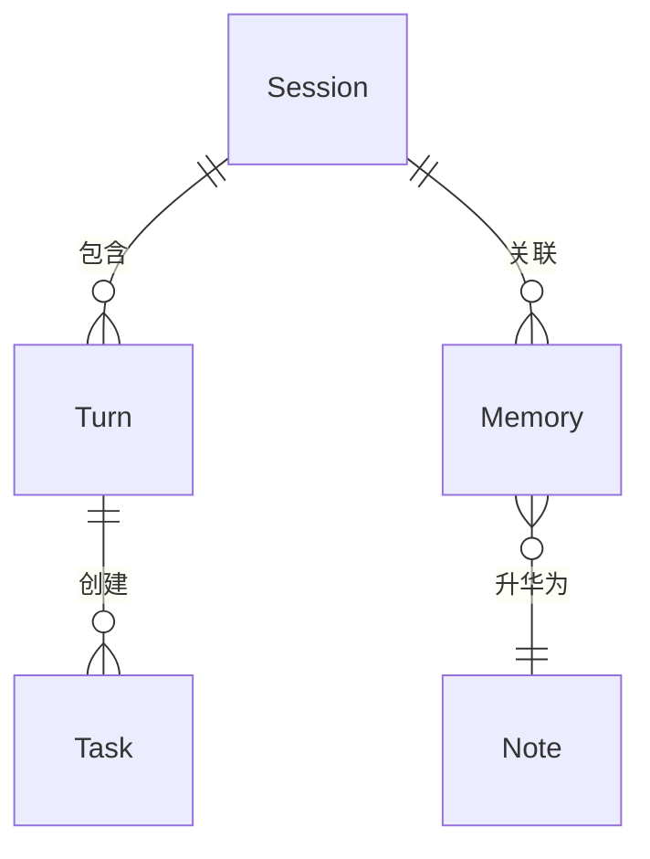

> **Status**: `active`
>
> 本文档描述 MindClaw 系统的全局架构设计。涉及 ≥2 个模块的代码变更时，需检查本文档是否仍然准确。

# MindClaw 系统架构总览

MindClaw 的核心命题是"记忆是 Agent 的，知识是共同的"，为个人用户提供本地 AI 知识管理应用，支持对话、笔记、任务三大核心场景，所有数据在设备本地处理，不经过第三方服务器。

---

## § 系统目标与约束

**系统定位**：MindClaw 为个人用户提供一个跨通道（桌面、Telegram、飞书）的 AI 助手，助手通过自然语言帮助用户管理知识笔记和任务，保留对话记忆。

**核心约束**（每条均可验证）：

1. 所有业务逻辑在 Rust Services 层执行，React 前端不持有业务逻辑，Tauri Plugin 仅桥接 OS 能力。
2. API Key 等敏感信息存储在 OS Keychain，不以任何形式明文写入磁盘文件。
3. Agent 对文件系统的写操作仅限 `vault_path` 范围，PathGuard 强制拒绝越界路径请求。
4. 同一 `session_key` 的消息串行处理，Session Lock 保证同一会话无并发执行。
5. AgentRunner 不持有 Session、MessageBus 或任何业务基础设施依赖，只通过 AgentRunSpec 接收输入。

---

## § 核心设计原则

**1. 业务层与执行层分离**
AgentLoop 不嵌入 LLM 迭代逻辑，AgentRunner 不感知业务层；AgentHook 作为唯一桥梁。
理由：AgentRunner 可被子代理、CLI 命令、定时任务无差别复用，无需携带业务基础设施。

**2. 数据所有权单一**
每份数据只有一个 Module 拥有写权限；其他 Module 通过该 Module 的接口读取。
理由：消除跨模块写竞争，统一一致性保证边界。

**3. 通道无关性**
AgentLoop 通过 MessageBus 收发消息，不直接引用任何 Channel 实现。
理由：Desktop、Telegram、Feishu 三个通道可独立启用/禁用，AgentLoop 无需感知差异。

**4. 人类主权**
知识笔记以 Markdown 文件为真相源，SQLite 仅存储索引。
理由：用户可在工具之外直接编辑文件，数据不被应用锁定；工具重建索引即可恢复。

**5. 渐进式上下文**
上下文按稳定性分层注入：Core 层缓存稳定，Dynamic 层每次请求重新组装，User 层每次请求唯一。
理由：Core 层支持 LLM KV-cache 复用，降低 token 成本；Dynamic 层保持上下文相关性。

---

## § 关键设计决策

| 决策问题 | 选择 | 放弃的替代方案 | 理由 |
|---------|------|--------------|------|
| AgentLoop 是否直接包含 LLM 迭代逻辑？ | 抽取为独立 AgentRunner | 单层 Agent 内部嵌入循环 | Runner 无状态，子代理、CLI、Cron 可直接复用，无需携带 MessageBus 等依赖 |
| Channel 如何与 Agent 通信？ | MessageBus 异步队列 | Channel 直接调用 Agent 方法 | 解耦两侧生命周期，支持背压控制，避免 Channel 阻塞 Agent 执行 |
| 知识笔记的真相源是什么？ | Markdown 文件（`vault/`） | SQLite 为真相源，文件为导出 | Markdown 对用户透明，文本编辑器可直接操作，Agent 崩溃不丢数据 |
| 密钥如何存储？ | OS Keychain | tauri-plugin-stronghold 文件加密 | OS Keychain 由操作系统管理，无需应用维护加密文件，生命周期更简单 |
| Agent 文件访问如何限制？ | PathGuard 路径沙箱 | Tauri 文件系统权限 | PathGuard 在 Rust 层强制，细粒度到 vault_path，私有区无需 Tauri 权限参与 |

---

## § 边界划分

### 模块层级

```
┌─────────────────────────────────────────────────────┐
│  Channel 层                                          │
│  Desktop（Tauri）· Telegram Bot · 飞书 Bot           │
│  职责：接收用户输入，推送 Agent 响应                  │
└───────────────────┬─────────────────────────────────┘
                    ↕  InboundMessage / OutboundMessage
┌───────────────────┴─────────────────────────────────┐
│  MessageBus                                          │
│  职责：解耦 Channel 与 AgentLoop 的双向异步队列       │
└───────────────────┬─────────────────────────────────┘
                    ↕
┌───────────────────┴─────────────────────────────────┐
│  AgentLoop（业务编排层）                              │
│  职责：会话管理、上下文构建、记忆整合、流式分发        │
└───────────────────┬─────────────────────────────────┘
                    ↕  AgentRunSpec / AgentRunResult
┌───────────────────┴─────────────────────────────────┐
│  AgentRunner（纯执行层）                              │
│  职责：LLM 迭代循环、工具执行、无状态可复用           │
└────────┬──────────────────────────┬─────────────────┘
         ↕                          ↕
┌────────┴───────┐       ┌──────────┴──────────────────┐
│  Providers     │       │  Tools                       │
│  职责：LLM API │       │  职责：文件、搜索、MCP、Skills│
│  适配与调用    │       │                              │
└────────────────┘       └──────────────────────────────┘
         ↕                          ↕
┌─────────────────────────────────────────────────────┐
│  Services 层                                         │
│  职责：Task、Knowledge、Daily 三大业务逻辑            │
└───────────────────┬─────────────────────────────────┘
                    ↕
┌───────────────────┴─────────────────────────────────┐
│  Storage 层                                          │
│  SQLite（索引）· Markdown vault（真相源）             │
│  OS Keychain（密钥）                                 │
│  职责：数据持久化，不含业务逻辑                       │
└─────────────────────────────────────────────────────┘
```

### 跨切关注点

以下关注点跨越多个模块边界，通过组合方式实现：

| 关注点 | 实现策略 | 说明 |
|--------|---------|------|
| **认证** | Provider 层统一处理 API Key | API Key 存储于 OS Keychain，Provider 在初始化时读取，不向其他层暴露 |
| **日志** | Builder 模式注入 | AppRuntimeBuilder 初始化时配置日志级别，通过依赖注入传递给各组件 |
| **指标** | AgentHook.after_iteration | Token 用量、迭代次数通过 Hook 回调收集，由 AgentLoop 写入指标存储 |
| **错误翻译** | 模块边界处显式转换 | Storage 错误在 Service 层翻译为业务错误；Provider 错误在 AgentRunner 翻译为 StopReason |
| **并发控制** | Session Lock + Concurrency Gate | Session 级别通过 DashMap Mutex 控制；全局级别通过 Semaphore 控制 |

**依赖方向**：各层模块依赖构成有向无环图（DAG）：

- Channel → MessageBus → AgentLoop → AgentRunner → Providers/Tools → Services → Storage
- 反向引用禁止（Storage 不依赖 Services）

---

## § 核心实体关系

**Session**：代表用户与 Agent 的一次持续会话，与通道和用户身份绑定。
关键属性：唯一会话标识、所属通道、活跃状态。
关系：包含多个 Turn，关联多个 Memory。

**Turn**：会话中一次完整的"用户输入 + Agent 响应"交互记录。
关键属性：输入内容、响应内容、使用的工具列表。
关系：属于一个 Session。

**Memory**：Agent 私有的观察记录，捕获用户偏好、事件或模式，随时间衰减。
关键属性：类别（Profile/Preferences/Events/Cases 等）、重要性权重、衰减系数。
关系：关联一个 Session，高重要性 Memory 可升华为 Note。

**Note**：用户管理的知识笔记，以 Markdown 文件存储，SQLite 维护三级索引。
关键属性：标题、标签（用于 L0 快速检索）、内容摘要（L1）。
关系：可被 Memory 引用（升华来源）。

**Task**：用户的待办项，由 Agent 辅助创建或管理。
关键属性：标题、状态、截止时间。
关系：可在 Turn 中被创建或更新。



---

## § 整体流程

**主路径：用户消息 → Agent 响应**

```
User ──► Channel ──► InboundMessage ──► MessageBus
                                             │
                                             ▼
┌─────────────────────────────────────────────────────────────────────────┐
│ [AgentLoop]                                                             │
│  Session Lock.acquire()                                                 │
│       │                                                                 │
│       ▼                                                                 │
│  SessionManager.load() ──► Turn 历史                                    │
│       │                                                                 │
│       ▼                                                                 │
│  ContextPipeline.build()                                                │
│       ├── CoreLayer.load()        ──► 稳定上下文                        │
│       ├── DynamicLayer.recall()   ──► Memory + Knowledge                │
│       └── UserLayer.inject()      ──► 当前输入                          │
│       │                                                                 │
│       ▼                                                                 │
│  AgentRunSpec { messages, tools, model }                                │
│       │                                                                 │
│       ▼                                                                 │
│  LoopHook.new(bus) ──► AgentRunner.run(spec, hook)                      │
│       │                                          │                      │
│       ▼                                          │                      │
│  LoopHook.on_stream(delta) ◄── stream ───────────┘                      │
│       │                                                                 │
│       ▼                                                                 │
│  MessageBus.publish_outbound()                                          │
│       │                                                                 │
│       ▼                                                                 │
│  SessionManager.append_turn() ──► Session Lock.release()                │
└─────────────────────────────────────────────────────────────────────────┘
       │
       ▼
OutboundMessage ──► Channel ──► User
```

---

## § 相关文档

### 设计文档

| 文件 | 内容 |
|------|------|
| [00-overview.md](./00-overview.md) | 系统架构总览 |
| [01-channels.md](./01-channels.md) | Channels：多通道架构 |
| [02-bus.md](./02-bus.md) | MessageBus：异步消息队列 |
| [03-agent-core.md](./03-agent-core.md) | Agent 核心：双层解耦架构概览 |
| [03.01-agent-loop.md](./03.01-agent-loop.md) | AgentLoop：业务编排层 |
| [03.02-agent-runner.md](./03.02-agent-runner.md) | AgentRunner：纯执行层 |
| [03.03-agent-spec.md](./03.03-agent-spec.md) | AgentRunSpec / AgentRunResult 契约定义 |
| [03.04-agent-hook.md](./03.04-agent-hook.md) | AgentHook：生命周期钩子 |
| [03.05-agent-context.md](./03.05-agent-context.md) | Context Building：三层上下文组装 |
| [03.06-subagent.md](./03.06-subagent.md) | SubAgent：后台任务派生 |
| [03.07-tools.md](./03.07-tools.md) | Tools：内置工具系统 |
| [03.08-mcp.md](./03.08-mcp.md) | MCP：外部工具协议集成 |
| [03.09-skills.md](./03.09-skills.md) | Skills：能力扩展机制 |
| [03.10-memory.md](./03.10-memory.md) | Memory：写入路径与升华机制 |
| [03.11-observability.md](./03.11-observability.md) | Observability：可观测性架构 |
| [04-providers.md](./04-providers.md) | Providers：LLM 适配层 |
| [05-services.md](./05-services.md) | Services：业务服务层 |
| [06-storage.md](./06-storage.md) | Storage：存储层设计 |
| [07-runtime.md](./07-runtime.md) | AppRuntime：统一运行时与依赖注入 |

### 参考文档

| 文件 | 内容 |
|------|------|
| [reference/directory-structure.md](./reference/directory-structure.md) | 代码目录结构现状 |
| [reference/dependencies.md](./reference/dependencies.md) | Rust 和前端依赖清单 |
| [reference/type-registry.md](./reference/type-registry.md) | 跨模块接口契约索引 |
| [reference/config.md](./reference/config.md) | 配置项清单与加载顺序 |
| [reference/database-notes.md](./reference/database-notes.md) | 数据库表结构与索引说明 |
