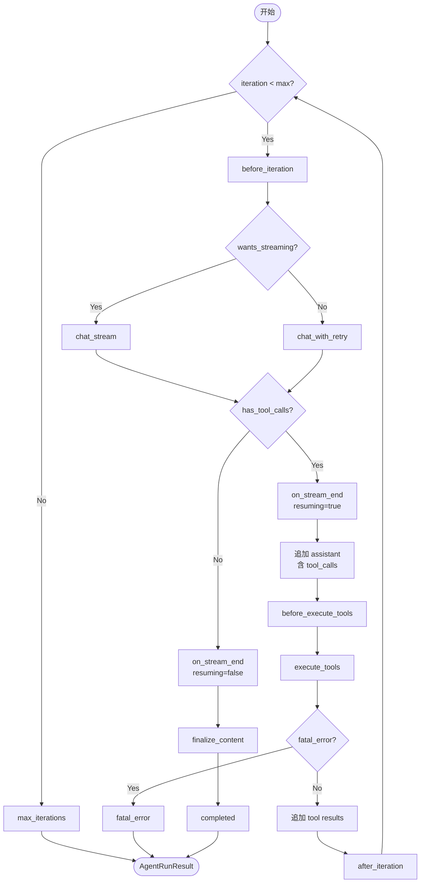

# MindClaw Agent 核心架构

> 双层解耦设计：业务编排层与纯执行层的分离

## 架构概览

MindClaw Agent 核心采用**双层解耦架构**，将业务层与执行层严格分离：

```
┌─────────────────────────────────────────────────────────┐
│  AgentLoop（业务编排层）—— 产品感知                      │
│  ├── 消息总线 I/O（MessageBus）                          │
│  ├── 会话管理（SessionManager）                          │
│  ├── 记忆整合（MemoryStore）                             │
│  ├── 命令路由（CommandRouter）                           │
│  ├── 上下文组装（ContextBuilder）                        │
│  └── 流式分发（Streaming Dispatcher）                    │
├─────────────────────────────────────────────────────────┤
│  AgentRunner（纯执行层）—— 产品无关                      │
│  ├── 迭代循环（LLM ↔ Tools，最多 8 rounds）              │
│  ├── 工具执行（ToolExecutor）                            │
│  └── 生命周期钩子（AgentHook）                           │
└─────────────────────────────────────────────────────────┘
```

**设计原则**：

- **AgentLoop** 处理所有产品层事务：消息总线集成、会话持久化、上下文构建、记忆整合、命令路由和流式传输
- **AgentRunner** 实现纯粹的、可复用的迭代循环，对 MindClaw 的基础设施一无所知
- **AgentHook** 作为两层之间的桥梁，通过生命周期回调将业务层行为注入执行层

这种分离意味着 Runner 可以被子 Agent、定时任务和后台任务复用，而无需依赖任何总线或渠道。

## 数据流概览

```
Channel ──► MessageBus ──► AgentLoop.run() ──► AgentRunner.run()
                                              │
                                              ▼
                                         LLM Provider
                                              │
                                              ▼
                                         Tool Execution
                                              │
                                              ▼
                                         AgentRunResult
                                              │
                                              ▼
AgentLoop ◄── persist turn ◄── MessageBus ◄── OutboundMessage
   │
   ▼
SessionManager
```

1. **Channel** 向 **MessageBus** 发布 `InboundMessage`
2. **AgentLoop** 从异步队列中消费消息，通过 `dispatch()` 分发
3. **AgentLoop** 构建 `AgentRunSpec`，调用 **AgentRunner**
4. **AgentRunner** 执行核心的"LLM 调用与工具执行"循环
5. **AgentHook** 通过生命周期回调桥接两层，传递流式增量和进度事件
6. **AgentLoop** 将生成的 `OutboundMessage` 发布回总线

## 双层职责划分

| 关注点     | AgentLoop（业务层）      | AgentRunner（执行层）     |
| ---------- | ------------------------ | ------------------------- |
| 消息流     | MessageBus 消费/发布     | —                         |
| 会话管理   | SessionManager 读写      | —                         |
| 上下文组装 | ContextBuilder           | —                         |
| 记忆整合   | MemoryStore recall/store | —                         |
| 命令拦截   | CommandRouter            | —                         |
| LLM 调用   | —                        | Provider.chat/chat_stream |
| 工具执行   | —                        | ToolExecutor.execute      |
| 迭代循环   | —                        | 最多 8 rounds 循环        |
| 流式传输   | 分发增量到 Channel       | 生成增量                  |
| 状态持久化 | 保存 turn 到 Session     | —                         |
| 并发控制   | Session 锁 + 并发闸      | —                         |

## 核心类型

### AgentRunSpec

声明式执行配置，冻结的数据类：

```rust
pub struct AgentRunSpec {
    pub messages: Vec<Message>,           // 预组装的消息历史
    pub tools: ActiveTools,               // 本次运行可用的工具
    pub model: String,                    // LLM 模型标识
    pub max_iterations: usize,            // 最大迭代次数（默认 8）
    pub temperature: Option<f32>,         // 采样温度
    pub max_tokens: Option<usize>,        // 最大 token 数
    pub parallel_tools: bool,             // 是否并行执行工具
    pub fail_on_tool_error: bool,         // 工具错误是否中止
}
```

### AgentRunResult

结构化执行结果：

```rust
pub struct AgentRunResult {
    pub content: String,                  // 最终文本响应
    pub messages: Vec<Message>,           // 完整消息列表（含工具轮次）
    pub tools_used: Vec<String>,          // 调用的工具名称列表
    pub usage: TokenUsage,                // Token 使用量
    pub stop_reason: StopReason,          // 停止原因
    pub error: Option<String>,            // 错误描述（如适用）
    pub tool_events: Vec<ToolEvent>,      // 工具调用事件轨迹
}

pub enum StopReason {
    Completed,        // 正常完成
    MaxIterations,    // 达到最大迭代次数
    ToolError,        // 工具错误且 fail_on_tool_error=true
    Cancelled,        // 被取消
}
```

## AgentHook 生命周期

钩子作为两层之间的桥梁，提供六个扩展点：

```rust
pub trait AgentHook {
    fn wants_streaming(&self) -> bool;
    fn before_iteration(&mut self, state: &mut IterationState);
    fn on_stream(&mut self, delta: &str);
    fn on_stream_end(&mut self, resuming: bool);
    fn before_execute_tools(&mut self, calls: &[ToolCall]);
    fn after_iteration(&mut self, state: &IterationState);
    fn finalize_content(&mut self, content: &str) -> String;
}
```

**调用顺序**：

```
before_iteration()
    │
    ▼（流式模式）
on_stream() × N ──► on_stream_end(resuming=true)
    │
    ▼（非流式模式）
chat_with_retry()
    │
    ▼（有工具调用）
before_execute_tools() ──► execute_tools() ──► after_iteration() ──► [继续循环]
    │
    ▼（无工具调用）
on_stream_end(resuming=false) ──► finalize_content() ──► [返回结果]
```

## 并发模型

AgentLoop 实现双层并发控制：

```
InboundMessage
    │
    ▼
asyncio.Task
    │
    ├──────────────┐
    ▼              ▼
Session Lock   Concurrency Gate
(每个 session_key)  (Semaphore，默认 3)
    │              │
    └──────┬───────┘
           ▼
    _process_message()
```

1. **Session Lock**：每个 `session_key` 一个 `tokio::sync::Mutex`，确保同一会话串行处理
2. **Concurrency Gate**：全局信号量（默认 3），限制并行 LLM 请求总数

## 迭代循环

AgentRunner 实现经典的 Agent 工具使用循环：



## 子章节导航

| 文件                                                 | 内容                                               |
| ---------------------------------------------------- | -------------------------------------------------- |
| [03.01-agent-loop.md](./03.01-agent-loop.md)         | 业务编排层：消息消费、会话管理、并发控制、流式分发 |
| [03.02-agent-runner.md](./03.02-agent-runner.md)     | 纯执行层：迭代循环、LLM 调用、工具执行             |
| [03.03-agent-spec.md](./03.03-agent-spec.md)         | AgentRunSpec / AgentRunResult 详细设计             |
| [03.04-agent-hook.md](./03.04-agent-hook.md)         | AgentHook 生命周期与桥接机制                       |
| [03.05-tool-execution.md](./03.05-tool-execution.md) | 工具执行策略：顺序/并行、错误处理、验证            |
