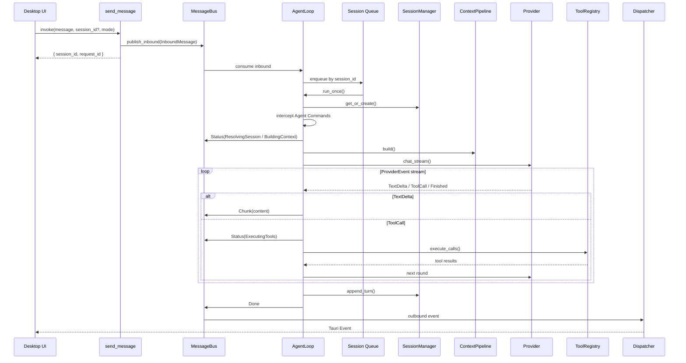

# MindClaw 技术架构设计

> 完整架构文档索引见 [README.md](./README.md)

## 四、核心数据流

### 4.1 Agent 输入路由（Agent Input Routing）

```
用户在对话中表达意图 → Agent 理解并通过 operations 工具直接写入目标：
    ├── "帮我记个任务…"  → task_create   → tasks 表 + Daily checkbox
    ├── "我觉得这个观点…" → knowledge_create → vault/knowledge/ 笔记
    ├── "今天感觉…"      → daily_append  → vault/daily/当日.md
    └── "这个链接不错…"  → resource_submit → resources 表 → 异步结晶为知识笔记
```

无需独立捕获管道——Agent 的对话理解天然具备路由能力。

### 4.2 对话流（Conversation Flow）

消息经过 Channel 抽象层统一处理，无论来源是桌面 UI 还是 Telegram Bot：



对话流关键规则：

- `send_message` 只入队，不等待最终模型文本。
- `AgentLoop` 按 session 串行处理消息；同一 session 的后续消息进入队列。
- Provider 通过事件流向 AgentLoop 发送 `TextDelta` / `ToolCall` / `Finished`。
- `Chunk`、`Done`、`Error`、`Status` 是统一的用户可见出站事件。
- 工具调用发生在单次 run 内部的有限回合 loop 中，最多 8 轮。

### 4.3 日记流（Daily Flow）

```
DailyPage 挂载，传入今日日期
  → invoke("daily_get", { date: "2026-03-26" })
  → Command → DailyService.get(): 读取 vault/daily/2026-03-26.md（不存在则模板创建）
  → Command → TaskService.list_by_date(): 查询关联任务
  → 返回 DailyNote { markdown, tasks: Vec<Task> }
  → 前端: 渲染 Markdown + 嵌入 TaskCard 组件
  → 用户编辑 → invoke("daily_save") → Command → DailyService.save()
  → 用户切换任务状态 → invoke("task_update") → Command → TaskService.update()
```

---
