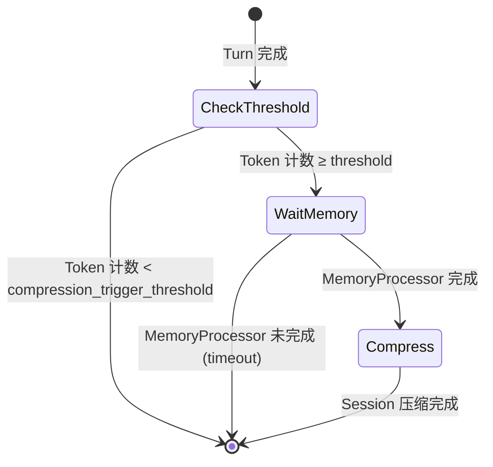

> **Status**: `active`

# AgentLoop — 业务编排层

---

## § 职责定位

AgentLoop 负责消息消费、会话管理、上下文构建、记忆整合和流式分发，不负责 LLM 调用、工具执行或任何 Provider 交互。

---

## § 核心原则

**Session 隔离**：同一 `session_key` 的消息严格串行，不同 Session 并发执行，互不阻塞。

**命令优先**：`/stop`、`/restart` 等控制命令在 `dispatch()` 阶段同步拦截，不进入 LLM 流程，确保控制命令能中断进行中的任务。

---

## § 边界与实体

**输入**：`bus.consume_inbound()` — 从 MessageBus 拉取用户消息，携带 `session_key` 和消息内容。

**输出**：`bus.publish_outbound()` — 将流式响应增量和最终响应推送回 MessageBus，由 ChannelManager 路由给用户。

**核心实体**：

**AgentSession**：会话的运行时状态，包含消息历史和会话元数据。
关键属性：`session_key`（唯一标识，格式 `{channel}:{chat_id}`）、消息轮次列表（Turn 序列）、最后活跃时间。
关系：由 SessionManager 管理；AgentLoop 每次处理消息时从 SessionManager 加载，处理完成后写回。

**ContextPipeline**：三层上下文的组装器，将 Core 层缓存、Dynamic 层动态内容和 User 层输入合并为发给 LLM 的消息列表。
关键属性：Core 层缓存（CoreLayerCache）、Dynamic 层 ContextSource 列表（按优先级排序）。
关系：由 AgentLoop 持有，每次处理消息时调用，输出填入 AgentRunSpec。

---

## § 并发模型

AgentLoop 实现双层并发控制：

```
InboundMessage
    │
    ▼
dispatch() — 检测控制命令
    │
    ▼ (普通消息，异步任务)
┌──────────────────────────────────────┐
│  Session Lock（每个 session_key）     │  ← 保证同一会话串行
│      +                               │
│  Concurrency Gate（全局 Semaphore）  │  ← 限制全局并行 LLM 请求数
└──────────────────────────────────────┘
    │
    ▼
_process_message()
```

---

## § 关键流程

```
InboundMessage
    │
    ▼
dispatch() ──► 控制命令? ──► 同步处理 ──► 返回
    │
    否
    ▼
tokio::spawn(async task) ──► active_tasks.insert()
    │
    ▼
┌─────────────────────────────────────────────────────────────────────┐
│ [Async Task]                                                        │
│  Session Lock.acquire() ──► Concurrency Gate.acquire()              │
│       │                                                             │
│       ▼                                                             │
│  SessionManager.load() ──► ContextPipeline.build()                  │
│       │                          ├── CoreLayer.load()               │
│       │                          ├── DynamicLayer.recall()          │
│       │                          └── UserLayer.inject()             │
│       ▼                                                             │
│  AgentRunSpec { messages, tools, context }                          │
│       │                                                             │
│       ▼                                                             │
│  LoopHook.new(bus) ──► AgentRunner.run(spec, hook)                  │
│       │                                          │                  │
│       ▼                                          │                  │
│  LoopHook.on_stream(delta) ◄── stream ───────────┘                  │
│       │                                                             │
│       ▼                                                             │
│  MessageBus.publish_outbound()                                      │
│       │                                                             │
│       ▼                                                             │
│  SessionManager.append_turn()                                       │
│       │                                                             │
│       ▼                                                             │
│  Session Lock.release() ──► Concurrency Gate.release()              │
│       │                                                             │
│       ▼                                                             │
│  active_tasks.remove()                                              │
└─────────────────────────────────────────────────────────────────────┘
```

## § Session 压缩机制

Session 压缩防止消息历史无限增长导致 Token 成本和响应延迟上升。

### 触发条件



**压缩触发阈值**：`compression_trigger_threshold = context_limit × 0.8`

在达到上下文限制 80% 时预触发，避免用户感受到"突然变慢"的请求。

### 执行顺序约束

```mermaid
sequenceDiagram
    participant Loop as AgentLoop
    participant SM as SessionManager
    participant MP as MemoryProcessor
    participant SC as SessionCompressor

    Loop->>SM: append_turn(turn N)
    SM-->>Loop: 完成
    Loop->>MP: process(turn N) [async detach]

    Note over Loop: 下一条消息到来
    Loop->>SM: load_session()
    SM-->>Loop: Session 含 turn N
    Loop->>Token: estimate(turns)

    alt Token ≥ threshold
        Loop->>MP: await_completion(turn N, timeout)
        MP-->>Loop: 完成 或 超时
        Loop->>SC: compress(turns[: -keep_recent])
        SC->>Background: run(compression_spec)
        Background-->>SC: CompressedTurn
        SC->>SM: replace_range_with_summary(range, compressed)
    end

    Loop->>Context: build_context()
```

**顺序保证**：SessionCompressor 压缩某段 Turn 前，必须等待该段 Turn 的 MemoryProcessor 完成（或超时）。这确保压缩不会丢失尚未提取的记忆。

**超时处理**：若 MemoryProcessor 超时未完成，该 Turn 标记为"待处理"，SessionCompressor 跳过该 Turn，留待下次压缩检查。

### CompressedTurn 实体

```
CompressedTurn:
  - original_range: (from_turn_id, to_turn_id)
  - summary: String          // 压缩后的摘要文本
  - token_before: usize      // 压缩前 Token 数
  - token_after: usize       // 压缩后 Token 数（用于统计）
  - compressed_at: DateTime  // 压缩时间戳
```

原始 Turns 在 Storage 中**保留**（只是不再加载到上下文），支持用户查看完整历史，也支持重建压缩摘要。

### 使用 BackgroundRunner

Session 压缩的摘要生成需要调用 LLM，通过 **BackgroundRunner** 执行：

- 非流式（NoOpHook）
- 占用 Background Semaphore（不与前台对话竞争）
- 可延迟执行（用户不感知延迟）

## § 设计决策与权衡

| 决策问题 | 选择 | 放弃的替代方案 | 理由 |
|---------|------|--------------|------|
| 如何保证同一会话的消息串行？ | 每个 `session_key` 独立 Mutex（Session Lock） | 全局队列串行化所有消息 | 不同 Session 可并发，互不阻塞；全局串行会令多用户场景（多通道）性能严重退化 |
| 如何限制全局并发 LLM 请求？ | 全局 Semaphore（Concurrency Gate） | 不限制并发 | 大量并发 LLM 请求会超出 API 速率限制，并消耗过多内存（每个请求持有完整消息历史） |
| 控制命令（/stop）如何优先处理？ | `dispatch()` 阶段同步拦截 | 命令进入 LLM 流程判断 | 控制命令必须在 LLM 调用前生效；LLM 流程耗时较长，等待会导致 /stop 无效 |
| 记忆整合何时触发？ | 后台异步任务，不阻塞主响应 | 每次响应后同步触发 | 记忆整合是 LLM 调用（耗时），异步执行对用户透明；同步触发会增加响应延迟 |
| LoopHook 如何传递流式增量？ | 通过 AgentHook.on_stream() 回调直接发布到 MessageBus | 通过 channel 传递增量到独立分发任务 | 直接发布减少一层中转，延迟更低；AgentHook 契约已明确流式传输的职责分配 |
| 如何处理长时间运行的会话？ | SessionManager 自动压缩早期历史（摘要替代） | 保留完整历史直到 token 超限 | 自动压缩防止上下文无限增长，同时保留关键信息；token 超限后再处理会导致当前请求失败 |
| 控制命令和普通消息如何处理差异？ | 控制命令同步处理，普通消息异步任务 | 所有消息统一异步处理 | 控制命令（/stop）需要立即生效，异步处理会导致延迟，用户感知的停止不及时 |
| 如何处理消息队列积压？ | 有界队列 + 背压 | 无界队列 | 无界队列会导致内存无限增长；有界队列使 Channel 在队列满时阻塞，自然限制流入速度 |
| 如何支持优雅关闭？ | 设置关闭标志，等待活跃任务完成 | 立即强制终止 | 优雅关闭确保会话状态持久化，强制终止可能导致数据丢失 |
| Session 压缩的摘要生成走哪条路径？ | BackgroundRunner（独立 Background Semaphore） | AgentRunner InboundMessage 路径（产生完整 Turn） | 压缩是后台优化，不需要主代理 LLM 参与；走 InboundMessage 会产生不必要的对话 Turn，消耗 Token |
| 压缩检查放在上下文构建前还是后？ | 构建前（预触发） | 构建后（后触发） | 构建前触发可以在上下文超限前主动优化；后触发可能导致当前请求失败（上下文已超限） |
| 压缩与 Memory 提取的顺序如何保证？ | 压缩前等待 Memory 提取完成（或超时） | 独立调度，无顺序约束 | 压缩会丢弃原文细节；若先压缩再提取，提取质量下降；顺序约束保证记忆完整性 |
| 压缩的触发阈值如何设置？ | context_limit × 0.8（预触发） | context_limit × 1.0（满触发） | 预触发避免用户感受到"突然变慢"的请求；满触发可能导致单次请求处理时间突变 |
