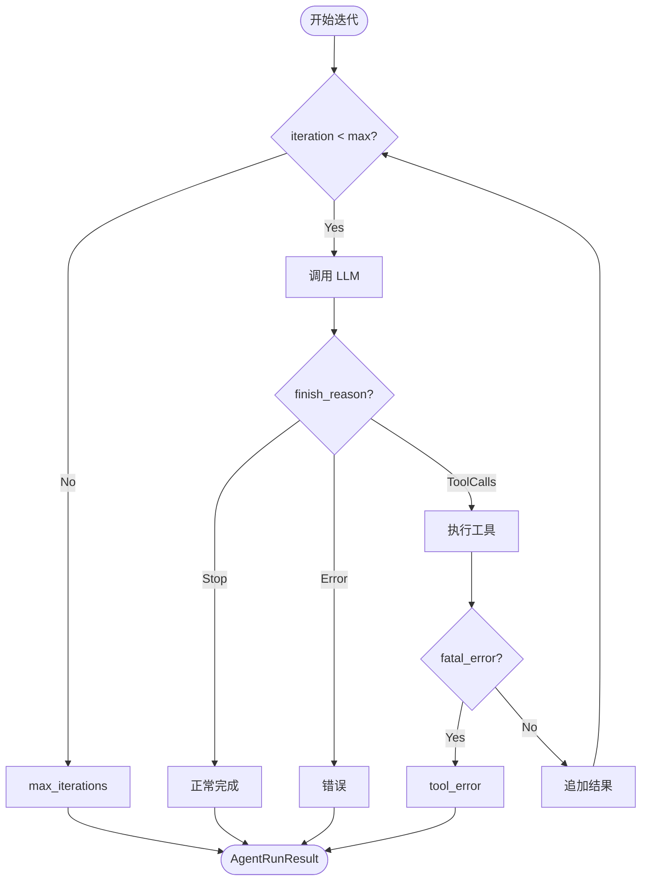

# AgentRunner — 纯执行层

> 无状态的 LLM 迭代循环引擎，对基础设施一无所知

## 职责定位

AgentRunner 是 MindClaw 的纯执行层，负责：

- 执行核心的"LLM 调用与工具执行"迭代循环
- 管理最多 8 轮的工具调用迭代
- 处理流式与非流式 LLM 响应
- 执行工具调用（顺序或并行）
- 组装最终的 `AgentRunResult`

**核心原则**：AgentRunner 无状态，不持有 session、message bus 或任何基础设施依赖，只依赖输入的 `AgentRunSpec`。

## 架构位置

```
AgentLoop ──► AgentRunner
                  │
                  ├── LLM Provider
                  ├── ToolRegistry
                  └── AgentHook
```

## 核心结构

```rust
pub struct AgentRunner {
    provider: Arc<dyn LLMProvider>,
    tool_registry: Arc<ToolRegistry>,
}

impl AgentRunner {
    pub fn new(provider: Arc<dyn LLMProvider>, tool_registry: Arc<ToolRegistry>) -> Self {
        Self { provider, tool_registry }
    }
}
```

## 核心迭代循环

### 主入口

```rust
impl AgentRunner {
    pub async fn run(
        &self,
        spec: AgentRunSpec,
        hook: &mut dyn AgentHook,
    ) -> AgentRunResult {
        let mut messages = spec.messages.clone();
        let mut tools_used = Vec::new();
        let mut tool_events = Vec::new();
        let mut usage = TokenUsage::default();
        
        for iteration in 0..spec.max_iterations {
            // 1. 迭代前钩子
            let mut state = IterationState::new(iteration, messages.len());
            hook.before_iteration(&mut state);
            
            // 2. 调用 LLM
            let response = if hook.wants_streaming() {
                self.chat_stream(&spec, &messages, hook).await
            } else {
                self.chat(&spec, &messages).await
            };
            
            // 3. 更新使用量
            usage.add(&response.usage);
            
            // 4. 检查是否有工具调用
            match response.finish_reason {
                FinishReason::ToolCalls => {
                    // 流结束信号（后续还有工具调用）
                    hook.on_stream_end(true);
                    
                    // 追加 assistant 消息（含 tool_calls）
                    let assistant_msg = Message::assistant_with_tools(
                        &response.content,
                        &response.tool_calls,
                    );
                    messages.push(assistant_msg);
                    
                    // 执行工具
                    let tool_calls = response.tool_calls;
                    hook.before_execute_tools(&tool_calls);
                    
                    let results = self.execute_tools(&spec, &tool_calls, hook).await;
                    
                    // 检查致命错误
                    if results.iter().any(|r| r.is_fatal()) && spec.fail_on_tool_error {
                        return AgentRunResult {
                            content: format!("Tool error: {}", results[0].error()),
                            messages,
                            tools_used,
                            usage,
                            stop_reason: StopReason::ToolError,
                            error: Some(results[0].error()),
                            tool_events,
                        };
                    }
                    
                    // 追加工具结果
                    for result in &results {
                        messages.push(Message::tool_result(result));
                        tools_used.push(result.name.clone());
                        tool_events.push(result.to_event());
                    }
                    
                    // 迭代后钩子
                    hook.after_iteration(&mut state);
                    
                    // 继续下一轮
                    continue;
                }
                
                FinishReason::Stop => {
                    // 流结束信号（最终响应）
                    hook.on_stream_end(false);
                    
                    // 最终内容定稿
                    let final_content = hook.finalize_content(&response.content);
                    
                    // 追加最终 assistant 消息
                    messages.push(Message::assistant(&final_content));
                    
                    return AgentRunResult {
                        content: final_content,
                        messages,
                        tools_used,
                        usage,
                        stop_reason: StopReason::Completed,
                        error: None,
                        tool_events,
                    };
                }
                
                FinishReason::Error => {
                    return AgentRunResult {
                        content: response.content,
                        messages,
                        tools_used,
                        usage,
                        stop_reason: StopReason::Error,
                        error: Some(response.content),
                        tool_events,
                    };
                }
                
                _ => {}
            }
        }
        
        // 达到最大迭代次数
        AgentRunResult {
            content: format!("Reached maximum iterations ({}).", spec.max_iterations),
            messages,
            tools_used,
            usage,
            stop_reason: StopReason::MaxIterations,
            error: Some("Max iterations reached".to_string()),
            tool_events,
        }
    }
}
```

## LLM 调用

### 非流式调用

```rust
impl AgentRunner {
    async fn chat(
        &self,
        spec: &AgentRunSpec,
        messages: &[Message],
    ) -> LLMResponse {
        let tools = self.tool_registry.get_definitions(&spec.tools);
        
        self.provider.chat(ChatRequest {
            model: &spec.model,
            messages,
            tools: &tools,
            temperature: spec.temperature,
            max_tokens: spec.max_tokens,
        }).await
    }
}
```

### 流式调用

```rust
impl AgentRunner {
    async fn chat_stream(
        &self,
        spec: &AgentRunSpec,
        messages: &[Message],
        hook: &mut dyn AgentHook,
    ) -> LLMResponse {
        let tools = self.tool_registry.get_definitions(&spec.tools);
        
        let mut stream = self.provider.chat_stream(ChatRequest {
            model: &spec.model,
            messages,
            tools: &tools,
            temperature: spec.temperature,
            max_tokens: spec.max_tokens,
        }).await;
        
        let mut content = String::new();
        let mut tool_calls = Vec::new();
        let mut usage = TokenUsage::default();
        let mut finish_reason = FinishReason::Stop;
        
        while let Some(chunk) = stream.next().await {
            match chunk {
                StreamChunk::Delta(delta) => {
                    content.push_str(&delta);
                    hook.on_stream(&delta);
                }
                StreamChunk::ToolCall(call) => {
                    tool_calls.push(call);
                }
                StreamChunk::Usage(u) => {
                    usage = u;
                }
                StreamChunk::Finish(reason) => {
                    finish_reason = reason;
                }
            }
        }
        
        LLMResponse {
            content,
            tool_calls,
            usage,
            finish_reason,
        }
    }
}
```

## 三条终止路径

循环的结束原因恰好有三种：



| 停止原因 | 触发条件 | 行为 |
|----------|----------|------|
| `Completed` | LLM 返回无工具调用的响应 | 正常中断，内容定稿后返回 |
| `ToolError` | 工具错误且 `fail_on_tool_error=true` | 立即中断，返回错误信息 |
| `MaxIterations` | 达到 `max_iterations` 限制 | 返回最大迭代提示 |

## 迭代状态

```rust
pub struct IterationState {
    pub iteration: usize,           // 当前迭代次数（0-based）
    pub message_count: usize,       // 当前消息数量
    pub start_time: Instant,        // 迭代开始时间
}

impl IterationState {
    pub fn new(iteration: usize, message_count: usize) -> Self {
        Self {
            iteration,
            message_count,
            start_time: Instant::now(),
        }
    }
    
    pub fn elapsed(&self) -> Duration {
        self.start_time.elapsed()
    }
}
```

## 错误处理策略

### 工具错误模型

```rust
pub enum ToolErrorStrategy {
    Graceful,   // 默认：工具错误作为消息返回，LLM 可重试
    Fatal,      // fail_on_tool_error=true：立即中止循环
}
```

### 实现

```rust
impl AgentRunner {
    async fn execute_tools(
        &self,
        spec: &AgentRunSpec,
        calls: &[ToolCall],
        hook: &mut dyn AgentHook,
    ) -> Vec<ToolResult> {
        let results = if spec.parallel_tools {
            self.execute_parallel(calls, hook).await
        } else {
            self.execute_sequential(calls, hook).await
        };
        
        // 检查是否需要中止
        if spec.fail_on_tool_error && results.iter().any(|r| r.is_error()) {
            return results;
        }
        
        results
    }
}
```

## 复用场景

AgentRunner 可被以下场景复用：

| 场景 | 调用方式 | 说明 |
|------|----------|------|
| 普通对话 | `AgentLoop` 调用 | 标准流程 |
| SubAgent | 直接调用 `run()` | 后台任务使用简化 spec |
| 定时任务 | 直接调用 `run()` | 使用系统会话构造 spec |
| 心跳任务 | 直接调用 `run()` | 健康检查使用最小 spec |
| 测试 | 直接调用 `run()` | 无需基础设施依赖 |

### SubAgent 复用示例

```rust
impl SubAgent {
    async fn execute(&self, task: BackgroundTask) {
        // 构造简化 spec
        let spec = AgentRunSpec {
            messages: vec![
                Message::system("你是一个后台任务执行器。"),
                Message::user(&task.payload),
            ],
            tools: self.tools.clone(),
            model: "claude-3-haiku".to_string(),
            max_iterations: 4,
            temperature: Some(0.0),
            max_tokens: Some(2000),
            parallel_tools: true,
            fail_on_tool_error: false,
        };
        
        // 使用空钩子（无流式输出）
        let mut hook = NoOpHook;
        let result = self.runner.run(spec, &mut hook).await;
        
        // 处理结果
        self.handle_result(task.session_key, result).await;
    }
}
```

## 关键设计决策

| 决策 | 选择 | 理由 |
|------|------|------|
| 状态管理 | 完全无状态 | 可被任意场景复用，易于测试 |
| 迭代上限 | 8 轮 | 防止无限循环，平衡能力与安全 |
| 流式控制 | 由 Hook 决定 | 业务层控制是否流式 |
| 错误策略 | 可配置（优雅/致命） | 适应不同场景需求 |
| 工具执行 | 顺序/并行可配置 | 适应工具依赖关系 |

## 与 AgentLoop 的边界

```
AgentLoop（业务层）              AgentRunner（执行层）
        │                              │
        ├──► 构造 AgentRunSpec ───────►│
        │                              │
        ├──► 提供 AgentHook ──────────►│
        │                              ├──► 调用 Hook 方法
        │                              │    （桥接回业务层）
        │                              │
        │◄── 返回 AgentRunResult ──────┤
        │                              │
        └──► 处理结果持久化            │
                                     │
        不直接调用 Provider ◄─────────┤
        不直接调用 ToolRegistry ◄─────┤
```

**边界规则**：

- AgentLoop 不直接调用 Provider，只通过 AgentRunner
- AgentLoop 不直接调用 ToolRegistry，只通过 AgentRunner
- AgentRunner 不感知 Session、MessageBus、Channel
- AgentRunner 只通过 AgentHook 与业务层通信
