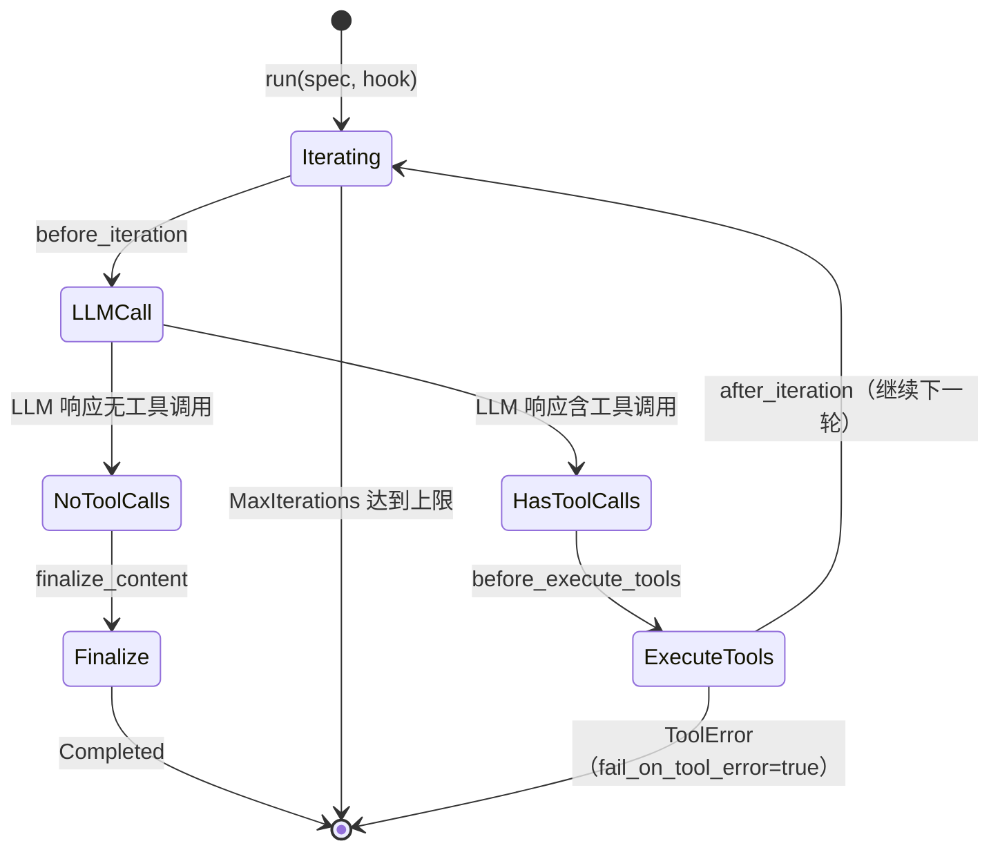

> **Status**: `active`

# AgentRunner — 纯执行层

---

## § 职责定位

AgentRunner 负责驱动"LLM 调用 ↔ 工具执行"迭代循环，不负责会话管理、消息路由、上下文构建或任何业务基础设施交互。

---

## § 核心原则

**完全无状态**：AgentRunner 不持有会话历史、记忆或任何跨次请求的可变状态。同一实例可被 AgentLoop、SubagentManager、CLI 同时调用，无需同步原语保护。

---

## § 边界与实体

**输入**：`AgentRunSpec` — 由 AgentLoop 预组装的声明式执行配置，包含完整消息历史、工具集和执行策略。

**输出**：`AgentRunResult` — 结构化执行结果，包含最终响应文本、完整消息链（含工具往返）、工具使用记录、停止原因和 Token 用量统计。

**核心实体**：

**IterationState**：单次迭代的运行时快照，只在迭代期间存在，由 AgentHook 观测。
关键属性：当前迭代序号（从 0 起）、迭代开始时的消息数量。
关系：每次迭代开始时由 AgentRunner 创建，传递给 AgentHook 的 `before_iteration` 和 `after_iteration` 回调。

**ToolCall**：LLM 响应中的工具调用请求，由 AgentRunner 解析后交给 ToolRegistry 执行。
关键属性：唯一调用 ID（`tool_call_id`）、工具名称、参数（JSON）。
关系：从 LLM 响应中提取，传给 `hook.before_execute_tools()`，再由 ToolRegistry 执行，结果追加为 ToolResult 消息。

---

## § 迭代循环状态



---

## § 关键流程

1. 接收 AgentRunSpec，初始化消息列表副本和 Token 计数器。
2. 进入迭代循环，调用 `hook.before_iteration(state)` 通知业务层迭代开始。
3. 根据 `hook.wants_streaming()` 选择流式（`provider.chat_stream()`）或非流式（`provider.chat()`）调用 LLM。
4. 解析 LLM 响应：检测是否含工具调用（`tool_calls` 字段非空）。
5. 若含工具调用：调用 `hook.before_execute_tools(calls)`，将调用交给 ToolRegistry 执行（顺序或并行由 Spec 声明），将工具结果追加为 ToolResult 消息，调用 `hook.after_iteration(state)`，继续下一次迭代。
6. 若无工具调用（最终响应）：调用 `hook.on_stream_end(false)` 和 `hook.finalize_content(content)`，获取处理后的最终文本，终止循环。
7. 组装 AgentRunResult（消息链、工具列表、Token 用量、停止原因）并返回。

---

## § 复用场景

| 场景 | 调用方 | Hook 类型 | 特殊配置 |
|------|--------|-----------|---------|
| 普通对话 | AgentLoop | LoopHook（流式 + 消息分发） | 标准 Spec |
| 后台子代理 | SubagentManager | NoOpHook（非流式） | 迭代上限更低，禁用 spawn_subagent |
| 定时任务 | Cron | NoOpHook（非流式） | 系统构建的 Spec，无用户消息 |
| 测试 | 测试代码 | TestHook（录制事件序列） | MockProvider 注入 |

---

## § BackgroundRunner — 后台任务执行

AgentRunner 的所有复用场景都面向**前台交互**（占用 Concurrency Gate 槽位）。后台任务（Memory 提取、升华草稿生成、Session 压缩摘要）需要独立的 LLM 调用通道。

**BackgroundRunner** 是与 AgentRunner **同一实现**，注入**独立 Semaphore** 的变体：

```
┌──────────────────────────────────────────────────────────┐
│ 前台执行（AgentRunner）                                   │
│  - 使用 Concurrency Gate（主 Semaphore）                  │
│  - 槽位数：user_config.concurrency_limit（默认 4）        │
│  - 优先保证用户交互响应                                   │
├──────────────────────────────────────────────────────────┤
│ 后台执行（BackgroundRunner）                              │
│  - 使用 Background Semaphore（独立）                      │
│  - 槽位数：固定较小（默认 2）                             │
│  - 后台任务互不竞争，也不与前台竞争                       │
└──────────────────────────────────────────────────────────┘
```

**使用 BackgroundRunner 的场景**：

| 任务类型 | 调用方 | Hook | 理由 |
|---------|--------|------|------|
| Memory 自动提取 | MemoryProcessor | NoOpHook | 非交互，低优先级，不阻塞前台对话 |
| 记忆升华草稿 | MemorySublimationJob | NoOpHook | 批量处理，结果需用户确认后才生效 |
| Session 压缩摘要 | SessionCompressor | NoOpHook | 后台优化，可延迟执行 |

**与 AgentRunner 的接口一致性**：

BackgroundRunner 实现相同的 `run(spec, hook)` 接口，调用方无需感知差异。唯一区别是构造时注入的 Semaphore 不同。

```rust
// AppRuntimeBuilder 初始化
let agent_runner = AgentRunner::new(provider_registry, tool_registry, main_semaphore);
let background_runner = AgentRunner::new(provider_registry, tool_registry, background_semaphore);
// 两者均为 Arc<dyn Runner>，接口完全一致
```

---

## § 设计决策与权衡

| 决策问题 | 选择 | 放弃的替代方案 | 理由 |
|---------|------|--------------|------|
| Runner 是否持有业务状态？ | 完全无状态（构造函数只注入 Provider 和 ToolRegistry） | Runner 持有 SessionManager 引用 | 无状态保证任意场景可复用，测试时无需构建业务基础设施；有状态则每个复用场景都需要传入 Session 上下文 |
| 流式与否由谁决定？ | AgentHook.wants_streaming() 决定（即调用方决定） | Runner 固定选择流式或非流式 | 子代理和定时任务不需要流式输出；桌面 UI 需要流式实时显示。同一 Runner 需要适应两种场景 |
| 工具执行顺序如何控制？ | AgentRunSpec.parallel_tools 字段声明，Runner 执行 | Runner 固定并行 | 工具间可能有依赖关系（写文件后读文件），调用方通过 Spec 声明策略，Runner 不做判断 |
| 工具错误是否中止循环？ | AgentRunSpec.fail_on_tool_error 字段声明 | Runner 固定优雅降级 | 子代理要求快速失败（便于主代理决策），对话场景要求优雅降级（LLM 可重试）；统一策略无法满足两种需求 |
| 如何限制最大迭代次数？ | AgentRunSpec.max_iterations 字段声明 | Runner 固定上限 | 不同场景需要不同上限：主对话、子代理、定时任务的复杂度不同；声明式让调用方控制 |
| 迭代中如何观测 Token 用量？ | AgentHook.after_iteration(state) 传入当前用量 | Runner 不提供用量信息 | Hook 层（AgentLoop）需要监控和记录用量；提供用量使 Hook 可以触发预算警告或自动降级 |
| 如何处理 Provider 返回的停止原因？ | 映射到 StopReason 枚举 | 直接透传 Provider 原始字符串 | StopReason 是内部统一类型，不同 Provider 的停止原因（如 Claude 的 `stop_sequence` vs OpenAI 的 `stop`）映射到统一语义 |
| 如何支持测试场景？ | TestHook 记录所有事件序列 | 直接测试 Provider | TestHook 使测试无需真实 LLM 调用，可注入 MockProvider 和 MockTool，完全可控 |
| 如何处理工具执行超时？ | ToolRegistry 层设置超时 | 无限等待 | 无限等待会导致 Runner 卡住；超时使 Runner 可以优雅处理慢工具，返回超时错误给 LLM |
| 流式调用失败如何处理？ | 不重试，直接返回错误 | 重试并重新推送全部内容 | 重试会导致用户看到重复内容；流式场景下中断概率低，不重试简化逻辑 |
| 是否需要支持流式重试？ | 不支持；非流式可重试 | 统一支持重试 | 流式与非流式语义不同；流式是"实时推送"，重试破坏实时性契约 |
