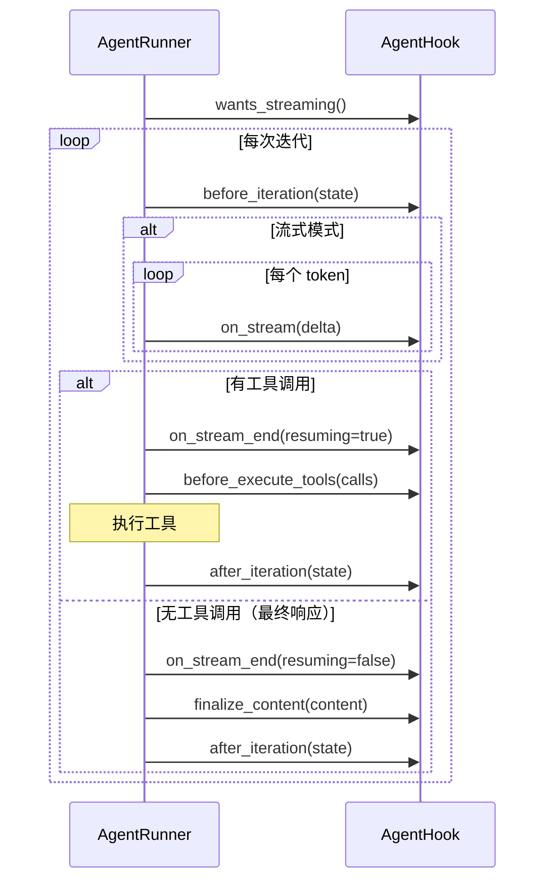

> **Status**: `active`

# AgentHook — 生命周期钩子

---

## § 职责定位

AgentHook 负责将业务层行为注入到 AgentRunner 的迭代循环中，不负责 LLM 调用、工具执行、会话持久化或消息路由。

---

## § 核心原则

**可选注入**：Hook 的所有方法均有默认空操作实现，调用方只需覆盖需要的方法，不强制实现全部扩展点。这保证 AgentRunner 在任何场景下均可使用最简的 NoOpHook。

---

## § 边界与实体

**输入**：AgentRunner 在各生命周期节点主动调用 Hook 方法，传入当前迭代状态或内容片段。

**输出**：Hook 方法产生的副作用（如将流式增量发布到 MessageBus）或返回处理后的内容（`finalize_content`）。

**核心实体**：

**AgentHook trait**：七个扩展点的接口契约（六个生命周期回调加一个配置查询），定义业务层可介入 Runner 循环的时机。

```
fn wants_streaming(&self) -> bool
fn before_iteration(&mut self, state: &IterationState)
fn on_stream(&mut self, delta: &str)
fn on_stream_end(&mut self, resuming: bool)
fn before_execute_tools(&mut self, calls: &[ToolCall])
fn after_iteration(&mut self, state: &IterationState)
fn finalize_content(&mut self, content: &str) -> String
```

**LoopHook**：AgentLoop 使用的标准 Hook 实现，负责将流式增量实时发布到 MessageBus，并处理 think 标签剥离。
关键属性：持有 MessageBus 引用、当前 `session_key`、流式内容缓冲区、段计数器。
关系：由 AgentLoop 在每次处理消息前实例化，单次使用后丢弃。

**NoOpHook**：所有方法均为空操作的 Hook，用于子代理和定时任务（这些场景不需要流式输出）。
关键属性：无。
关系：SubagentManager 和 Cron 调用 AgentRunner 时传入。

---

## § 七个扩展点语义

| 扩展点 | 调用时机 | LoopHook 的行为 | NoOpHook 的行为 |
|--------|---------|----------------|----------------|
| `wants_streaming` | Runner 决定调用方式前 | 返回 `true` | 返回 `false` |
| `before_iteration` | 每次 LLM 调用前 | 重置流式缓冲区 | 无操作 |
| `on_stream` | 每个流式 token 到达时 | 发布 OutboundMessage::Delta 到 MessageBus | 无操作 |
| `on_stream_end` | 一次 LLM 调用的流式结束 | 发布流结束事件（`resuming` 区分中间结束和最终结束） | 无操作 |
| `before_execute_tools` | 工具执行前 | 发布工具进度事件，供 UI 展示 | 无操作 |
| `after_iteration` | 每次迭代完成后 | 记录迭代指标 | 无操作 |
| `finalize_content` | 最终响应确定后 | 剥离 think 标签，返回清洁内容 | 原样返回 |

---

## § 扩展点调用顺序



---

## § 关键流程

1. AgentLoop 在调用 AgentRunner 前，实例化对应场景的 Hook（对话用 LoopHook，子代理用 NoOpHook）。
2. AgentRunner 在迭代开始时调用 `before_iteration`，LoopHook 重置流式缓冲区。
3. 流式模式下，每个 LLM token 触发 `on_stream(delta)`，LoopHook 将增量发布到 MessageBus。
4. LLM 调用结束时，`on_stream_end(resuming)` 通知 Hook 流式是否结束（`resuming=true` 表示后续还有工具调用）。
5. 若有工具调用，`before_execute_tools(calls)` 通知 Hook，工具执行期间 Hook 可发布进度事件。
6. 最终响应确定时，`finalize_content(content)` 供 LoopHook 剥离 think 标签后返回清洁内容。

---

## § 设计决策与权衡

| 决策问题 | 选择 | 放弃的替代方案 | 理由 |
|---------|------|--------------|------|
| 如何向无状态 Runner 注入业务行为？ | AgentHook trait，调用方实现并在调用时传入 | Runner 内部硬编码 MessageBus 引用和流式逻辑 | Runner 不依赖任何业务层类型；不同场景替换不同 Hook 实现，Runner 代码不变 |
| Hook 方法是否需要可变访问？ | 是，接受 `&mut self` | 不可变 `&self`，使用 Interior Mutability | LoopHook 需要维护流式缓冲区（可变状态）；`&mut self` 直接表达语义，不需要 Mutex 或 Cell |
| 流式与否由谁决定？ | Hook.wants_streaming()（业务层决定） | Runner 固定策略 | 子代理场景不需要流式（NoOpHook 返回 false），对话场景需要（LoopHook 返回 true）；Runner 本身不关心 |
| think 标签如何处理？ | `finalize_content` 在最终响应上一次性处理 | 在每个 `on_stream` delta 上实时过滤 | think 标签可能跨越多个 delta（`<thi` + `nk>`），在完整内容上处理更可靠 |
| on_stream_end 的 resuming 参数有何作用？ | 区分中间结束（后续还有工具调用）和最终结束 | 不区分，由 Hook 自行判断 | LoopHook 需要知道当前流式段是否是最终响应，以决定是否发送"流式完成"通知给用户 |
