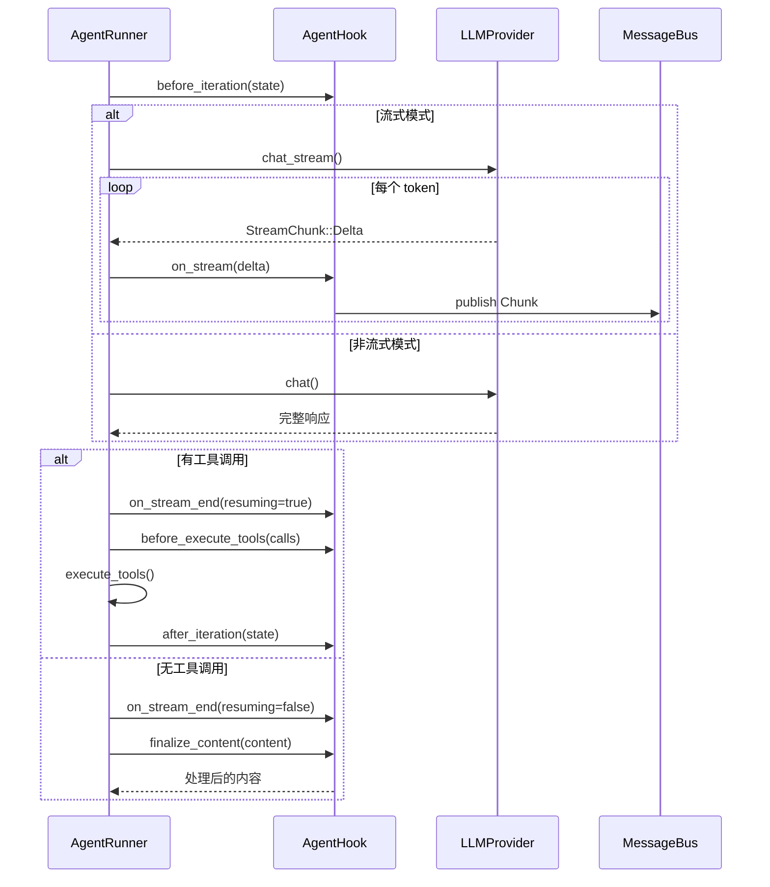

# AgentHook — 生命周期钩子

> 连接业务层与执行层的桥梁

## 设计哲学

AgentHook 是 MindClaw 双层架构的核心桥梁，它：

- **解耦两层**：AgentRunner 不感知业务层，只通过 Hook 接口通信
- **生命周期拦截**：在关键执行点提供扩展能力
- **流式桥接**：将 LLM 流式输出转发到业务层
- **内容处理**：在最终输出前进行后处理（如剥离 think 标签）

**核心原则**：Hook 完全可选，默认实现均为空操作，不强制业务层实现所有方法。

## 接口定义

```rust
/// Agent 生命周期钩子
/// 
/// 提供六个扩展点，允许业务层将特定行为注入到 Runner 的迭代循环中。
/// 默认实现对所有方法都是空操作，使得 Hook 完全可选。
pub trait AgentHook {
    /// 决定本次迭代是否使用流式传输
    /// 
    /// 返回 true：使用 chat_stream，逐 token 回调 on_stream
    /// 返回 false：使用 chat，一次性返回完整响应
    fn wants_streaming(&self) -> bool;
    
    /// 每次迭代开始时调用
    /// 
    /// 用途：观察/重置状态，为新的 LLM 调用做准备
    fn before_iteration(&mut self, state: &mut IterationState);
    
    /// 流式传输期间的每个内容增量
    /// 
    /// 用途：将内容增量转发到 UI 层
    fn on_stream(&mut self, delta: &str);
    
    /// 流式传输完成时调用
    /// 
    /// # 参数
    /// - `resuming`: true 表示后续还有工具调用，false 表示最终响应
    /// 
    /// 用途：发出流结束信号，UI 层可据此调整状态
    fn on_stream_end(&mut self, resuming: bool);
    
    /// 工具执行之前调用
    /// 
    /// 用途：设置工具路由上下文，记录工具调用日志，发送进度事件
    fn before_execute_tools(&mut self, calls: &[ToolCall]);
    
    /// 每次迭代结束时调用
    /// 
    /// 用途：持久化指标，完成状态定稿
    fn after_iteration(&mut self, state: &IterationState);
    
    /// 最终响应时调用
    /// 
    /// 用途：后处理内容（如剥离 think 标签）
    /// 返回处理后的内容
    fn finalize_content(&mut self, content: &str) -> String;
}

/// 默认实现（空操作）
impl dyn AgentHook {
    fn wants_streaming(&self) -> bool { false }
    fn before_iteration(&mut self, _state: &mut IterationState) {}
    fn on_stream(&mut self, _delta: &str) {}
    fn on_stream_end(&mut self, _resuming: bool) {}
    fn before_execute_tools(&mut self, _calls: &[ToolCall]) {}
    fn after_iteration(&mut self, _state: &IterationState) {}
    fn finalize_content(&mut self, content: &str) -> String { content.to_string() }
}
```

## 调用顺序

### 完整调用序列

```
单次迭代（有工具调用）：
─────────────────────────
before_iteration()
    │
    ▼（流式模式）
on_stream() × N
    │
    ▼
on_stream_end(resuming=true)
    │
    ▼（非流式模式）
chat_with_retry()
    │
    ▼
before_execute_tools()
    │
    ▼
execute_tools()
    │
    ▼
after_iteration()
    │
    └──► [继续下一轮]

最终迭代（无工具调用）：
─────────────────────────
before_iteration()
    │
    ▼（流式模式）
on_stream() × N
    │
    ▼
on_stream_end(resuming=false)
    │
    ▼（非流式模式）
chat_with_retry()
    │
    ▼
finalize_content()
    │
    └──► [返回 AgentRunResult]
```

### 时序图



## 方法详解

### wants_streaming

决定本次迭代是否使用流式传输：

```rust
fn wants_streaming(&self) -> bool;
```

**返回值**：

- `true`：使用 `chat_stream`，逐 token 回调 `on_stream`
- `false`：使用 `chat`，一次性返回完整响应

**典型实现**：

```rust
impl AgentHook for LoopHook {
    fn wants_streaming(&self) -> bool {
        // 业务层决定是否流式
        self.channel.supports_streaming()
    }
}
```

### before_iteration

每次迭代开始时调用：

```rust
fn before_iteration(&mut self, state: &mut IterationState);
```

**参数**：

- `state`：当前迭代状态（迭代次数、消息数量、开始时间）

**典型用途**：

- 重置流式缓冲区
- 记录迭代开始时间
- 初始化工具上下文

```rust
impl AgentHook for LoopHook {
    fn before_iteration(&mut self, state: &mut IterationState) {
        // 重置缓冲区
        self.buffer.clear();
        self.last_stripped_len = 0;
        
        // 记录开始时间
        self.iteration_start = Some(Instant::now());
        
        // 发送状态更新
        self.bus.publish(OutboundMessage::Status {
            session_key: self.session_key.clone(),
            status: RunStatus::Thinking { iteration: state.iteration },
        });
    }
}
```

### on_stream

流式传输期间的每个内容增量：

```rust
fn on_stream(&mut self, delta: &str);
```

**参数**：

- `delta`：新增的内容片段（可能是不完整的 token）

**典型用途**：

- 将增量转发到 UI
- 缓冲并处理内容（如剥离 think 标签）

```rust
impl AgentHook for LoopHook {
    fn on_stream(&mut self, delta: &str) {
        // 1. 缓冲原始内容
        self.buffer.push_str(delta);
        
        // 2. 剥离 think 标签（差分剥离）
        let stripped = strip_think_tags(&self.buffer);
        let new_chars = &stripped[self.last_stripped_len..];
        
        // 3. 只发送新增的清洁字符
        if !new_chars.is_empty() {
            self.bus.publish(OutboundMessage::Chunk {
                session_key: self.session_key.clone(),
                segment_id: self.segment_id,
                content: new_chars.to_string(),
            });
            self.last_stripped_len = stripped.len();
        }
    }
}
```

### on_stream_end

流式传输完成时调用：

```rust
fn on_stream_end(&mut self, resuming: bool);
```

**参数**：

- `resuming`：`true` 表示后续还有工具调用，`false` 表示最终响应

**典型用途**：

- 发送流结束信号
- 调整 UI 状态（如显示"使用工具中..."）
- 递增段计数器

```rust
impl AgentHook for LoopHook {
    fn on_stream_end(&mut self, resuming: bool) {
        // 发送段结束信号
        self.bus.publish(OutboundMessage::SegmentEnd {
            session_key: self.session_key.clone(),
            segment_id: self.segment_id,
            resuming,
        });
        
        if resuming {
            // 还有工具调用，新分段
            self.segment_id += 1;
            self.buffer.clear();
            self.last_stripped_len = 0;
            
            // 发送状态更新
            self.bus.publish(OutboundMessage::Status {
                session_key: self.session_key.clone(),
                status: RunStatus::UsingTools,
            });
        }
    }
}
```

### before_execute_tools

工具执行之前调用：

```rust
fn before_execute_tools(&mut self, calls: &[ToolCall]);
```

**参数**：

- `calls`：即将执行的工具调用列表

**典型用途**：

- 设置工具路由上下文
- 记录工具调用日志
- 发送进度事件

```rust
impl AgentHook for LoopHook {
    fn before_execute_tools(&mut self, calls: &[ToolCall]) {
        // 设置工具上下文
        for tool in &self.tools {
            if let Some(ctx) = tool.as_context_aware() {
                ctx.set_context(ToolContext {
                    channel: self.channel.clone(),
                    chat_id: self.chat_id.clone(),
                    message_id: self.message_id.clone(),
                });
            }
        }
        
        // 发送工具提示
        let tool_names: Vec<_> = calls.iter().map(|c| c.name.clone()).collect();
        self.bus.publish(OutboundMessage::Status {
            session_key: self.session_key.clone(),
            status: RunStatus::UsingTools { tools: tool_names },
        });
        
        // 记录工具调用
        for call in calls {
            log::info!("Tool call: {}({})", call.name, call.arguments);
        }
    }
}
```

### after_iteration

每次迭代结束时调用：

```rust
fn after_iteration(&mut self, state: &mut IterationState);
```

**参数**：

- `state`：当前迭代状态

**典型用途**：

- 持久化指标
- 完成状态定稿
- 记录迭代耗时

```rust
impl AgentHook for LoopHook {
    fn after_iteration(&mut self, state: &mut IterationState) {
        // 记录迭代耗时
        if let Some(start) = self.iteration_start {
            let elapsed = start.elapsed();
            log::info!("Iteration {} completed in {:?}", state.iteration, elapsed);
        }
        
        // 重置工具上下文
        for tool in &self.tools {
            if let Some(ctx) = tool.as_context_aware() {
                ctx.clear_context();
            }
        }
    }
}
```

### finalize_content

最终响应时调用：

```rust
fn finalize_content(&mut self, content: &str) -> String;
```

**参数**：

- `content`：原始 LLM 响应内容

**返回**：处理后的内容

**典型用途**：

- 剥离 think 标签
- 清理特殊标记
- 格式化输出

```rust
impl AgentHook for LoopHook {
    fn finalize_content(&mut self, content: &str) -> String {
        // 剥离 think 标签
        let stripped = strip_think_tags(content);
        
        // 清理多余空行
        let cleaned = strip_extra_newlines(&stripped);
        
        cleaned.to_string()
    }
}
```

## 典型实现

### LoopHook（业务层桥接）

AgentLoop 使用的内部 Hook，将 Runner 事件桥接到 MessageBus：

```rust
pub struct LoopHook {
    bus: Arc<MessageBus>,
    session_key: String,
    segment_id: u64,
    buffer: String,
    last_stripped_len: usize,
    iteration_start: Option<Instant>,
    channel: String,
    chat_id: String,
    message_id: String,
}

impl LoopHook {
    pub fn new(
        bus: Arc<MessageBus>,
        session_key: String,
        channel_context: ChannelContext,
    ) -> Self {
        Self {
            bus,
            session_key,
            segment_id: 0,
            buffer: String::new(),
            last_stripped_len: 0,
            iteration_start: None,
            channel: channel_context.channel,
            chat_id: channel_context.chat_id,
            message_id: channel_context.message_id,
        }
    }
}

impl AgentHook for LoopHook {
    fn wants_streaming(&self) -> bool { true }
    
    fn before_iteration(&mut self, state: &mut IterationState) {
        self.buffer.clear();
        self.last_stripped_len = 0;
        self.iteration_start = Some(Instant::now());
    }
    
    fn on_stream(&mut self, delta: &str) {
        self.buffer.push_str(delta);
        let stripped = strip_think_tags(&self.buffer);
        let new_chars = &stripped[self.last_stripped_len..];
        
        if !new_chars.is_empty() {
            self.bus.publish(OutboundMessage::Chunk {
                session_key: self.session_key.clone(),
                segment_id: self.segment_id,
                content: new_chars.to_string(),
            });
            self.last_stripped_len = stripped.len();
        }
    }
    
    fn on_stream_end(&mut self, resuming: bool) {
        self.bus.publish(OutboundMessage::SegmentEnd {
            session_key: self.session_key.clone(),
            segment_id: self.segment_id,
            resuming,
        });
        
        if resuming {
            self.segment_id += 1;
            self.buffer.clear();
            self.last_stripped_len = 0;
        }
    }
    
    fn before_execute_tools(&mut self, calls: &[ToolCall]) {
        let tool_names: Vec<_> = calls.iter().map(|c| c.name.clone()).collect();
        self.bus.publish(OutboundMessage::Status {
            session_key: self.session_key.clone(),
            status: RunStatus::UsingTools { tools: tool_names },
        });
    }
    
    fn after_iteration(&mut self, _state: &mut IterationState) {
        // 清理
    }
    
    fn finalize_content(&mut self, content: &str) -> String {
        strip_think_tags(content).to_string()
    }
}
```

### NoOpHook（后台任务）

后台任务使用的空实现：

```rust
pub struct NoOpHook;

impl AgentHook for NoOpHook {
    fn wants_streaming(&self) -> bool { false }
    fn before_iteration(&mut self, _state: &mut IterationState) {}
    fn on_stream(&mut self, _delta: &str) {}
    fn on_stream_end(&mut self, _resuming: bool) {}
    fn before_execute_tools(&mut self, _calls: &[ToolCall]) {}
    fn after_iteration(&mut self, _state: &mut IterationState) {}
    fn finalize_content(&mut self, content: &str) -> String { content.to_string() }
}
```

### TestHook（测试）

测试使用的记录型 Hook：

```rust
pub struct TestHook {
    pub events: Vec<HookEvent>,
    pub stream_deltas: Vec<String>,
}

pub enum HookEvent {
    BeforeIteration { iteration: usize },
    StreamEnd { resuming: bool },
    BeforeExecuteTools { calls: Vec<ToolCall> },
    AfterIteration { iteration: usize },
    FinalizeContent { input: String, output: String },
}

impl AgentHook for TestHook {
    fn wants_streaming(&self) -> bool { true }
    
    fn before_iteration(&mut self, state: &mut IterationState) {
        self.events.push(HookEvent::BeforeIteration { iteration: state.iteration });
    }
    
    fn on_stream(&mut self, delta: &str) {
        self.stream_deltas.push(delta.to_string());
    }
    
    fn on_stream_end(&mut self, resuming: bool) {
        self.events.push(HookEvent::StreamEnd { resuming });
    }
    
    fn before_execute_tools(&mut self, calls: &[ToolCall]) {
        self.events.push(HookEvent::BeforeExecuteTools { calls: calls.to_vec() });
    }
    
    fn after_iteration(&mut self, state: &mut IterationState) {
        self.events.push(HookEvent::AfterIteration { iteration: state.iteration });
    }
    
    fn finalize_content(&mut self, content: &str) -> String {
        let output = content.to_string();
        self.events.push(HookEvent::FinalizeContent {
            input: content.to_string(),
            output: output.clone(),
        });
        output
    }
}
```

## 辅助函数

### Think 标签剥离

```rust
/// 剥离 <think>...</think> 标签
/// 
/// 使用差分剥离策略：保留原始缓冲区，计算剥离后的版本，
/// 只返回在剥离后出现在最新增量中的字符。
pub fn strip_think_tags(content: &str) -> String {
    let mut result = String::new();
    let mut in_think = false;
    let mut chars = content.chars().peekable();
    
    while let Some(ch) = chars.next() {
        if ch == '<' {
            if chars.peek() == Some(&'t') {
                // 检查是否是 <think>
                let tag: String = chars.by_ref().take(6).collect();
                if tag == "think>" {
                    in_think = true;
                    continue;
                }
            }
        } else if ch == '<' && in_think {
            // 检查是否是 </think>
            if chars.peek() == Some(&'/') {
                let tag: String = chars.by_ref().take(7).collect();
                if tag == "/think>" {
                    in_think = false;
                    continue;
                }
            }
        }
        
        if !in_think {
            result.push(ch);
        }
    }
    
    result
}
```

## 设计决策

| 决策 | 选择 | 理由 |
|------|------|------|
| 默认实现 | 空操作 | Hook 完全可选，不强制实现所有方法 |
| 可变引用 | `&mut self` | 允许 Hook 维护状态（如缓冲区） |
| 流式控制 | `wants_streaming` | 业务层决定是否流式，而非 Runner |
| 差分剥离 | 比较前后版本 | 正确处理 think 标签跨多个增量 |
| 段计数器 | 由 Hook 维护 | 支持多段响应的清晰边界 |
