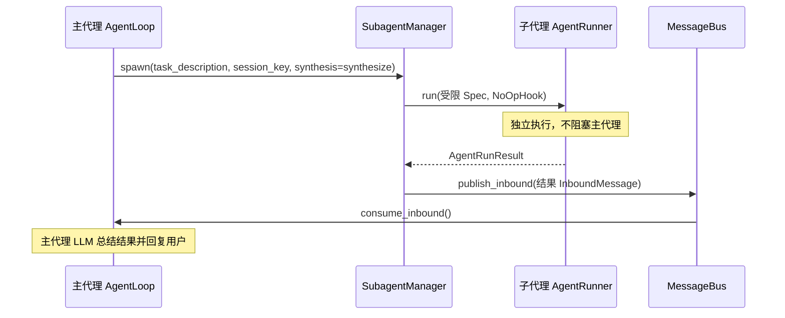
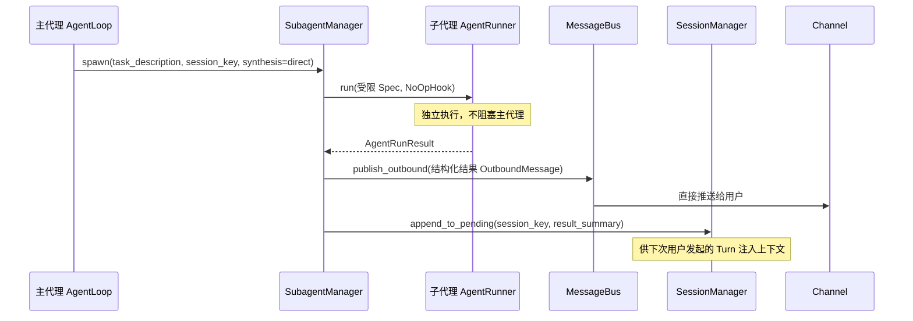

> **Status**: `active`

# SubAgent — 后台任务派生

---

## § 职责定位

SubagentManager 负责管理从主代理派生的后台任务 AgentRunner 实例，不负责主代理的会话管理、消息路由或与用户的直接交互。

---

## § 核心原则

**禁止递归派生**：子代理不能再派生子代理，防止无界任务树。SubagentManager 在构建子代理的 AgentRunSpec 时，从工具集中移除 `spawn_subagent` 工具。

**结果回注**：子代理执行完成后将结果作为 InboundMessage 发布到 MessageBus，由主代理 AgentLoop 消费后汇报给用户。子代理不直接写 OutboundMessage。

---

## § 边界与实体

**输入**：主代理 LLM 生成的 `spawn_subagent` 工具调用，携带任务描述文本、可选的上下文信息，以及 `synthesis` 字段（`direct` 或 `synthesize`）。

**输出**：子代理执行完成后：

- `synthesize` 模式：结果封装为 InboundMessage 发布到 MessageBus（由主代理 AgentLoop 消费后汇报给用户）
- `direct` 模式：结果直接格式化为 OutboundMessage 推送给用户，并将摘要写入 Session.pending_subagent_results（供下次对话注入上下文）

**核心实体**：

**SubagentTask**：一次后台任务的执行单元。
关键属性：任务描述（传递给子代理 LLM 的自然语言指令）、所属 `session_key`（创建时主代理的会话标识）、执行状态（Pending / Running / Completed / Failed）、`synthesis` 模式（决定结果回注方式）。
关系：由 SubagentManager 创建并跟踪；SubagentTask 完成时，SubagentManager 根据 `synthesis` 模式选择回注路径。

**受限 AgentRunSpec**：子代理使用的执行配置，与主代理 Spec 的区别：
关键属性：迭代上限更低（防止后台任务失控）、工具集中不含 `spawn_subagent`（防止递归）、`fail_on_tool_error=true`（快速失败）。
关系：由 SubagentManager 构建，传入独立的 AgentRunner 实例执行。

**SubagentResult**：子代理执行结果的结构化表示。
关键属性：任务描述摘要、执行状态、结果内容（或错误信息）、执行时长、Token 用量。
关系：`direct` 模式下直接格式化输出；`synthesize` 模式下封装为 InboundMessage 由主代理 LLM 消费。

---

## § 生命周期流程

### synthesize 模式（传统路径）

### direct 模式（优化路径）

---

## § 关键流程

1. 主代理 LLM 生成 `spawn_subagent` 工具调用，携带任务描述和 `synthesis` 字段。
2. ToolRegistry 将调用路由到 SubagentManager.spawn() 方法。
3. SubagentManager 构建受限 AgentRunSpec：系统消息说明子代理角色，工具集移除 `spawn_subagent`，迭代上限设为子代理专用值，`fail_on_tool_error=true`。
4. SubagentManager 创建独立 `tokio::spawn` 任务，在后台运行 `AgentRunner.run(spec, &mut NoOpHook)`。
5. `spawn_subagent` 工具立即返回"子代理已启动"给主代理 LLM，主代理可继续处理其他事务。
6. 子代理 AgentRunner 在后台完成执行，SubagentManager 根据 `synthesis` 字段选择回注路径：
   - **`synthesize` 模式**：将结果格式化为自然语言摘要，封装为 InboundMessage 发布到 MessageBus
   - **`direct` 模式**：将结构化结果格式化为用户可读格式，直接发布 OutboundMessage 推送给用户；同时将摘要写入 Session.pending_subagent_results（供下次对话上下文注入）
7. `synthesize` 模式下，主代理 AgentLoop 从 MessageBus 消费该消息，主代理 LLM 将结果总结为用户友好的回复。

---

## § synthesis 模式选择指南

| 场景 | 推荐模式 | 理由 |
|------|---------|------|
| 文件分析、数据整理、搜索汇总 | `direct` | 结果明确，不需要主代理 LLM 二次翻译；Token 成本低，用户体验直接 |
| 模糊结果需主代理决策 | `synthesize` | 子代理返回的信息需要主代理综合判断、询问用户、或规划后续步骤 |
| 多步骤子任务，结果需整合 | `synthesize` | 子代理结果需要与主代理上下文融合后呈现给用户 |

**默认策略**：鼓励使用 `direct` 模式。只有明确需要 LLM 综合时才用 `synthesize`。这体现架构对效率的优先保证——通用路径应是最低成本路径。

---

## § 约束汇总

| 约束 | 值 | 理由 |
|------|-----|------|
| 递归派生 | 禁止 | 防止无界任务树，保证资源可控 |
| 直接发送用户消息 | 禁止 | 保持主代理作为单一对话角色 |
| 迭代上限 | 低于主代理 | 防止后台任务占用过长 |
| 工具错误策略 | fail_on_tool_error=true | 快速失败，保留部分结果，由主代理决策 |

---

## § 设计决策与权衡

| 决策问题 | 选择 | 放弃的替代方案 | 理由 |
|---------|------|--------------|------|
| 子代理结果如何传回主代理？ | 双路径：`direct` 直接推送用户，`synthesize` 触发 InboundMessage | 统一走 InboundMessage | 统一路径导致所有子代理结果都产生一次完整 LLM Turn（Token 成本高、时序不可控）；双路径让简单任务直接呈现，仅复杂任务触发 LLM 综合 |
| spawn_subagent 工具是否阻塞等待结果？ | 不阻塞，立即返回"已启动" | 阻塞等待子代理完成 | 阻塞会占用主代理的迭代上限计数；子代理可能耗时较长（文件分析、多步骤任务），阻塞对用户体验不友好 |
| 是否允许子代理直接向用户发送消息？ | 不允许；`direct` 模式下由 SubagentManager 格式化和发布 OutboundMessage | 允许子代理写 OutboundMessage | 多路消息并发到达用户会造成混乱；`direct` 模式下 SubagentManager 统一格式化，保证输出一致性 |
| 如何防止子代理递归派生？ | 构建 Spec 时从工具集移除 `spawn_subagent` | 运行时检测调用栈 | 移除工具是最简单可靠的方式；LLM 不会调用不存在的工具，无需运行时状态追踪 |
| 子代理的 Session Key 如何确定？ | 与主代理相同（继承） | 独立生成 | 结果消息需要被主代理消费；相同 session_key 使 MessageBus 路由自然指向主代理的 Channel |
| 如何限制子代理的资源使用？ | 降低迭代上限 + 禁用递归 + 简化 Hook | 与主代理相同配置 | 子代理是后台任务，不应占用与主代理相同的资源；受限配置防止后台任务失控 |
| 子代理结果如何处理过长？ | 截断后注入主上下文（`synthesize` 模式）或直接展示关键部分（`direct` 模式） | 完整注入 | 完整结果可能超过上下文窗口；截断保留关键信息，由主代理 LLM 或用户在 `direct` 模式下决定是否请求更多细节 |
| 如何取消运行中的子代理？ | SubagentManager 持有任务句柄，支持取消 | 不支持取消 | 取消支持让用户可以中断长时间运行的后台任务；通过任务句柄实现，与主代理取消机制一致 |
| 子代理的错误如何报告？ | `direct` 模式下直接推送错误通知，`synthesize` 模式下作为 InboundMessage 返回由主代理 LLM 解释 | 直接抛异常 | 异常会终止主代理；两种模式都使主代理可以优雅处理错误，向用户解释问题 |
| 子代理结果如何注入下次对话上下文？ | `direct` 模式下写入 Session.pending_subagent_results，`synthesize` 模式下通过 Turn 历史自动保留 | 所有结果都需用户发起查询才能获取 | `direct` 模式保证子代理完成即通知用户，同时在下次对话中上下文可用，无需用户额外询问 |
