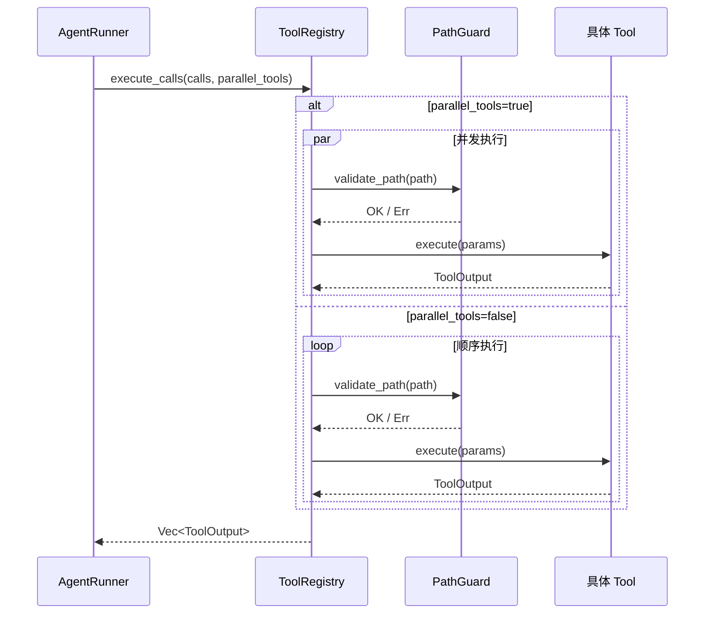

> **Status**: `active`

# Tools — 工具系统

---

## § 职责定位

Tools 系统负责内置工具的注册、Schema 管理和执行调度，不负责工具的具体业务逻辑实现（各工具文件各自负责）、MCP 工具的连接管理（由 MCP 模块负责）或 Skills 指令的加载（由 Skills 模块负责）。

---

## § 核心原则

**路径沙箱强制**：所有文件类工具的路径请求在执行前必须通过 PathGuard 验证，验证失败立即返回错误，不进入文件 I/O 操作。

---

## § 边界与实体

**输入**：来自 AgentRunner 的工具调用列表（`Vec<ToolCall>`），每个调用包含工具名称和 JSON 参数；以及来自 ContextPipeline 的工具 Schema 查询（用于注入 Core 层）。

**输出**：工具执行结果（`Vec<ToolOutput>`），格式化为 LLM 可消费的文本内容，追加为 ToolResult 消息；工具 Schema 列表（`Vec<ToolSchema>`），注入 AgentRunSpec 的 tools 字段。

**核心实体**：

**Tool trait**：所有工具实现的接口契约，定义工具的自描述能力和异步执行方法。

```
fn name(&self) -> &str
fn description(&self) -> &str
fn parameters_schema(&self) -> serde_json::Value
async fn execute(&self, params: serde_json::Value) -> Result<String, String>
```

**ToolRegistry**：工具的注册中心和执行调度器。
关键属性：工具名称到 Tool 实现的映射（`HashMap<String, Box<dyn Tool>>`）、缓存的 JSON Schema 列表。
关系：由 AppRuntimeBuilder 创建，注入 AgentRunner；同时被 ContextPipeline 的 ToolSchemaSource 引用以获取 Schema。

**PathGuard**：文件系统工具的路径访问控制器，强制所有路径在 `vault_path` 范围内。
关键属性：允许的根路径（`vault_path`，运行时确定）。
关系：FileReadTool、FileWriteTool、FileEditTool 在 `execute()` 入口处调用 PathGuard 验证，不通过则拒绝执行。

---

## § 内置工具清单

| 工具名 | 职责 | PathGuard |
|--------|------|-----------|
| `file_read` | 读取 vault 内文件内容 | 是 |
| `file_write` | 写入或覆盖 vault 内文件 | 是 |
| `file_edit` | 按内容匹配替换文件指定片段 | 是 |
| `find_files` | 在 vault 内按 Glob 模式搜索文件 | 是 |
| `search_content` | 在 vault 内按正则表达式搜索文件内容 | 是 |
| `shell` | 执行系统命令（独立命令注入防护） | 否（不限路径） |

MCP 工具以 `mcp__` 前缀注册，由 MCPManager 代理，见 [03.08-mcp.md](./03.08-mcp.md)。

---

## § 工具执行流程



---

## § 关键流程

1. AppRuntimeBuilder 创建 ToolRegistry，注册所有内置工具（包括 `file_read`、`shell` 等），从 MCPManager 注入 MCPTool 代理。
2. ContextPipeline 的 ToolSchemaSource 在构建 Core 层时，调用 `registry.list_schemas()` 获取所有工具的 JSON Schema，合并后注入系统消息。
3. LLM 响应含工具调用时，AgentRunner 将调用列表传给 `registry.execute_calls()`。
4. ToolRegistry 根据 AgentRunSpec 的 `parallel_tools` 字段，选择并发或顺序执行工具。
5. 文件类工具在 `execute()` 内首先调用 PathGuard 验证路径；Shell 工具验证命令无注入危险字符。
6. 所有工具结果汇总为 `Vec<ToolOutput>` 返回 AgentRunner，追加为 ToolResult 消息。

---

## § 设计决策与权衡

| 决策问题 | 选择 | 放弃的替代方案 | 理由 |
|---------|------|--------------|------|
| 工具 Schema 注入在哪一层？ | Core 层（稳定缓存，多请求间不变） | Dynamic 层（每次重新生成） | 工具 Schema 在会话期间稳定；放 Core 层支持 LLM KV-cache 复用，降低 token 成本 |
| 文件访问如何限制？ | PathGuard 在 Rust 层强制路径验证 | Tauri FS 权限声明（JSON） | PathGuard 精确到 vault_path 级别，私有区（vault/private/）单独拒绝，无需 Tauri 权限介入 |
| 工具并发执行如何控制？ | AgentRunSpec.parallel_tools 字段 + 实现层 Semaphore | 固定并行或固定顺序 | 工具间可能有依赖关系（写文件后读文件需顺序）；声明式配置让调用方控制策略，ToolRegistry 不做业务判断 |
| MCP 工具如何集成？ | MCPTool 代理类，注册在同一 ToolRegistry | MCP 工具使用独立注册表 | 对 AgentRunner 透明：Runner 看到的只是实现了 Tool trait 的对象，不区分内置还是 MCP |
| Shell 工具的安全如何保证？ | 命令注入防护（检测危险模式）+ 进程隔离 | 完全禁止 Shell 工具 | Shell 工具是 Agent 强大能力的来源；通过防护而非禁止，在能力和安全间取得平衡 |
| 取消时如何保证文件完整性？ | 原子写入（temp + rename） | 写前复制（Copy-on-Write） | temp+rename 在 POSIX/Windows 均原子，实现简单；COW 依赖文件系统特性，复杂度高 |
| 长时间运行工具如何响应取消？ | 定期检查 CancellationToken | 不响应取消（等执行完成） | 不响应导致用户感知的停止延迟；定期检查可及时终止，但只在安全点检查避免数据损坏 |
| Shell 工具安全模型？ | 白名单 + 用户确认 + 可选受限环境 | 黑名单模式检测 | 黑名单可被绕过（编码、拼接等）；白名单明确允许的行为，更安全可审计 |
| 危险命令如何处理？ | 需用户显式确认 | 完全禁止 | 某些场景需要 rm 等命令；确认机制在能力与安全间取得平衡 |
