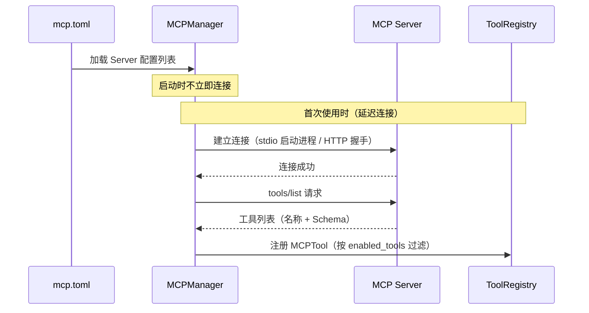

> **Status**: `active`

# MCP — 外部工具协议集成

---

## § 职责定位

MCPManager 负责管理与外部 MCP Server 的连接生命周期，并将外部工具注册到 ToolRegistry，不负责工具的执行调度策略或 Agent 的执行控制。

---

## § 边界与实体

**输入**：`mcp.toml` 配置文件，声明外部 MCP Server 的连接方式（stdio / streamable-http）、Server 名称和允许的工具列表。

**输出**：注册到 ToolRegistry 的 MCPTool 代理实例集合，对 AgentRunner 完全透明（与内置工具接口一致）。

**核心实体**：

**MCPServer**：一个外部 MCP Server 连接的配置与运行时状态。
关键属性：Server 名称（唯一标识）、传输类型（stdio 命令 / HTTP URL）、连接状态（Disconnected / Connecting / Connected）、允许工具列表（`enabled_tools`，空表示允许全部）。
关系：由 MCPManager 管理，每个 Server 对应一组从该 Server 发现的 MCPTool 实例。

**MCPTool**：单个 MCP 工具的代理，实现 Tool trait，将执行请求透明转发到对应 MCPServer。
关键属性：工具名称（格式 `mcp__<tool_name>`，确保唯一性）、Tool Schema（从 Server 获取）、所属 Server 引用。
关系：注册在 ToolRegistry 中，与内置工具并列；AgentRunner 调用时由 MCPTool 代理转发到 MCPManager。

---

## § 传输方式对比

| 传输类型 | 适用场景 | 连接方式 | 特点 |
|---------|---------|---------|------|
| `stdio` | 本地命令行工具（npx、uvx、Python 脚本） | 启动子进程，stdin/stdout 通信 | 无需网络，低延迟，进程生命周期与 MindClaw 绑定 |
| `streamable-http` | 远程 Web 服务 | HTTP 连接，支持 SSE 推送 | 支持远程部署，自动兼容旧版 SSE 协议 |

---

## § 工具发现与注册流程

---

## § 关键流程

1. AppRuntimeBuilder 读取 `mcp.toml`，创建 MCPManager（含各 Server 配置），但不立即建立连接。
2. AgentLoop 首次需要 MCP 工具时（或启动时按需），MCPManager 的 `ensure_connected()` 建立连接。
3. 连接成功后，MCPManager 调用 MCP 协议的 `tools/list` 接口获取工具列表。
4. 按 `enabled_tools` 字段过滤（空列表表示允许全部），为每个工具创建 MCPTool 代理并注册到 ToolRegistry。
5. AgentRunner 调用 MCPTool 时，MCPTool 通过 MCPManager 将 `tools/call` 请求转发给对应 Server。
6. Server 执行完成返回结果，MCPTool 将结果格式化为标准 ToolOutput 返回给 AgentRunner。
7. AgentLoop 关闭时，MCPManager 依次关闭所有 Server 连接（stdio 终止子进程，HTTP 关闭连接）。

---

## § 设计决策与权衡

| 决策问题 | 选择 | 放弃的替代方案 | 理由 |
|---------|------|--------------|------|
| MCP Server 何时连接？ | 首次使用时延迟连接（lazy connect） | 应用启动时立即连接全部 | 启动时连接所有 Server 会阻塞应用启动；用户未必会使用所有 MCP Server，按需连接节省资源 |
| MCP 工具命名规范？ | `mcp__<toolname>` 命名空间前缀 | 与内置工具共享命名空间 | 明确区分来源，避免同名冲突；调试日志中可直接识别工具来源 |
| 工具过滤在哪层控制？ | `mcp.toml` 的 `enabled_tools` 字段（配置时声明） | 运行时动态启用/禁用 | 声明式配置清晰可审查，用户一次性决定哪些外部工具可用，不需要运行时管理 |
| 单个 Server 连接失败是否中止启动？ | 优雅降级：记录错误，继续启动，跳过该 Server 的工具 | 任一 Server 失败则整体启动失败 | MCP 工具是可选扩展，核心功能不依赖任何 MCP Server；单点失败不应影响内置工具可用性 |
| 使用哪个 Rust SDK？ | rmcp（MCP 官方 Rust SDK） | 自行实现 MCP 协议解析 | rmcp 由 MCP 官方维护，与协议版本同步；自行实现需要持续跟进协议变更，维护成本高 |
| MCP 工具如何与内置工具区分？ | 命名空间前缀 `mcp__` | 无区分 | 明确标识工具来源，便于调试和问题定位；用户可一眼看出工具来自外部 MCP Server 还是内置 |
| MCP 连接超时如何处理？ | 可配置超时，超时后视为连接失败 | 固定超时 | 不同 MCP Server 的启动时间差异大（本地命令 vs 远程 HTTP），可配置超时适应不同场景 |
| MCP Server 崩溃后如何恢复？ | 下次使用时自动重连 | 立即重连 | 立即重连可能进入快速失败循环；下次使用时重连让系统有机会恢复 |
| 如何处理 MCP 工具返回的非文本内容？ | Base64 编码为文本 | 拒绝非文本 | LLM 目前主要处理文本；Base64 编码使二进制内容可被 LLM 消费（如图片分析场景） |
| MCP 发现后如何更新 Core 层缓存？ | ToolRegistry 变更通知 + CoreCache 失效标记 | 定时轮询检查 | 通知机制即时响应，无额外轮询开销；轮询有延迟或增加 CPU 占用 |
| 缓存失效是部分还是全部？ | 全部重建 | 仅追加 MCP 工具 Schema | MCP 工具可能重名或冲突，需要重新全量构建确保一致性；重建成本低（仅文件读取） |
