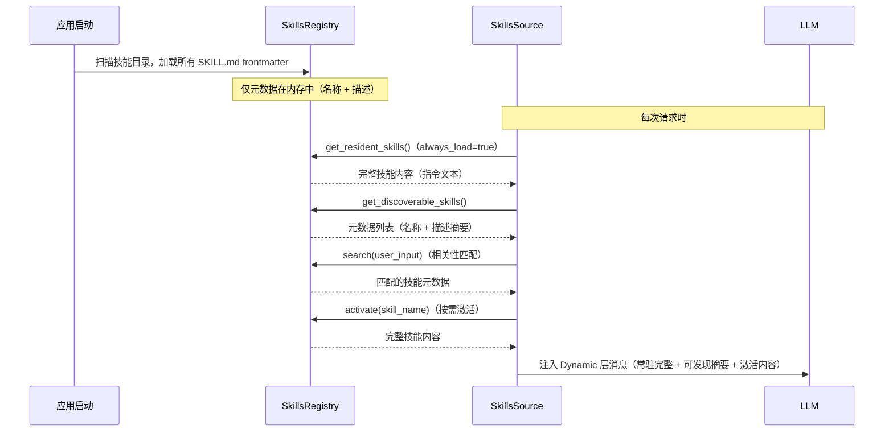

> **Status**: `active`

# Skills — 能力扩展机制

> 遵循 [Agent Skills](https://agentskills.io) 规范的渐进式能力加载系统。

---

## § 职责定位

Skills 系统负责发现、加载和向上下文注入技能指令，不负责工具 Schema 的注册或执行（技能描述"何时使用"，工具实现"如何执行"）。

---

## § 边界与实体

**输入**：文件系统上的 Skill 目录（每个技能一个目录，包含 `SKILL.md`）和当前用户输入（用于相关性匹配）。
**输出**：注入到 Context Building Dynamic 层的系统消息，包含常驻技能完整指令和可发现技能摘要。

**核心实体**：

**SkillManifest**：单个技能的元数据和指令内容的内存表示。
关键属性：名称、描述（用于相关性匹配）、`always_load` 标记（常驻 vs 可发现）、指令文本。
关系：由 SkillsRegistry 管理，作为 ContextSource 注入 Dynamic 层。

**SkillsRegistry**：所有已发现技能的注册中心，负责扫描目录、缓存元数据。
关键属性：按名称索引的 SkillManifest 列表。
关系：被 SkillsSource（ContextSource 实现）持有，每次请求时按用户输入检索相关技能。

---

## § 技能目录结构

```
skills/
└── <skill-name>/
    ├── SKILL.md        必需：YAML frontmatter（元数据）+ 正文（指令）
    ├── scripts/        可选：可执行脚本
    ├── references/     可选：参考文档（按需加载）
    └── assets/         可选：模板、资源文件
```

Skills 扫描路径优先级（高到低）：Project → User → Builtin → Compatibility。

---

## § 技能生命周期



---

## § 渐进式披露三阶段

| 阶段 | 触发时机 | 加载内容 | Token 成本 |
|------|---------|---------|-----------|
| 元数据 | 应用启动 | 名称 + 描述 | 极低（~100 tokens/技能） |
| 指令 | 技能激活（用户输入相关或 `always_load=true`） | 完整 SKILL.md 正文 | 中等（< 5000 tokens） |
| 资源 | LLM 按需请求 | references/ 和 assets/ | 按需 |

---

## § 关键流程

1. SkillsRegistry 在初始化时扫描所有技能目录，加载各技能的 SKILL.md frontmatter（元数据阶段）。
2. ContextPipeline 构建 Dynamic 层时，SkillsSource 调用 SkillsRegistry：
   - `always_load=true` 的技能：完整内联指令内容。
   - 其余技能：仅注入"名称 + 描述"摘要，供 LLM 判断是否需要激活。
3. SkillsSource 根据用户输入文本，匹配相关技能（名称/描述相似度），激活后加载完整指令注入上下文。

---

## § 设计决策与权衡

| 决策问题 | 选择 | 放弃的替代方案 | 理由 |
|---------|------|--------------|------|
| 所有技能是否启动时全量加载？ | 元数据启动加载，指令按需激活 | 全量加载所有技能指令 | 技能数量增长后全量加载会超过上下文窗口；渐进式保证可扩展性 |
| 技能是否与工具注册耦合？ | 独立系统，Skills 只提供指令，Tools 提供执行 | Skills 内嵌工具注册 | 职责分离：技能描述场景和使用方式，工具定义具体能力；两者独立演化 |
| 技能目录名与 name 字段的关系？ | 目录名必须等于 SKILL.md 中的 `name` 字段 | 目录名任意 | 强约束避免命名混淆，简化查找逻辑：按目录名即可直接定位技能 |
| 多个技能同时匹配时如何处理？ | 取相关性最高的前 N 个激活（N 可配置） | 激活所有匹配技能 | 全部激活会将大量技能指令注入上下文，超过 token 预算；相关性排序保证最有用的技能优先 |
| 技能扫描路径的优先级？ | Project > User > Builtin > Compatibility | 无优先级，所有技能等权重 | 项目级技能覆盖用户级，用户级覆盖内置；允许在项目内定制或覆盖通用技能 |
