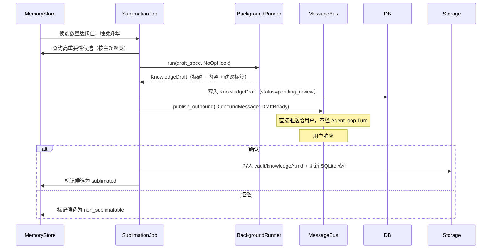
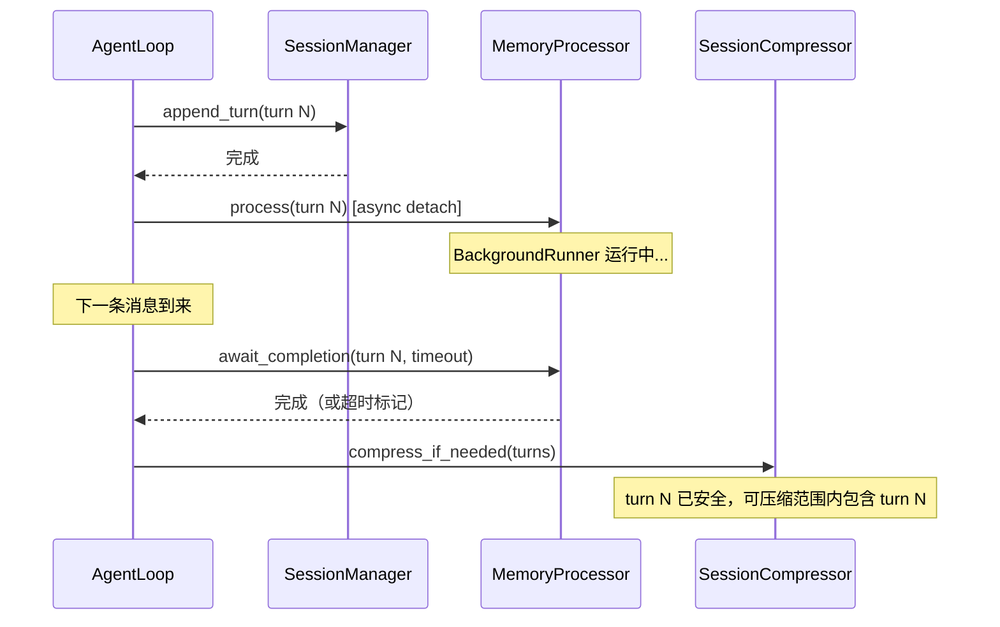

> **Status**: `active`

# Memory — 写入路径与升华机制

---

## § 职责定位

MemoryProcessor 负责从完成的 Turn 中提取记忆并写入 MemoryStore，MemorySublimationJob 负责将高重要性记忆升华为知识草稿，不负责记忆的读取与召回（由 MemorySource / ContextPipeline 负责）、知识草稿的用户审核交互（由 Channel 层负责）或知识笔记的持久化（由 Storage 层负责）。

---

## § 核心原则

**提取先于压缩**：Turn 的记忆提取必须在该 Turn 被 SessionCompressor 压缩前完成。MemoryProcessor 完成（或超时）前，SessionCompressor 不压缩该 Turn。

**后台不阻塞前台**：MemoryProcessor 和 MemorySublimationJob 均通过 BackgroundRunner 执行 LLM 调用，使用独立的 Background Semaphore，不与用户交互的 Concurrency Gate 竞争。

---

## § 边界与实体

**输入**：Turn（来自 `SessionManager.append_turn()` 完成后触发）；用户确认/拒绝信号（来自 Channel 层的 InboundMessage）。

**输出**：Memory 条目写入 MemoryStore；KnowledgeDraft 写入 DB（升华阶段）；正式 Note 写入 vault（用户确认后）；`OutboundMessage::DraftReady`（直接发布，不经 AgentLoop Turn）。

**核心实体**：

**Memory**：Agent 对用户的一次观察记录。
关键属性：类别（Profile / Preferences / Events / Cases）、内容文本、重要性评分（高 / 中 / 低）、来源 Turn ID、衰减系数。
关系：属于一个 Session；高重要性 Memory 标记为升华候选，可升华为 Note。

**KnowledgeDraft**：升华候选生成的待审核知识草稿，尚未写入 vault。
关键属性：草稿标题、内容、建议标签、来源 Memory ID 列表、审核状态（pending_review / confirmed / rejected）。
关系：用户确认后由 Storage 层写入 `vault/knowledge/`，成为正式 Note；拒绝后候选标记为不可升华。

---

## § 两条写入路径

### 路径 A：显式写入（create_memory 工具）

LLM 在迭代中主动调用 `create_memory` 工具，直接写入 MemoryStore。重要性由 LLM 判断，不触发额外 LLM 调用，实时生效。

```
AgentRunner 迭代中
    │
    └── LLM 调用 create_memory(content, category, importance)
            │
            └── ToolRegistry.execute() → MemoryStore.write()
```

路径 A 是主写入路径。SOUL.md 中的 Agent 人格指令引导 LLM 在发现重要信息时主动调用此工具。

### 路径 B：自动提取（MemoryProcessor）

Turn 持久化后，AgentLoop 触发 MemoryProcessor 后台任务。规则层先过滤，降低不必要的 LLM 配额消耗：

```
SessionManager.append_turn(turn) 完成
    │
    └── MemoryProcessor.process(turn) [tokio::spawn, detached]
              │
              ├── 规则层过滤：检测个人信息、事件、偏好特征
              │       └── 无特征 → 跳过（不消耗 BackgroundRunner 配额）
              │
              └── 有特征 → BackgroundRunner.run(extraction_spec, NoOpHook)
                              → 提取候选 Memory 列表
                              → MemoryStore.write_batch()
                              → 检查升华阈值，满足则触发 MemorySublimationJob
```

路径 B 捕获 LLM 未显式记录的隐性信息（用户语气、隐含偏好等）。

---

## § 记忆升华流程

MemorySublimationJob 在 pending 升华候选数量达阈值时触发（或 Session 结束时兜底触发）：



升华通知直接通过 MessageBus 发布 `OutboundMessage::DraftReady`，不触发 AgentLoop Turn，不消耗 Concurrency Gate 槽位。

---

## § 执行顺序约束

记忆提取与 Session 压缩之间存在强顺序依赖：



**超时处理**：若 MemoryProcessor 超时未完成，AgentLoop 继续推进（优先保证响应速度）。未完成提取的 Turn 标记为"待处理"，SessionCompressor 跳过该 Turn，保留到下次检查。

---

## § 设计决策与权衡

| 决策问题 | 选择 | 放弃的替代方案 | 理由 |
|---------|------|--------------|------|
| 记忆如何创建？ | 双路径：LLM 显式工具调用（路径 A）+ 后台自动提取（路径 B） | 仅自动提取 | 路径 A 精度高，LLM 可直接判断重要性；路径 B 捕获隐性信息。纯自动提取信噪比低，纯显式依赖 LLM 主动性，二者互补 |
| 自动提取的 LLM 调用走哪条路径？ | BackgroundRunner（独立 Background Semaphore） | AgentLoop InboundMessage 路径（产生完整 Turn） | 后台提取不应占用用户交互配额；通过 InboundMessage 会产生不必要的对话 Turn，增加 Token 成本 |
| 升华通知如何推送给用户？ | 直接发布 OutboundMessage::DraftReady | 通过 InboundMessage 触发主代理 Turn 生成通知 | 升华通知是系统事件，不需要主代理 LLM 生成响应；直接推送减少 Token 消耗，且通知内容格式固定，无需生成 |
| 提取与压缩的顺序如何保证？ | MemoryProcessor 完成（或超时）后，SessionCompressor 才压缩该 Turn | 压缩和提取独立调度，无顺序约束 | 压缩会丢失原文细节；若先压缩再提取，提取质量下降；顺序约束保证记忆完整性，超时兜底保证不无限等待 |
| 升华草稿的最终写入由谁执行？ | 用户确认后由 MemorySublimationJob 调用 Storage 层写入 | Agent 自动写入 vault，用户无确认 | 体现"知识是共同的"——Knowledge 由人类主权；Agent 自动写入绕过人类审查，可能引入不准确的知识 |
