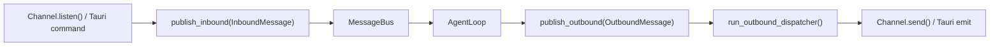
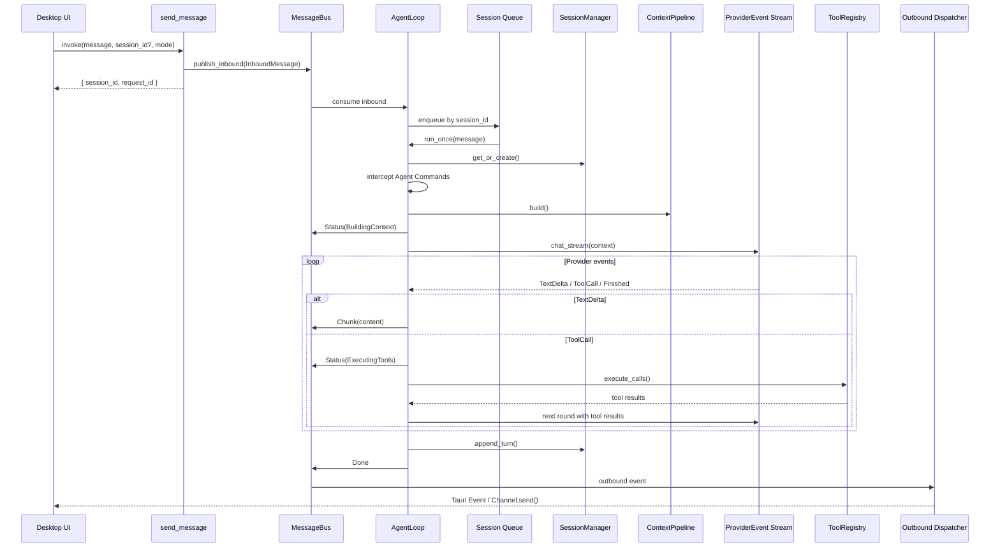
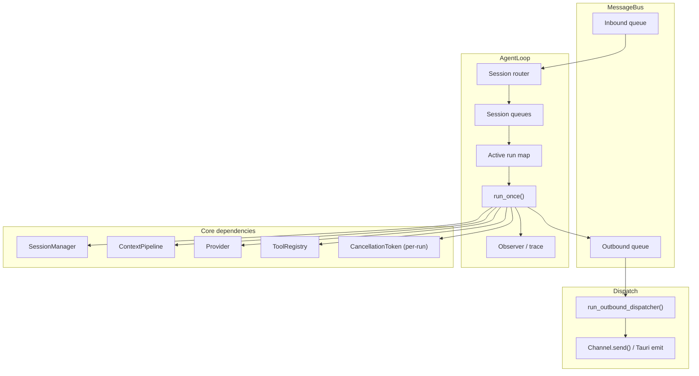
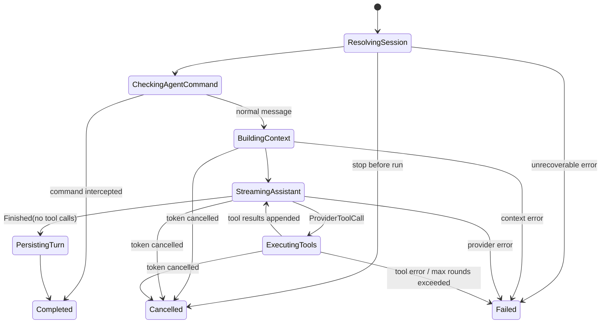

# MindClaw 技术架构设计

> 完整架构文档索引见 [README.md](./README.md)

## 六、Agent 架构

> 参考 [zeroclaw](https://github.com/zeroclaw-labs/zeroclaw) 的 Channel + Agent 分层模式。

### 6.1 整体结构

```
┌─────────────────────────────────────────────────────────────┐
│                      Channel Layer                          │
│  ┌──────────┐  ┌──────────────┐  ┌───────────────┐         │
│  │ Desktop  │  │ Telegram Bot │  │  Feishu Bot   │         │
│  │ Channel  │  │   Channel    │  │   Channel     │         │
│  └─────┬────┘  └──────┬───────┘  └───────┬───────┘         │
│        └──────────────┼──────────────────┘                  │
│                       │                                     │
│              ChannelMessage / SendMessage                    │
└───────────────────────┼─────────────────────────────────────┘
                        │
┌───────────────────────┼─────────────────────────────────────┐
│                  Gateway Layer                              │
│  ┌──────────────┐  ┌──────────────┐  ┌────────────────┐    │
│  │ HTTP Server  │  │  WebSocket   │  │  Auth Guard    │    │
│  │ (PWA/API)    │  │  (实时对话)   │  │  (Token/签名)  │    │
│  └──────┬───────┘  └──────┬───────┘  └────────────────┘    │
│         └─────────────────┘                                 │
└───────────────────────┼─────────────────────────────────────┘
                        │
                        ▼
┌─────────────────────────────────────────────────────────────┐
│                  Core Agent Service                         │
│                                                             │
│  ┌──────────┐ ┌──────────┐ ┌────────┐ ┌────────────────┐  │
│  │ Context  │ │ Session  │ │ Router │ │   Observer     │  │
│  │ Builder  │ │ Manager  │ │        │ │ (Layer 3 观察)  │  │
│  └──────────┘ └──────────┘ └────────┘ └────────────────┘  │
│                                                             │
│  ┌───────────────────────┐   ┌──────────────────────────┐  │
│  │     Tool Registry     │   │   Memory / Knowledge     │  │
│  │  搜索·分析·写作·文件    │   │   RAG · 观察 · 知识库    │  │
│  └───────────────────────┘   └──────────────────────────┘  │
└───────────────────────┬─────────────────────────────────────┘
                        │
┌───────────────────────┼─────────────────────────────────────┐
│                  Provider Layer                             │
│  ┌─────────────────────────────────────────────────────┐   │
│  │            ProviderRegistry（配置驱动）               │   │
│  │  ┌────────────────────────────────────────────────┐ │   │
│  │  │  OpenAICompatProvider（async-openai）           │ │   │
│  │  │  OpenAI · DeepSeek · Moonshot · Groq · …       │ │   │
│  │  └────────────────────────────────────────────────┘ │   │
│  │  ┌──────────────┐  ┌──────────────────────────┐     │   │
│  │  │ Claude       │  │  Local Embedding         │     │   │
│  │  │ (独立实现)    │  │  (向量检索, Phase 2)      │     │   │
│  │  └──────────────┘  └──────────────────────────┘     │   │
│  └─────────────────────────────────────────────────────┘   │
└─────────────────────────────────────────────────────────────┘

┌─────────────────────────────────────────────────────────────┐
│               Infrastructure Layer                          │
│  ┌──────────────┐  ┌────────────────┐  ┌────────────────┐  │
│  │     Cron     │  │   Heartbeat    │  │    Logging     │  │
│  │  定时任务调度  │  │  健康检测/监控   │  │  tracing 日志  │  │
│  └──────────────┘  └────────────────┘  └────────────────┘  │
└─────────────────────────────────────────────────────────────┘
```

**Core Agent 是唯一持有完整人模型的编排器**。Channel、Gateway、Provider、Tools 都是可替换的适配层，通过 trait 解耦。Cron 和 Heartbeat 提供后台运行能力。

### 6.2 Channel 层 — 统一消息通道

Channel 是所有通信平台的抽象接口。无论消息来自桌面 UI、Telegram 还是 Feishu，Channel 直接产出 `InboundMessage` 推入 MessageBus（Desktop Channel 由 `send_message` command 代为生成 `InboundMessage`，其余 Channel 在 `listen()` 中生成）。

> **设计决策**：不再定义独立的 `ChannelMessage` 结构。Channel 直接使用 `InboundMessage`（定义在 `bus/events.rs`），`request_id` 由 Channel/Command 层生成，`session_id` 可选（新会话时为 None）。

```rust
// src-tauri/src/channels/traits.rs

pub struct SendMessage {
    pub content: String,
    pub recipient: String,
    pub metadata: Option<serde_json::Value>,
}

pub enum ChannelSource {
    Desktop,
    Telegram,
    Feishu,
    Webhook,
}

#[async_trait]
pub trait Channel: Send + Sync {
    fn name(&self) -> &str;
    fn source(&self) -> ChannelSource;
    async fn send(&self, message: OutboundMessage) -> Result<(), AppError>;
    async fn listen(&self, bus: Arc<MessageBus>) -> Result<(), AppError>;
    fn supports_streaming(&self) -> bool { false }
    async fn send_chunk(&self, _chunk: &str, _session_id: &str) -> Result<(), AppError> { Ok(()) }
    async fn start_typing(&self) -> Result<(), AppError> { Ok(()) }
    async fn stop_typing(&self) -> Result<(), AppError> { Ok(()) }
}
```

#### Channel 实现一览

| Channel | 传输方式 | 流式支持 | 入站机制 | Phase |
|---------|---------|---------|---------|-------|
| **Desktop** | Tauri IPC invoke + Event emit | Yes | Tauri command 桥接推入 Bus（listen 为空实现） | MVP |
| **Telegram** | HTTP API / Long polling | No | getUpdates 或 Webhook → Bus | Phase 1 后期 |
| **Feishu** | HTTP API / Webhook | No | Webhook → Bus | Phase 2 |
| **Webhook** | HTTP POST → Bus | No | Gateway 接收 → Bus | Phase 1 后期 |

### 6.3 MessageBus — 双向异步消息队列

MessageBus 解耦 Channel 与 Agent。它只负责事件搬运，不承担业务决策；是否执行、如何排队、何时取消，全部由 AgentLoop 决定。



**设计决策**：

- Bus 是事件驱动的异步队列，不做定时轮询。
- inbound / outbound Receiver 均采用 `take` 语义，确保单消费者。
- 出站消息使用显式 `payload` enum，前端与 Channel 只消费标准化事件，不解析正文字符串中的状态语义。

```rust
// src-tauri/src/bus/events.rs

pub struct InboundMessage {
    pub id: String,
    pub request_id: String,
    pub session_id: Option<String>,
    pub sender: String,
    pub source: ChannelSource,
    pub mode: ConversationMode,
    pub content: String,
    pub timestamp: DateTime<Utc>,
}

pub struct OutboundMessage {
    pub id: String,
    pub request_id: String,
    pub session_id: String,
    pub target: ChannelSource,
    pub payload: OutboundPayload,
}

pub enum OutboundPayload {
    Chunk { content: String },
    Done,
    Error { message: String, retryable: bool },
    Status { phase: UserVisiblePhase },  // Thinking / UsingTools / Streaming
}
```

```rust
// src-tauri/src/bus/mod.rs

pub struct MessageBus {
    inbound: mpsc::Sender<InboundMessage>,
    inbound_rx: Mutex<Option<mpsc::Receiver<InboundMessage>>>,
    outbound: mpsc::Sender<OutboundMessage>,
    outbound_rx: Mutex<Option<mpsc::Receiver<OutboundMessage>>>,
    inbound_count: AtomicUsize,
    outbound_count: AtomicUsize,
}
```

| 方法 | 调用方 | 说明 |
|------|--------|------|
| `publish_inbound(msg)` | Channel / `send_message` command | 推送入站消息 |
| `take_inbound_rx()` | AgentLoop | 取出入站 Receiver（仅一次） |
| `publish_outbound(msg)` | AgentLoop | 推送出站事件 |
| `take_outbound_rx()` | Dispatcher | 取出出站 Receiver（仅一次） |
| `inbound_pending()` | `/status` | 入站待处理数 |
| `outbound_pending()` | `/status` | 出站待分发数 |

出站消费循环 `run_outbound_dispatcher()` 根据 `OutboundMessage.target` 路由到对应 Channel；Desktop Channel 将 `OutboundPayload` 映射为 Tauri Event 发给前端。

### 6.4 消息流水线（端到端）

首期对话链路按 Desktop 优先设计，但消息模型保持多 Channel 兼容。外层是事件驱动队列，内层是单次 run 的有限回合工具循环。



关键边界：

- `send_message` 只负责入队并立即返回 `{ session_id, request_id }`。
- `AgentLoop` 负责同一 session 的串行化，不允许多个 run 同时写同一会话。
- 工具回合是单次 run 内部的有限 loop，最多 8 轮；它不是系统级轮询架构。
- `Done`、`Error`、`Status` 与文本 `Chunk` 分离，避免正文承载状态协议。

### 6.5 Agent 核心：Loop · Session · Identity

Agent 核心围绕“事件驱动外层 + 单次 run 状态机 + 有限工具循环”构建。消息是否执行、如何排队、何时取消，都在这一层被决定。



#### AgentLoop — 事件驱动编排器

```rust
// src-tauri/src/agent/agent_loop.rs

/// Session 级串行化状态：队列 + 活跃 run 合并在同一 Mutex 内，避免 check-then-act 竞态。
struct SessionSlot {
    queue: VecDeque<InboundMessage>,
    steering_queue: VecDeque<String>,  // 运行中注入的补充指令（steering）
    active_run: Option<RunHandle>,
}

pub struct AgentLoop {
    bus: Arc<MessageBus>,
    session_mgr: Arc<SessionManager>,
    context_pipeline: Arc<ContextPipeline>,
    provider: Arc<dyn Provider>,
    tools: Arc<ToolRegistry>,
    agent_commands: Arc<AgentCommandRegistry>,
    sessions: DashMap<String, Mutex<SessionSlot>>,
    observer: Arc<dyn AgentObserver>,
}
```

`AgentLoop` 的职责固定为：

1. 消费 `InboundMessage` 并按 session 串行排队（`SessionSlot` 内原子操作）。
2. 为每条消息创建单次 `run_once()` 执行。
3. 在 `run_once()` 中驱动 Session → Context → Provider → Tool → Session append。
4. 将运行态映射为 `OutboundPayload` 和内部观测事件。
5. 管理取消令牌（per-run `CancellationToken`）与活跃 run 生命周期。
6. run 完成后自旋检查队列，消费同 session 的下一条消息。

```rust
impl AgentLoop {
    /// 向指定 session 的活跃 run 注入 steering 补充指令。
    /// 若无活跃 run，消息直接入普通 queue（下一次 run_once 时作为前置 user 消息）。
    pub async fn steer(&self, session_id: &str, message: String) -> Result<(), AppError>;
}
```

**外层不使用全局 `while (true)` 轮询架构**。唯一允许的 loop 是单次 run 内部的有限工具回合循环。

#### 消息入队与 Session 串行化

```rust
// 入站消息处理（在消费 inbound 的 tokio task 中）
async fn on_inbound(&self, message: InboundMessage) {
    let session_id = &message.session_id;
    let mut slot = self.sessions
        .entry(session_id.clone())
        .or_insert_with(|| Mutex::new(SessionSlot::default()))
        .lock().await;

    if slot.active_run.is_some() {
        // 已有活跃 run → 入队等待
        slot.queue.push_back(message);
    } else {
        // 无活跃 run → 启动新 run
        let cancel = CancellationToken::new();
        slot.active_run = Some(RunHandle { cancel: cancel.clone(), .. });
        drop(slot); // 释放锁后再执行 run
        self.run_session_loop(session_id.clone(), message, cancel).await;
    }
}

// Session 串行循环：run 完成后自旋消费队列
async fn run_session_loop(&self, session_id: String, first: InboundMessage, cancel: CancellationToken) {
    self.run_once(first, cancel).await;

    loop {
        let next = {
            let mut slot = self.sessions.get(&session_id).unwrap().lock().await;
            slot.active_run = None;
            match slot.queue.pop_front() {
                Some(msg) => {
                    let cancel = CancellationToken::new();
                    slot.active_run = Some(RunHandle { cancel: cancel.clone(), .. });
                    Some((msg, cancel))
                }
                None => None,
            }
        };
        match next {
            Some((msg, cancel)) => self.run_once(msg, cancel).await,
            None => break,
        }
    }
}
```

#### 单次 run 状态机



运行规则：

- 同一 `session_id` 同时最多一个活跃 run，后续消息进入队列等待。
- `/stop` 取消当前 session 的活跃 run（通过 `RunHandle.cancel.cancel()`），不取消其他 session。
- 工具回合上限固定为 8 轮 LLM 调用（每轮 = 一次 `chat_stream` 调用，非单个 tool call），超限时发送 `Error` 并终止本次 run。
- cancelled / failed run 不持久化半成品 assistant 文本。

**Steering vs Cancel 语义区分**：

- `steer(msg)` — 软打断。消息注入 `steering_queue`，在每轮工具执行结束后合并为 user 消息，Agent 基于更新的上下文继续当前 run。适用于"等等，方向调整一下"的场景，已完成的工具轮次不会被丢弃。
- `cancel_session()` + 重新 `publish_inbound()` — 硬中止。通过 `CancellationToken` 终止当前 run，新消息作为独立 run 重新入队。适用于用户明确放弃当前任务的场景。

#### `run_once()` 核心实现

```rust
const MAX_TOOL_ROUNDS: usize = 8;

async fn run_once(&self, message: InboundMessage, cancel: CancellationToken) -> Result<(), AppError> {
    // ── 1. ResolvingSession ──
    let session = self.session_mgr.get_or_create(
        &message.sender, &message.mode, message.session_id.as_deref()
    ).await?;
    self.observer.on_event(&AgentEvent::SessionResolved { session_id: session.id.clone() }).await;

    // ── 2. CheckingAgentCommand ──
    if let Some(cmd_name) = parse_agent_command(&message.content) {
        if let Some(cmd) = self.agent_commands.get(cmd_name) {
            let ctx = AgentCommandContext {
                session: session.clone(),
                session_mgr: self.session_mgr.clone(),
                // cancel_token: ... (从活跃 run 获取)
            };
            let result = cmd.execute(ctx).await?;
            // 直接返回响应，不继续 Provider 调用
            self.emit_text_and_done(&message, &session, &result.response).await;
            self.handle_action(result.action).await?;
            return Ok(());
        }
    }

    // ── 3. BuildingContext ──
    self.emit_status(&message, UserVisiblePhase::Thinking).await;
    let built_context = self.context_pipeline.build(&ContextBuildContext {
        inbound: message.clone(),
        session: Arc::new(session.clone()),
        // TODO: 添加 memory, services, db 字段
    }).await?;

    // ── 4. 有限工具循环（最多 MAX_TOOL_ROUNDS 轮 LLM 调用）──
    let mut all_tool_traces = Vec::new();
    let mut final_text = String::new();
    let mut messages = built_context.messages;

    for round in 0..MAX_TOOL_ROUNDS {
        cancel.check()?; // 每轮开始时检查取消

        // 4a. StreamingAssistant — 调用 Provider
        let mut text_buffer = String::new();
        let mut tool_calls: Vec<ToolCall> = Vec::new();

        let stream = self.provider.chat_stream(ChatRequest {
            model: context.model_tier,  // TODO: 从 built_context 获取或默认值
            messages: &messages,
            system: Some(&built_context.system_prompt),
            tools: &self.tools.schemas(),  // 常驻工具 Schema
            tool_choice: ToolChoice::Auto,
            max_tokens: None,
            cancel: cancel.clone(),
        }).await?;

        // 4b. 消费 Provider 事件流
        // Provider 实现负责在内部缓冲 tool call arguments delta，
        // 仅在参数 JSON 完整后才发出 ProviderEvent::ToolCall。
        while let Some(event) = stream.next().await {
            match event? {
                ProviderEvent::TextDelta { text } => {
                    text_buffer.push_str(&text);
                    self.emit_chunk(&message, &session, &text).await;
                    self.observer.on_event(&AgentEvent::ProviderTextDelta { len: text.len() }).await;
                }
                ProviderEvent::ToolCall { id, name, arguments_json } => {
                    tool_calls.push(ToolCall { id, name, arguments: arguments_json });
                    self.observer.on_event(&AgentEvent::ProviderToolCall { name: name.clone() }).await;
                }
                ProviderEvent::Finished { usage, .. } => break,
            }
        }

        final_text = text_buffer.clone();

        // 4c. 无工具调用 → 结束循环，进入 PersistingTurn
        if tool_calls.is_empty() {
            break;
        }

        // 4d. ExecutingTools — 并行执行工具（Semaphore 限制最多 4 并发）
        self.emit_status(&message, UserVisiblePhase::UsingTools).await;
        let start = Instant::now();
        let results = self.tools.execute_calls(tool_calls.clone(), cancel.clone()).await?;

        // 记录 tool trace
        for (call, result) in tool_calls.iter().zip(results.iter()) {
            all_tool_traces.push(ToolTrace {
                tool_name: call.name.clone(),
                input_summary: truncate(&call.arguments.to_string(), 500),
                output_summary: truncate(&result.content, 1000),
                duration_ms: start.elapsed().as_millis() as u64,
                success: !result.is_error,
                round: round as u32,
            });
        }

        // 4e. 追加 assistant message（含 tool_calls）+ tool results 到 messages
        messages.push(ChatMessage {
            role: MessageRole::Assistant,
            content: vec![MessageContent::Text(text_buffer)]
                .into_iter()
                .chain(tool_calls.iter().map(|tc| MessageContent::ToolUse {
                    id: tc.id.clone(), name: tc.name.clone(), input: tc.arguments.clone(),
                }))
                .collect(),
        });
        for result in &results {
            messages.push(ChatMessage {
                role: MessageRole::User,
                content: vec![MessageContent::ToolResult {
                    tool_use_id: result.tool_call_id.clone(),
                    content: truncate(&result.content, 4000),
                    is_error: result.is_error,
                }],
            });
        }

        self.emit_status(&message, UserVisiblePhase::Thinking).await;

        // 4e.5 检查 steering 注入（软打断）
        // 在下一轮 LLM 调用前，将 steering_queue 中的补充指令合并为 user 消息
        if let Some(steering_msgs) = self.drain_steering(&session.id).await {
            for msg in &steering_msgs {
                messages.push(ChatMessage::user(msg));
            }
            self.observer.on_event(&AgentEvent::SteeringInjected {
                count: steering_msgs.len()
            }).await;
        }

        // 4f. 若是最后一轮仍有工具调用，发送 Error
        if round == MAX_TOOL_ROUNDS - 1 && !tool_calls.is_empty() {
            self.emit_error(&message, &session, "工具循环超过最大轮数限制", false).await;
            return Ok(());
        }
    }

    // ── 5. PersistingTurn ──
    self.session_mgr.append_turn(
        &session.id,
        ChatMessage::user(&message.content),
        Some(ChatMessage::assistant_text(&final_text)),
        all_tool_traces,
    ).await?;

    // ── 6. Done ──
    self.emit_done(&message, &session).await;
    self.observer.on_event(&AgentEvent::RunCompleted).await;

    // ── 7. 派发 SubAgent（异步，不阻塞 Done 出站）──
    self.dispatch_sub_agents(&session).await;

    Ok(())
}
```

**关键设计决策**：

| 决策 | 选择 | 理由 |
|------|------|------|
| 每轮定义 | 一次完整 `chat_stream` 调用 | 一次调用可能返回多个 tool calls，按轮计比按 tool call 计更可预测 |
| 工具执行时机 | 先收完 stream，再批量执行 | 避免 stream 中途暂停的复杂状态管理 |
| 工具结果回传 | 追加到 messages，发起新 `chat_stream` | OpenAI/Claude API 都是无状态请求，无法在同一 stream 内 resume |
| 工具并行 | `join_all` + `Semaphore(4)` | 多个独立 tool calls 可并行，但限制并发防资源爆炸 |
| 取消检查 | 每轮开始 + Provider 内部 `select!` | 粗粒度检查 + 细粒度 HTTP abort |
| 运行中注入 | Steering 软打断（`steering_queue` + per-round 检查）| Steering 保留已完成的工具轮次，Agent 结合新上下文继续执行；硬取消（`CancellationToken`）用于用户明确中止的场景 |

#### 事件模型

`ProviderEvent` 是 Provider 对 AgentLoop 的输入；`AgentEvent` 是 AgentLoop 内部运行语义；`OutboundPayload` 是对前端和 Channel 暴露的用户可见事件。

```rust
// src-tauri/src/agent/events.rs

/// Provider → AgentLoop 的事件流。
/// Provider 实现必须在内部缓冲 tool call arguments delta，
/// 仅在参数 JSON 完整后才发出 ToolCall 事件。
pub enum ProviderEvent {
    TextDelta { text: String },
    ToolCall { id: String, name: String, arguments_json: Value },
    Finished { stop_reason: String, usage: UsageStats },
}

/// AgentLoop 内部观测事件（日志/审计/指标）
pub enum AgentEvent {
    RunStarted { session_id: String, request_id: String },
    SessionResolved { session_id: String },
    CommandIntercepted { name: String },
    ContextBuilt { fragments: usize },
    ProviderTextDelta { len: usize },
    ProviderToolCall { name: String },
    ToolStarted { name: String },
    ToolFinished { name: String, success: bool },
    SteeringInjected { count: usize },
    RunCompleted,
    RunCancelled,
    RunFailed { message: String },
}

/// 内部 run 阶段（仅供 AgentEvent/Observer 使用，不暴露给前端）
pub enum RunPhase {
    Queued,
    ResolvingSession,
    CheckingAgentCommand,
    BuildingContext,
    StreamingAssistant,
    ExecutingTools,
    PersistingTurn,
    Completed,
    Cancelled,
    Failed,
}

/// 前端/Channel 可见的简化状态（由 OutboundPayload::Status 携带）
pub enum UserVisiblePhase {
    Thinking,     // 组装上下文 + 等待 LLM 首 token
    UsingTools,   // 执行工具中
    Streaming,    // 正在输出文本（前端收到首个 Chunk 时自动进入）
}
```

#### AgentObserver — 内部观测接口

```rust
// src-tauri/src/agent/observer.rs

#[async_trait]
pub trait AgentObserver: Send + Sync {
    async fn on_event(&self, event: &AgentEvent);
}

/// MVP 默认实现：tracing 日志
pub struct TracingObserver;

#[async_trait]
impl AgentObserver for TracingObserver {
    async fn on_event(&self, event: &AgentEvent) {
        tracing::info!(?event, "agent_event");
    }
}
```

#### ToolTrace — 工具执行记录

```rust
// src-tauri/src/agent/session.rs

pub struct ToolTrace {
    pub tool_name: String,
    pub input_summary: String,   // 截断/脱敏后的输入（≤500 chars）
    pub output_summary: String,  // 截断后的输出（≤1000 chars）
    pub duration_ms: u64,
    pub success: bool,
    pub round: u32,              // 第几轮工具循环（0-indexed）
}
```

三条边界必须分离：

- 取消信号：`CancellationToken`（per-run，存入 `RunHandle`），只负责中断。
- 内部观测：`AgentEvent` → `AgentObserver`，供日志、审计、指标使用。
- 用户可见输出：`OutboundPayload`（`Chunk` / `Done` / `Error` / `Status(UserVisiblePhase)`），只承载 UI 和 Channel 需要的事件。

#### SessionManager — 会话生命周期管理

会话管理器不再只保存“消息列表”，而是保存一个完整 turn 的执行结果，以支持恢复、调试和历史压缩。

```rust
// src-tauri/src/agent/session.rs

pub struct Session {
    pub id: String,
    pub sender: String,
    pub mode: ConversationMode,
    pub turns: Vec<TurnRecord>,
    pub created: DateTime<Utc>,
    pub updated: DateTime<Utc>,
}

pub struct TurnRecord {
    pub user_message: ChatMessage,
    pub assistant_message: Option<ChatMessage>,
    pub tool_trace: Vec<ToolTrace>,
    pub run_status: RunStatus,
    pub created: DateTime<Utc>,
}

pub struct SessionManager {
    db: Arc<DbState>,
    max_turns: usize,
    keep_recent: usize,
}
```

| 方法 | 说明 |
|------|------|
| `get_or_create(sender, mode, session_id?)` | 获取或创建会话 |
| `append_turn(session_id, user_msg, assistant_msg, tool_trace)` | 成功完成后追加 turn |
| `mark_failed(session_id, request_id, error)` | 记录失败元数据，不写半成品内容 |
| `prune(session)` | 近 N 轮完整 + 早期摘要压缩 |
| `persist(session)` | 持久化到 SQLite |

`Session.compressed_history()` 返回压缩后的 provider messages；工具输出在历史中仅保留必要 trace，不完整回灌超长原始结果。

#### 身份解析 — MVP 简化

MindClaw 是单用户桌面应用，MVP 阶段所有 Channel 的 sender 统一为常量 `"local_user"`，不引入独立的 `UserIdentityResolver` 组件。Phase 1 后期引入 Telegram/Feishu Channel 时再按需添加跨通道身份映射。

#### 设计取舍（参考 nanobot / zeroclaw）

- 采纳 `nanobot` 的外层消息分发 + 内层有限工具回合结构。
- 拒绝 `nanobot` 的全局串行锁，改为“按 session 串行”。
- 采纳 `zeroclaw` 的取消、观测、工具去重和输出安全边界分层。
- 拒绝 `zeroclaw` 当前过重的 runtime 复杂度，不在首期引入预算审批、多格式 tool-call 兼容解析等增强模块。

---

## 子章节导航

| 文件 | 内容 |
|------|------|
| **本文件** | 6.1 整体结构 · 6.2 Channel · 6.3 MessageBus · 6.4 消息流水线 · 6.5 AgentLoop 核心 |
| [05.01-context-provider.md](./05.01-context-provider.md) | 6.6 Context Pipeline · 6.7 Provider 层 |
| [05.02-tools-services.md](./05.02-tools-services.md) | 6.8 Tool 层 · 6.9 Services 层 |
| [05.03-memory.md](./05.03-memory.md) | 6.10 Memory 层 |
| [05.04-extensions.md](./05.04-extensions.md) | 6.11 MCP · 6.12 SubAgent · 6.13 Hooks · 6.14 Skills · 6.15+ 基础设施 |
