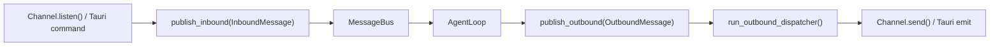
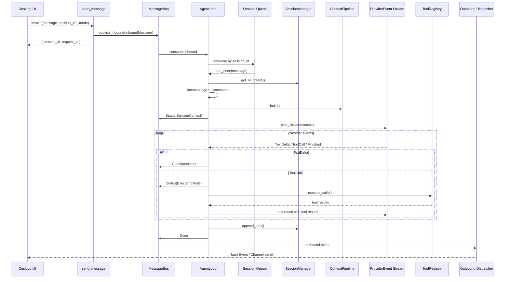
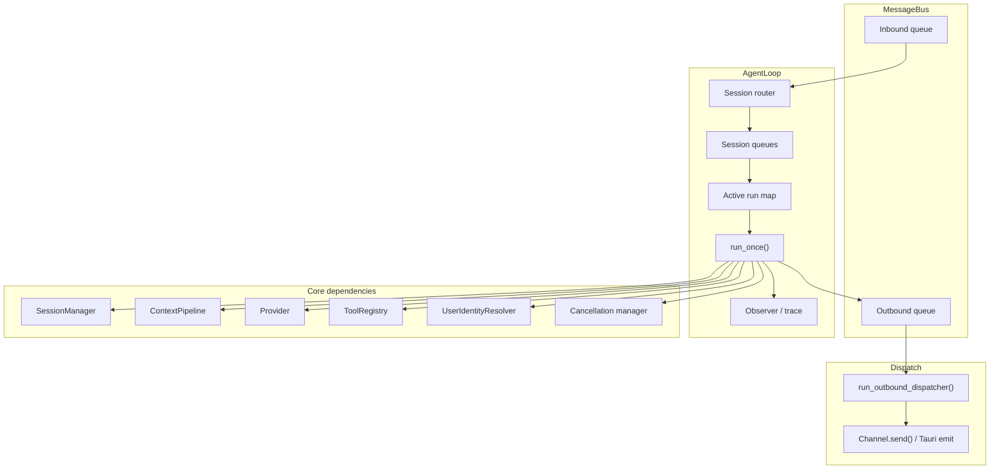
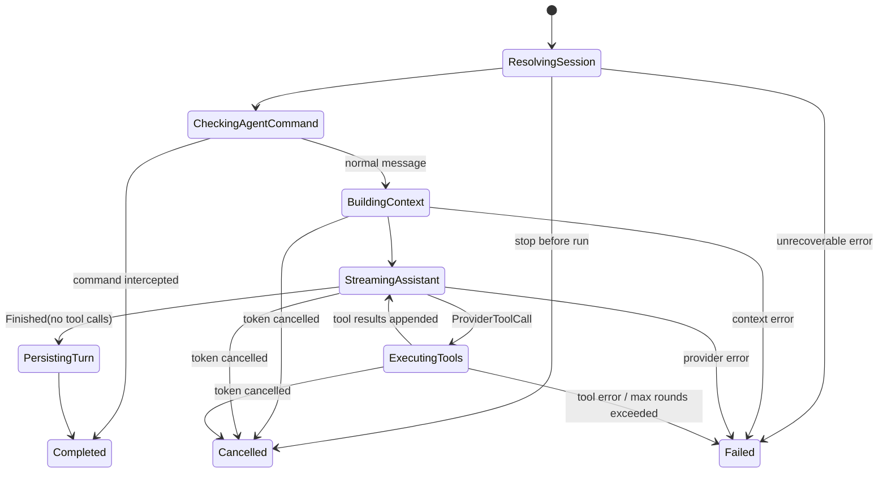
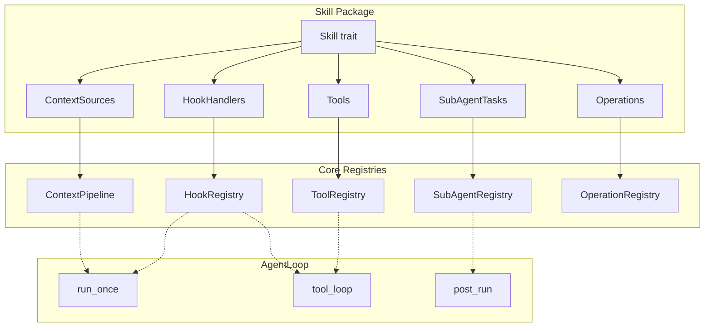

# MindClaw 技术架构设计

> 完整架构文档索引见 [README.md](./README.md)

## 六、Agent 架构

> 参考 [zeroclaw](https://github.com/zeroclaw-labs/zeroclaw) 的 Channel + Agent 分层模式。

### 6.1 整体结构

```
┌─────────────────────────────────────────────────────────────┐
│                      Channel Layer                          │
│  ┌──────────┐  ┌──────────────┐  ┌───────────────┐         │
│  │ Desktop  │  │ Telegram Bot │  │  Feishu Bot   │         │
│  │ Channel  │  │   Channel    │  │   Channel     │         │
│  └─────┬────┘  └──────┬───────┘  └───────┬───────┘         │
│        └──────────────┼──────────────────┘                  │
│                       │                                     │
│              ChannelMessage / SendMessage                    │
└───────────────────────┼─────────────────────────────────────┘
                        │
┌───────────────────────┼─────────────────────────────────────┐
│                  Gateway Layer                              │
│  ┌──────────────┐  ┌──────────────┐  ┌────────────────┐    │
│  │ HTTP Server  │  │  WebSocket   │  │  Auth Guard    │    │
│  │ (PWA/API)    │  │  (实时对话)   │  │  (Token/签名)  │    │
│  └──────┬───────┘  └──────┬───────┘  └────────────────┘    │
│         └─────────────────┘                                 │
└───────────────────────┼─────────────────────────────────────┘
                        │
                        ▼
┌─────────────────────────────────────────────────────────────┐
│                  Core Agent Service                         │
│                                                             │
│  ┌──────────┐ ┌──────────┐ ┌────────┐ ┌────────────────┐  │
│  │ Context  │ │ Session  │ │ Router │ │   Observer     │  │
│  │ Builder  │ │ Manager  │ │        │ │ (Layer 3 观察)  │  │
│  └──────────┘ └──────────┘ └────────┘ └────────────────┘  │
│                                                             │
│  ┌───────────────────────┐   ┌──────────────────────────┐  │
│  │     Tool Registry     │   │   Memory / Knowledge     │  │
│  │  搜索·分析·写作·文件    │   │   RAG · 观察 · 知识库    │  │
│  └───────────────────────┘   └──────────────────────────┘  │
└───────────────────────┬─────────────────────────────────────┘
                        │
┌───────────────────────┼─────────────────────────────────────┐
│                  Provider Layer                             │
│  ┌─────────────────────────────────────────────────────┐   │
│  │            ProviderRegistry（配置驱动）               │   │
│  │  ┌────────────────────────────────────────────────┐ │   │
│  │  │  OpenAICompatProvider（async-openai）           │ │   │
│  │  │  OpenAI · DeepSeek · Moonshot · Groq · …       │ │   │
│  │  └────────────────────────────────────────────────┘ │   │
│  │  ┌──────────────┐  ┌──────────────────────────┐     │   │
│  │  │ Claude       │  │  Local Embedding         │     │   │
│  │  │ (独立实现)    │  │  (向量检索, Phase 2)      │     │   │
│  │  └──────────────┘  └──────────────────────────┘     │   │
│  └─────────────────────────────────────────────────────┘   │
└─────────────────────────────────────────────────────────────┘

┌─────────────────────────────────────────────────────────────┐
│               Infrastructure Layer                          │
│  ┌──────────────┐  ┌────────────────┐  ┌────────────────┐  │
│  │     Cron     │  │   Heartbeat    │  │    Logging     │  │
│  │  定时任务调度  │  │  健康检测/监控   │  │  tracing 日志  │  │
│  └──────────────┘  └────────────────┘  └────────────────┘  │
└─────────────────────────────────────────────────────────────┘
```

**Core Agent 是唯一持有完整人模型的编排器**。Channel、Gateway、Provider、Tools 都是可替换的适配层，通过 trait 解耦。Cron 和 Heartbeat 提供后台运行能力。

### 6.2 Channel 层 — 统一消息通道

Channel 是所有通信平台的抽象接口。无论消息来自桌面 UI、Telegram 还是 Feishu，Agent 看到的都是统一的 `ChannelMessage`。

```rust
// src-tauri/src/channels/traits.rs

pub struct ChannelMessage {
    pub id: String,
    pub sender: String,
    pub content: String,
    pub source: ChannelSource,
    pub timestamp: DateTime<Utc>,
    pub mode: ConversationMode,
}

pub struct SendMessage {
    pub content: String,
    pub recipient: String,
    pub metadata: Option<serde_json::Value>,
}

pub enum ChannelSource {
    Desktop,
    Telegram,
    Feishu,
    Webhook,
}

#[async_trait]
pub trait Channel: Send + Sync {
    fn name(&self) -> &str;
    fn source(&self) -> ChannelSource;
    async fn send(&self, message: OutboundMessage) -> Result<(), AppError>;
    async fn listen(&self, bus: Arc<MessageBus>) -> Result<(), AppError>;
    fn supports_streaming(&self) -> bool { false }
    async fn send_chunk(&self, _chunk: &str, _session_id: &str) -> Result<(), AppError> { Ok(()) }
    async fn start_typing(&self) -> Result<(), AppError> { Ok(()) }
    async fn stop_typing(&self) -> Result<(), AppError> { Ok(()) }
}
```

#### Channel 实现一览

| Channel | 传输方式 | 流式支持 | 入站机制 | Phase |
|---------|---------|---------|---------|-------|
| **Desktop** | Tauri IPC invoke + Event emit | Yes | Tauri command 桥接推入 Bus（listen 为空实现） | MVP |
| **Telegram** | HTTP API / Long polling | No | getUpdates 或 Webhook → Bus | Phase 1 后期 |
| **Feishu** | HTTP API / Webhook | No | Webhook → Bus | Phase 2 |
| **Webhook** | HTTP POST → Bus | No | Gateway 接收 → Bus | Phase 1 后期 |

### 6.3 MessageBus — 双向异步消息队列

MessageBus 解耦 Channel 与 Agent。它只负责事件搬运，不承担业务决策；是否执行、如何排队、何时取消，全部由 AgentLoop 决定。



**设计决策**：

- Bus 是事件驱动的异步队列，不做定时轮询。
- inbound / outbound Receiver 均采用 `take` 语义，确保单消费者。
- 出站消息使用显式 `payload` enum，前端与 Channel 只消费标准化事件，不解析正文字符串中的状态语义。

```rust
// src-tauri/src/bus/events.rs

pub struct InboundMessage {
    pub id: String,
    pub request_id: String,
    pub session_id: Option<String>,
    pub sender: String,
    pub source: ChannelSource,
    pub mode: ConversationMode,
    pub content: String,
    pub timestamp: DateTime<Utc>,
}

pub struct OutboundMessage {
    pub id: String,
    pub request_id: String,
    pub session_id: String,
    pub target: ChannelSource,
    pub payload: OutboundPayload,
}

pub enum OutboundPayload {
    Chunk { content: String },
    Done,
    Error { message: String, retryable: bool },
    Status { phase: RunPhase },
}
```

```rust
// src-tauri/src/bus/mod.rs

pub struct MessageBus {
    inbound: mpsc::Sender<InboundMessage>,
    inbound_rx: Mutex<Option<mpsc::Receiver<InboundMessage>>>,
    outbound: mpsc::Sender<OutboundMessage>,
    outbound_rx: Mutex<Option<mpsc::Receiver<OutboundMessage>>>,
    inbound_count: AtomicUsize,
    outbound_count: AtomicUsize,
}
```

| 方法 | 调用方 | 说明 |
|------|--------|------|
| `publish_inbound(msg)` | Channel / `send_message` command | 推送入站消息 |
| `take_inbound_rx()` | AgentLoop | 取出入站 Receiver（仅一次） |
| `publish_outbound(msg)` | AgentLoop | 推送出站事件 |
| `take_outbound_rx()` | Dispatcher | 取出出站 Receiver（仅一次） |
| `inbound_pending()` | `/status` | 入站待处理数 |
| `outbound_pending()` | `/status` | 出站待分发数 |

出站消费循环 `run_outbound_dispatcher()` 根据 `OutboundMessage.target` 路由到对应 Channel；Desktop Channel 将 `OutboundPayload` 映射为 Tauri Event 发给前端。

### 6.4 消息流水线（端到端）

首期对话链路按 Desktop 优先设计，但消息模型保持多 Channel 兼容。外层是事件驱动队列，内层是单次 run 的有限回合工具循环。



关键边界：

- `send_message` 只负责入队并立即返回 `{ session_id, request_id }`。
- `AgentLoop` 负责同一 session 的串行化，不允许多个 run 同时写同一会话。
- 工具回合是单次 run 内部的有限 loop，最多 8 轮；它不是系统级轮询架构。
- `Done`、`Error`、`Status` 与文本 `Chunk` 分离，避免正文承载状态协议。

### 6.5 Agent 核心：Loop · Session · Identity

Agent 核心围绕“事件驱动外层 + 单次 run 状态机 + 有限工具循环”构建。消息是否执行、如何排队、何时取消，都在这一层被决定。



#### AgentLoop — 事件驱动编排器

```rust
// src-tauri/src/agent/agent_loop.rs

pub struct AgentLoop {
    bus: Arc<MessageBus>,
    session_mgr: Arc<SessionManager>,
    context_pipeline: Arc<ContextPipeline>,
    provider: Arc<dyn Provider>,
    tools: Arc<ToolRegistry>,
    agent_commands: Arc<AgentCommandRegistry>,
    identity_resolver: Arc<UserIdentityResolver>,
    session_queues: DashMap<String, VecDeque<InboundMessage>>,
    active_runs: DashMap<String, RunHandle>,
    observer: Arc<dyn AgentObserver>,
}
```

`AgentLoop` 的职责固定为：

1. 消费 `InboundMessage` 并按 session 串行排队。
2. 为每条消息创建单次 `run_once()` 执行。
3. 在 `run_once()` 中驱动 Session → Context → Provider → Tool → Session append。
4. 将运行态映射为 `OutboundPayload` 和内部观测事件。
5. 管理取消令牌与活跃 run 生命周期。

**外层不使用全局 `while (true)` 轮询架构**。唯一允许的 loop 是单次 run 内部的有限工具回合循环。

#### 单次 run 状态机



运行规则：

- 同一 `session_id` 同时最多一个活跃 run，后续消息进入队列等待。
- `/stop` 取消当前 session 的活跃 run，不取消其他 session。
- 工具回合上限固定为 8，超限时发送 `Error` 并终止本次 run。
- cancelled / failed run 不持久化半成品 assistant 文本。

#### 事件模型

`ProviderEvent` 是 Provider 对 AgentLoop 的输入；`AgentEvent` 是 AgentLoop 内部运行语义；`OutboundPayload` 是对前端和 Channel 暴露的用户可见事件。

```rust
// src-tauri/src/agent/events.rs

pub enum ProviderEvent {
    TextDelta { text: String },
    ToolCall { id: String, name: String, arguments_json: Value },
    Finished { stop_reason: String, usage: UsageStats },
}

pub enum AgentEvent {
    RunStarted { session_id: String, request_id: String },
    SessionResolved { session_id: String },
    CommandIntercepted { name: String },
    ContextBuilt { fragments: usize },
    ProviderTextDelta { len: usize },
    ProviderToolCall { name: String },
    ToolStarted { name: String },
    ToolFinished { name: String, success: bool },
    RunCompleted,
    RunCancelled,
    RunFailed { message: String },
}

pub enum RunPhase {
    Queued,
    ResolvingSession,
    CheckingAgentCommand,
    BuildingContext,
    StreamingAssistant,
    ExecutingTools,
    PersistingTurn,
    Completed,
    Cancelled,
    Failed,
}
```

三条边界必须分离：

- 取消信号：`CancellationToken`，只负责中断。
- 内部观测：`AgentEvent` / tracing，供日志、审计、指标使用。
- 用户可见输出：`OutboundPayload`，只承载 UI 和 Channel 需要的事件。

#### SessionManager — 会话生命周期管理

会话管理器不再只保存“消息列表”，而是保存一个完整 turn 的执行结果，以支持恢复、调试和历史压缩。

```rust
// src-tauri/src/agent/session.rs

pub struct Session {
    pub id: String,
    pub sender: String,
    pub mode: ConversationMode,
    pub turns: Vec<TurnRecord>,
    pub created: DateTime<Utc>,
    pub updated: DateTime<Utc>,
}

pub struct TurnRecord {
    pub user_message: ChatMessage,
    pub assistant_message: Option<ChatMessage>,
    pub tool_trace: Vec<ToolTrace>,
    pub run_status: RunStatus,
    pub created: DateTime<Utc>,
}

pub struct SessionManager {
    db: Arc<DbState>,
    max_turns: usize,
    keep_recent: usize,
}
```

| 方法 | 说明 |
|------|------|
| `get_or_create(sender, mode, session_id?)` | 获取或创建会话 |
| `append_turn(session_id, user_msg, assistant_msg, tool_trace)` | 成功完成后追加 turn |
| `mark_failed(session_id, request_id, error)` | 记录失败元数据，不写半成品内容 |
| `prune(session)` | 近 N 轮完整 + 早期摘要压缩 |
| `persist(session)` | 持久化到 SQLite |

`Session.compressed_history()` 返回压缩后的 provider messages；工具输出在历史中仅保留必要 trace，不完整回灌超长原始结果。

#### UserIdentityResolver — 跨通道身份统一

MindClaw 是单用户桌面应用，但仍需保留跨 Channel 身份统一层，避免未来多入口时会话碎片化。

```rust
// src-tauri/src/agent/identity.rs

pub struct UserIdentityResolver {
    mode: IdentityMode,
}

pub enum IdentityMode {
    SingleUser,
    Mapped(HashMap<(ChannelSource, String), String>),
}
```

#### 设计取舍（参考 nanobot / zeroclaw）

- 采纳 `nanobot` 的外层消息分发 + 内层有限工具回合结构。
- 拒绝 `nanobot` 的全局串行锁，改为“按 session 串行”。
- 采纳 `zeroclaw` 的取消、观测、工具去重和输出安全边界分层。
- 拒绝 `zeroclaw` 当前过重的 runtime 复杂度，不在首期引入预算审批、多格式 tool-call 兼容解析等增强模块。

### 6.6 Context Pipeline — 可插拔上下文组装

上下文组装仍采用可插拔 `ContextSource` 管线，但其调用时机固定为：Session 解析完成、Agent Command 未命中之后，由 `run_once()` 显式触发。

#### System Prompt 组装结构

```
┌─────────────────────────────────────────────────────────────┐
│ 固定层（启动时加载）                                         │
├─────────────────────────────────────────────────────────────┤
│ SOUL.md / IDENTITY.md / USER.md / Tool Schema              │
├─────────────────────────────────────────────────────────────┤
│ 动态层（每次 run 按需注入）                                  │
├─────────────────────────────────────────────────────────────┤
│ MemoryRecallSource                                          │
│ RAGKnowledgeSource                                          │
│ ConversationHistorySource                                   │
│ UserMessageSource                                           │
└─────────────────────────────────────────────────────────────┘
```

#### ContextSource Trait 与 Pipeline

```rust
// src-tauri/src/agent/context_pipeline.rs

pub struct ContextFragment {
    pub role: MessageRole,
    pub content: String,
    pub token_estimate: usize,
    pub label: String,
}

#[async_trait]
pub trait ContextSource: Send + Sync {
    fn name(&self) -> &str;
    fn priority(&self) -> i32;
    fn enabled(&self) -> bool { true }
    async fn inject(
        &self, ctx: &ContextBuildContext<'_>, budget: usize,
    ) -> Result<Vec<ContextFragment>, AppError>;
}

pub struct ContextBuildContext<'a> {
    pub inbound: &'a InboundMessage,
    pub session: &'a Session,
    pub memory: &'a MemoryManager,
    pub services: &'a ServiceContainer,
    pub db: &'a DbState,
}

pub struct BuiltContext {
    pub system_prompt: String,
    pub messages: Vec<ChatMessage>,
    pub fragments: Vec<ContextFragment>,
}

pub struct ContextPipeline {
    sources: Vec<Arc<dyn ContextSource>>,
    total_budget: usize,
    budget_allocations: HashMap<String, usize>,
}
```

构建逻辑：按 `priority` 顺序遍历 source，在各自 budget 内注入 fragment；超预算时优先削减 RAG，再压缩历史，最后截断观察类内容。

#### 内置源映射

| Source | Priority | 默认预算 | 数据来源 | 注入方式 |
|--------|----------|---------|---------|---------|
| `SystemPromptSource` | 0 | ~2K | SOUL.md + IDENTITY.md + USER.md + Tool Schema | 固定加载 |
| `RAGKnowledgeSource` | 10 | ~10K | `knowledge/` 目录 | `search_with_rerank` Top N |
| `MemoryRecallSource` | 20 | ~2K | `memories` 表 | relevance + importance 排序 |
| `ConversationHistorySource` | 30 | ~50K | session 历史 | 近 5 轮完整 + 早期摘要 |
| `UserMessageSource` | 100 | ~1K | 当前消息 | 始终最后 |

#### Token 预算管理

| 策略 | 实现 |
|------|------|
| 知识库注入 | L0 粗筛 → L1 overview 重排序 → Top N |
| 对话历史 | 近 5 轮完整 + 早期摘要 |
| Token 预算 | Haiku 默认 ≤ 16K，Sonnet 默认 ≤ 80K |

### 6.7 Provider 层 — LLM 抽象

Provider 直接向 AgentLoop 产出事件流，而不是纯 token callback。这样文本增量、工具调用和结束事件都能进入统一状态机。

```rust
// src-tauri/src/providers/traits.rs

pub enum ModelTier {
    Haiku,
    Sonnet,
}

pub struct UsageStats {
    pub input_tokens: u32,
    pub output_tokens: u32,
}

#[async_trait]
pub trait Provider: Send + Sync {
    async fn chat(
        &self,
        model: ModelTier,
        messages: &[ChatMessage],
        system: Option<&str>,
    ) -> Result<ProviderResponse, AppError>;

    async fn chat_stream(
        &self,
        model: ModelTier,
        messages: &[ChatMessage],
        system: Option<&str>,
    ) -> Result<Pin<Box<dyn Stream<Item = Result<ProviderEvent, AppError>> + Send>>, AppError>;

    fn supports_streaming(&self) -> bool;
    fn max_tokens(&self, model: ModelTier) -> usize;
}
```

#### ProviderEvent 到 AgentLoop 的映射

| ProviderEvent | AgentLoop 动作 |
|---------------|----------------|
| `TextDelta` | 立即转成 `OutboundPayload::Chunk` |
| `ToolCall` | 暂停文本流，进入工具执行阶段 |
| `Finished` | 无工具调用时进入 `PersistingTurn` |

首期 `OpenAICompatProvider` 至少需要稳定产出 `TextDelta` 与 `Finished`；工具事件接口先定义好，便于后续 Claude / OpenAI 原生 tool 模式接入。

#### 模型分层调用

| 任务类型 | 模型 | 成本比 |
|---------|------|--------|
| 内容分类 · 路由 · 简单任务 | Haiku | 1x |
| 日常对话 · 一般生成 | Haiku | 1x |
| 知识沉淀 · 综合分析 · 异步总结 | Sonnet | ~10x |
| 深度对话 · Layer 3 洞见 | Sonnet | ~10x |

### 6.8 Tool 层 — Agent 可用工具

Agent 上下文常驻仅 4 个 Tool Schema，业务操作通过 `operations` 元工具按需发现和调用，避免上下文膨胀。

```
Tools（常驻上下文，4 个 Schema）
├── filesystem   → 文件系统操作
├── shell        → 受限命令执行
├── mcp_client   → 外部 MCP 工具
└── operations   → 元工具（按需发现 Services + Memory 操作）
```

#### ToolRegistry

```rust
// src-tauri/src/tools/mod.rs

pub struct ToolCall {
    pub id: String,
    pub name: String,
    pub arguments: Value,
}

pub struct ToolResultMessage {
    pub tool_call_id: String,
    pub content: String,
    pub is_error: bool,
}

pub struct ToolRegistry {
    tools: HashMap<String, Arc<dyn Tool>>,
}

impl ToolRegistry {
    pub async fn execute_calls(
        &self, calls: Vec<ToolCall>,
    ) -> Result<Vec<ToolResultMessage>, AppError>;
}
```

#### 工具执行边界

| 边界 | 规则 |
|------|------|
| 最大回合数 | 单次 run 最多 8 轮工具回合 |
| 工具去重 | 使用 `(tool_name, canonical_args_json)` 计算签名，防无限循环 |
| 输出截断 | 超长工具输出在回写上下文和持久化前截断 |
| 敏感信息 | `token` / `api_key` / `password` 等模式统一脱敏 |
| 失败语义 | 工具失败返回结构化结果，不直接 poison session 历史 |

#### 基础能力工具

| 工具 | 操作 | 安全约束 |
|------|------|---------|
| **filesystem** | read/write/append/list/move/delete | `vault/` 内限定，`private/` 禁入 |
| **shell** | exec (白名单) | 白名单命令，禁管道/重定向，30s 超时，输出截断 |
| **mcp_client** | call_tool, list_tools | MCP 协议调用外部工具服务 |
| **operations** | list/call | Services 与 Memory 的唯一业务操作通道 |

#### Operations — 业务操作元工具

`operations` 连接 Agent 与 Services/Memory。操作 Schema 不常驻上下文，仅在 `list` 时返回；Agent 已知常用操作名时可直接 `call`。

```rust
// src-tauri/src/tools/operations.rs

pub struct OperationDef {
    pub name: String,
    pub category: String,
    pub description: String,
    pub parameters: Value,
}
```

#### 已注册操作

| 操作名 | 类别 | 说明 |
|--------|------|------|
| `knowledge_create` | knowledge | 创建知识笔记（自动生成 L0 tags + L1 overview） |
| `knowledge_search` | knowledge | 搜索知识库（返回 L1 overview） |
| `knowledge_get` | knowledge | 获取笔记完整内容（L2 detail） |
| `knowledge_list_tags` | knowledge | 列出 L0 tags 及频次 |
| `daily_get` | daily | 获取/创建日记 |
| `daily_append` | daily | 追加内容到日记 |
| `task_create` | task | 创建任务 |
| `task_list` | task | 列出任务 |
| `task_complete` | task | 完成任务 |
| `memory_search` | search | 搜索 Agent 记忆 |

### 6.9 Services 层 — 核心业务逻辑

Services 是业务操作的核心层。**Web Commands、CLI Commands 和 Agent 共用同一套 Services**，保证业务逻辑单一来源。

```
Web Commands  ──► Services ──► Storage
CLI Commands  ──► Services ──► Storage
Agent         ──► operations (元工具) ──► Services ──► Storage
                                     ──► Memory   ──► Storage
```

```rust
// src-tauri/src/services/mod.rs

pub struct ServiceContainer {
    pub knowledge: KnowledgeService,
    pub daily: DailyService,
    pub task: TaskService,
}
```

#### KnowledgeService — 知识笔记管理

操作人机共有的知识体系（Markdown 文件 + SQLite 索引）。检索采用三级渐进：L0 粗筛 → L1 重排序 → L2 按需加载。`search_with_rerank` 中命中目录（path 无 .md 后缀）时自动展开子笔记补充候选。

| 方法 | 说明 |
|------|------|
| `create(title, content, tags)` | 写 Markdown + 提取 L0 tags + 生成 L1 + 更新 FTS5 |
| `update(path, content)` | 更新笔记，自动更新 L0/L1 索引 |
| `search_l0(query, limit)` | FTS5 匹配 title + tags，返回候选集（~100 tokens/条） |
| `get_l1_batch(paths)` | 批量加载 L1 overview（~2k tokens/条） |
| `get_l2(path)` | 从文件系统读取完整 Markdown |
| `search_with_rerank(query, top_n)` | L0 粗筛 → 目录递归 → L1 重排序 → Top N |
| `list(tag?)` | 按标签筛选 |
| `list_children(parent)` | 列出目录下直接子节点 |
| `sync_links(path)` | 提取 wikilinks 并更新 links 表 |
| `rebuild_index(path?)` | 重建 Markdown → SQLite 索引 |

```rust
pub struct NoteL0 {
    pub path: String,       // 有 .md = 笔记，无后缀 = 目录
    pub title: String,
    pub tags: Vec<String>,
}

pub struct NoteL1 {
    pub path: String,
    pub title: String,
    pub tags: Vec<String>,
    pub overview: String,   // ~2k tokens
}
```

#### DailyService — 日记管理

| 方法 | 说明 |
|------|------|
| `get(date)` | 获取日记（不存在则从模板创建）+ 关联任务 |
| `save(date, content)` | 保存日记内容 |
| `append_entry(date, content, section?)` | 追加条目到指定区域 |
| `list(limit)` | 日记列表（元数据） |

#### TaskService — 任务管理

| 方法 | 说明 |
|------|------|
| `create(content, due?, context?, note_path?)` | 创建任务 |
| `update(id, status?, content?, due?)` | 更新任务 |
| `list(status?)` | 列出任务 |
| `complete(id)` | 完成任务 |

### 6.10 Memory 层 — Agent 私有记忆

> PRD 核心命题：**记忆是 Agent 的，知识是共同的。**

Memory 管理 Agent 对用户的私有认知——观察、偏好、模式识别等。存在 SQLite 中，用户不直接操作。Knowledge（Markdown）是人机共有的，由 Services 管理。

```
Memory (Agent 私有, SQLite)          Knowledge (人机共有, Markdown)
├── 观察：第三次提到工作疲惫感        ├── vault/knowledge/工作节奏.md
├── 偏好：偏好简短直接的回复           ├── vault/knowledge/投资策略.md
├── 模式：周一情绪通常低落             └── vault/knowledge/育儿方法.md
└── 召回：按相关性检索记忆
                                      ↑
    记忆可以升华为知识 ────────────────┘
    （Agent 发现模式 → 沉淀为知识笔记，需人类确认）
```

#### 单表 `memories` 设计

所有记忆存入单表，通过 `category` 区分类型，`key` 去重，`superseded_by` 追踪认知演进：

```rust
// src-tauri/src/memory/mod.rs

pub struct Memory {
    pub id: String,
    pub key: String,                     // 唯一去重键，同一认知 upsert
    pub content: String,
    pub category: MemoryCategory,        // 6 类，隐含 owner（user/agent）
    pub importance: f32,                 // 重要度 0.0-1.0
    pub session_id: Option<String>,      // 关联会话（溯源）
    pub related_path: Option<String>,    // 关联笔记路径
    pub surfaced: bool,                  // 是否已浮出给用户
    pub superseded_by: Option<String>,   // 被哪条新记忆替代
    pub created: DateTime<Utc>,
    pub updated: DateTime<Utc>,
}

pub enum MemoryCategory {
    // user 拥有
    Profile,      // 用户基本信息（角色、背景、目标）
    Preferences,  // 用户偏好（沟通风格、主题偏好）
    Entities,     // 实体记忆（人物、项目、组织）
    Events,       // 事件记录（决策、里程碑、事故）
    // agent 拥有
    Cases,        // 学到的案例（成功方案、调试经验）
    Patterns,     // 学到的模式（行为规律、偏好趋势）
}
```

#### 记忆类别与示例

| category | 说明 | key 示例 |
|----------|------|---------|
| **profile** | "用户是创业者，关注教育和投资" | `profile:role_entrepreneur` |
| **preferences** | "偏好直接简洁的沟通方式" | `pref:communication_style` |
| **entities** | "张三是用户的合伙人，负责技术" | `entity:person_zhangsan` |
| **events** | "2026-03 决定转型做教育方向" | `event:pivot_education_202603` |
| **cases** | "工作压力与陪孩子质量高度相关" | `case:work_parenting_correlation` |
| **patterns** | "晚上 10 点后对话质量最高" | `pat:engagement_peak_time` |

#### MemoryManager

```rust
pub struct MemoryManager {
    db: Arc<DbState>,
}
```

| 方法 | 说明 |
|------|------|
| `remember(memory)` | 写入记忆（upsert by key，旧记忆标记 superseded_by） |
| `recall(query, limit)` | FTS5 关键词匹配 + importance 排序（Phase 2: embedding 向量检索） |
| `recall_by_category(category, limit)` | 按类别召回 |
| `unsurfaced(limit)` | 获取未浮出的记忆（ContextPipeline 注入用） |
| `mark_surfaced(id)` | 标记已浮出 |
| `decay()` | 按 category 差异化衰减 importance（Cron 定期调用） |
| `propose_crystallization(id)` | 高 importance 记忆 → 知识笔记草稿（需人类确认） |
| `cleanup(threshold)` | 删除 superseded + importance 低于阈值的旧记忆 |

#### 衰减系数

| category | 衰减系数 | 原因 |
|----------|---------|------|
| profile | 0.99 | 用户信息稳定 |
| preferences | 0.99 | 偏好稳定 |
| entities | 0.98 | 实体信息较稳定 |
| events | 0.95 | 事件中等衰减 |
| cases | 0.95 | 案例中等衰减 |
| patterns | 0.90 | 模式时效性强，快速衰减 |

#### 认知演进链（superseded_by）

**设计决策**：记忆更新不覆盖旧值，而是通过 `superseded_by` 链追踪认知变化。`recall()` 只返回 `superseded_by IS NULL` 的最新认知，但旧记忆保留可追溯。

```
记忆 A: "用户对教育有兴趣" (importance: 0.6)
  ↓ 新对话后 Agent 理解更深
记忆 B: "用户关注蒙特梭利教育方法，孩子 3 岁" (importance: 0.8)
  A.superseded_by = B.id
```

#### 记忆生命周期

```
写入 → 演进 → 衰减 → 升华/清理

1. 写入：SubAgent 对话后分析 → remember() upsert by key
2. 演进：同一 key 的新认知替代旧认知（superseded_by 链）
3. 衰减：Cron 定期 decay()，importance *= 衰减系数
4. 升华：高 importance 观察 → propose_crystallization()
         → 知识笔记草稿 → 人类确认 → vault/knowledge/
5. 清理：被替代 + importance < 阈值的旧记忆 cleanup()
```

### 6.11 SubAgent — 异步后台任务

AgentLoop 负责主对话流，SubAgent 处理不应阻塞响应的后台任务。**首期事件驱动主链路不依赖 SubAgent 才能完成对话**；SubAgent 作为 `RunCompleted` 后的异步订阅者存在。

```
AgentLoop (主对话)
    │
    ├── 对话响应 → 立即返回给用户
    │
    └── 派发 SubAgent 任务（不阻塞）
         ├── KnowledgeDistill:  从对话中提炼知识笔记
         ├── SessionSummarize:  会话摘要生成
         ├── ObservationAnalyze: Layer 3 模式识别
         └── DailySummary:      当日回顾生成
```

#### SubAgentTask Trait

```rust
// src-tauri/src/agent/sub_agent.rs

#[async_trait]
pub trait SubAgentTask: Send + Sync {
    fn name(&self) -> &str;
    fn description(&self) -> &str;
    fn model_tier(&self) -> ModelTier;
    async fn execute(
        &self, ctx: SubAgentContext, input: Value,
    ) -> Result<SubAgentOutput, AppError>;
}

pub struct SubAgentContext {
    pub provider: Arc<dyn Provider>,
    pub db: Arc<DbState>,
    pub memory: Arc<MemoryManager>,
    pub services: Arc<ServiceContainer>,
}

pub struct SubAgentOutput {
    pub success: bool,
    pub summary: String,
    pub artifacts: Vec<Artifact>,
}

pub struct Artifact {
    pub kind: String,    // "knowledge_draft" | "summary" | "observation"
    pub content: String,
    pub metadata: Value,
}
```

#### SubAgentRegistry 与派发

```rust
pub struct SubAgentRegistry {
    tasks: HashMap<String, Arc<dyn SubAgentTask>>,
}

pub struct SubAgentDispatch {
    pub task_name: String,
    pub input: Value,
}
```

`SubAgentRegistry::with_builtins()` 注册 4 个内置任务。`SubAgentExecutor` 消费 `mpsc::Receiver<SubAgentDispatch>`，通过 `Semaphore` 限制最大 3 个并发 API 调用，防止速率爆炸。

#### 内置任务与模型选择

| 任务 | model_tier() | 原因 |
|------|-------------|------|
| `knowledge_distill` | Sonnet | 需深度理解和提炼 |
| `session_summarize` | Haiku | 摘要生成，低成本 |
| `observation_analyze` | Sonnet | 跨域关联和模式识别 |
| `daily_summary` | Sonnet | 综合当日全部信息 |

**派发时机**：首期在 `RunCompleted` 之后异步派发，不阻塞 `Done` 出站；知识模式下派发 KnowledgeDistill，每次对话后派发 ObservationAnalyze，会话结束时派发 SessionSummarize。

### 6.12 扩展性：Hooks · Skills · 基础设施

#### Agent Hooks — 事件钩子系统

AgentLoop 预留事件驱动扩展点，支持 Rust trait 实现和 Shell 命令两种 handler 类型。**首期 Hooks 不进入核心 run 状态机，只订阅标准化 `AgentEvent` 与 `Tool` 生命周期事件。**

```
run_once() 中预留的 Hook 触发点：

  1. Session get_or_create ──► OnSessionCreate（新会话时）
  2. Agent Command interception
  3. ► PreMessage ◄ ──────── 可修改消息、注入额外上下文、或阻止处理
  4. ContextPipeline.build()
  5. 有限工具循环内：
     ├── ► PreToolUse ◄ ──── 可验证/修改输入、或阻止工具执行
     ├── tools.execute_calls()
     └── ► PostToolUse ◄ ─── 可审计/修改工具输出
  6. Session append
  7. ► PostMessage ◄ ──────── 可触发副作用（通知、分析等）
  8. RunCompleted / RunCancelled / RunFailed
  9. Session close ──────── ► OnSessionClose ◄
```

```rust
// src-tauri/src/agent/hooks.rs

pub enum HookEvent {
    PreMessage,
    PostMessage,
    PreToolUse,
    PostToolUse,
    OnSessionCreate,
    OnSessionClose,
}

pub enum HookResult<T> {
    Continue,
    Modified(T),
    Block(String),
}

#[async_trait]
pub trait HookHandler: Send + Sync {
    fn name(&self) -> &str;
    fn event(&self) -> HookEvent;
    fn priority(&self) -> i32 { 0 }
    async fn on_pre_message(&self, _ctx: &HookContext<'_>, payload: PreMessagePayload)
        -> Result<HookResult<PreMessagePayload>, AppError> { Ok(HookResult::Continue) }
    async fn on_post_message(&self, _ctx: &HookContext<'_>, message: &ChannelMessage, response: &AgentResponse)
        -> Result<(), AppError> { Ok(()) }
    async fn on_pre_tool_use(&self, _ctx: &HookContext<'_>, payload: PreToolUsePayload)
        -> Result<HookResult<PreToolUsePayload>, AppError> { Ok(HookResult::Continue) }
    async fn on_post_tool_use(&self, _ctx: &HookContext<'_>, payload: PostToolUsePayload)
        -> Result<HookResult<PostToolUsePayload>, AppError> { Ok(HookResult::Continue) }
}
```

**Shell 命令钩子**（Claude Code 风格）：通过 `settings.json` 配置，无需编译。

```rust
pub struct CommandHook {
    pub name: String,
    pub event: HookEvent,
    pub matcher: Option<String>,  // 工具名匹配（仅 ToolUse 事件）
    pub command: String,          // 支持 ${tool_name} ${tool_input} 变量
    pub timeout_ms: u64,
    pub priority: i32,
}
```

```json
{
  "hooks": {
    "PreToolUse": [
      { "name": "audit-shell", "matcher": "shell",
        "command": "echo '${tool_name}: ${tool_input}' >> ~/MindClaw/data/audit.log" }
    ],
    "PostMessage": [
      { "name": "notify-mobile",
        "command": "curl -s https://api.telegram.org/bot${TG_TOKEN}/sendMessage ..." }
    ]
  }
}
```

`HookRegistry` 按 `priority` 排序执行所有 handler，遇到 `Block` 立即返回阻止后续流程。首期默认只启用低耦合、只读型 Hook；会修改主链路行为的 Hook 放到 Phase 1 后期。

#### Agent Skills — 技能系统

Skill 是核心扩展机制。一个技能包可提供 Tools、ContextSources、HookHandlers、SubAgentTasks、Operations 的任意组合，通过 SkillRegistry 统一分发到各注册表。



```rust
// src-tauri/src/agent/skills.rs

pub trait Skill: Send + Sync {
    fn manifest(&self) -> &SkillManifest;
    fn tools(&self) -> Vec<Arc<dyn Tool>> { vec![] }
    fn context_sources(&self) -> Vec<Arc<dyn ContextSource>> { vec![] }
    fn hooks(&self) -> Vec<Arc<dyn HookHandler>> { vec![] }
    fn sub_agent_tasks(&self) -> Vec<Arc<dyn SubAgentTask>> { vec![] }
    fn operations(&self) -> Vec<OperationDef> { vec![] }
    fn init(&self, _ctx: &SkillInitContext) -> Result<(), AppError> { Ok(()) }
}

pub struct SkillManifest {
    pub name: String,
    pub version: String,
    pub description: String,
}
```

```toml
# config/skills/weekly-report/skill.toml
[skill]
name = "weekly-report"
version = "0.1.0"
description = "Generate weekly reports from knowledge and daily notes"

[provides]
tools = ["weekly_report"]
context_sources = ["weekly_context"]
hooks = { PostMessage = "on_weekly_check" }
sub_agent_tasks = ["weekly_report_generate"]
operations = ["weekly_report_generate", "weekly_report_list"]
```

#### 扩展性分阶段实现

| 组件 | MVP | Phase 1 后期 | Phase 2 |
|------|-----|-------------|---------|
| HookRegistry（Rust handlers） | Y | | |
| HookRegistry（command hooks） | | Y | |
| ContextPipeline（内置源） | Y | | |
| ContextPipeline（自定义源） | | Y | |
| SubAgentRegistry（内置任务） | Y | | |
| SubAgentRegistry（自定义任务） | | Y | |
| SkillRegistry（built-in skills） | | Y | |
| SkillRegistry（外部加载/WASM） | | | Y |

#### Gateway Layer — HTTP/WebSocket 服务

Gateway 为移动端 PWA 提供静态文件和 API，为 Webhook 通道提供接入点。通过 Bus 解耦，不直接引用 Agent。

| 端点 | 方法 | 说明 | Phase |
|------|------|------|-------|
| `/api/chat` | POST | 发送消息，返回 Agent 响应 | Phase 1 后期 |
| `/api/daily/:date` | GET | 获取日记内容 | Phase 2 |
| `/api/knowledge` | GET | 知识库搜索 | Phase 2 |
| `/api/tasks` | GET | 任务列表 | Phase 2 |
| `/ws/chat` | WS | WebSocket 实时对话 | Phase 2 |
| `/webhook/telegram` | POST | Telegram Bot Webhook | Phase 1 后期 |
| `/webhook/feishu` | POST | 飞书 Bot Webhook | Phase 2 |
| `/` | GET | PWA 静态文件服务 | Phase 2 |

**认证**：

| 场景 | 认证方式 | 说明 |
|------|---------|------|
| 本地 WiFi（PWA /api/*） | Bearer Token | Token 存储在 OS Keychain，客户端请求时携带 |
| Tailscale 远程接入 | 双重保护 | Bearer Token + Tailscale 身份验证 |
| Webhook（Telegram/Feishu） | 平台签名验证 | 验证平台发送的签名（如 Telegram 的 `X-Telegram-Date`），**不需要** Bearer Token |
| WebSocket（/ws/chat） | Bearer Token | 连接时认证，之后保持会话 |

#### Cron — 定时任务调度

| 任务 | 默认频率 | 说明 | Phase |
|------|---------|------|-------|
| `daily_summary` | 每日 22:00 | 生成当日回顾，写入日记 | MVP |
| `resource_process` | 每 5 分钟 | 处理 pending 资源（解析 + 结晶） | MVP |
| `history_prune` | 每日 03:00 | 压缩旧对话历史，超 90 天转冷归档 | Phase 2 |
| `knowledge_review` | 每周日 10:00 | 回顾知识库，发现新关联 | Phase 2 |
| `index_rebuild` | 每日 04:00 | 增量重建 Markdown → SQLite 索引 | MVP |
| `memory_surface` | 每日 09:00 | 检查未浮出记忆的浮出时机 | Phase 2 |
| `heartbeat_check` | 每 30 秒 | 系统健康检测 | MVP |

基于 `tokio-cron-scheduler` 精确调度，避免 loop+sleep 的时钟漂移。

#### Heartbeat — 健康检测

```rust
pub struct SystemHealth {
    pub status: HealthStatus,          // healthy | degraded | down
    pub db_connected: bool,
    pub api_key_valid: bool,
    pub vault_accessible: bool,
    pub gateway_running: bool,
    pub channels: Vec<ChannelHealth>,
    pub last_check: DateTime<Utc>,
    pub uptime_seconds: u64,
}
```

通道断线时自动重连，指数退避（2s → 4s → 8s → ... → 60s）。前端通过 IPC 命令 `system_health` 查询，Settings 页面展示。
