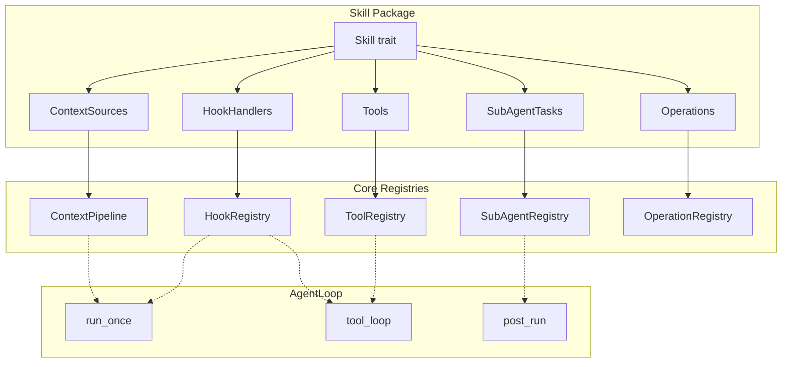

# MindClaw 技术架构设计 — SubAgent 与扩展性

> 完整架构文档索引见 [README.md](./README.md) | Agent 核心见 [05-agent.md](./05-agent.md)

## 6.11 SubAgent — 异步后台任务

AgentLoop 负责主对话流，SubAgent 处理不应阻塞响应的后台任务。**首期事件驱动主链路不依赖 SubAgent 才能完成对话**；SubAgent 作为 `RunCompleted` 后的异步订阅者存在。

```
AgentLoop (主对话)
    │
    ├── 对话响应 → 立即返回给用户
    │
    └── 派发 SubAgent 任务（不阻塞）
         ├── KnowledgeDistill:  从对话中提炼知识笔记
         ├── SessionSummarize:  会话摘要生成
         ├── ObservationAnalyze: Layer 3 模式识别
         └── DailySummary:      当日回顾生成
```

### SubAgentTask Trait

```rust
// src-tauri/src/agent/sub_agent.rs

#[async_trait]
pub trait SubAgentTask: Send + Sync {
    fn name(&self) -> &str;
    fn description(&self) -> &str;
    fn preferred_model(&self) -> &str;  // 返回 model_id 字符串，由 ProviderRegistry 解析
    async fn execute(
        &self, ctx: SubAgentContext, input: Value,
    ) -> Result<SubAgentOutput, AppError>;
}

pub struct SubAgentContext {
    pub provider: Arc<dyn Provider>,
    pub db: Arc<DbState>,
    pub memory: Arc<MemoryManager>,
    pub services: Arc<ServiceContainer>,
}

pub struct SubAgentOutput {
    pub success: bool,
    pub summary: String,
    pub artifacts: Vec<Artifact>,
}

pub struct Artifact {
    pub kind: String,    // "knowledge_draft" | "summary" | "observation"
    pub content: String,
    pub metadata: Value,
}
```

### SubAgentRegistry 与派发

```rust
pub struct SubAgentRegistry {
    tasks: HashMap<String, Arc<dyn SubAgentTask>>,
}

pub struct SubAgentDispatch {
    pub task_name: String,
    pub input: Value,
}
```

`SubAgentRegistry::with_builtins()` 注册 4 个内置任务。`SubAgentExecutor` 消费 `mpsc::Receiver<SubAgentDispatch>`，通过 `Semaphore` 限制最大 3 个并发 API 调用，防止速率爆炸。

**派发时机**：首期在 `RunCompleted` 之后异步派发，不阻塞 `Done` 出站；知识模式下派发 KnowledgeDistill，每次对话后派发 ObservationAnalyze，会话结束时派发 SessionSummarize。

---

## 6.12 扩展性：Hooks · Skills · 基础设施

### Agent Hooks — 事件钩子系统

AgentLoop 预留事件驱动扩展点，支持 Rust trait 实现和 Shell 命令两种 handler 类型。**首期 Hooks 不进入核心 run 状态机，只订阅标准化 `AgentEvent` 与 `Tool` 生命周期事件。**

```
run_once() 中预留的 Hook 触发点：

  1. Session get_or_create ──► OnSessionCreate（新会话时）
  2. Agent Command interception
  3. ► PreMessage ◄ ──────── 可修改消息、注入额外上下文、或阻止处理
  4. ContextPipeline.build()
  5. 有限工具循环内：
     ├── ► PreToolUse ◄ ──── 可验证/修改输入、或阻止工具执行
     ├── tools.execute_calls()
     └── ► PostToolUse ◄ ─── 可审计/修改工具输出
  6. Session append
  7. ► PostMessage ◄ ──────── 可触发副作用（通知、分析等）
  8. RunCompleted / RunCancelled / RunFailed
  9. Session close ──────── ► OnSessionClose ◄
```

```rust
// src-tauri/src/agent/hooks.rs

pub enum HookEvent {
    PreMessage,
    PostMessage,
    PreToolUse,
    PostToolUse,
    OnSessionCreate,
    OnSessionClose,
}

pub enum HookResult<T> {
    Continue,
    Modified(T),
    Block(String),
}

#[async_trait]
pub trait HookHandler: Send + Sync {
    fn name(&self) -> &str;
    fn event(&self) -> HookEvent;
    fn priority(&self) -> i32 { 0 }
    async fn on_pre_message(&self, _ctx: &HookContext<'_>, payload: PreMessagePayload)
        -> Result<HookResult<PreMessagePayload>, AppError> { Ok(HookResult::Continue) }
    async fn on_post_message(&self, _ctx: &HookContext<'_>, message: &InboundMessage, response: &AgentResponse)
        -> Result<(), AppError> { Ok(()) }
    async fn on_pre_tool_use(&self, _ctx: &HookContext<'_>, payload: PreToolUsePayload)
        -> Result<HookResult<PreToolUsePayload>, AppError> { Ok(HookResult::Continue) }
    async fn on_post_tool_use(&self, _ctx: &HookContext<'_>, payload: PostToolUsePayload)
        -> Result<HookResult<PostToolUsePayload>, AppError> { Ok(HookResult::Continue) }
}
```

**Shell 命令钩子**（Claude Code 风格）：通过 `settings.json` 配置，无需编译。

```rust
pub struct CommandHook {
    pub name: String,
    pub event: HookEvent,
    pub matcher: Option<String>,  // 工具名匹配（仅 ToolUse 事件）
    pub command: String,          // 支持 ${tool_name} ${tool_input} 变量
    pub timeout_ms: u64,
    pub priority: i32,
}
```

```json
{
  "hooks": {
    "PreToolUse": [
      { "name": "audit-shell", "matcher": "shell",
        "command": "echo '${tool_name}: ${tool_input}' >> ~/MindClaw/data/audit.log" }
    ],
    "PostMessage": [
      { "name": "notify-mobile",
        "command": "curl -s https://api.telegram.org/bot${TG_TOKEN}/sendMessage ..." }
    ]
  }
}
```

`HookRegistry` 按 `priority` 排序执行所有 handler，遇到 `Block` 立即返回阻止后续流程。首期默认只启用低耦合、只读型 Hook；会修改主链路行为的 Hook 放到 Phase 1 后期。

### Agent Skills — 技能系统

Skill 是核心扩展机制。一个技能包可提供 Tools、ContextSources、HookHandlers、SubAgentTasks、Operations 的任意组合，通过 SkillRegistry 统一分发到各注册表。



```rust
// src-tauri/src/agent/skills.rs

pub trait Skill: Send + Sync {
    fn manifest(&self) -> &SkillManifest;
    fn tools(&self) -> Vec<Arc<dyn Tool>> { vec![] }
    fn context_sources(&self) -> Vec<Arc<dyn ContextSource>> { vec![] }
    fn hooks(&self) -> Vec<Arc<dyn HookHandler>> { vec![] }
    fn sub_agent_tasks(&self) -> Vec<Arc<dyn SubAgentTask>> { vec![] }
    fn operations(&self) -> Vec<OperationDef> { vec![] }
    fn init(&self, _ctx: &SkillInitContext) -> Result<(), AppError> { Ok(()) }
}

pub struct SkillManifest {
    pub name: String,
    pub version: String,
    pub description: String,
}
```

```toml
# config/skills/weekly-report/skill.toml
[skill]
name = "weekly-report"
version = "0.1.0"
description = "Generate weekly reports from knowledge and daily notes"

[provides]
tools = ["weekly_report"]
context_sources = ["weekly_context"]
hooks = { PostMessage = "on_weekly_check" }
sub_agent_tasks = ["weekly_report_generate"]
operations = ["weekly_report_generate", "weekly_report_list"]
```

### 扩展性分阶段实现

| 组件 | MVP | Phase 1 后期 | Phase 2 |
|------|-----|-------------|---------|
| HookRegistry（Rust handlers） | Y | | |
| HookRegistry（command hooks） | | Y | |
| ContextPipeline（内置源） | Y | | |
| ContextPipeline（自定义源） | | Y | |
| SubAgentRegistry（内置任务） | Y | | |
| SubAgentRegistry（自定义任务） | | Y | |
| SkillRegistry（built-in skills） | | Y | |
| SkillRegistry（外部加载/WASM） | | | Y |

### Gateway Layer — HTTP/WebSocket 服务

Gateway 为移动端 PWA 提供静态文件和 API，为 Webhook 通道提供接入点。通过 Bus 解耦，不直接引用 Agent。

| 端点 | 方法 | 说明 | Phase |
|------|------|------|-------|
| `/api/chat` | POST | 发送消息，返回 Agent 响应 | Phase 1 后期 |
| `/api/daily/:date` | GET | 获取日记内容 | Phase 2 |
| `/api/knowledge` | GET | 知识库搜索 | Phase 2 |
| `/api/tasks` | GET | 任务列表 | Phase 2 |
| `/ws/chat` | WS | WebSocket 实时对话 | Phase 2 |
| `/webhook/telegram` | POST | Telegram Bot Webhook | Phase 1 后期 |
| `/webhook/feishu` | POST | 飞书 Bot Webhook | Phase 2 |
| `/` | GET | PWA 静态文件服务 | Phase 2 |

**认证**：

| 场景 | 认证方式 | 说明 |
|------|---------|------|
| 本地 WiFi（PWA /api/*） | Bearer Token | Token 存储在 OS Keychain，客户端请求时携带 |
| Tailscale 远程接入 | 双重保护 | Bearer Token + Tailscale 身份验证 |
| Webhook（Telegram/Feishu） | 平台签名验证 | 验证平台发送的签名（如 Telegram 的 `X-Telegram-Date`），**不需要** Bearer Token |
| WebSocket（/ws/chat） | Bearer Token | 连接时认证，之后保持会话 |

### Cron — 定时任务调度

| 任务 | 默认频率 | 说明 | Phase |
|------|---------|------|-------|
| `daily_summary` | 每日 22:00 | 生成当日回顾，写入日记 | MVP |
| `resource_process` | 每 5 分钟 | 处理 pending 资源（解析 + 结晶） | MVP |
| `history_prune` | 每日 03:00 | 压缩旧对话历史，超 90 天转冷归档 | Phase 2 |
| `knowledge_review` | 每周日 10:00 | 回顾知识库，发现新关联 | Phase 2 |
| `index_rebuild` | 每日 04:00 | 增量重建 Markdown → SQLite 索引 | MVP |
| `memory_surface` | 每日 09:00 | 检查未浮出记忆的浮出时机 | Phase 2 |
| `heartbeat_check` | 每 30 秒 | 系统健康检测 | MVP |

基于 `tokio-cron-scheduler` 精确调度，避免 loop+sleep 的时钟漂移。

### Heartbeat — 健康检测

```rust
pub struct SystemHealth {
    pub status: HealthStatus,          // healthy | degraded | down
    pub db_connected: bool,
    pub api_key_valid: bool,
    pub vault_accessible: bool,
    pub gateway_running: bool,
    pub channels: Vec<ChannelHealth>,
    pub last_check: DateTime<Utc>,
    pub uptime_seconds: u64,
}
```

通道断线时自动重连，指数退避（2s → 4s → 8s → ... → 60s）。前端通过 IPC 命令 `system_health` 查询，Settings 页面展示。
