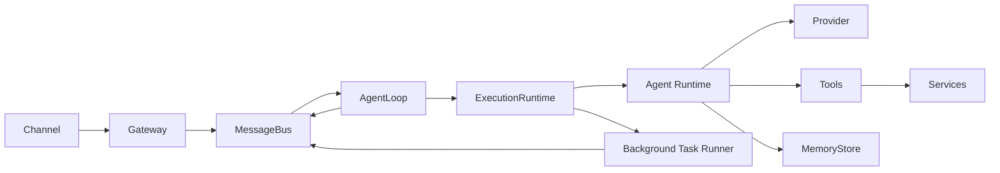
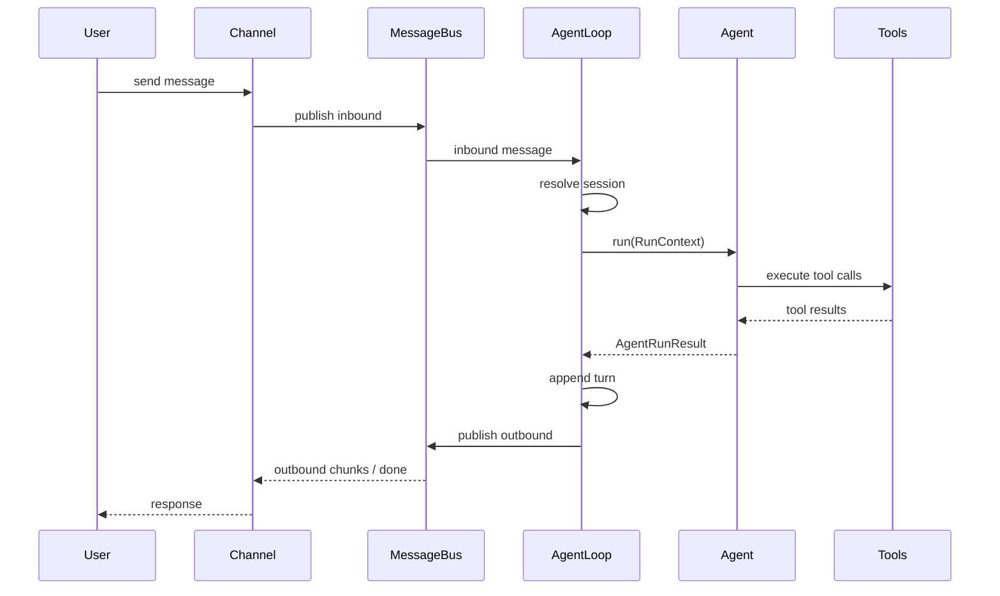
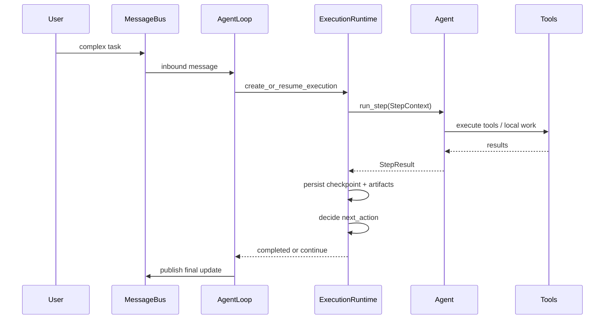

# V2 Overview

## Intent

V2 的目标不是给旧架构补丁，而是重新定义 Agent Core 的最小稳定骨架。

这套骨架只保留五个一等概念：

- `MessageBus`
- `Session`
- `ExecutionRuntime`
- `AgentLoop`
- `Agent`
- `MemoryStore`

其他能力都必须依附在这条主线上，而不是再开新的隐式通道。

## Layer Model



## Ownership Model

| Object            | Owner             | Mutable Scope |
| ----------------- | ----------------- | ------------- |
| `Session history` | `SessionManager`  | 会话级        |
| `Session settings`| `SessionManager`  | 会话级        |
| `Execution`       | `ExecutionRuntime`| 任务级        |
| `Execution checkpoint` | `ExecutionRuntime` | 任务级   |
| `Artifacts`       | `ExecutionRuntime`| 任务级        |
| `ToolCatalog`     | Runtime bootstrap | 全局只读      |
| `ActiveTools`     | `RunContext`      | 单次 run      |
| `Memory snapshot` | `RunContext`      | 单次 run 只读 |
| `BackgroundTask`  | Task runner       | 任务级        |

这条所有权规则是 V2 的核心约束：

- 全局对象只能是静态目录或共享服务。
- 单次 run 的全部可变状态只能存在于 `RunContext`。
- 会话级状态只能由 `SessionManager` 维护。
- 复杂任务状态只能由 `ExecutionRuntime` 维护。

## Core Objects

```rust
pub struct Session {
    pub id: SessionId,
    pub history: Vec<TurnRecord>,
    pub memory_refs: Vec<MemoryRef>,
    pub settings: SessionSettings,
}

pub struct Execution {
    pub id: ExecutionId,
    pub session_id: SessionId,
    pub goal: String,
    pub status: ExecutionStatus,
    pub checkpoint: ExecutionCheckpoint,
    pub artifacts: Vec<ArtifactRef>,
}

pub struct RunContext {
    pub session: SessionSnapshot,
    pub inbound_message: InboundMessage,
    pub active_tools: ActiveTools,
    pub memory_snapshot: MemorySnapshot,
    pub cancel_token: CancellationToken,
}
```

## Main Data Flow

V2 现在区分两条主线：

### 普通对话

1. Channel/Gateway 将消息发到 `MessageBus`
2. `AgentLoop` 按 session 串行消费
3. `AgentLoop` 读取 `Session`，构造 `RunContext`
4. `Agent` 运行一次工具循环并返回 `AgentRunResult`
5. `AgentLoop` 持久化结果并通过 `MessageBus` 发出出站消息

### 复杂任务

1. Channel/Gateway 将消息发到 `MessageBus`
2. `AgentLoop` 解析 session，并为该任务创建或恢复 `Execution`
3. `ExecutionRuntime` 读取 checkpoint 与 artifacts，构造 `StepContext`
4. `Agent` 执行一次 step，返回 `StepResult`
5. `ExecutionRuntime` 持久化 checkpoint、artifacts 与 `next_action`
6. 未完成则继续下一 step；完成后由 `AgentLoop` 写回 session 并发出出站消息
7. 如需异步继续，则派发后台任务，完成后重新回注 `MessageBus`





## Deliberate Omissions

V2 明确不把以下机制纳入核心主线：

- 运行中 `Steering` 注入
- 自动摘要压缩
- Skill 驱动的上下文保护
- 通过 SubAgent 做内部维护任务
- 生命周期 Hook 作为主流程前提
- 把复杂任务状态直接混进 session history

这些都可以作为后续扩展，但不能改变主线数据流。
