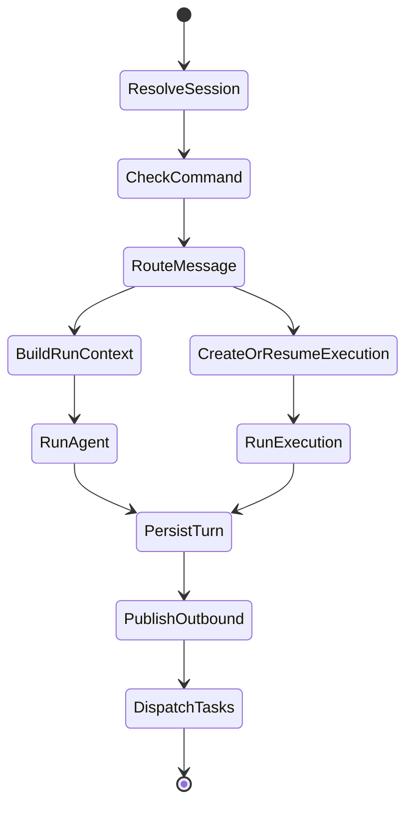

# Agent Loop

## Separation Of Responsibilities

V2 采用三层执行模型：

- `AgentLoop`: 入口编排器
- `ExecutionRuntime`: 复杂任务推进器
- `Agent`: 单步运行内核

```rust
pub struct AgentLoop {
    pub bus: Arc<MessageBus>,
    pub session_manager: Arc<SessionManager>,
    pub execution_runtime: Arc<ExecutionRuntime>,
}

pub struct ExecutionRuntime {
    pub agent: Arc<Agent>,
    pub execution_store: Arc<ExecutionStore>,
}

pub struct Agent {
    pub provider: Arc<dyn Provider>,
    pub context_builder: Arc<ContextBuilder>,
    pub tool_catalog: Arc<ToolCatalog>,
}
```

`AgentLoop` 不执行工具，也不维护复杂任务 checkpoint。

`ExecutionRuntime` 不拥有 session 历史。

`Agent` 不拥有会话，也不拥有 execution 持久状态。

这是 V2 的第一条硬边界。

## RunContext

所有 run 级状态统一进入 `RunContext`：

```rust
pub struct RunContext {
    pub session: SessionSnapshot,
    pub inbound_message: InboundMessage,
    pub active_tools: ActiveTools,
    pub memory_snapshot: MemorySnapshot,
    pub cancel_token: CancellationToken,
}
```

### Why It Exists

- 防止 `Agent` 持有可变 run 状态
- 防止 `ToolCatalog` 与 `ActiveTools` 混用
- 防止上下文注入规则散落在多个模块

## Execution And Step

复杂任务不再直接由 `AgentLoop` 反复驱动，而是落到 `ExecutionRuntime`。

```rust
pub struct Execution {
    pub id: ExecutionId,
    pub session_id: SessionId,
    pub goal: String,
    pub status: ExecutionStatus,
    pub checkpoint: ExecutionCheckpoint,
    pub artifacts: Vec<ArtifactRef>,
}

pub struct StepContext {
    pub session: SessionSnapshot,
    pub execution: ExecutionSnapshot,
    pub active_tools: ActiveTools,
    pub memory_snapshot: MemorySnapshot,
    pub cancel_token: CancellationToken,
}
```

### Why This Layer Exists

- 让复杂任务状态脱离 session history
- 让中间产物有独立归属
- 让中断、恢复和重试有 checkpoint
- 避免 `AgentLoop` 重新膨胀成旧版大一统 loop

## ToolCatalog vs ActiveTools

```rust
pub struct ToolCatalog {
    pub resident_tools: Vec<ToolDescriptor>,
    pub discoverable_tools: Vec<ToolDescriptor>,
}

pub struct ActiveTools {
    pub tools: Vec<ToolBinding>,
}
```

规则如下：

- `ToolCatalog` 是全局静态目录，只读共享
- `ActiveTools` 是单次 run 快照
- run 内如果发现新工具，只能更新 run-local 的 `ActiveTools`
- `Agent` 不直接持有可变 `ToolRegistry`

这解决了旧版“共享 Agent”和“run 级动态工具集”之间的结构冲突。

## Agent Interface

```rust
pub trait AgentRuntime {
    async fn run(&self, run: RunContext) -> Result<AgentRunResult, RunError>;
}

pub trait StepRuntime {
    async fn run_step(&self, step: StepContext) -> Result<StepResult, RunError>;
}

pub struct AgentRunResult {
    pub assistant_output: AssistantOutput,
    pub tool_trace: Vec<ToolTrace>,
    pub status: RunStatus,
    pub background_tasks: Vec<BackgroundTask>,
}

pub struct StepResult {
    pub assistant_output: Option<AssistantOutput>,
    pub tool_trace: Vec<ToolTrace>,
    pub artifact_updates: Vec<ArtifactRef>,
    pub checkpoint: ExecutionCheckpoint,
    pub next_action: NextAction,
}
```

`AgentRunResult` 的职责只有四项：

- 返回最终用户输出
- 返回工具执行轨迹
- 返回 run 状态
- 返回新派发的后台任务

`StepResult` 的职责也只保留任务推进所需最小信息：

- 更新 checkpoint
- 记录 artifact 变化
- 记录本 step 的工具轨迹
- 声明下一步动作

## AgentLoop Responsibilities

- 从 `MessageBus` 消费入站消息
- 按 session 串行化执行
- 解析命令和取消请求
- 读取 session + memory refs
- 判断该消息是普通对话还是复杂任务
- 普通对话时构造 `RunContext`
- 复杂任务时创建或恢复 `Execution`
- 将执行委托给 `ExecutionRuntime`
- 在任务完成后持久化 turn 与发布出站消息

## ExecutionRuntime Responsibilities

- 创建 `Execution`
- 读取并更新 checkpoint
- 管理 artifacts
- 构造 `StepContext`
- 调用 `Agent::run_step`
- 根据 `next_action` 决定继续、等待或完成
- 在需要时派发后台任务

## Agent Responsibilities

- 组装 provider 请求上下文
- 调用 provider
- 处理单步有限工具循环
- 维护 step-local transcript
- 返回 `StepResult` 或 `AgentRunResult`

## Simplified Run State Machine



V2 刻意不纳入以下状态：

- `Steering`
- 异步摘要压缩
- 运行中阶段注入
- 细粒度 round 事件树

## Context Model

V2 只允许一种上下文所有权结构：

`Session history + inbound message + core prompt + memory snapshot + run-local transcript`

额外规则：

- `Session history` 由 `SessionManager` 提供
- `run-local transcript` 只在本次 run 存活
- 历史压缩不是 AgentLoop 核心职责
- 没有“protected messages”这种额外通道
- 复杂任务中间状态进入 `Execution checkpoint`，不进入 session history

## Command And Cancellation

命令依然属于 `AgentLoop`，而不是 `Agent`。

最小命令面：

- `/new`
- `/stop`
- `/status`

取消规则：

- `/stop` 只取消当前 session 的活跃 run
- 取消信号通过 `RunContext.cancel_token` 或 `StepContext.cancel_token` 传入
- 已完成的历史不回滚
- 已持久化的 execution checkpoint 不回滚
- 已派发的后台任务是否取消，由任务策略单独决定
