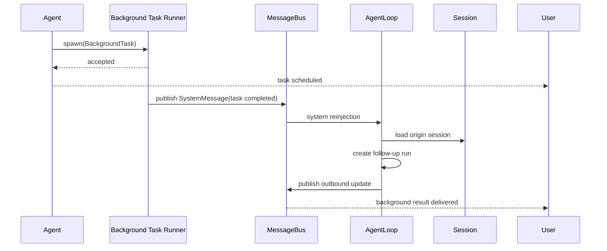

# Memory, SubAgent, And MessageBus

## Memory Is Lightweight Context

V2 中的 memory 不是自治系统，而是辅助上下文来源。

它只保留两类接口：

```rust
pub trait MemoryStore {
    async fn store(&self, record: MemoryRecord) -> Result<MemoryRef, MemoryError>;
    async fn recall(&self, query: MemoryQuery, scope: MemoryScope) -> Result<Vec<MemoryRecord>, MemoryError>;
}
```

```rust
pub struct MemoryRecord {
    pub id: MemoryId,
    pub kind: MemoryKind,
    pub content: String,
    pub source_session_id: Option<SessionId>,
}

pub enum MemoryKind {
    Profile,
    Preferences,
    Facts,
}
```

## Memory Rules

- 只保留稳定、可解释、低歧义的记忆
- memory 是输入补充，不参与主编排
- `recall` 在 run 开始前产生 `memory_snapshot`
- run 内不做自动模式发现
- 不做自动衰减
- 不做自动升华为 knowledge

## SubAgent Is Only A Background Task Runner

V2 中的 `SubAgent` 不是第二套 Agent Core，也不是通用内部 worker。

它只有一个职责：

`执行主 run 派发的后台异步任务`

```rust
pub struct BackgroundTask {
    pub task_id: TaskId,
    pub origin_session_id: SessionId,
    pub task_type: String,
    pub payload: serde_json::Value,
}
```

```rust
pub trait BackgroundTaskRunner {
    async fn spawn(&self, task: BackgroundTask) -> Result<(), TaskError>;
}
```

## Background Task Rules

- 后台任务必须有来源 session
- 后台任务独立上下文执行
- 后台任务不共享主 run 的可变状态
- 后台任务完成后必须通过 `MessageBus` 回注

明确禁止以下用途：

- 用 SubAgent 做会话摘要
- 用 SubAgent 做记忆提炼
- 用 SubAgent 做 skill fork
- 用 SubAgent 做 loop 内同步并行推理

## MessageBus Responsibilities

`MessageBus` 是 V2 的核心基础设施，必须支持三类消息：

- 用户入站消息
- 用户可见出站消息
- 系统内部异步回注消息

```rust
pub enum BusMessage {
    Inbound(InboundMessage),
    Outbound(OutboundMessage),
    System(SystemMessage),
}
```

`SystemMessage` 典型用于：

- 后台任务完成通知
- 后台任务失败通知
- 需要回到原 session 的系统事件

## Reinjection Model

后台任务完成后不直接写会话历史，而是先回注 `MessageBus`，再由 `AgentLoop` 以标准 session 规则处理。



## Why Bus Is Mandatory

如果没有 `MessageBus`，后台任务结果只能通过旁路直接写 session 或直接推 UI，这会带来三个问题：

- 绕开统一 session 串行规则
- 绕开统一出站协议
- 绕开多 Channel 的一致分发

因此在 V2 中，所有异步结果必须先回到 bus，再回到 loop。
