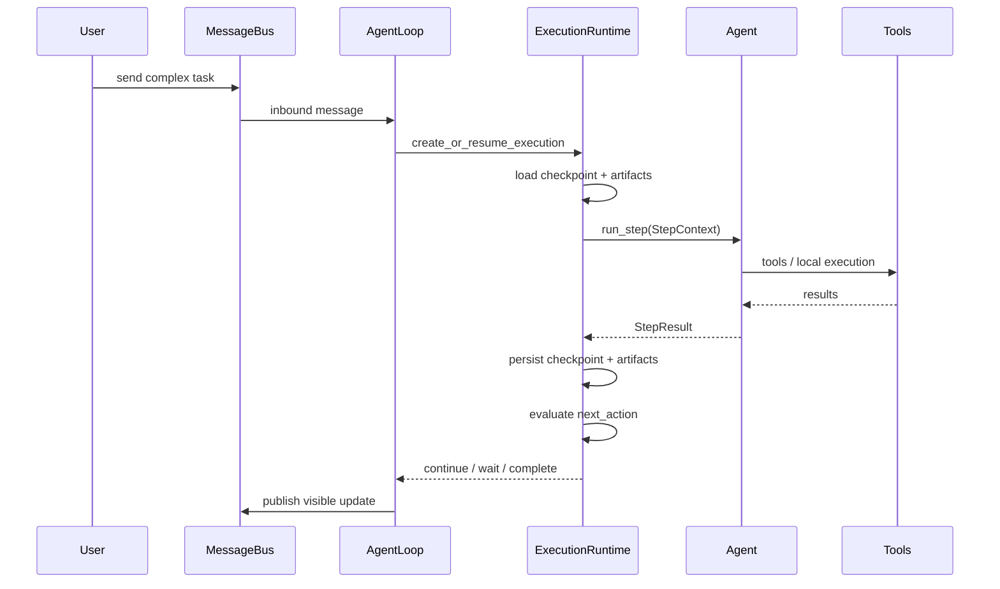

# Execution Runtime

## Why This Layer Exists

如果一个复杂任务需要很多轮 LLM 请求、本地执行、检查和再推进，那么仅靠：

- `Session`
- `RunContext`
- `BackgroundTask`

是不够的。

缺失的问题主要有四个：

- 复杂任务没有独立状态归属
- 中间产物只能错误地塞进 session history
- 中断与恢复没有 checkpoint
- `AgentLoop` 会被迫重新膨胀成旧版大一统 loop

因此 V2 新增 `ExecutionRuntime`，专门承接复杂任务生命周期。

## Core Model

```rust
pub struct Execution {
    pub id: ExecutionId,
    pub session_id: SessionId,
    pub goal: String,
    pub status: ExecutionStatus,
    pub checkpoint: ExecutionCheckpoint,
    pub artifacts: Vec<ArtifactRef>,
}

pub enum ExecutionStatus {
    Running,
    Waiting,
    Completed,
    Failed,
    Cancelled,
}

pub struct ExecutionCheckpoint {
    pub current_stage: String,
    pub completed_steps: Vec<String>,
    pub pending_steps: Vec<String>,
    pub last_error: Option<String>,
}
```

## Artifact Model

`Artifacts` 是复杂任务的中间产物引用，不直接写入 session history。

```rust
pub struct ArtifactRef {
    pub kind: ArtifactKind,
    pub locator: String,
    pub summary: Option<String>,
}

pub enum ArtifactKind {
    File,
    SearchResult,
    CommandOutput,
    StructuredData,
}
```

Artifact 的作用：

- 给后续 step 提供稳定输入
- 避免超长中间结果污染对话历史
- 让复杂任务可以恢复和调试

## Step Model

`Execution` 不直接调用 Provider；它通过一个个 step 推进。

```rust
pub struct StepContext {
    pub session: SessionSnapshot,
    pub execution: ExecutionSnapshot,
    pub active_tools: ActiveTools,
    pub memory_snapshot: MemorySnapshot,
    pub cancel_token: CancellationToken,
}

pub struct StepResult {
    pub assistant_output: Option<AssistantOutput>,
    pub tool_trace: Vec<ToolTrace>,
    pub artifact_updates: Vec<ArtifactRef>,
    pub checkpoint: ExecutionCheckpoint,
    pub next_action: NextAction,
}

pub enum NextAction {
    Continue,
    Wait,
    Complete,
    SpawnBackgroundTask(BackgroundTask),
}
```

## Responsibilities

### AgentLoop

- 识别消息是否需要复杂任务执行
- 创建或恢复 `Execution`
- 将执行委托给 `ExecutionRuntime`
- 在任务完成时写回 session

### ExecutionRuntime

- 管理 execution 状态
- 管理 checkpoint
- 管理 artifacts
- 生成 `StepContext`
- 调用 `Agent::run_step`
- 解释 `NextAction`

### Agent

- 执行单步 LLM + tools 循环
- 不直接持久化 checkpoint
- 不直接持久化 artifacts

## Complex Task Flow



## Data Placement Rules

### Session History

只保留：

- 用户输入
- 用户可见输出
- 少量任务级里程碑

### Execution Checkpoint

只保留：

- 当前阶段
- 已完成步骤
- 待执行步骤
- 最近失败原因

### Artifacts

只保留：

- 文件路径
- 命令输出引用
- 搜索结果引用
- 结构化中间结果引用

### Step-local Transcript

只保留：

- 本 step 临时上下文
- 本 step 工具交互

step 结束后可以被丢弃或压缩，不进入长期状态。

## Relation To Background Tasks

`BackgroundTask` 不是游离在系统外的特殊流程，而是 `ExecutionRuntime` 的一种调度结果。

关系如下：

- 简单任务：`AgentLoop -> Agent`
- 复杂同步任务：`AgentLoop -> ExecutionRuntime -> Agent(step...)`
- 复杂异步任务：`AgentLoop -> ExecutionRuntime -> BackgroundTaskRunner -> Agent(step...)`

这样 `SubAgent` 仍然只是后台执行器，而不是第二套主系统。

## Explicit Non-Goals

`ExecutionRuntime` 明确不负责：

- Session 历史压缩
- Steering 注入
- 生命周期 Hook 编排
- 角色系统
- 自动记忆提炼

它只负责复杂任务的过程状态推进。
